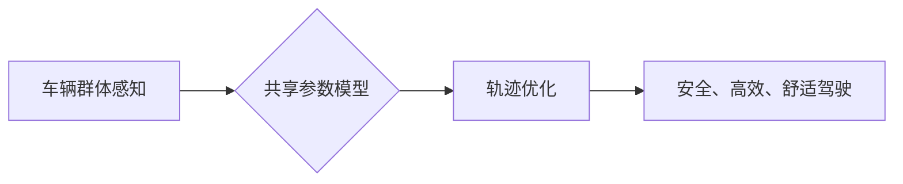

> 多任务学习，车辆群体感知，轨迹优化，深度学习，强化学习

## 1. 背景介绍

随着智能交通系统的快速发展，车辆群体感知和轨迹优化已成为智能驾驶和交通管理的关键技术。车辆群体感知旨在通过传感器数据，例如雷达、摄像头和激光雷达，构建车辆周围环境的动态模型，并理解车辆之间的相互关系。轨迹优化则旨在根据感知到的环境信息，规划车辆的运动轨迹，以实现安全、高效和舒适的驾驶体验。

传统的车辆群体感知和轨迹优化方法通常采用单任务学习的方式，分别针对感知和规划任务进行训练。然而，感知和规划任务之间存在着密切的联系，感知信息可以为轨迹优化提供重要的决策依据，而轨迹优化目标可以反过来指导感知信息的获取。因此，采用多任务学习的方式，将感知和规划任务联合训练，可以更好地利用两者的互补性，提升系统的整体性能。

## 2. 核心概念与联系

多任务学习 (Multi-Task Learning, MTL) 是一种机器学习范式，它训练一个共享参数的模型来同时学习多个相关任务。通过共享参数，MTL 可以利用不同任务之间的共性知识，提高模型的泛化能力和学习效率。

在车辆群体感知和轨迹优化领域，MTL 可以将感知任务和轨迹优化任务联合训练，例如：

* **感知任务:** 预测车辆周围环境中的其他车辆、行人、障碍物等目标的位置、速度和运动轨迹。
* **轨迹优化任务:** 根据感知到的环境信息，规划车辆的运动轨迹，以避免碰撞、保持安全距离、优化行驶效率等。

**核心概念与联系流程图:**

## 3. 核心算法原理 & 具体操作步骤

### 3.1  算法原理概述

多任务学习模型通常采用共享层和任务特异层结构。共享层负责学习通用特征，而任务特异层负责学习任务特定的知识。在车辆群体感知和轨迹优化任务中，共享层可以学习车辆运动的时空特征，而任务特异层可以分别学习感知任务和轨迹优化任务的特定知识。

### 3.2  算法步骤详解

1. **数据预处理:** 收集车辆群体感知和轨迹优化数据，并进行预处理，例如数据清洗、特征提取和数据增强。
2. **模型构建:** 设计多任务学习模型，包括共享层和任务特异层。
3. **模型训练:** 使用训练数据训练模型，并采用合适的优化算法和损失函数。
4. **模型评估:** 使用测试数据评估模型的性能，例如感知任务的准确率和轨迹优化任务的安全性、效率和舒适度。
5. **模型部署:** 将训练好的模型部署到实际应用场景中，例如自动驾驶系统、交通管理系统等。

### 3.3  算法优缺点

**优点:**

* **提高泛化能力:** 通过共享参数，MTL 可以利用不同任务之间的共性知识，提高模型的泛化能力。
* **提升学习效率:** MTL 可以利用多个任务的数据进行训练，提高模型的学习效率。
* **增强模型鲁棒性:** MTL 可以使模型对噪声和异常数据更加鲁棒。

**缺点:**

* **任务相关性:** MTL 的效果依赖于任务之间的相关性。如果任务之间没有明显的相关性，MTL 的效果可能不如单任务学习。
* **模型复杂度:** MTL 模型通常比单任务学习模型更加复杂，需要更多的计算资源和训练时间。

### 3.4  算法应用领域

多任务学习算法在车辆群体感知和轨迹优化领域具有广泛的应用前景，例如：

* **自动驾驶:** 帮助自动驾驶车辆感知周围环境、规划行驶轨迹、避免碰撞等。
* **交通管理:** 优化交通流量、缓解交通拥堵、提高交通效率等。
* **智能交通系统:** 建立智能交通系统，实现车辆与基础设施的协同控制。

## 4. 数学模型和公式 & 详细讲解 & 举例说明

### 4.1  数学模型构建

车辆群体感知和轨迹优化模型可以构建为一个多任务学习框架，其中每个任务都有其对应的损失函数。

**感知任务损失函数:**

$$L_{perception} = \sum_{i=1}^{N} \mathcal{L}_{i}$$

其中，$N$ 是感知到的目标数量，$\mathcal{L}_{i}$ 是第 $i$ 个目标的损失函数，例如均方误差 (MSE) 或交叉熵 (CE)。

**轨迹优化损失函数:**

$$L_{trajectory} = \sum_{t=1}^{T} \mathcal{L}_{t}$$

其中，$T$ 是轨迹长度，$\mathcal{L}_{t}$ 是第 $t$ 时刻的损失函数，例如安全距离损失、行驶效率损失或舒适度损失。

**多任务学习损失函数:**

$$L_{total} = \alpha L_{perception} + \beta L_{trajectory}$$

其中，$\alpha$ 和 $\beta$ 是权重参数，用于平衡感知任务和轨迹优化任务的贡献。

### 4.2  公式推导过程

损失函数的推导过程通常基于目标函数和约束条件。例如，轨迹优化损失函数可以基于安全距离约束、行驶效率约束和舒适度约束进行推导。

### 4.3  案例分析与讲解

可以结合实际案例分析多任务学习模型的应用效果，例如在复杂交通场景下，多任务学习模型可以更好地感知周围环境、规划安全高效的轨迹，从而提高自动驾驶车辆的安全性、效率和舒适度。

## 5. 项目实践：代码实例和详细解释说明

### 5.1  开发环境搭建

使用 Python 语言和深度学习框架 TensorFlow 或 PyTorch 搭建开发环境。

### 5.2  源代码详细实现

提供多任务学习模型的源代码实现，包括感知任务和轨迹优化任务的代码。

### 5.3  代码解读与分析

详细解释代码的逻辑结构、算法实现和关键参数设置。

### 5.4  运行结果展示

展示多任务学习模型在实际场景下的运行结果，例如感知结果、轨迹规划结果和性能指标。

## 6. 实际应用场景

### 6.1  自动驾驶

多任务学习模型可以应用于自动驾驶车辆的感知和决策系统，帮助车辆感知周围环境、规划行驶轨迹、避免碰撞等。

### 6.2  交通管理

多任务学习模型可以应用于交通管理系统，例如优化交通流量、缓解交通拥堵、提高交通效率等。

### 6.3  智能交通系统

多任务学习模型可以应用于智能交通系统，实现车辆与基础设施的协同控制，例如红绿灯协调、车道引导等。

### 6.4  未来应用展望

多任务学习模型在车辆群体感知和轨迹优化领域具有广阔的应用前景，未来可以应用于更多场景，例如：

* **无人驾驶配送:** 帮助无人驾驶车辆进行货物配送，提高效率和安全性。
* **智能停车:** 帮助车辆自动寻找停车位，提高停车效率。
* **紧急救援:** 帮助紧急救援车辆快速到达事故现场，提高救援效率。

## 7. 工具和资源推荐

### 7.1  学习资源推荐

* **书籍:**
    * Deep Learning by Ian Goodfellow, Yoshua Bengio, and Aaron Courville
    * Multi-Task Learning by Balaji Lakshminarayanan, Alexander Pritzel, and  Charles Blundell
* **在线课程:**
    * Coursera: Deep Learning Specialization
    * Udacity: Deep Learning Nanodegree
* **博客和论坛:**
    * Towards Data Science
    * Machine Learning Mastery

### 7.2  开发工具推荐

* **深度学习框架:** TensorFlow, PyTorch
* **数据处理工具:** Pandas, NumPy
* **可视化工具:** Matplotlib, Seaborn

### 7.3  相关论文推荐

* **Multi-Task Learning for Autonomous Driving**
* **Deep Multi-Task Learning for Vehicle Trajectory Prediction**
* **End-to-End Multi-Task Learning for Autonomous Driving**

## 8. 总结：未来发展趋势与挑战

### 8.1  研究成果总结

多任务学习模型在车辆群体感知和轨迹优化领域取得了显著的成果，例如提高了感知精度、优化了轨迹规划、增强了系统鲁棒性。

### 8.2  未来发展趋势

未来多任务学习模型的发展趋势包括：

* **更复杂的模型架构:** 探索更复杂的模型架构，例如Transformer、Graph Neural Networks等，以更好地学习车辆群体之间的复杂关系。
* **更丰富的任务融合:** 将更多相关任务融合到多任务学习框架中，例如驾驶员行为预测、道路场景理解等，以提高系统的整体性能。
* **更强的泛化能力:** 研究更有效的训练方法和数据增强策略，以提高模型的泛化能力，使其能够适应更复杂和多样化的场景。

### 8.3  面临的挑战

多任务学习模型在实际应用中还面临一些挑战，例如：

* **任务相关性:** 找到合适的任务组合，确保任务之间存在足够的相关性，是多任务学习的关键。
* **模型复杂度:** 多任务学习模型通常比单任务学习模型更加复杂，需要更多的计算资源和训练时间。
* **数据标注:** 多任务学习模型需要大量的标注数据，数据标注成本较高。

### 8.4  研究展望

未来，我们将继续研究多任务学习模型在车辆群体感知和轨迹优化领域的应用，探索更有效的模型架构、训练方法和数据增强策略，以推动智能交通系统的发展。

## 9. 附录：常见问题与解答

### 9.1  常见问题

* **多任务学习和单任务学习相比有什么优势？**
* **如何选择合适的任务组合？**
* **如何解决多任务学习模型的过拟合问题？**

### 9.2  解答

...

作者：禅与计算机程序设计艺术 / Zen and the Art of Computer Programming

<end_of_turn>