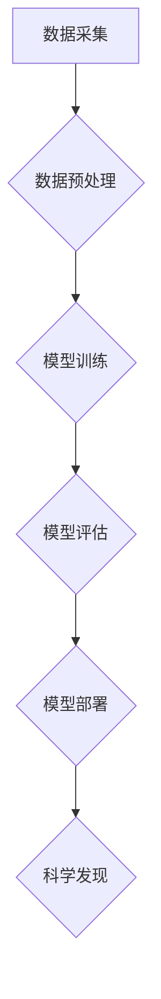

>人工智能，科学计算，机器学习，深度学习，数据分析，科学发现，算法优化，模型训练

## 1. 背景介绍

科学研究的本质是探索未知，揭示规律，推动人类文明进步。传统科学研究依靠人类的智慧和经验，往往耗时费力，效率低下。随着人工智能（AI）技术的飞速发展，AI为科学研究带来了前所未有的机遇。AI算法能够高效处理海量数据，发现隐藏的模式和规律，加速科学发现。

AI for Science是指利用人工智能技术辅助科学研究的全新范式。它涵盖了从数据分析、模型构建到实验设计和结果解释等多个方面，旨在通过智能化手段提升科学研究的效率、精度和创新能力。

## 2. 核心概念与联系

AI for Science的核心概念包括：

* **机器学习（Machine Learning）：** 算法从数据中学习，发现模式和规律，无需明确编程。
* **深度学习（Deep Learning）：** 基于多层神经网络的机器学习方法，能够处理复杂的数据结构和模式。
* **数据分析（Data Analysis）：** 从海量数据中提取有价值的信息，发现隐藏的趋势和关系。
* **科学计算（Scientific Computing）：** 利用计算机模拟和计算，解决复杂科学问题。

**AI for Science的架构**



## 3. 核心算法原理 & 具体操作步骤

### 3.1  算法原理概述

**机器学习算法**

机器学习算法的核心是通过学习数据中的模式和规律，建立预测模型。常见的机器学习算法包括：

* **监督学习（Supervised Learning）：** 利用标记数据训练模型，预测新的数据标签。
* **无监督学习（Unsupervised Learning）：** 从未标记数据中发现隐藏的结构和模式。
* **强化学习（Reinforcement Learning）：** 通过试错学习，在环境中获得最大奖励。

**深度学习算法**

深度学习算法利用多层神经网络，能够学习更复杂的特征表示。常见的深度学习算法包括：

* **卷积神经网络（CNN）：** 用于图像识别、物体检测等任务。
* **循环神经网络（RNN）：** 用于自然语言处理、时间序列分析等任务。
* **生成对抗网络（GAN）：** 用于生成图像、文本等数据。

### 3.2  算法步骤详解

**机器学习算法步骤**

1. **数据采集和预处理：** 收集相关数据，并进行清洗、转换、特征工程等预处理操作。
2. **模型选择：** 根据任务需求选择合适的机器学习算法。
3. **模型训练：** 利用训练数据训练模型，调整模型参数，使模型能够准确预测。
4. **模型评估：** 利用测试数据评估模型的性能，例如准确率、召回率、F1-score等。
5. **模型部署：** 将训练好的模型部署到实际应用场景中。

**深度学习算法步骤**

1. **数据采集和预处理：** 与机器学习算法类似，需要收集和预处理数据。
2. **模型架构设计：** 设计深度神经网络的结构，包括层数、节点数、激活函数等。
3. **模型训练：** 利用训练数据训练深度神经网络，调整模型参数，使模型能够准确预测。
4. **模型评估：** 利用测试数据评估模型的性能，例如准确率、召回率、F1-score等。
5. **模型部署：** 将训练好的深度神经网络部署到实际应用场景中。

### 3.3  算法优缺点

**机器学习算法**

* **优点：** 能够从数据中学习，无需明确编程，适应性强。
* **缺点：** 需要大量数据训练，对数据质量要求高，解释性较差。

**深度学习算法**

* **优点：** 能够学习更复杂的特征表示，性能优于传统机器学习算法。
* **缺点：** 需要更多计算资源和数据训练，训练时间长，解释性较差。

### 3.4  算法应用领域

* **药物研发：** 预测药物活性，加速药物发现。
* **材料科学：** 设计新型材料，提高材料性能。
* **气候模型：** 预测气候变化趋势，应对气候挑战。
* **生物信息学：** 分析基因组数据，揭示生命奥秘。

## 4. 数学模型和公式 & 详细讲解 & 举例说明

### 4.1  数学模型构建

**线性回归模型**

线性回归模型假设数据之间存在线性关系，可以用以下公式表示：

$$y = w_0 + w_1x_1 + w_2x_2 + ... + w_nx_n + \epsilon$$

其中：

* $y$ 是目标变量
* $x_1, x_2, ..., x_n$ 是输入特征
* $w_0, w_1, w_2, ..., w_n$ 是模型参数
* $\epsilon$ 是误差项

**目标是找到最佳参数值，使模型预测结果与实际值之间的误差最小化。**

### 4.2  公式推导过程

**最小二乘法**

最小二乘法是一种常用的模型参数估计方法，其目标是找到使模型预测结果与实际值之间平方误差最小化的参数值。

**损失函数**

损失函数用于衡量模型预测结果与实际值之间的误差。常用的损失函数包括均方误差（MSE）和交叉熵损失（Cross-Entropy Loss）。

**梯度下降法**

梯度下降法是一种迭代优化算法，用于更新模型参数，使损失函数最小化。

### 4.3  案例分析与讲解

**房价预测**

假设我们想要预测房屋价格，可以使用线性回归模型。输入特征包括房屋面积、房间数、地理位置等，目标变量是房屋价格。

通过训练数据，我们可以找到最佳参数值，建立一个预测房屋价格的模型。

## 5. 项目实践：代码实例和详细解释说明

### 5.1  开发环境搭建

* Python 3.x
* Jupyter Notebook
* scikit-learn
* TensorFlow/PyTorch

### 5.2  源代码详细实现

```python
# 导入必要的库
import pandas as pd
from sklearn.model_selection import train_test_split
from sklearn.linear_model import LinearRegression
from sklearn.metrics import mean_squared_error

# 加载数据
data = pd.read_csv('house_price.csv')

# 选择特征和目标变量
features = ['area', 'rooms', 'location']
target = 'price'

# 将数据分割为训练集和测试集
X_train, X_test, y_train, y_test = train_test_split(data[features], data[target], test_size=0.2)

# 创建线性回归模型
model = LinearRegression()

# 训练模型
model.fit(X_train, y_train)

# 预测测试集数据
y_pred = model.predict(X_test)

# 计算模型性能
mse = mean_squared_error(y_test, y_pred)
print(f'Mean Squared Error: {mse}')
```

### 5.3  代码解读与分析

* 首先，我们导入必要的库，并加载数据。
* 然后，我们选择特征和目标变量，并将数据分割为训练集和测试集。
* 接下来，我们创建线性回归模型，并使用训练集训练模型。
* 然后，我们使用训练好的模型预测测试集数据，并计算模型性能。

### 5.4  运行结果展示

运行代码后，会输出模型的均方误差值。

## 6. 实际应用场景

### 6.1  药物研发

AI for Science可以加速药物研发过程，例如：

* **药物靶点发现：** 利用机器学习算法分析基因组数据，发现潜在的药物靶点。
* **药物分子设计：** 利用深度学习算法设计新的药物分子，提高药物活性。
* **药物毒性预测：** 利用机器学习算法预测药物的毒性，降低药物研发风险。

### 6.2  材料科学

AI for Science可以帮助设计新型材料，例如：

* **材料性能预测：** 利用机器学习算法预测材料的力学、电学、热学等性能。
* **材料结构设计：** 利用深度学习算法设计新的材料结构，提高材料性能。
* **材料合成优化：** 利用机器学习算法优化材料合成工艺，提高材料质量。

### 6.3  气候模型

AI for Science可以帮助预测气候变化趋势，例如：

* **气候模式构建：** 利用机器学习算法构建更精细的气候模型。
* **气候变化预测：** 利用深度学习算法预测未来气候变化趋势。
* **气候变化影响评估：** 利用机器学习算法评估气候变化对不同地区的影响。

### 6.4  未来应用展望

AI for Science的应用前景广阔，未来将应用于更多领域，例如：

* **精准医疗：** 利用AI技术个性化治疗方案。
* **农业科技：** 利用AI技术提高农业生产效率。
* **能源开发：** 利用AI技术开发清洁能源。

## 7. 工具和资源推荐

### 7.1  学习资源推荐

* **在线课程：** Coursera, edX, Udacity
* **书籍：**
    * "Deep Learning" by Ian Goodfellow, Yoshua Bengio, and Aaron Courville
    * "Hands-On Machine Learning with Scikit-Learn, Keras & TensorFlow" by Aurélien Géron
* **博客和论坛：** Towards Data Science, Machine Learning Mastery

### 7.2  开发工具推荐

* **Python:** 
* **Jupyter Notebook:** 
* **scikit-learn:** 
* **TensorFlow/PyTorch:** 

### 7.3  相关论文推荐

* **"Attention Is All You Need"** by Vaswani et al. (2017)
* **"BERT: Pre-training of Deep Bidirectional Transformers for Language Understanding"** by Devlin et al. (2018)
* **"Generative Adversarial Networks"** by Goodfellow et al. (2014)

## 8. 总结：未来发展趋势与挑战

### 8.1  研究成果总结

AI for Science取得了显著进展，在药物研发、材料科学、气候模型等领域取得了突破性成果。

### 8.2  未来发展趋势

* **模型规模和复杂度提升：** 未来AI模型将更加强大，能够处理更复杂的数据和问题。
* **跨学科融合：** AI for Science将与其他学科更加融合，例如生物学、化学、物理学等。
* **解释性AI：** 研究如何提高AI模型的解释性，使人类能够更好地理解AI的决策过程。

### 8.3  面临的挑战

* **数据获取和质量：** AI for Science需要大量高质量的数据，而获取和处理这些数据仍然是一个挑战。
* **算法可解释性：** 许多AI算法是黑箱模型，难以解释其决策过程，这限制了AI在科学研究中的应用。
* **伦理问题：** AI for Science的应用可能带来伦理问题，例如数据隐私、算法偏见等，需要认真考虑和解决。

### 8.4  研究展望

未来，AI for Science将继续发展，推动科学研究的进步。我们需要加强基础研究，解决算法可解释性、数据质量等问题，并关注AI伦理问题，确保AI技术安全、可控、可持续地发展。

## 9. 附录：常见问题与解答

**Q1：AI for Science与传统科学研究有什么区别？**

**A1：** AI for Science利用人工智能技术辅助科学研究，可以加速数据分析、模型构建、实验设计等环节，提高科学研究的效率和精度。传统科学研究主要依靠人类的智慧和经验，效率相对较低。

**Q2：AI for Science有哪些应用领域？**

**A2：** AI for Science的应用领域非常广泛，包括药物研发