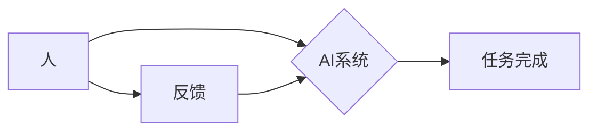

> 人工智能，协同工作，未来趋势，应用场景，挑战与机遇

## 1. 背景介绍

人工智能（AI）技术近年来发展迅速，已渗透到各个领域，深刻地改变着人们的生活和工作方式。从自动驾驶汽车到智能语音助手，从医疗诊断到金融交易，AI正在以惊人的速度改变着世界。

然而，AI技术的发展也引发了人们对未来工作格局的担忧。一些人担心AI将取代人类工作，导致失业率上升。但实际上，AI更像是人类的助手，能够帮助我们更高效地完成工作，释放出更多的时间和精力去从事更具创造性和战略性的工作。

## 2. 核心概念与联系

**2.1 人工智能与协同工作**

人工智能是指模拟人类智能行为的计算机系统。协同工作是指多个个体（包括人、机器和软件）共同合作完成任务的过程。

AI与协同工作相结合，可以实现以下优势：

* **提高效率:** AI可以自动化重复性任务，解放人力，提高工作效率。
* **增强创造力:** AI可以提供新的视角和灵感，帮助人类进行更深入的思考和创新。
* **优化决策:** AI可以分析海量数据，提供更准确的决策支持。
* **提升体验:** AI可以个性化服务，提供更便捷、更人性化的体验。

**2.2 协同工作模式**

AI与人协同工作的方式多种多样，主要包括以下几种模式：

* **人机分工:** 人负责制定策略和决策，AI负责执行具体任务。
* **人机交互:** 人与AI实时交互，共同完成任务。
* **人机融合:** 人和AI深度融合，形成一个新的智能体。

**2.3 协同工作架构**



## 3. 核心算法原理 & 具体操作步骤

**3.1 算法原理概述**

AI协同工作中常用的算法包括机器学习、深度学习、自然语言处理等。这些算法通过学习数据，识别模式，并做出预测或决策。

**3.2 算法步骤详解**

以机器学习为例，其基本步骤包括：

1. **数据收集:** 收集与任务相关的训练数据。
2. **数据预处理:** 对数据进行清洗、转换和特征提取。
3. **模型选择:** 选择合适的机器学习模型。
4. **模型训练:** 使用训练数据训练模型，使其能够学习数据中的模式。
5. **模型评估:** 使用测试数据评估模型的性能。
6. **模型部署:** 将训练好的模型部署到实际应用场景中。

**3.3 算法优缺点**

**优点:**

* 自动化学习，无需人工编程。
* 能够处理复杂数据，发现隐藏模式。
* 性能不断提升，应用范围不断扩大。

**缺点:**

* 需要大量数据进行训练。
* 训练过程耗时和耗能。
* 模型解释性较差，难以理解模型决策过程。

**3.4 算法应用领域**

* **自然语言处理:** 语音识别、机器翻译、文本生成等。
* **计算机视觉:** 图像识别、物体检测、视频分析等。
* **推荐系统:** 产品推荐、内容推荐、个性化服务等。
* **医疗诊断:** 病情预测、辅助诊断、药物研发等。

## 4. 数学模型和公式 & 详细讲解 & 举例说明

**4.1 数学模型构建**

在AI协同工作中，数学模型是描述人机交互和决策过程的关键工具。常用的数学模型包括：

* **贝叶斯网络:** 用于表示概率关系，预测事件发生的可能性。
* **决策树:** 用于决策分析，根据条件判断做出选择。
* **强化学习:** 用于训练智能体，使其在环境中学习最佳策略。

**4.2 公式推导过程**

以贝叶斯网络为例，其核心公式为：

$$P(A|B) = \frac{P(B|A)P(A)}{P(B)}$$

其中：

* $P(A|B)$ 表示在已知事件B发生的情况下，事件A发生的概率。
* $P(B|A)$ 表示在已知事件A发生的情况下，事件B发生的概率。
* $P(A)$ 表示事件A发生的概率。
* $P(B)$ 表示事件B发生的概率。

**4.3 案例分析与讲解**

假设我们有一个医疗诊断系统，需要根据患者的症状预测疾病类型。我们可以使用贝叶斯网络构建一个数学模型，其中：

* 节点A表示疾病类型，节点B表示患者的症状。
* $P(B|A)$ 表示给定疾病类型A，患者出现症状B的概率。
* $P(A)$ 表示疾病类型A发生的概率。
* $P(B)$ 表示患者出现症状B的概率。

通过收集患者的症状数据和疾病诊断信息，我们可以训练贝叶斯网络模型，并使用该模型预测新的患者的疾病类型。

## 5. 项目实践：代码实例和详细解释说明

**5.1 开发环境搭建**

* 操作系统: Ubuntu 20.04
* Python 版本: 3.8
* 必要的库: TensorFlow, PyTorch, scikit-learn

**5.2 源代码详细实现**

```python
# 导入必要的库
import tensorflow as tf

# 定义模型结构
model = tf.keras.models.Sequential([
    tf.keras.layers.Dense(128, activation='relu', input_shape=(784,)),
    tf.keras.layers.Dense(10, activation='softmax')
])

# 编译模型
model.compile(optimizer='adam',
              loss='sparse_categorical_crossentropy',
              metrics=['accuracy'])

# 训练模型
model.fit(x_train, y_train, epochs=10)

# 评估模型
loss, accuracy = model.evaluate(x_test, y_test)
print('Test loss:', loss)
print('Test accuracy:', accuracy)
```

**5.3 代码解读与分析**

这段代码实现了简单的深度学习模型训练。

* `tf.keras.models.Sequential` 定义了一个顺序模型，其中层级依次连接。
* `tf.keras.layers.Dense` 定义了一个全连接层，输入节点数为784，输出节点数为10。
* `activation='relu'` 指定激活函数为ReLU。
* `optimizer='adam'` 指定优化器为Adam。
* `loss='sparse_categorical_crossentropy'` 指定损失函数为类别交叉熵。
* `metrics=['accuracy']` 指定评估指标为准确率。

**5.4 运行结果展示**

训练完成后，模型会输出测试集上的损失值和准确率。

## 6. 实际应用场景

**6.1 医疗保健**

* **疾病诊断:** AI可以辅助医生诊断疾病，提高诊断准确率。
* **药物研发:** AI可以加速药物研发过程，发现新的药物靶点。
* **个性化医疗:** AI可以根据患者的基因信息和生活习惯，提供个性化的医疗方案。

**6.2 教育**

* **个性化学习:** AI可以根据学生的学习进度和能力，提供个性化的学习内容和辅导。
* **智能评估:** AI可以自动批改作业，评估学生的学习成果。
* **在线教学:** AI可以提供智能化的在线教学平台，帮助学生更好地学习。

**6.3 金融**

* **欺诈检测:** AI可以识别金融交易中的欺诈行为，降低风险。
* **风险管理:** AI可以分析市场数据，预测金融风险，帮助投资者做出更明智的决策。
* **个性化理财:** AI可以根据用户的风险偏好和财务目标，提供个性化的理财建议。

**6.4 未来应用展望**

随着AI技术的不断发展，其在协同工作领域的应用将更加广泛和深入。未来，AI将与人类更加紧密地合作，共同创造更加美好的未来。

## 7. 工具和资源推荐

**7.1 学习资源推荐**

* **在线课程:** Coursera, edX, Udacity
* **书籍:** 《深度学习》、《机器学习》、《人工智能导论》
* **开源项目:** TensorFlow, PyTorch, scikit-learn

**7.2 开发工具推荐**

* **IDE:** PyCharm, VS Code
* **机器学习库:** TensorFlow, PyTorch, scikit-learn
* **数据可视化工具:** Matplotlib, Seaborn

**7.3 相关论文推荐**

* 《Attention Is All You Need》
* 《BERT: Pre-training of Deep Bidirectional Transformers for Language Understanding》
* 《AlphaGo: Mastering the Game of Go with Deep Neural Networks and Tree Search》

## 8. 总结：未来发展趋势与挑战

**8.1 研究成果总结**

近年来，AI协同工作领域取得了显著进展，在医疗保健、教育、金融等领域取得了成功应用。

**8.2 未来发展趋势**

* **更智能的AI:** AI将更加智能，能够更好地理解人类需求，提供更个性化的服务。
* **更广泛的应用:** AI将应用于更多领域，改变人们的生活方式。
* **更安全的AI:** AI将更加安全可靠，能够更好地保护用户隐私和数据安全。

**8.3 面临的挑战**

* **数据安全:** AI模型训练需要大量数据，如何保证数据安全和隐私保护是一个重要挑战。
* **算法解释性:** 许多AI算法的决策过程难以解释，如何提高算法的透明度和可解释性是一个重要问题。
* **伦理问题:** AI的应用可能会引发一些伦理问题，例如算法偏见、工作岗位替代等，需要认真思考和解决。

**8.4 研究展望**

未来，AI协同工作领域的研究将更加注重以下几个方面：

* **更智能的AI算法:** 研究更智能、更灵活、更适应复杂环境的AI算法。
* **更安全的AI系统:** 研究更安全的AI系统，防止算法被恶意利用。
* **更人性的AI交互:** 研究更自然、更人性化的AI交互方式，让AI更加易于理解和使用。

## 9. 附录：常见问题与解答

**9.1 AI会不会取代人类工作？**

AI更像是人类的助手，能够帮助我们更高效地完成工作，释放出更多的时间和精力去从事更具创造性和战略性的工作。

**9.2 如何学习AI协同工作相关知识？**

可以通过在线课程、书籍、开源项目等方式学习AI协同工作相关知识。

**9.3 如何选择合适的AI协同工作工具？**

需要根据具体应用场景和需求选择合适的AI协同工作工具。

作者：禅与计算机程序设计艺术 / Zen and the Art of Computer Programming


<end_of_turn>