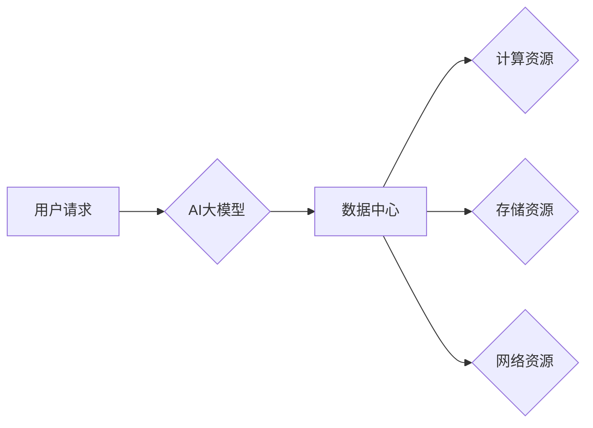

> AI大模型、数据中心、运维管理、模型部署、资源调度、性能优化、安全保障、可扩展性

## 1. 背景介绍

近年来，人工智能（AI）技术蓬勃发展，特别是大规模语言模型（LLM）的出现，为各行各业带来了革命性的变革。从自然语言处理到图像识别，从药物研发到金融预测，AI大模型正在深刻地改变着我们的生活和工作方式。

然而，AI大模型的应用也带来了新的挑战，其中之一就是数据中心建设和运维管理。AI大模型的训练和推理需要海量计算资源和存储空间，对数据中心的硬件设施、软件架构、网络带宽等方面提出了更高的要求。

同时，AI大模型的部署和运行也需要考虑模型的实时性、可靠性、安全性等因素。因此，构建高效、可靠、安全的AI大模型应用数据中心，是推动AI技术落地和发展的关键。

## 2. 核心概念与联系

**2.1 数据中心**

数据中心是集计算机、网络、存储等信息技术基础设施于一体的场所，为企业和组织提供计算、存储、网络等服务。

**2.2 AI大模型**

AI大模型是指在海量数据上训练的深度学习模型，具有强大的泛化能力和学习能力，能够处理复杂的任务，例如自然语言理解、图像识别、语音合成等。

**2.3 核心概念联系**

AI大模型的应用需要依赖于数据中心提供的计算、存储、网络等基础设施。数据中心为AI大模型的训练、推理、部署等环节提供必要的硬件资源和软件环境。

**2.4 架构图**



## 3. 核心算法原理 & 具体操作步骤

**3.1 算法原理概述**

AI大模型的训练通常采用深度学习算法，例如卷积神经网络（CNN）、循环神经网络（RNN）等。这些算法通过多层神经网络结构，学习数据中的特征和模式，从而实现对数据的理解和预测。

**3.2 算法步骤详解**

1. **数据预处理:** 将原始数据清洗、转换、格式化，使其适合模型训练。
2. **模型构建:** 根据任务需求选择合适的深度学习模型架构，并设置模型参数。
3. **模型训练:** 使用训练数据训练模型，调整模型参数，使其能够准确地预测目标变量。
4. **模型评估:** 使用测试数据评估模型的性能，例如准确率、召回率、F1-score等。
5. **模型部署:** 将训练好的模型部署到生产环境中，用于处理实际数据。

**3.3 算法优缺点**

**优点:**

* 强大的泛化能力，能够处理复杂的任务。
* 学习能力强，能够从海量数据中提取特征。

**缺点:**

* 训练成本高，需要大量的计算资源和时间。
* 模型解释性差，难以理解模型的决策过程。

**3.4 算法应用领域**

* 自然语言处理：文本分类、情感分析、机器翻译等。
* 图像识别：物体检测、图像分类、图像分割等。
* 语音识别：语音转文本、语音合成等。
* 药物研发：药物发现、药物设计等。
* 金融预测：股票预测、信用风险评估等。

## 4. 数学模型和公式 & 详细讲解 & 举例说明

**4.1 数学模型构建**

AI大模型的训练过程可以看作是一个优化问题，目标是找到模型参数，使得模型的预测结果与真实值之间的误差最小。常用的损失函数包括均方误差（MSE）、交叉熵损失（Cross-Entropy Loss）等。

**4.2 公式推导过程**

假设模型的预测结果为 $y_i$，真实值 $y_i^*$，损失函数为 $L(y_i, y_i^*)$，则模型的目标函数为：

$$
J(\theta) = \frac{1}{N} \sum_{i=1}^{N} L(y_i, y_i^*)
$$

其中，$N$ 为样本数量，$\theta$ 为模型参数。

通过梯度下降算法，不断更新模型参数，使得目标函数 $J(\theta)$ 最小化。

**4.3 案例分析与讲解**

例如，在图像分类任务中，可以使用交叉熵损失函数来衡量模型的预测结果与真实标签之间的差异。

$$
L(y_i, y_i^*) = - \sum_{j=1}^{C} y_{ij} \log(p_{ij})
$$

其中，$C$ 为类别数量，$y_{ij}$ 为真实标签，$p_{ij}$ 为模型预测的第 $j$ 类别的概率。

## 5. 项目实践：代码实例和详细解释说明

**5.1 开发环境搭建**

使用Python语言开发AI大模型应用数据中心，需要搭建相应的开发环境，包括：

* 操作系统：Linux或Windows
* Python版本：3.6或更高版本
* 深度学习框架：TensorFlow、PyTorch等
* 其他工具：Git、Jupyter Notebook等

**5.2 源代码详细实现**

以下是一个简单的AI大模型训练代码示例，使用TensorFlow框架：

```python
import tensorflow as tf

# 定义模型结构
model = tf.keras.models.Sequential([
    tf.keras.layers.Dense(128, activation='relu', input_shape=(784,)),
    tf.keras.layers.Dense(10, activation='softmax')
])

# 定义损失函数和优化器
model.compile(loss='sparse_categorical_crossentropy',
              optimizer='adam',
              metrics=['accuracy'])

# 训练模型
model.fit(x_train, y_train, epochs=10)

# 评估模型
loss, accuracy = model.evaluate(x_test, y_test)
print('Test loss:', loss)
print('Test accuracy:', accuracy)
```

**5.3 代码解读与分析**

* 代码首先定义了模型结构，包括两层全连接层。
* 然后定义了损失函数和优化器，用于训练模型。
* 接着使用`model.fit()`方法训练模型，传入训练数据和训练轮数。
* 最后使用`model.evaluate()`方法评估模型的性能。

**5.4 运行结果展示**

训练完成后，可以查看模型的训练损失和准确率曲线，以及测试集上的损失和准确率。

## 6. 实际应用场景

**6.1 自然语言处理**

* **聊天机器人:** 使用AI大模型构建智能聊天机器人，能够与用户进行自然流畅的对话。
* **文本摘要:** 自动生成文本的摘要，节省用户阅读时间。
* **机器翻译:** 将文本从一种语言翻译成另一种语言。

**6.2 图像识别**

* **物体检测:** 在图像中识别和定位物体，例如人脸识别、车辆识别等。
* **图像分类:** 将图像分类到不同的类别，例如动物、植物、风景等。
* **图像分割:** 将图像分割成不同的区域，例如分割出前景和背景。

**6.3 其他应用场景**

* **语音识别:** 将语音转为文本，例如语音助手、语音搜索等。
* **药物研发:** 使用AI大模型预测药物的活性，加速药物研发过程。
* **金融预测:** 使用AI大模型预测股票价格、信用风险等。

**6.4 未来应用展望**

AI大模型的应用前景广阔，未来将应用于更多领域，例如：

* **个性化推荐:** 根据用户的喜好，推荐个性化的商品、服务等。
* **自动驾驶:** 使用AI大模型控制自动驾驶汽车。
* **医疗诊断:** 使用AI大模型辅助医生进行疾病诊断。

## 7. 工具和资源推荐

**7.1 学习资源推荐**

* **书籍:**
    * 深度学习
    * 人工智能：一种现代方法
* **在线课程:**
    * Coursera深度学习课程
    * Udacity深度学习工程师课程

**7.2 开发工具推荐**

* **深度学习框架:** TensorFlow、PyTorch、Keras等
* **云计算平台:** AWS、Azure、Google Cloud等
* **数据处理工具:** Pandas、NumPy等

**7.3 相关论文推荐**

* Attention Is All You Need
* BERT: Pre-training of Deep Bidirectional Transformers for Language Understanding
* GPT-3: Language Models are Few-Shot Learners

## 8. 总结：未来发展趋势与挑战

**8.1 研究成果总结**

近年来，AI大模型取得了显著的进展，在多个领域取得了突破性成果。

**8.2 未来发展趋势**

* 模型规模的进一步扩大
* 模型训练效率的提升
* 模型解释性和可解释性的增强
* 模型的安全性、可靠性和可控性的提升

**8.3 面临的挑战**

* 计算资源需求巨大
* 数据获取和隐私保护问题
* 模型的偏见和公平性问题
* 模型的安全性、可靠性和可控性问题

**8.4 研究展望**

未来，AI大模型的研究将继续朝着更强大、更安全、更可解释的方向发展，并将为人类社会带来更多福祉。

## 9. 附录：常见问题与解答

**9.1 如何选择合适的AI大模型？**

选择合适的AI大模型需要根据具体的应用场景和需求进行考虑，例如模型的规模、精度、速度、成本等因素。

**9.2 如何训练和部署AI大模型？**

训练和部署AI大模型需要一定的技术基础和经验，可以参考相关的教程和文档进行学习。

**9.3 如何解决AI大模型的偏见和公平性问题？**

解决AI大模型的偏见和公平性问题需要从数据、算法和模型评估等多个方面进行考虑，例如使用更公平的数据集、设计更公平的算法、评估模型的公平性等。


作者：禅与计算机程序设计艺术 / Zen and the Art of Computer Programming 
<end_of_turn>