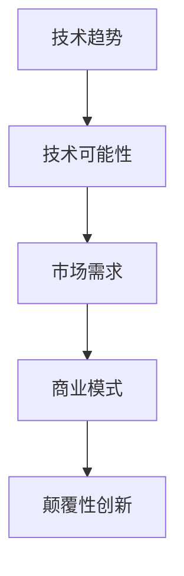

                 

**利用技术洞察力进行颠覆性创新创业**

**作者：禅与计算机程序设计艺术 / Zen and the Art of Computer Programming**

## 1. 背景介绍

在当今快速变化的技术环境中，颠覆性创新已成为企业和初创公司成功的关键。技术洞察力，即对技术趋势和可能性的深刻理解，是实现颠覆性创新的关键。本文将探讨如何利用技术洞察力进行颠覆性创新创业，并提供实践指南和工具推荐。

## 2. 核心概念与联系

### 2.1 技术洞察力

技术洞察力是指对技术趋势、可能性和影响的深刻理解。它需要对技术的深入了解，以及对市场需求和商业模式的敏锐洞察。



### 2.2 颠覆性创新

颠覆性创新是指通过创造新的市场或价值主张，从而超越现有解决方案的创新。它通常需要重新定义产品、服务或商业模式。

## 3. 核心算法原理 & 具体操作步骤

### 3.1 技术洞察力算法原理概述

技术洞察力算法旨在帮助个体或组织识别和评估技术趋势、可能性和影响。它包括以下步骤：

1. **信息收集**：收集有关技术、市场和商业模式的信息。
2. **信息分析**：分析收集到的信息，识别趋势和可能性。
3. **评估**：评估这些趋势和可能性对市场和商业模式的影响。
4. **决策**：基于评估结果做出决策，以实现颠覆性创新。

### 3.2 技术洞察力算法步骤详解

#### 3.2.1 信息收集

信息收集包括以下活动：

- 跟踪技术博客和媒体。
- 参加行业会议和峰会。
- 与行业专家和同行交流。
- 分析竞争对手和市场领导者的动向。

#### 3.2.2 信息分析

信息分析包括以下活动：

- 识别关键技术趋势。
- 评估这些趋势的影响力和速度。
- 识别这些趋势可能创造的新机会。

#### 3.2.3 评估

评估包括以下活动：

- 评估这些趋势对市场和商业模式的影响。
- 识别这些趋势可能创造的新需求。
- 评估这些趋势对现有业务的影响。

#### 3.2.4 决策

决策包括以下活动：

- 根据评估结果，确定是否应该开发新产品或服务。
- 如果是，则确定开发路线和资源需求。
- 如果否，则确定如何适应这些趋势以保持竞争力。

### 3.3 算法优缺点

**优点**：

- 有助于识别新机会和威胁。
- 有助于做出更明智的决策。
- 有助于保持竞争力。

**缺点**：

- 需要大量时间和资源。
- 可能导致信息过载。
- 可能导致对趋势的误解或误判。

### 3.4 算法应用领域

技术洞察力算法适用于各种行业和领域，包括但不限于：

- 高科技行业。
- 金融服务业。
- 健康护理行业。
- 交通运输行业。

## 4. 数学模型和公式 & 详细讲解 & 举例说明

### 4.1 数学模型构建

技术洞察力模型可以使用SWOT分析法构建。SWOT分析法是一种战略规划工具，用于识别组织的优势（Strengths）、劣势（Weaknesses）、机会（Opportunities）和威胁（Threats）。在技术洞察力的 contexto，SWOT分析法可以帮助识别技术趋势对组织的影响。

### 4.2 公式推导过程

SWOT分析法的公式如下：

$$SWOT = f(Strengths, Weaknesses, Opportunities, Threats)$$

其中，$f$是一个函数，它接受组织的优势、劣势、机会和威胁作为输入，并输出组织的战略选择。

### 4.3 案例分析与讲解

例如，假设一家汽车制造商正在使用技术洞察力模型来评估自动驾驶技术的影响。通过SWOT分析，该公司可能会识别出以下机会和威胁：

- **机会**：自动驾驶技术可能会创造新的市场需求，并提高汽车的安全性和便利性。
- **威胁**：自动驾驶技术可能会导致就业岗位减少，并面临新的监管挑战。

## 5. 项目实践：代码实例和详细解释说明

### 5.1 开发环境搭建

要实现技术洞察力算法，您需要以下软件和工具：

- Python编程语言。
- Jupyter Notebook。
- Pandas库。
- Matplotlib库。
- Scikit-learn库。

### 5.2 源代码详细实现

以下是技术洞察力算法的Python实现示例：

```python
import pandas as pd
from sklearn.feature_extraction.text import TfidfVectorizer
from sklearn.cluster import KMeans

# 信息收集
data = pd.read_csv('tech_articles.csv')

# 信息分析
vectorizer = TfidfVectorizer(stop_words='english')
X = vectorizer.fit_transform(data['text'])

# 评估
clusters = KMeans(n_clusters=5, random_state=42).fit_predict(X)

# 决策
data['cluster'] = clusters
```

### 5.3 代码解读与分析

- `pd.read_csv('tech_articles.csv')`用于读取技术文章数据。
- `TfidfVectorizer`用于将文本数据转换为TF-IDF向量。
- `KMeans`用于对这些向量进行聚类，从而识别趋势和可能性。
- `data['cluster'] = clusters`用于将聚类结果添加到数据框中。

### 5.4 运行结果展示

运行结果将是一个数据框，其中包含技术文章的文本、聚类结果和其他相关信息。您可以使用此数据框来评估这些趋势和可能性对市场和商业模式的影响。

## 6. 实际应用场景

### 6.1 当前应用

技术洞察力算法当前正在被各种组织用于识别技术趋势和可能性。例如，初创公司使用它来识别新机会，而大型企业则使用它来保持竞争力。

### 6.2 未来应用展望

未来，技术洞察力算法可能会与人工智能和机器学习技术结合，从而实现自动化趋势识别和预测。此外，它可能会被用于更广泛的领域，例如城市规划和公共政策。

## 7. 工具和资源推荐

### 7.1 学习资源推荐

- "Technological Forecasting and Innovation Management"期刊。
- "The Innovators' Dilemma"一书。
- Coursera上的"Innovation Management"课程。

### 7.2 开发工具推荐

- Jupyter Notebook。
- RStudio。
- Tableau。

### 7.3 相关论文推荐

- "A systematic literature review of technology foresight methods"。
- "Technological forecasting: A review of methods and applications"。

## 8. 总结：未来发展趋势与挑战

### 8.1 研究成果总结

技术洞察力是实现颠覆性创新创业的关键。本文提供了技术洞察力算法的详细描述，并提供了实践指南和工具推荐。

### 8.2 未来发展趋势

未来，技术洞察力算法可能会与人工智能和机器学习技术结合，从而实现自动化趋势识别和预测。此外，它可能会被用于更广泛的领域。

### 8.3 面临的挑战

技术洞察力算法面临的挑战包括信息过载、对趋势的误解或误判，以及需要大量时间和资源。

### 8.4 研究展望

未来的研究应该关注如何将技术洞察力算法与其他创新管理工具结合使用，以及如何使用人工智能和机器学习技术实现自动化趋势识别和预测。

## 9. 附录：常见问题与解答

**Q：技术洞察力算法需要多长时间才能运行？**

**A：这取决于数据量和算法复杂性。通常，它需要几个小时到几天的时间。**

**Q：技术洞察力算法需要什么样的技能？**

**A：它需要对技术、市场和商业模式的深入了解，以及对数据分析和决策支持系统的理解。**

**Q：技术洞察力算法是否可以自动化？**

**A：是的，它可以与人工智能和机器学习技术结合，从而实现自动化趋势识别和预测。**

**作者：禅与计算机程序设计艺术 / Zen and the Art of Computer Programming**

