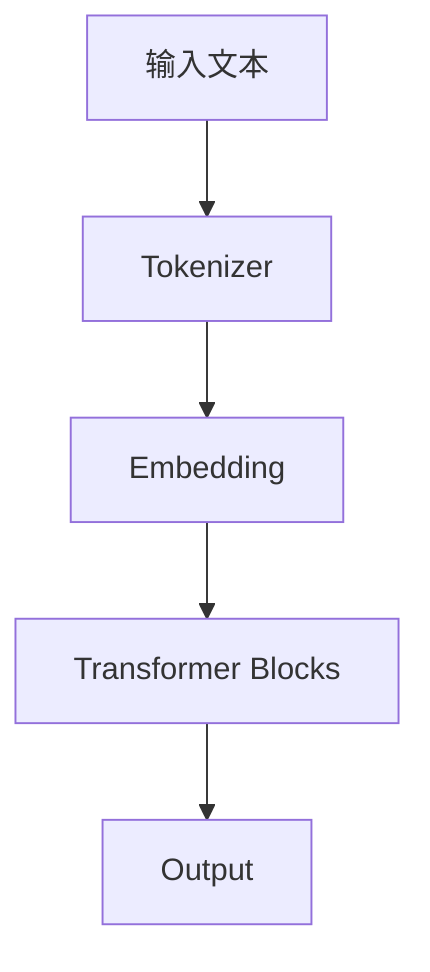

                 

**大语言模型（LLM）驱动的商业决策正在改变游戏规则，为企业带来前所未有的机遇和挑战。本文将深入探讨LLM在商业策略中的应用，从核心概念到具体算法，再到实践项目和未来展望。**

## 1. 背景介绍

大语言模型（LLM）是一种先进的深度学习模型，能够理解、生成和翻译人类语言。随着计算能力的提高和数据的丰富，LLM已经达到了可以驱动商业决策的水平。本文将探讨LLM如何帮助企业提高决策质量，增强竞争力，并带来新的商业机遇。

## 2. 核心概念与联系

### 2.1 大语言模型（LLM）的核心概念

大语言模型（LLM）是一种 transformer 模型，它使用自注意力机制（self-attention mechanism）来理解和生成文本。LLM 可以学习和理解上下文，从而生成相关、连贯的文本。 LLMs 的能力来自于它们的规模：它们由数十亿个参数组成，可以处理大量的文本数据。

### 2.2 LLM 在商业决策中的应用

LLM 可以在商业决策中发挥作用，因为它可以处理和理解大量的文本数据，从而提供有价值的见解。 LLMs 可以分析市场趋势，预测需求，评估竞争对手，并提供个性化的客户体验。

### 2.3 LLM 架构原理

以下是 LLM 的简化架构原理 Mermaid 流程图：



## 3. 核心算法原理 & 具体操作步骤

### 3.1 算法原理概述

LLM 的核心是 transformer 模型，它使用自注意力机制来理解和生成文本。自注意力机制允许模型在处理输入序列时考虑上下文，从而生成更相关、更连贯的输出。

### 3.2 算法步骤详解

1. **Tokenizer**: 将输入文本转换为模型可以理解的令牌（tokens）序列。
2. **Embedding**: 将令牌转换为模型可以处理的数值表示。
3. **Transformer Blocks**: 使用自注意力机制和全连接层处理输入，生成输出。
4. **Output**: 将输出转换为人类可读的文本。

### 3.3 算法优缺点

**优点**：LLM 可以理解和生成人类语言，可以处理大量的文本数据，可以提供有价值的见解。

**缺点**：LLM 训练需要大量的计算资源和数据，模型可能会生成不准确或不相关的输出。

### 3.4 算法应用领域

LLM 可以应用于商业决策、市场分析、客户服务、内容创作等领域。

## 4. 数学模型和公式 & 详细讲解 & 举例说明

### 4.1 数学模型构建

LLM 的数学模型是基于 transformer 模型的。transformer 模型使用自注意力机制和全连接层来处理输入序列。

### 4.2 公式推导过程

自注意力机制的数学公式如下：

$$ \text{Attention}(Q, K, V) = \text{softmax}\left(\frac{QK^T}{\sqrt{d_k}}\right)V $$

其中，$Q$, $K$, $V$ 是查询（query）、键（key）和值（value）矩阵，$d_k$ 是键矩阵的维度。

### 4.3 案例分析与讲解

例如，LLM 可以分析市场趋势。输入市场数据后，LLM 可以生成市场分析报告，提供有价值的见解。

## 5. 项目实践：代码实例和详细解释说明

### 5.1 开发环境搭建

要使用 LLM，需要安装 Python 和-transformers 库。可以使用以下命令安装：

```bash
pip install transformers
```

### 5.2 源代码详细实现

以下是一个简单的 LLM 示例，使用 Hugging Face 的 transformers 库：

```python
from transformers import AutoTokenizer, AutoModelForCausalLM

tokenizer = AutoTokenizer.from_pretrained("bigscience/bloom")
model = AutoModelForCausalLM.from_pretrained("bigscience/bloom")

inputs = tokenizer("Hello, I'm a language model.", return_tensors="pt")
outputs = model.generate(inputs["input_ids"], max_length=50)
print(tokenizer.decode(outputs[0]))
```

### 5.3 代码解读与分析

这段代码使用 Bloom 语言模型生成文本。首先，它加载 tokenizer 和模型。然后，它将输入文本转换为模型可以理解的令牌序列。最后，它生成输出序列，并将其解码为人类可读的文本。

### 5.4 运行结果展示

运行这段代码后，模型可能会生成类似于 "Hello, I'm a language model. I can help you with a variety of tasks." 的文本。

## 6. 实际应用场景

### 6.1 市场分析

LLM 可以分析市场数据，预测需求，评估竞争对手，并提供有价值的见解。

### 6.2 客户服务

LLM 可以提供个性化的客户服务，回答客户问题，提供建议，并帮助客户解决问题。

### 6.3 内容创作

LLM 可以帮助创作内容，从博客文章到广告文案，都可以由 LLM 生成。

### 6.4 未来应用展望

LLM 的未来应用包括实时市场分析，个性化营销，自动内容创作，以及更多。

## 7. 工具和资源推荐

### 7.1 学习资源推荐

- [Hugging Face Transformers](https://huggingface.co/transformers/)
- [Stanford CS224n: Natural Language Processing with Deep Learning](https://online.stanford.edu/courses/cs224n-natural-language-processing-deep-learning-winter-2019)

### 7.2 开发工具推荐

- [Google Colab](https://colab.research.google.com/)
- [Jupyter Notebook](https://jupyter.org/)

### 7.3 相关论文推荐

- [Language Models are Few-Shot Learners](https://arxiv.org/abs/2005.14165)
- [Bloom: A Large Language Model for Many Tasks](https://arxiv.org/abs/2201.12044)

## 8. 总结：未来发展趋势与挑战

### 8.1 研究成果总结

LLM 在商业决策中的应用正在改变游戏规则。LLM 可以提供有价值的见解，增强竞争力，并带来新的商业机遇。

### 8.2 未来发展趋势

LLM 的未来发展趋势包括实时市场分析，个性化营销，自动内容创作，以及更多。

### 8.3 面临的挑战

LLM 的主要挑战包括模型训练需要大量的计算资源和数据，模型可能会生成不准确或不相关的输出。

### 8.4 研究展望

未来的研究将关注于提高 LLM 的准确性和可靠性，降低模型的计算需求，并扩展 LLM 的应用领域。

## 9. 附录：常见问题与解答

**Q：LLM 可以理解和生成人类语言吗？**

**A：**是的，LLM 可以理解和生成人类语言。LLM 使用 transformer 模型，它使用自注意力机制来理解和生成文本。

**Q：LLM 需要大量的计算资源吗？**

**A：**是的，LLM 训练需要大量的计算资源和数据。但是，预训练的 LLM 模型可以在常见的计算设备上运行。

**Q：LLM 可以应用于商业决策吗？**

**A：**是的，LLM 可以应用于商业决策。LLM 可以分析市场数据，预测需求，评估竞争对手，并提供有价值的见解。

**作者：禅与计算机程序设计艺术 / Zen and the Art of Computer Programming**

