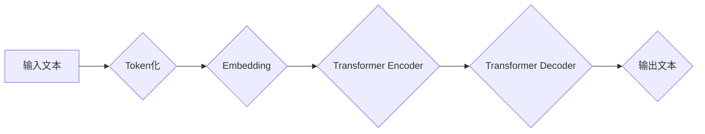

> AIGC, ChatGPT, 语言模型, Transformer, 训练数据, 算法原理, 应用场景

## 1. 背景介绍

近年来，人工智能（AI）技术飞速发展，特别是生成式人工智能（AIGC）的兴起，为人们的生活和工作带来了革命性的改变。AIGC能够根据输入的文本或代码生成新的文本、代码、图像、音频等内容，展现出强大的创造力和应用潜力。其中，ChatGPT作为一款基于Transformer架构的强大语言模型，迅速成为公众关注的焦点。

ChatGPT由OpenAI公司开发，其强大的文本生成能力和自然语言理解能力，使其在聊天机器人、文本创作、代码生成等领域展现出巨大的应用价值。本文将深入探讨ChatGPT的外貌和内涵，分析其核心概念、算法原理、训练方法以及实际应用场景，并展望其未来发展趋势。

## 2. 核心概念与联系

ChatGPT的核心概念是**语言模型**，它是一种能够理解和生成人类语言的AI系统。语言模型通过学习大量的文本数据，建立起单词之间的关系和语义理解能力，从而能够生成流畅、自然的文本。

ChatGPT基于**Transformer**架构，这是一个专门用于处理序列数据的深度学习模型。Transformer模型通过**自注意力机制**，能够捕捉文本中长距离依赖关系，从而实现更准确的文本理解和生成。

**Mermaid 流程图：**

## 3. 核心算法原理 & 具体操作步骤

### 3.1  算法原理概述

ChatGPT的核心算法是**Transformer**模型，它由**Encoder**和**Decoder**两个部分组成。

* **Encoder**: 负责将输入文本转换为隐藏表示，捕捉文本中的语义信息。
* **Decoder**: 根据Encoder的输出，生成目标文本。

Transformer模型的核心是**自注意力机制**，它能够捕捉文本中不同单词之间的关系，即使这些单词相隔很远。

### 3.2  算法步骤详解

1. **Token化**: 将输入文本分割成一个个单词或子词，称为Token。
2. **Embedding**: 将每个Token映射到一个低维向量，称为Embedding向量。
3. **Encoder**: 将Embedding向量输入到Encoder中，通过多层Transformer模块进行处理，最终得到隐藏表示。
4. **Decoder**: 将隐藏表示输入到Decoder中，通过多层Transformer模块进行处理，最终生成目标文本。
5. **输出**: 将生成的文本Token解码回原始文本。

### 3.3  算法优缺点

**优点**:

* 能够捕捉长距离依赖关系，生成更流畅的文本。
* 训练效率高，能够处理海量文本数据。
* 泛化能力强，能够应用于多种自然语言处理任务。

**缺点**:

* 计算量大，需要强大的计算资源。
* 训练数据量大，需要大量高质量的文本数据。
* 容易受到训练数据偏差的影响。

### 3.4  算法应用领域

Transformer模型和ChatGPT在以下领域有广泛的应用：

* **聊天机器人**: 提供自然流畅的对话体验。
* **文本创作**: 生成小说、诗歌、剧本等创意文本。
* **机器翻译**: 将文本从一种语言翻译成另一种语言。
* **代码生成**: 根据自然语言描述生成代码。
* **问答系统**: 回答用户提出的问题。

## 4. 数学模型和公式 & 详细讲解 & 举例说明

### 4.1  数学模型构建

Transformer模型的核心是**自注意力机制**，它通过计算每个单词与所有其他单词之间的注意力权重，来捕捉文本中的语义关系。

**注意力机制公式**:

$$
Attention(Q, K, V) = softmax(\frac{QK^T}{\sqrt{d_k}})V
$$

其中：

* $Q$：查询矩阵
* $K$：键矩阵
* $V$：值矩阵
* $d_k$：键向量的维度
* $softmax$：softmax函数

### 4.2  公式推导过程

注意力机制的公式可以理解为计算每个单词与所有其他单词之间的相关性，然后根据相关性分配不同的权重。

* $QK^T$：计算查询矩阵和键矩阵的点积，得到每个单词与所有其他单词之间的相似度。
* $\frac{QK^T}{\sqrt{d_k}}$：对点积进行归一化，使得注意力权重在0到1之间。
* $softmax$：对归一化后的值进行softmax操作，得到每个单词与所有其他单词之间的注意力权重。
* $V$：将注意力权重与值矩阵相乘，得到每个单词的加权平均值，即最终的隐藏表示。

### 4.3  案例分析与讲解

例如，在句子“我爱吃苹果”中，单词“我”与“苹果”之间的注意力权重会比较高，因为它们是句子中最重要的两个词。而单词“爱”与“吃”之间的注意力权重会比较低，因为它们是连接两个重要词的词。

## 5. 项目实践：代码实例和详细解释说明

### 5.1  开发环境搭建

ChatGPT的开发环境需要Python语言环境，以及一些深度学习库，例如TensorFlow或PyTorch。

### 5.2  源代码详细实现

ChatGPT的源代码开源，可以在GitHub上找到。

### 5.3  代码解读与分析

ChatGPT的源代码主要包含以下部分：

* **模型架构**: 定义Transformer模型的结构，包括Encoder和Decoder的层数、隐藏单元数等参数。
* **训练方法**: 定义训练模型的算法，例如梯度下降法。
* **数据处理**: 定义处理文本数据的函数，例如Token化、Embedding等。

### 5.4  运行结果展示

运行ChatGPT的代码，可以生成新的文本，例如回答问题、翻译文本、写诗歌等。

## 6. 实际应用场景

### 6.1  聊天机器人

ChatGPT可以用于构建聊天机器人，提供自然流畅的对话体验。例如，可以开发一个客服机器人，自动回答用户的常见问题。

### 6.2  文本创作

ChatGPT可以用于生成各种文本内容，例如小说、诗歌、剧本等。例如，可以利用ChatGPT生成创意写作素材，帮助作家克服写作瓶颈。

### 6.3  代码生成

ChatGPT可以根据自然语言描述生成代码，例如Python、Java等编程语言。例如，可以利用ChatGPT自动生成简单的代码片段，提高开发效率。

### 6.4  未来应用展望

ChatGPT的应用场景还在不断扩展，未来可能在以下领域发挥更大的作用：

* **教育**: 提供个性化的学习辅导，帮助学生理解复杂的知识。
* **医疗**: 辅助医生诊断疾病，提供患者个性化的治疗方案。
* **科研**: 自动生成研究论文，加速科研成果的产出。

## 7. 工具和资源推荐

### 7.1  学习资源推荐

* **书籍**: 《深度学习》、《自然语言处理》
* **在线课程**: Coursera、edX、Udacity
* **博客**: Towards Data Science、Machine Learning Mastery

### 7.2  开发工具推荐

* **Python**: 编程语言
* **TensorFlow**: 深度学习框架
* **PyTorch**: 深度学习框架
* **Hugging Face**: 预训练模型库

### 7.3  相关论文推荐

* **Attention Is All You Need**: https://arxiv.org/abs/1706.03762
* **BERT**: https://arxiv.org/abs/1810.04805
* **GPT-3**: https://openai.com/blog/gpt-3/

## 8. 总结：未来发展趋势与挑战

### 8.1  研究成果总结

ChatGPT的出现标志着AIGC技术取得了重大突破，其强大的文本生成能力和自然语言理解能力，为人工智能的应用带来了新的可能性。

### 8.2  未来发展趋势

未来，ChatGPT和类似的语言模型将朝着以下方向发展：

* **更强大的模型**: 模型规模将进一步扩大，参数量将达到数千亿甚至万亿级别。
* **更精准的理解**: 模型将能够更准确地理解人类语言的复杂含义和语义。
* **更广泛的应用**: 模型将应用于更多领域，例如教育、医疗、科研等。

### 8.3  面临的挑战

ChatGPT的发展也面临着一些挑战：

* **数据安全**: 训练模型需要大量数据，如何保证数据的安全和隐私是一个重要问题。
* **算法偏见**: 训练数据可能存在偏见，导致模型生成带有偏见的文本。
* **伦理问题**: 如何确保模型的应用符合伦理道德，避免被用于恶意目的，是一个需要认真思考的问题。

### 8.4  研究展望

未来，研究者将继续探索新的算法和模型，提高语言模型的性能和安全性，并积极应对AIGC带来的伦理挑战，推动AIGC技术朝着更加安全、可控、可持续的方向发展。

## 9. 附录：常见问题与解答

### 9.1  ChatGPT和BERT有什么区别？

ChatGPT和BERT都是基于Transformer架构的语言模型，但它们在训练目标和应用场景上有所不同。

* **ChatGPT**: 侧重于文本生成任务，例如聊天机器人、文本创作等。
* **BERT**: 侧重于文本理解任务，例如问答系统、文本分类等。

### 9.2  如何训练自己的ChatGPT模型？

训练ChatGPT模型需要大量的计算资源和高质量的文本数据。

* **数据**: 需要收集大量的文本数据，并进行预处理，例如Token化、清洗等。
* **硬件**: 需要使用强大的GPU集群进行训练。
* **软件**: 需要使用深度学习框架，例如TensorFlow或PyTorch。

### 9.3  ChatGPT的安全性如何保证？

ChatGPT的安全性是一个重要问题，OpenAI采取了一些措施来确保模型的安全使用，例如：

* **数据隐私**: 训练数据经过匿名处理，保护用户隐私。
* **内容过滤**: 模型训练时会过滤掉有害内容，例如暴力、色情等。
* **滥用检测**: OpenAI会监控模型的使用情况，并对滥用行为进行处罚。

作者：禅与计算机程序设计艺术 / Zen and the Art of Computer Programming 
<end_of_turn>