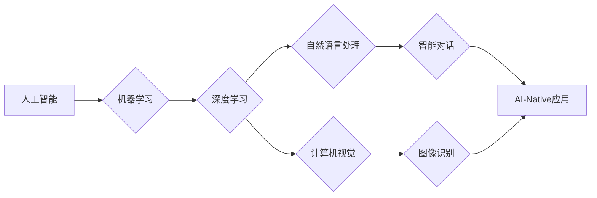

> AI-Native应用，人工智能，机器学习，深度学习，自然语言处理，计算机视觉，云计算，大数据

## 1. 背景介绍

近年来，人工智能（AI）技术取得了飞速发展，并开始渗透到各个领域，深刻地改变着人们的生活方式和工作模式。传统软件开发模式逐渐难以满足日益增长的智能化需求，新的开发理念和技术体系应运而生。AI-Native应用作为一种基于人工智能技术的全新应用模式，正逐渐成为未来软件开发的主流趋势。

AI-Native应用是指完全利用人工智能技术构建的应用，其核心特征是将人工智能算法和模型作为应用的核心组件，并通过数据驱动和机器学习不断优化和提升应用性能。与传统的软件开发模式相比，AI-Native应用具有以下显著优势：

* **智能化：** AI-Native应用能够通过机器学习和深度学习等算法，实现对数据的智能分析、理解和决策，从而提供更智能、更个性化的用户体验。
* **自适应性：** AI-Native应用能够根据用户行为和环境变化，动态调整自身参数和策略，实现对不断变化的需求的适应。
* **持续进化：** AI-Native应用能够通过持续学习和数据积累，不断提升自身性能和功能，实现持续进化和发展。

## 2. 核心概念与联系

AI-Native应用的核心概念包括：

* **人工智能（AI）：** 指计算机模拟人类智能的行为，例如学习、推理、决策和感知等。
* **机器学习（ML）：** 指让计算机从数据中学习，并根据学习到的知识进行预测或决策。
* **深度学习（DL）：** 指利用多层神经网络进行机器学习，能够处理更复杂的数据和任务。
* **自然语言处理（NLP）：** 指让计算机理解和处理人类语言。
* **计算机视觉（CV）：** 指让计算机“看”图像和视频，并从中提取信息。

这些核心概念相互关联，共同构成了AI-Native应用的基础。

**Mermaid 流程图**



## 3. 核心算法原理 & 具体操作步骤

### 3.1  算法原理概述

AI-Native应用的核心算法主要包括机器学习算法、深度学习算法和自然语言处理算法。

* **机器学习算法：** 这些算法通过训练数据学习模型，并根据模型预测或决策。常见的机器学习算法包括线性回归、逻辑回归、决策树、支持向量机和k近邻算法等。
* **深度学习算法：** 深度学习算法利用多层神经网络进行学习，能够处理更复杂的数据和任务。常见的深度学习算法包括卷积神经网络（CNN）、循环神经网络（RNN）和生成对抗网络（GAN）等。
* **自然语言处理算法：** 这些算法能够理解和处理人类语言，例如文本分类、情感分析、机器翻译和文本生成等。常见的自然语言处理算法包括词嵌入、词向量、序列标注和Transformer模型等。

### 3.2  算法步骤详解

以机器学习算法为例，其基本步骤包括：

1. **数据收集和预处理：** 收集相关数据并进行清洗、转换和特征工程等预处理操作。
2. **模型选择：** 根据任务需求选择合适的机器学习算法模型。
3. **模型训练：** 使用训练数据训练模型，并调整模型参数以获得最佳性能。
4. **模型评估：** 使用测试数据评估模型性能，并进行模型调优。
5. **模型部署：** 将训练好的模型部署到生产环境中，用于实际应用。

### 3.3  算法优缺点

每个算法都有其自身的优缺点，需要根据具体应用场景进行选择。

* **机器学习算法：** 优点：易于理解和实现，适用于数据量较小的场景。缺点：难以处理复杂的数据和任务，需要人工特征工程。
* **深度学习算法：** 优点：能够处理复杂的数据和任务，自动学习特征。缺点：需要大量数据进行训练，训练时间较长，模型解释性较差。
* **自然语言处理算法：** 优点：能够理解和处理人类语言，应用场景广泛。缺点：需要大量的标注数据进行训练，模型效果受数据质量影响较大。

### 3.4  算法应用领域

AI-Native应用的算法在各个领域都有广泛的应用，例如：

* **医疗保健：** 疾病诊断、药物研发、个性化医疗。
* **金融服务：** 风险评估、欺诈检测、投资决策。
* **零售业：** 商品推荐、客户服务、库存管理。
* **交通运输：** 自动驾驶、交通流量预测、物流优化。
* **教育：** 个性化学习、智能辅导、自动批改。

## 4. 数学模型和公式 & 详细讲解 & 举例说明

### 4.1  数学模型构建

AI-Native应用中常用的数学模型包括线性回归模型、逻辑回归模型、神经网络模型等。

**线性回归模型**

线性回归模型假设数据之间存在线性关系，可以用以下公式表示：

$$y = w_0 + w_1x_1 + w_2x_2 + ... + w_nx_n + \epsilon$$

其中：

* $y$ 是预测值
* $w_0, w_1, w_2, ..., w_n$ 是模型参数
* $x_1, x_2, ..., x_n$ 是输入特征
* $\epsilon$ 是误差项

**逻辑回归模型**

逻辑回归模型用于二分类问题，将线性回归模型的输出映射到0到1之间的概率值，表示样本属于正类的概率。其公式如下：

$$P(y=1|x) = \frac{1}{1 + e^{-(w_0 + w_1x_1 + w_2x_2 + ... + w_nx_n)}}$$

### 4.2  公式推导过程

公式推导过程通常涉及微积分、概率论和统计学等数学知识。例如，神经网络模型的训练过程涉及梯度下降算法，其核心是利用微积分求导计算模型参数的更新方向。

### 4.3  案例分析与讲解

以图像识别为例，可以使用卷积神经网络（CNN）模型进行图像分类。CNN模型通过卷积层、池化层和全连接层等结构，学习图像特征，并将其映射到不同的类别概率。

## 5. 项目实践：代码实例和详细解释说明

### 5.1  开发环境搭建

AI-Native应用开发通常需要使用Python语言和相关的机器学习库，例如TensorFlow、PyTorch和Scikit-learn等。

### 5.2  源代码详细实现

以下是一个简单的机器学习模型代码示例，用于预测房价：

```python
import pandas as pd
from sklearn.model_selection import train_test_split
from sklearn.linear_model import LinearRegression
from sklearn.metrics import mean_squared_error

# 加载数据
data = pd.read_csv('house_price.csv')

# 划分训练集和测试集
X = data[['size', 'location']]
y = data['price']
X_train, X_test, y_train, y_test = train_test_split(X, y, test_size=0.2, random_state=42)

# 创建线性回归模型
model = LinearRegression()

# 训练模型
model.fit(X_train, y_train)

# 预测测试集数据
y_pred = model.predict(X_test)

# 计算模型性能
mse = mean_squared_error(y_test, y_pred)
print(f'Mean Squared Error: {mse}')
```

### 5.3  代码解读与分析

这段代码首先加载房价数据，然后将数据分为特征和目标变量。接着使用`train_test_split`函数将数据划分为训练集和测试集。

然后创建线性回归模型，并使用`fit`函数训练模型。最后使用`predict`函数预测测试集数据，并计算模型性能。

### 5.4  运行结果展示

运行代码后，会输出模型的均方误差值，该值越小，模型性能越好。

## 6. 实际应用场景

AI-Native应用在各个领域都有广泛的应用场景，例如：

### 6.1  智能客服

AI-Native应用可以构建智能客服系统，利用自然语言处理技术，理解用户问题并提供自动回复，提高客户服务效率。

### 6.2  个性化推荐

AI-Native应用可以根据用户的行为数据和偏好，提供个性化的商品推荐，提升用户体验和转化率。

### 6.3  自动驾驶

AI-Native应用可以构建自动驾驶系统，利用计算机视觉和机器学习技术，感知周围环境并做出驾驶决策。

### 6.4  未来应用展望

随着人工智能技术的不断发展，AI-Native应用将更加智能化、个性化和广泛应用于各个领域。例如：

* **医疗保健：** AI-Native应用将能够辅助医生进行诊断、治疗和预防疾病，提高医疗效率和质量。
* **教育：** AI-Native应用将能够提供个性化学习方案，帮助学生更好地掌握知识和技能。
* **金融服务：** AI-Native应用将能够提高金融服务的效率和安全性，并为用户提供更个性化的金融产品和服务。

## 7. 工具和资源推荐

### 7.1  学习资源推荐

* **在线课程：** Coursera、edX、Udacity等平台提供丰富的AI和机器学习课程。
* **书籍：** 《深度学习》、《机器学习实战》等书籍是学习AI和机器学习的经典教材。
* **博客和论坛：** TensorFlow、PyTorch等开源框架的官方博客和论坛提供大量技术文档和社区支持。

### 7.2  开发工具推荐

* **Python：** Python是AI和机器学习开发的常用语言，拥有丰富的库和工具。
* **TensorFlow：** TensorFlow是一个开源的机器学习框架，支持多种深度学习算法。
* **PyTorch：** PyTorch是一个开源的机器学习框架，以其灵活性和易用性而闻名。
* **Scikit-learn：** Scikit-learn是一个开源的机器学习库，提供多种传统机器学习算法。

### 7.3  相关论文推荐

* **《ImageNet Classification with Deep Convolutional Neural Networks》**
* **《Attention Is All You Need》**
* **《BERT: Pre-training of Deep Bidirectional Transformers for Language Understanding》**

## 8. 总结：未来发展趋势与挑战

### 8.1  研究成果总结

近年来，AI-Native应用取得了显著进展，在各个领域都有广泛的应用。深度学习算法的突破、大数据量的积累和计算能力的提升，为AI-Native应用的发展提供了强有力的支撑。

### 8.2  未来发展趋势

未来，AI-Native应用将朝着以下方向发展：

* **更加智能化：** AI-Native应用将更加智能化，能够更好地理解和响应用户的需求。
* **更加个性化：** AI-Native应用将更加个性化，能够提供定制化的服务和体验。
* **更加广泛应用：** AI-Native应用将更加广泛应用于各个领域，改变人们的生活方式和工作模式。

### 8.3  面临的挑战

AI-Native应用的发展也面临着一些挑战：

* **数据安全和隐私保护：** AI-Native应用需要大量数据进行训练和运行，如何保障数据安全和隐私保护是一个重要问题。
* **算法解释性和可信度：** 许多深度学习算法的内部机制难以理解，如何提高算法的解释性和可信度是一个关键挑战。
* **伦理和社会影响：** AI-Native应用的广泛应用可能带来一些伦理和社会问题，需要进行深入研究和探讨。

### 8.4  研究展望

未来，需要进一步研究以下问题：

* 如何开发更加安全、可靠和可解释的AI算法。
* 如何解决AI-