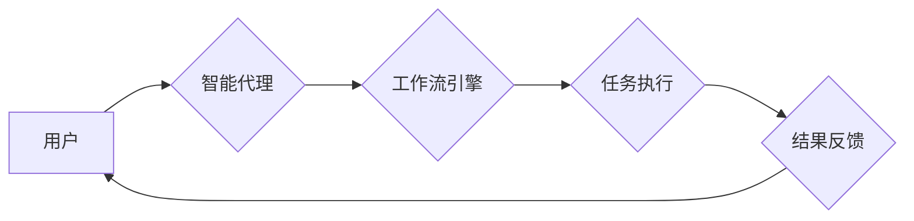

> AI代理，工作流，健康医疗，智能化，自动化，机器学习，自然语言处理，数据分析

## 1. 背景介绍

随着人工智能技术的飞速发展，智能代理（AI Agent）作为一种能够自主学习、决策和执行任务的软件系统，在各个领域展现出巨大的应用潜力。尤其是在医疗保健领域，智能代理能够有效提升医疗效率、降低成本，并为患者提供更个性化的医疗服务。

传统的医疗工作流程往往冗长繁琐，需要大量人力参与，容易出现错误和延误。而智能代理能够自动化执行许多重复性任务，例如预约挂号、处理病历、提醒服药等，从而解放医护人员的时间和精力，让他们能够专注于更重要的临床工作。

## 2. 核心概念与联系

**2.1 智能代理的概念**

智能代理是一种能够感知环境、做出决策并执行行动的软件系统。它通常具有以下特征：

* **自主性:** 智能代理能够独立完成任务，无需人工干预。
* **学习能力:** 智能代理能够从经验中学习，不断改进自己的决策和执行能力。
* **适应性:** 智能代理能够适应不断变化的环境，并调整自己的行为策略。
* **交互性:** 智能代理能够与用户和环境进行交互，获取信息和反馈。

**2.2 工作流的概念**

工作流是一种描述业务流程的模型，它定义了任务的顺序、依赖关系和执行规则。工作流管理系统能够自动执行工作流程，并跟踪任务的执行进度。

**2.3 AI代理工作流的结合**

将智能代理与工作流结合起来，可以构建一个更加智能化和自动化的工作流程系统。AI代理能够根据工作流程的规则和自身学习到的知识，自动执行任务，并根据环境变化动态调整执行策略。

**2.4 架构图**



## 3. 核心算法原理 & 具体操作步骤

**3.1 算法原理概述**

AI代理工作流的核心算法通常基于机器学习和自然语言处理技术。

* **机器学习:** 用于训练智能代理，使其能够从历史数据中学习工作流程的规则和任务执行策略。
* **自然语言处理:** 用于使智能代理能够理解和处理用户自然语言的请求，并生成自然语言的回复。

**3.2 算法步骤详解**

1. **数据收集和预处理:** 收集工作流程相关的数据，例如任务描述、执行步骤、时间成本等，并进行预处理，例如清洗、转换、标注等。
2. **模型训练:** 使用机器学习算法，例如决策树、支持向量机、神经网络等，训练智能代理模型。
3. **工作流程建模:** 根据工作流程的规则和任务依赖关系，构建工作流程模型。
4. **任务分配和执行:** 智能代理根据工作流程模型和自身学习到的知识，自动分配任务并执行任务。
5. **结果反馈和评估:** 收集任务执行结果，并进行评估，例如准确率、效率、用户满意度等。
6. **模型更新:** 根据评估结果，更新智能代理模型，使其能够不断改进。

**3.3 算法优缺点**

* **优点:**
    * 自动化执行任务，提高效率。
    * 降低人工成本。
    * 提供个性化服务。
    * 适应环境变化。
* **缺点:**
    * 需要大量数据进行训练。
    * 模型训练复杂。
    * 算法解释性差。

**3.4 算法应用领域**

AI代理工作流的应用领域非常广泛，例如：

* 医疗保健：预约挂号、处理病历、提醒服药、辅助诊断等。
* 金融服务：理财规划、风险评估、欺诈检测等。
* 制造业：生产调度、质量控制、设备维护等。
* 教育行业：个性化学习、在线辅导、自动批改等。

## 4. 数学模型和公式 & 详细讲解 & 举例说明

**4.1 数学模型构建**

我们可以使用状态机模型来描述智能代理的工作流程。状态机由状态和转换规则组成。每个状态代表代理当前的工作状态，转换规则描述了代理在不同状态下如何根据环境信息和任务指令进行状态转换。

**4.2 公式推导过程**

状态转换的概率可以根据机器学习算法训练得到。例如，我们可以使用贝叶斯网络来计算代理在不同状态下执行不同任务的概率。

**4.3 案例分析与讲解**

假设一个智能代理用于处理患者预约挂号的任务。

* 状态：等待预约、处理预约、完成预约。
* 转换规则：
    * 从等待预约状态到处理预约状态的概率取决于患者预约的医院、科室和时间。
    * 从处理预约状态到完成预约状态的概率取决于患者信息是否完整、预约时间是否冲突等。

**4.4 数学公式举例**

$$P(s_t|s_{t-1},a_{t-1},o_t)$$

其中：

* $P(s_t|s_{t-1},a_{t-1},o_t)$ 表示在时间步 $t$ 状态为 $s_t$ 的概率，
* $s_{t-1}$ 表示时间步 $t-1$ 的状态，
* $a_{t-1}$ 表示时间步 $t-1$ 的动作，
* $o_t$ 表示时间步 $t$ 的观测信息。

## 5. 项目实践：代码实例和详细解释说明

**5.1 开发环境搭建**

* Python 3.x
* TensorFlow 或 PyTorch
* NLTK 或 SpaCy
* Flask 或 Django

**5.2 源代码详细实现**

```python
# 导入必要的库
import tensorflow as tf
from nltk.tokenize import word_tokenize

# 定义一个简单的智能代理模型
class SimpleAgent:
    def __init__(self):
        self.model = tf.keras.Sequential([
            tf.keras.layers.Embedding(input_dim=10000, output_dim=128),
            tf.keras.layers.LSTM(units=64),
            tf.keras.layers.Dense(units=1, activation='sigmoid')
        ])

    def predict(self, text):
        tokens = word_tokenize(text)
        # 将文本转换为模型输入格式
        # ...
        # 使用模型预测
        prediction = self.model.predict(input_data)
        return prediction

# 创建一个智能代理实例
agent = SimpleAgent()

# 获取用户输入
user_input = input("请输入您的请求：")

# 使用智能代理处理请求
prediction = agent.predict(user_input)

# 根据预测结果执行相应的操作
if prediction > 0.5:
    print("我理解您的请求，正在为您处理...")
else:
    print("对不起，我无法理解您的请求。")
```

**5.3 代码解读与分析**

* 该代码定义了一个简单的智能代理模型，使用 LSTM 网络进行文本分类。
* 模型输入是文本，输出是预测结果，表示是否理解用户请求。
* 代码演示了如何使用智能代理处理用户请求，并根据预测结果执行相应的操作。

**5.4 运行结果展示**

当用户输入“帮我预约挂号”时，模型可能会预测为理解请求，并提示正在处理。

## 6. 实际应用场景

**6.1 医疗预约系统**

智能代理可以帮助患者预约挂号，查询医生信息，获取医疗服务相关信息。

**6.2 病历处理系统**

智能代理可以自动提取病历中的关键信息，例如症状、诊断、治疗方案等，并进行整理和归档。

**6.3 患者健康管理系统**

智能代理可以提醒患者服药、监测健康指标、提供健康建议等。

**6.4 未来应用展望**

* **个性化医疗服务:** 智能代理可以根据患者的个人信息和健康状况，提供个性化的医疗建议和服务。
* **远程医疗:** 智能代理可以帮助医生远程诊断和治疗患者，提高医疗服务的可及性。
* **医疗研究:** 智能代理可以帮助分析海量医疗数据，发现新的疾病治疗方法。

## 7. 工具和资源推荐

**7.1 学习资源推荐**

* **书籍:**
    * 《人工智能：现代方法》
    * 《深度学习》
* **在线课程:**
    * Coursera: 人工智能
    * edX: 深度学习
* **开源项目:**
    * TensorFlow
    * PyTorch

**7.2 开发工具推荐**

* **Python:** 
* **TensorFlow:** 深度学习框架
* **PyTorch:** 深度学习框架
* **NLTK:** 自然语言处理库
* **SpaCy:** 自然语言处理库

**7.3 相关论文推荐**

* **Reinforcement Learning: An Introduction**
* **Deep Learning**
* **Attention Is All You Need**

## 8. 总结：未来发展趋势与挑战

**8.1 研究成果总结**

AI代理工作流在医疗保健领域取得了显著的成果，例如提高了医疗效率、降低了成本，并为患者提供更个性化的医疗服务。

**8.2 未来发展趋势**

* **更智能的代理:** 利用更先进的机器学习算法，训练更智能的代理，使其能够更好地理解用户需求和执行复杂的任务。
* **更个性化的服务:** 根据患者的个人信息和健康状况，提供更个性化的医疗服务。
* **更安全的系统:** 加强数据安全和隐私保护，确保智能代理系统安全可靠。

**8.3 面临的挑战**

* **数据质量:** 智能代理的训练需要大量高质量的数据，而医疗数据往往存在隐私问题和质量问题。
* **算法解释性:** 许多机器学习算法的决策过程难以解释，这可能会导致用户对智能代理的信任度降低。
* **伦理问题:** 智能代理在医疗保健领域的应用可能会引发一些伦理问题，例如责任归属、数据隐私等。

**8.4 研究展望**

未来，我们将继续研究更智能、更安全、更可靠的AI代理工作流，并将其应用于更多医疗保健领域，为患者提供更优质的医疗服务。

## 9. 附录：常见问题与解答

**9.1 智能代理是否会取代医生？**

智能代理可以帮助医生提高效率和准确性，但不会取代医生。医生仍然需要根据患者的具体情况进行诊断和治疗。

**9.2 智能代理是否会泄露患者隐私？**

我们非常重视数据安全和隐私保护。我们将采取多种措施来确保智能代理系统安全可靠，不会泄露患者隐私。

**9.3 如何使用智能代理？**

您可以通过我们的应用程序或网站与智能代理进行交互。

作者：禅与计算机程序设计艺术 / Zen and the Art of Computer Programming


<end_of_turn>