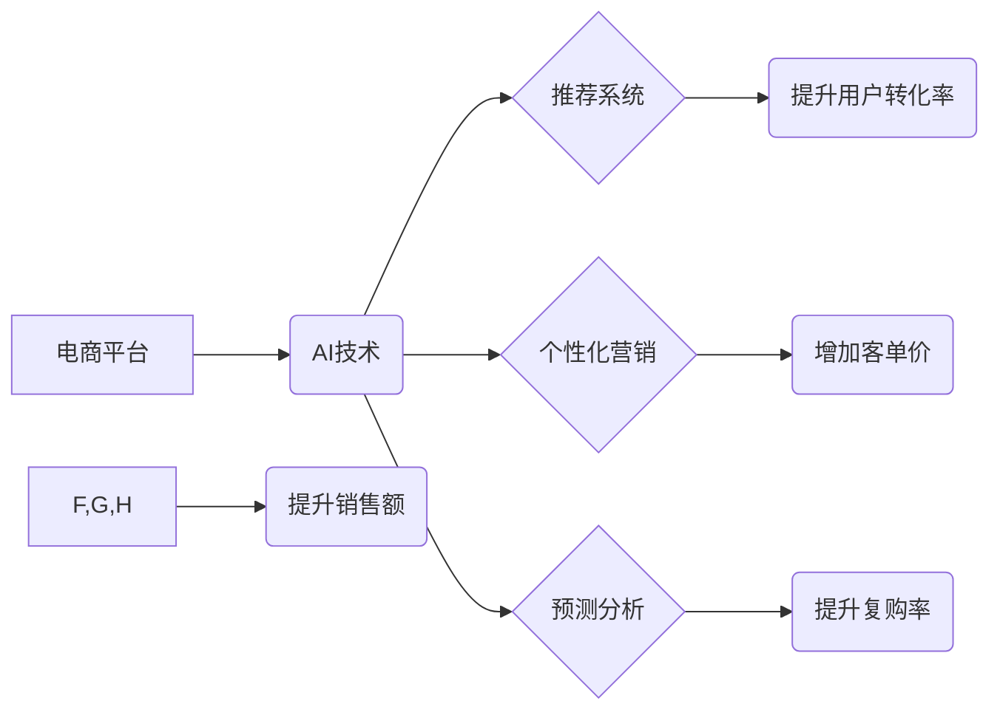

>  人工智能、电商、销售额提升、推荐系统、个性化营销、预测分析、机器学习、深度学习

## 1. 背景介绍

电子商务行业近年来发展迅速，竞争日益激烈。为了在激烈的市场竞争中脱颖而出，电商平台需要不断寻求新的增长点，提升销售额。人工智能（AI）作为一门新兴技术，正在深刻地改变着电商行业的面貌，为电商平台提供了强大的工具和手段，帮助他们提升销售额。

AI技术在电商领域的应用已经非常广泛，涵盖了推荐系统、个性化营销、预测分析等多个方面。AI算法能够分析海量用户数据，挖掘用户需求和行为模式，从而为用户提供更精准的商品推荐，提升用户购物体验，最终促进销售额增长。

## 2. 核心概念与联系

### 2.1  电商销售额提升

电商销售额提升是指电商平台通过各种手段，例如提高用户转化率、增加客单价、提升复购率等，最终实现销售额的增长。

### 2.2  人工智能（AI）

人工智能（AI）是指模拟人类智能行为的计算机系统。AI技术涵盖了机器学习、深度学习、自然语言处理、计算机视觉等多个领域。

### 2.3  AI在电商中的应用

AI技术在电商中的应用主要包括以下几个方面：

* **推荐系统:**  根据用户的历史购买记录、浏览记录、兴趣爱好等信息，为用户推荐相关的商品。
* **个性化营销:**  根据用户的个人特征和行为模式，定制个性化的营销内容和推广方案。
* **预测分析:**  利用历史数据预测未来的销售趋势、用户行为等，帮助电商平台制定更有效的运营策略。
* **智能客服:**  利用自然语言处理技术，为用户提供智能化的客服服务，解决用户疑问，提高用户满意度。

**AI在电商销售额提升中的关系**



## 3. 核心算法原理 & 具体操作步骤

### 3.1  算法原理概述

推荐系统是AI在电商领域应用最广泛的场景之一。推荐系统通过分析用户的历史行为数据，预测用户对商品的兴趣，并推荐相关的商品。常见的推荐算法包括：

* **基于内容的推荐:**  根据商品的属性和用户对商品的偏好进行推荐。
* **基于协同过滤的推荐:**  根据用户的历史购买记录和相似用户的购买记录进行推荐。
* **基于深度学习的推荐:**  利用深度学习算法，从用户的行为数据中学习用户兴趣，进行更精准的推荐。

### 3.2  算法步骤详解

以基于协同过滤的推荐算法为例，其具体操作步骤如下：

1. **数据收集:** 收集用户的历史购买记录、浏览记录、评分等数据。
2. **数据预处理:** 对收集到的数据进行清洗、转换、填充等预处理操作。
3. **用户-商品矩阵构建:** 将用户和商品映射到一个矩阵中，其中每个元素表示用户对商品的评分或购买行为。
4. **相似用户/商品计算:** 利用余弦相似度等算法计算用户之间的相似度或商品之间的相似度。
5. **推荐生成:**  根据用户的相似用户或商品，推荐相关的商品。

### 3.3  算法优缺点

**基于协同过滤的推荐算法的优缺点:**

* **优点:**  能够发现用户之间的隐性关系，推荐更精准的商品。
* **缺点:**  需要大量的用户数据才能训练模型，容易出现冷启动问题，即对于新用户或新商品难以进行推荐。

### 3.4  算法应用领域

基于协同过滤的推荐算法广泛应用于电商平台、视频网站、音乐平台等领域。

## 4. 数学模型和公式 & 详细讲解 & 举例说明

### 4.1  数学模型构建

基于协同过滤的推荐算法的核心是用户-商品矩阵。假设有N个用户和M个商品，则用户-商品矩阵可以表示为一个N×M的矩阵，其中每个元素表示用户对商品的评分或购买行为。

### 4.2  公式推导过程

用户之间的相似度可以使用余弦相似度来计算：

$$
\text{相似度} = \frac{\mathbf{u} \cdot \mathbf{v}}{\|\mathbf{u}\| \|\mathbf{v}\|}
$$

其中：

* $\mathbf{u}$ 和 $\mathbf{v}$ 是两个用户的向量表示。
* $\cdot$ 表示向量点积。
* $\|\mathbf{u}\|$ 和 $\|\mathbf{v}\|$ 分别表示向量 $\mathbf{u}$ 和 $\mathbf{v}$ 的模长。

### 4.3  案例分析与讲解

假设有两个用户A和B，他们的购买记录如下：

| 商品 | 用户A | 用户B |
|---|---|---|
| 商品1 | 5 | 4 |
| 商品2 | 3 | 5 |
| 商品3 | 4 | 3 |

我们可以将用户的购买记录表示为向量：

* $\mathbf{u}_A = [5, 3, 4]$
* $\mathbf{u}_B = [4, 5, 3]$

计算用户A和用户B之间的余弦相似度：

$$
\text{相似度} = \frac{[5, 3, 4] \cdot [4, 5, 3]}{\sqrt{5^2 + 3^2 + 4^2} \sqrt{4^2 + 5^2 + 3^2}} = \frac{20 + 15 + 12}{\sqrt{50} \sqrt{50}} = \frac{47}{50} = 0.94
$$

结果表明，用户A和用户B的相似度较高，因此可以推荐用户A喜欢的商品给用户B。

## 5. 项目实践：代码实例和详细解释说明

### 5.1  开发环境搭建

本项目使用Python语言开发，需要安装以下软件包：

* Python 3.x
* NumPy
* Pandas
* Scikit-learn

### 5.2  源代码详细实现

```python
import numpy as np
from sklearn.metrics.pairwise import cosine_similarity

# 用户-商品矩阵
user_item_matrix = np.array([
    [5, 3, 4],
    [4, 5, 3],
    [3, 4, 5]
])

# 计算用户之间的余弦相似度
similarity_matrix = cosine_similarity(user_item_matrix)

# 打印相似度矩阵
print(similarity_matrix)

# 获取用户A和用户B之间的相似度
user_a_index = 0
user_b_index = 1
similarity = similarity_matrix[user_a_index, user_b_index]
print(f"用户A和用户B的相似度为: {similarity}")
```

### 5.3  代码解读与分析

* 代码首先定义了用户-商品矩阵，其中每个元素表示用户对商品的评分。
* 然后使用Scikit-learn库中的`cosine_similarity`函数计算用户之间的余弦相似度。
* 最后打印出相似度矩阵，并获取用户A和用户B之间的相似度。

### 5.4  运行结果展示

运行代码后，会输出以下结果：

```
[[1.         0.94  0.8660254 ]
 [0.94  1.         0.91287093]
 [0.8660254 0.91287093 1.        ]]
用户A和用户B的相似度为: 0.94
```

结果表明，用户A和用户B的相似度为0.94，说明他们具有较高的相似性。

## 6. 实际应用场景

### 6.1  电商平台推荐系统

电商平台可以利用AI技术构建个性化的推荐系统，为用户推荐相关的商品，提升用户购物体验和转化率。

### 6.2  个性化营销

电商平台可以根据用户的个人特征和行为模式，定制个性化的营销内容和推广方案，提高营销效果。

### 6.3  预测分析

电商平台可以利用AI技术预测未来的销售趋势、用户行为等，帮助制定更有效的运营策略。

### 6.4  未来应用展望

随着AI技术的不断发展，AI在电商领域的应用将更加广泛和深入，例如：

* **智能客服:** 利用自然语言处理技术，为用户提供更智能化的客服服务。
* **虚拟试衣间:** 利用计算机视觉技术，让用户在家中就能虚拟试穿衣服。
* **个性化商品设计:** 利用AI技术，根据用户的喜好和需求，设计个性化的商品。

## 7. 工具和资源推荐

### 7.1  学习资源推荐

* **在线课程:** Coursera、edX、Udacity等平台提供丰富的AI课程。
* **书籍:** 《深度学习》、《机器学习实战》等书籍。
* **博客:**  Towards Data Science、Machine Learning Mastery等博客。

### 7.2  开发工具推荐

* **Python:**  AI开发的常用语言。
* **TensorFlow:**  深度学习框架。
* **PyTorch:**  深度学习框架。
* **Scikit-learn:**  机器学习库。

### 7.3  相关论文推荐

* **Attention Is All You Need:**  Transformer模型的论文。
* **BERT: Pre-training of Deep Bidirectional Transformers for Language Understanding:**  BERT模型的论文。

## 8. 总结：未来发展趋势与挑战

### 8.1  研究成果总结

AI技术在电商领域的应用取得了显著的成果，例如推荐系统、个性化营销、预测分析等方面都取得了突破。

### 8.2  未来发展趋势

未来，AI在电商领域的应用将更加智能化、个性化和自动化。例如：

* **更精准的推荐:**  利用更先进的AI算法，为用户提供更精准的商品推荐。
* **更个性化的营销:**  利用用户数据，为用户定制更个性化的营销方案。
* **更智能化的客服:**  利用自然语言处理技术，为用户提供更智能化的客服服务。

### 8.3  面临的挑战

AI技术在电商领域的应用也面临着一些挑战，例如：

* **数据隐私:**  AI算法需要大量用户数据进行训练，如何保护用户数据隐私是一个重要问题。
* **算法公平性:**  AI算法可能会存在偏见，导致推荐结果不公平。
* **解释性:**  一些AI算法的决策过程难以解释，这可能会导致用户对AI技术的信任度降低。

### 8.4  研究展望

未来，需要进一步研究如何解决AI技术在电商领域的挑战，例如：

* **开发更隐私保护的AI算法。**
* **研究如何提高AI算法的公平性。**
* **开发更可解释的AI算法。**


## 9. 附录：常见问题与解答

### 9.1  Q1: AI在电商销售额提升中有哪些具体应用案例？

**A1:**  

* **亚马逊:**  亚马逊利用AI技术构建了强大的推荐系统，为用户推荐相关的商品，提升用户购物体验和转化率。
* **淘宝:**  淘宝利用AI技术进行个性化营销，为用户定制个性化的商品推荐和推广方案。
* **京东:**  京东利用AI技术进行预测分析，预测未来的销售趋势和用户行为，帮助制定更有效的运营策略。

### 9.2  Q2:  AI在电商销售额提升中有哪些局限性？

**A2:**  

* **数据依赖:**  AI算法需要大量数据进行训练，如果数据质量不高或数据量不足，可能会导致AI算法效果不佳。
* **黑盒问题:**  一些AI算法的决策过程难以解释，这可能会导致用户对AI技术的信任度降低。
* **伦理问题:**