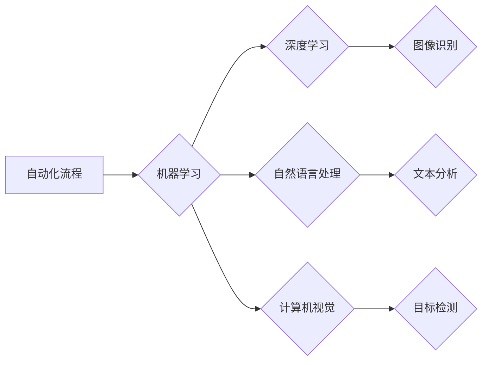

>人工智能，自动化，机器学习，深度学习，自然语言处理，计算机视觉，流程自动化，机器人技术

## 1. 背景介绍

随着科技的飞速发展，人工智能（AI）技术已经从实验室走向现实生活，并在各个领域展现出强大的应用潜力。自动化一直是人类追求的目标，而AI技术的出现为实现自动化带来了新的机遇。AI在自动化领域的应用前景广阔，能够提高效率、降低成本、提升安全性，并为人类创造更多价值。

### 1.1 自动化发展历程

自动化技术的起源可以追溯到工业革命时期，当时蒸汽机和自动化生产线开始应用，标志着人类开始摆脱体力劳动，提高生产效率。随着科技的进步，自动化技术不断发展，从传统的机械自动化到如今的智能自动化，例如：

* **机械自动化:** 利用机械装置和程序控制，实现重复性任务的自动化，例如流水线生产、机器人焊接等。
* **程序化自动化:** 利用软件程序控制设备和系统，实现特定任务的自动化，例如数据处理、网络管理等。
* **智能自动化:** 利用人工智能技术，赋予机器学习和决策能力，实现更复杂的自动化，例如智能客服、自动驾驶等。

### 1.2 AI技术与自动化融合

人工智能技术的出现为自动化带来了革命性的变革。AI技术能够学习和理解数据，并根据数据做出决策，从而实现更智能、更灵活的自动化。AI技术与自动化融合，形成了智能自动化，其特点如下：

* **学习和适应:** AI算法能够从数据中学习，并根据环境变化进行调整，实现更灵活的自动化。
* **决策和推理:** AI算法能够进行决策和推理，解决复杂问题，实现更智能的自动化。
* **交互和理解:** AI技术能够理解自然语言和图像，实现人机交互，提升自动化体验。

## 2. 核心概念与联系

### 2.1 自动化流程

自动化流程是指利用程序、规则和工具，将重复性、规则性任务自动化执行的过程。

### 2.2 机器学习

机器学习是人工智能的一个分支，它通过算法训练模型，使模型能够从数据中学习，并做出预测或决策。

### 2.3 深度学习

深度学习是机器学习的一个子领域，它利用多层神经网络来模拟人类大脑的学习过程，能够处理更复杂的数据，并取得更优的性能。

### 2.4 自然语言处理

自然语言处理（NLP）是人工智能的一个分支，它致力于使计算机能够理解和处理人类语言。

### 2.5 计算机视觉

计算机视觉是人工智能的一个分支，它致力于使计算机能够“看”和理解图像和视频。

**Mermaid 流程图**



## 3. 核心算法原理 & 具体操作步骤

### 3.1 算法原理概述

机器学习算法的核心原理是通过训练模型，使模型能够从数据中学习规律，并根据学习到的规律进行预测或决策。常见的机器学习算法包括：

* **监督学习:** 利用标记数据训练模型，例如分类、回归等。
* **无监督学习:** 利用未标记数据训练模型，例如聚类、降维等。
* **强化学习:** 通过奖励和惩罚机制训练模型，使模型能够在环境中学习最佳策略。

### 3.2 算法步骤详解

**以监督学习为例，其基本步骤如下：**

1. **数据收集和预处理:** 收集相关数据，并进行清洗、转换、特征工程等预处理操作。
2. **模型选择:** 根据任务需求选择合适的机器学习算法模型。
3. **模型训练:** 利用训练数据训练模型，调整模型参数，使模型能够学习数据中的规律。
4. **模型评估:** 利用测试数据评估模型的性能，例如准确率、召回率、F1-score等。
5. **模型部署:** 将训练好的模型部署到实际应用场景中，用于预测或决策。

### 3.3 算法优缺点

**不同机器学习算法各有优缺点，需要根据具体任务选择合适的算法。**

* **优点:** 能够自动学习数据规律，无需人工编程，能够处理大规模数据，具有较高的准确率。
* **缺点:** 需要大量数据进行训练，训练时间较长，对数据质量要求较高，难以解释模型决策过程。

### 3.4 算法应用领域

机器学习算法广泛应用于各个领域，例如：

* **图像识别:** 人脸识别、物体检测、图像分类等。
* **自然语言处理:** 文本分类、情感分析、机器翻译等。
* **推荐系统:** 商品推荐、内容推荐、用户画像等。
* **金融领域:** 风险评估、欺诈检测、信用评分等。
* **医疗领域:** 疾病诊断、药物研发、医疗影像分析等。

## 4. 数学模型和公式 & 详细讲解 & 举例说明

### 4.1 数学模型构建

机器学习算法通常基于数学模型进行构建，例如线性回归模型、逻辑回归模型、支持向量机模型等。这些模型通过数学公式来描述数据之间的关系，并利用这些关系进行预测或决策。

### 4.2 公式推导过程

**以线性回归模型为例，其目标是找到一条直线，使得这条直线与数据点之间的误差最小。**

线性回归模型的数学公式如下：

$$y = w_0 + w_1x_1 + w_2x_2 + ... + w_nx_n$$

其中：

* $y$ 是预测值
* $w_0, w_1, w_2, ..., w_n$ 是模型参数
* $x_1, x_2, ..., x_n$ 是输入特征

模型参数的求解可以通过最小二乘法进行，其目标函数为：

$$J(w) = \frac{1}{2}\sum_{i=1}^{m}(y_i - \hat{y}_i)^2$$

其中：

* $m$ 是样本数量
* $y_i$ 是真实值
* $\hat{y}_i$ 是预测值

通过求解目标函数的最小值，可以得到模型参数的最佳值。

### 4.3 案例分析与讲解

**假设我们想要预测房屋价格，输入特征包括房屋面积、房间数量、地理位置等。**

我们可以使用线性回归模型进行预测，通过训练模型，找到一条直线，使得这条直线与房屋价格和输入特征之间的关系最小。

**例如，如果模型参数为：**

* $w_0 = 100000$
* $w_1 = 500$
* $w_2 = 10000$

**则房屋价格的预测公式为：**

$$y = 100000 + 500x_1 + 10000x_2$$

其中：

* $x_1$ 是房屋面积
* $x_2$ 是房间数量

**我们可以根据房屋面积和房间数量，使用该公式预测房屋价格。**

## 5. 项目实践：代码实例和详细解释说明

### 5.1 开发环境搭建

**为了实现机器学习项目，我们需要搭建相应的开发环境。**

常用的开发环境包括：

* **Python:** Python 是机器学习领域最常用的编程语言，拥有丰富的机器学习库，例如 scikit-learn、TensorFlow、PyTorch 等。
* **Jupyter Notebook:** Jupyter Notebook 是一个交互式编程环境，方便进行机器学习代码编写、调试和展示。
* **云平台:** 云平台，例如 AWS、Azure、Google Cloud 等，提供强大的计算资源和机器学习服务，方便进行大规模机器学习项目开发。

### 5.2 源代码详细实现

**以使用 scikit-learn 库进行线性回归为例，代码如下：**

```python
from sklearn.linear_model import LinearRegression
from sklearn.model_selection import train_test_split
from sklearn.metrics import mean_squared_error

# 准备数据
X = [[100, 2], [150, 3], [200, 4], [250, 5]]  # 房屋面积和房间数量
y = [200000, 300000, 400000, 500000]  # 房屋价格

# 将数据分为训练集和测试集
X_train, X_test, y_train, y_test = train_test_split(X, y, test_size=0.2)

# 创建线性回归模型
model = LinearRegression()

# 训练模型
model.fit(X_train, y_train)

# 预测测试集数据
y_pred = model.predict(X_test)

# 计算模型性能
mse = mean_squared_error(y_test, y_pred)
print(f"Mean Squared Error: {mse}")
```

### 5.3 代码解读与分析

**代码首先准备了房屋面积和房间数量作为输入特征，以及对应的房屋价格作为目标变量。**

然后，将数据分为训练集和测试集，用于训练和评估模型。

接下来，创建线性回归模型，并使用训练集数据进行模型训练。

训练完成后，使用测试集数据进行预测，并计算模型性能。

### 5.4 运行结果展示

**运行代码后，会输出模型的均方误差 (MSE) 值，该值越小，模型性能越好。**

## 6. 实际应用场景

### 6.1 工业自动化

AI技术可以应用于工业自动化，例如：

* **机器人协作:** 利用AI技术，机器人能够与人类协作完成复杂任务，提高生产效率。
* ** Predictive Maintenance:** 利用AI技术，预测设备故障，提前进行维护，降低设备停机时间。
* **质量控制:** 利用AI技术，自动识别产品缺陷，提高产品质量。

### 6.2 商业自动化

AI技术可以应用于商业自动化，例如：

* **客户服务:** 利用AI技术，开发智能客服系统，自动回答客户问题，提高客户服务效率。
* **营销自动化:** 利用AI技术，分析客户数据，进行精准营销，提高营销效果。
* **财务自动化:** 利用AI技术，自动处理财务数据，提高财务效率。

### 6.3 生活自动化

AI技术可以应用于生活自动化，例如：

* **智能家居:** 利用AI技术，实现智能家居控制，例如自动调节灯光、温度等。
* **智能交通:** 利用AI技术，实现自动驾驶、智能交通管理等。
* **个性化推荐:** 利用AI技术，根据用户喜好，提供个性化推荐，例如商品推荐、内容推荐等。

### 6.4 未来应用展望

AI技术在自动化领域的应用前景广阔，未来将有更多新的应用场景出现，例如：

* **更智能的机器人:** 机器人将更加智能，能够理解人类语言，并完成更复杂的任务。
* **更个性化的服务:** AI技术将能够提供更加个性化的服务，例如定制化产品、个性化教育等。
* **更安全的社会:** AI技术将能够帮助我们提高社会安全，例如犯罪预防、灾害预警等。

## 7. 工具和资源推荐

### 7.1 学习资源推荐

* **在线课程:** Coursera、edX、Udacity 等平台提供丰富的机器学习课程。
* **书籍:** 《机器学习》 (周志华)、《深度学习》 (Ian Goodfellow) 等书籍是机器学习学习的经典教材。
* **博客和论坛:** 机器学习相关的博客和论坛，例如 Towards Data Science、Machine Learning Mastery 等，可以获取最新的机器学习资讯和技术分享。

### 7.2 开发工具推荐

* **Python:** Python 是机器学习领域最常用的编程语言。
* **scikit-learn:** scikit-learn 是 Python 的一个机器学习库，提供各种机器学习算法和工具。
* **TensorFlow:** TensorFlow 是 Google 开发的深度学习框架，支持多种硬件平台。
* **PyTorch:** PyTorch 是 Facebook 开发的深度学习框架，以其灵活性和易用性而闻