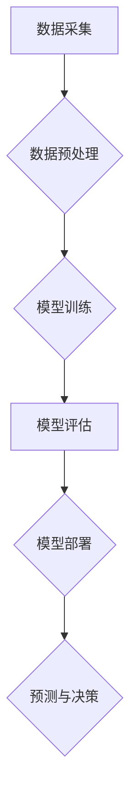

>  人工智能、商业应用、机器学习、深度学习、自然语言处理、计算机视觉、数据分析、自动化、预测分析

## 1. 背景介绍

人工智能（AI）技术近年来发展迅速，从学术研究走向了商业应用的各个领域。AI技术的核心在于模拟人类智能，使其能够学习、推理、决策和解决问题。随着计算能力的提升和数据量的爆炸式增长，AI技术已经具备了强大的应用潜力，在商业领域掀起了新的变革浪潮。

传统的商业模式往往依赖于人力和经验，效率有限，成本高昂。而AI技术可以自动化许多重复性任务，提高效率，降低成本，并提供更精准的预测和分析，帮助企业做出更明智的决策。

## 2. 核心概念与联系

**2.1  人工智能（AI）**

人工智能是指模拟和扩展人类智能的计算机系统。它涵盖了多个子领域，例如机器学习、深度学习、自然语言处理、计算机视觉等。

**2.2  机器学习（ML）**

机器学习是人工智能的一个重要分支，它使计算机能够从数据中学习，无需明确编程。机器学习算法可以根据训练数据识别模式，并做出预测或决策。

**2.3  深度学习（DL）**

深度学习是机器学习的一个子领域，它使用多层神经网络来模拟人类大脑的学习过程。深度学习算法能够处理复杂的数据，并取得更优异的性能。

**2.4  自然语言处理（NLP）**

自然语言处理是指使计算机能够理解和处理人类语言的技术。NLP应用广泛，例如聊天机器人、机器翻译、文本摘要等。

**2.5  计算机视觉（CV）**

计算机视觉是指使计算机能够“看”和理解图像的技术。CV应用广泛，例如图像识别、物体检测、人脸识别等。

**2.6  数据分析**

数据分析是指从数据中提取有价值信息的技术。AI技术可以帮助企业更有效地分析数据，发现隐藏的模式和趋势。

**2.7  自动化**

AI技术可以自动化许多重复性任务，例如数据录入、客户服务等，提高效率，降低成本。

**2.8  预测分析**

AI技术可以根据历史数据预测未来趋势，帮助企业做出更明智的决策。

**2.9  商业应用场景**

AI技术在商业领域应用广泛，例如：

* **客户关系管理（CRM）:** AI可以帮助企业更好地了解客户需求，提供个性化服务。
* **营销和销售:** AI可以帮助企业精准营销，提高销售转化率。
* **运营管理:** AI可以帮助企业优化运营流程，提高效率。
* **金融服务:** AI可以帮助金融机构进行风险管理、欺诈检测等。
* **医疗保健:** AI可以帮助医生诊断疾病、制定治疗方案等。

**2.10  AI技术架构**



## 3. 核心算法原理 & 具体操作步骤

### 3.1  算法原理概述

机器学习算法的核心在于从数据中学习，并根据学习到的知识进行预测或决策。常见的机器学习算法包括：

* **监督学习:** 训练数据包含输入和输出，算法学习输入与输出之间的关系，用于预测新的输入的输出。例如，分类和回归问题。
* **无监督学习:** 训练数据不包含输出，算法学习数据中的模式和结构。例如，聚类和降维问题。
* **强化学习:** 算法通过与环境交互，学习如何采取行动以获得最大奖励。例如，游戏和机器人控制问题。

### 3.2  算法步骤详解

**3.2.1  数据采集和预处理**

* 采集相关数据，例如文本、图像、音频等。
* 数据清洗：去除噪声、缺失值等异常数据。
* 数据转换：将数据转换为算法可处理的格式。
* 数据特征工程：提取数据中的特征，用于训练模型。

**3.2.2  模型选择和训练**

* 根据具体问题选择合适的机器学习算法。
* 使用训练数据训练模型，调整模型参数以获得最佳性能。

**3.2.3  模型评估和优化**

* 使用测试数据评估模型性能，例如准确率、召回率、F1-score等。
* 根据评估结果调整模型参数或选择其他算法，优化模型性能。

**3.2.4  模型部署和应用**

* 将训练好的模型部署到生产环境中，用于预测或决策。
* 持续监控模型性能，并进行更新和维护。

### 3.3  算法优缺点

**3.3.1  监督学习**

* **优点:** 准确率高，可以解决分类和回归问题。
* **缺点:** 需要大量标注数据，数据标注成本高。

**3.3.2  无监督学习**

* **优点:** 不需要标注数据，可以发现数据中的隐含模式。
* **缺点:** 难以评估模型性能，结果解释性较差。

**3.3.3  强化学习**

* **优点:** 可以解决复杂的任务，例如游戏和机器人控制。
* **缺点:** 训练过程复杂，需要大量的试错和奖励机制。

### 3.4  算法应用领域

* **图像识别:** 人脸识别、物体检测、图像分类等。
* **自然语言处理:** 机器翻译、文本摘要、情感分析等。
* **推荐系统:** 商品推荐、内容推荐、用户匹配等。
* **金融风险管理:** 欺诈检测、信用评分、风险评估等。
* **医疗诊断:** 疾病诊断、影像分析、药物研发等。

## 4. 数学模型和公式 & 详细讲解 & 举例说明

### 4.1  数学模型构建

机器学习算法通常基于数学模型，例如线性回归、逻辑回归、支持向量机等。这些模型通过数学公式来描述数据之间的关系。

**4.1.1  线性回归模型**

线性回归模型假设数据之间存在线性关系，可以使用以下公式来描述：

$$y = w_0 + w_1x_1 + w_2x_2 + ... + w_nx_n + \epsilon$$

其中：

* $y$ 是目标变量
* $x_1, x_2, ..., x_n$ 是输入特征
* $w_0, w_1, w_2, ..., w_n$ 是模型参数
* $\epsilon$ 是误差项

**4.1.2  逻辑回归模型**

逻辑回归模型用于分类问题，它将线性回归模型的输出映射到0到1之间的概率值，表示样本属于某个类别的概率。

$$P(y=1|x) = \frac{1}{1 + e^{-(w_0 + w_1x_1 + w_2x_2 + ... + w_nx_n)}}$$

### 4.2  公式推导过程

机器学习算法的训练过程通常涉及优化模型参数，使其能够最小化预测误差。常用的优化算法包括梯度下降法、随机梯度下降法等。

**4.2.1  梯度下降法**

梯度下降法是一种迭代算法，它通过不断更新模型参数，朝着误差函数的最小值方向移动。

**4.2.2  随机梯度下降法**

随机梯度下降法是一种改进的梯度下降法，它在每次迭代时只使用一个样本进行梯度计算，可以加速训练速度。

### 4.3  案例分析与讲解

**4.3.1  线性回归案例**

假设我们想要预测房屋价格，输入特征包括房屋面积、房间数、地理位置等。我们可以使用线性回归模型来建立房屋价格与输入特征之间的关系。

**4.3.2  逻辑回归案例**

假设我们想要预测客户是否会购买某个产品，输入特征包括客户年龄、收入、购买历史等。我们可以使用逻辑回归模型来预测客户购买产品的概率。

## 5. 项目实践：代码实例和详细解释说明

### 5.1  开发环境搭建

* Python 3.x
* Jupyter Notebook
* TensorFlow 或 PyTorch

### 5.2  源代码详细实现

```python
# 使用 TensorFlow 实现线性回归模型
import tensorflow as tf

# 定义模型
model = tf.keras.models.Sequential([
    tf.keras.layers.Dense(units=1, input_shape=[1])
])

# 编译模型
model.compile(optimizer='sgd', loss='mean_squared_error')

# 训练模型
model.fit(x_train, y_train, epochs=100)

# 预测
predictions = model.predict(x_test)
```

### 5.3  代码解读与分析

* `tf.keras.models.Sequential` 创建一个顺序模型，即层级结构。
* `tf.keras.layers.Dense` 创建一个全连接层，输入维度为1，输出维度为1。
* `model.compile` 编译模型，指定优化器、损失函数等。
* `model.fit` 训练模型，输入训练数据和训练轮数。
* `model.predict` 使用训练好的模型预测测试数据。

### 5.4  运行结果展示

训练完成后，可以评估模型性能，例如使用均方误差（MSE）来衡量预测值与真实值的差异。

## 6. 实际应用场景

### 6.1  客户关系管理（CRM）

AI可以帮助企业更好地了解客户需求，提供个性化服务。例如，AI驱动的聊天机器人可以回答客户常见问题，提供24/7客户服务。

### 6.2  营销和销售

AI可以帮助企业精准营销，提高销售转化率。例如，AI可以分析客户数据，预测哪些客户更有可能购买某个产品，并针对这些客户进行个性化营销。

### 6.3  运营管理

AI可以帮助企业优化运营流程，提高效率。例如，AI可以分析物流数据，优化配送路线，降低物流成本。

### 6.4  未来应用展望

AI技术在商业领域的应用前景广阔，未来将有更多创新应用场景出现，例如：

* **个性化推荐:** AI可以根据用户的兴趣和行为，提供更精准的商品、内容和服务推荐。
* **智能客服:** AI驱动的客服机器人可以更智能地理解客户需求，提供更精准的帮助。
* **自动化的决策支持:** AI可以帮助企业分析数据，提供决策建议，提高决策效率。
* **预测性维护:** AI可以分析设备数据，预测设备故障，提前进行维护，降低设备故障率。

## 7. 工具和资源推荐

### 7.1  学习资源推荐

* **在线课程:** Coursera、edX、Udacity等平台提供丰富的AI课程。
* **书籍:** 《深度学习》、《机器学习实战》等书籍是学习AI的基础教材。
* **博客和论坛:** Kaggle、Towards Data Science等平台提供大量的AI技术博客和论坛讨论。

### 7.2  开发工具推荐

* **Python:** Python是AI开发最常用的编程语言。
* **TensorFlow:** TensorFlow是Google开发的开源深度学习框架。
* **PyTorch:** PyTorch是Facebook开发的开源深度学习框架。
* **Scikit-learn:** Scikit-learn是Python机器学习库，提供各种经典机器学习算法。

### 7.3  相关论文推荐

* **《ImageNet Classification with Deep Convolutional Neural Networks》**
* **《Attention Is All You Need》**
* **《BERT: Pre-training of Deep Bidirectional Transformers for Language Understanding》**

## 8. 总结：未来发展趋势与挑战

### 8.1  研究成果总结

近年来，AI技术取得了长足的进步，在图像识别、自然语言处理、语音识别等领域取得了突破性进展。

### 8.2  未来发展趋势

* **模型规模和复杂度提升:** 未来AI模型将更加庞大，更加复杂，能够处理更复杂的数据和任务。
* **边缘计算和联邦学习:** AI模型将部署到边缘设备，并通过联邦学习的方式进行训练，提高隐私保护和效率。
* **跨模态学习:** AI