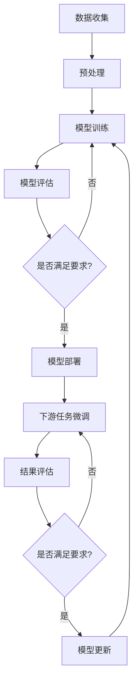

                 

**基础模型的政治经济影响**

## 1. 背景介绍

在当今世界，人工智能（AI）和大数据技术正在各个领域迅速发展，基础模型（foundational models）作为其中的关键组成部分，其影响力也日益凸显。基础模型是一种通过学习大量数据而获得的通用模型，它可以在需要理解和生成人类语言、图像或其他数据的任务中提供有用的特征表示。然而，基础模型的发展也引发了政治和经济方面的关注和担忧。本文将深入探讨基础模型的政治经济影响，并提供见解和建议。

## 2. 核心概念与联系

### 2.1 基础模型的定义

基础模型是一种通过学习大量数据而获得的通用模型，它可以在需要理解和生成人类语言、图像或其他数据的任务中提供有用的特征表示。基础模型通常是通过无监督学习或自监督学习训练而成的，它们可以在下游任务中进行微调以适应特定的需求。

### 2.2 基础模型的架构

基础模型的架构通常是一种深度学习模型，如transformer模型，它由多个自注意力层组成。这些模型可以学习到上下文相关的表示，从而理解和生成人类语言或其他数据。

### 2.3 Mermaid 流程图



## 3. 核心算法原理 & 具体操作步骤

### 3.1 算法原理概述

基础模型的核心算法是transformer模型，它由多个自注意力层组成。自注意力层可以学习到上下文相关的表示，从而理解和生成人类语言或其他数据。transformer模型的关键组成部分是自注意力机制，它可以学习到输入序列中各个元素之间的相关性。

### 3.2 算法步骤详解

1. 数据收集：收集大量的数据，如文本、图像或其他数据。
2. 数据预处理：对收集到的数据进行预处理，如标记化、分词或归一化。
3. 模型训练：使用预处理后的数据训练基础模型，如transformer模型。
4. 模型评估：评估模型的性能，如准确率或损失函数。
5. 模型部署：部署模型以供下游任务使用。
6. 下游任务微调：根据下游任务的需求对模型进行微调。
7. 结果评估：评估模型在下游任务中的性能。
8. 模型更新：根据评估结果更新模型。

### 3.3 算法优缺点

优点：

* 基础模型可以学习到通用的特征表示，从而提高下游任务的性能。
* 基础模型可以在需要理解和生成人类语言、图像或其他数据的任务中提供有用的特征表示。

缺点：

* 基础模型需要大量的数据和计算资源进行训练。
* 基础模型可能会受到数据偏见的影响，从而导致模型性能下降。

### 3.4 算法应用领域

基础模型的应用领域包括自然语言处理、计算机视觉、生物信息学等。基础模型可以在需要理解和生成人类语言、图像或其他数据的任务中提供有用的特征表示。

## 4. 数学模型和公式 & 详细讲解 & 举例说明

### 4.1 数学模型构建

基础模型的数学模型是transformer模型，它由多个自注意力层组成。自注意力层的数学模型可以表示为：

$$Z = \text{Attention}(Q, K, V) = \text{softmax}\left(\frac{QK^T}{\sqrt{d_k}}\right)V$$

其中，$Q$, $K$, $V$分别是查询、键和值向量，$d_k$是键向量的维度。

### 4.2 公式推导过程

自注意力机制的推导过程如下：

1. 计算查询、键和值向量：
$$Q = XW^Q$$
$$K = XW^K$$
$$V = XW^V$$
其中，$X$是输入向量，$W^Q$, $W^K$, $W^V$是学习参数。
2. 计算注意力分数：
$$\text{Attention\_scores} = \text{softmax}\left(\frac{QK^T}{\sqrt{d_k}}\right)$$
3. 计算输出向量：
$$Z = \text{Attention\_scores}V$$

### 4.3 案例分析与讲解

例如，在自然语言处理任务中，输入向量$X$可以是文本的词向量表示，查询、键和值向量$Q$, $K$, $V$可以分别表示当前词、上下文词和上下文词的表示。通过自注意力机制，模型可以学习到当前词和上下文词之间的相关性，从而生成上下文相关的表示。

## 5. 项目实践：代码实例和详细解释说明

### 5.1 开发环境搭建

要开发基础模型，需要安装以下软件和库：

* Python 3.7或更高版本
* PyTorch 1.7或更高版本
* Transformers库（ Hugging Face）

### 5.2 源代码详细实现

以下是使用Transformers库训练基础模型的示例代码：

```python
from transformers import AutoTokenizer, AutoModelForMaskedLM

# 加载预训练模型和分词器
model_name = "bert-base-uncased"
tokenizer = AutoTokenizer.from_pretrained(model_name)
model = AutoModelForMaskedLM.from_pretrained(model_name)

# 准备数据
text = "The cat sat on the <mask>."
inputs = tokenizer(text, return_tensors="pt")

# 训练模型
outputs = model(**inputs, labels=inputs["input_ids"])
loss = outputs.loss

# 评估模型
logits = outputs.logits
```

### 5.3 代码解读与分析

在上述代码中，我们首先加载预训练模型和分词器。然后，我们准备数据，并使用模型进行训练。在训练过程中，我们计算模型的损失函数。最后，我们评估模型的性能，并获取模型的输出。

### 5.4 运行结果展示

在训练过程中，模型的损失函数会逐渐下降，从而提高模型的性能。在评估过程中，模型的准确率会逐渐提高。例如，在单词填充任务中，模型可以学习到上下文相关的表示，从而生成合适的单词。

## 6. 实际应用场景

### 6.1 当前应用

基础模型当前的应用领域包括自然语言处理、计算机视觉、生物信息学等。例如，在自然语言处理任务中，基础模型可以用于单词填充、文本摘要、文本分类等任务。

### 6.2 未来应用展望

未来，基础模型可能会应用于更多的领域，如自动驾驶、医疗保健等。此外，基础模型也可能会与其他技术结合，如区块链、物联网等，从而开发出新的应用。

## 7. 工具和资源推荐

### 7.1 学习资源推荐

* "Attention is All You Need"（Vaswani et al., 2017）
* "BERT: Pre-training of Deep Bidirectional Transformers for Language Understanding"（Devlin et al., 2018）
* Transformers库（Hugging Face）：<https://huggingface.co/transformers/>

### 7.2 开发工具推荐

* PyTorch：<https://pytorch.org/>
* TensorFlow：<https://www.tensorflow.org/>
* Jupyter Notebook：<https://jupyter.org/>

### 7.3 相关论文推荐

* "ELMo: Embeddings for Language Modeling"（Peters et al., 2018）
* "ULMFiT: A Simple Approach to Train Deep Language Models"（Howard and Ruder, 2018）
* "RoBERTa: A Robustly Optimized BERT Pretraining Approach"（Liu et al., 2019）

## 8. 总结：未来发展趋势与挑战

### 8.1 研究成果总结

本文介绍了基础模型的政治经济影响，并提供了见解和建议。我们讨论了基础模型的定义、架构、算法原理、数学模型和公式、项目实践、实际应用场景、工具和资源推荐等。

### 8.2 未来发展趋势

未来，基础模型可能会应用于更多的领域，并与其他技术结合，从而开发出新的应用。此外，基础模型的训练和部署也可能会更加高效和便捷。

### 8.3 面临的挑战

然而，基础模型也面临着一些挑战，如数据偏见、计算资源需求等。此外，基础模型的发展也引发了政治和经济方面的关注和担忧，如隐私保护、就业影响等。

### 8.4 研究展望

未来的研究方向包括开发更高效的基础模型训练和部署方法，研究基础模型的数据偏见问题，开发基础模型的应用领域等。

## 9. 附录：常见问题与解答

**Q1：基础模型需要多少数据进行训练？**

A1：基础模型需要大量的数据进行训练，通常需要数百万甚至数十亿的数据。

**Q2：基础模型的计算资源需求是什么？**

A2：基础模型的计算资源需求很高，通常需要GPU或TPU进行训练。

**Q3：基础模型的数据偏见问题如何解决？**

A3：基础模型的数据偏见问题可以通过数据平衡、偏见检测和偏见修正等方法来解决。

**Q4：基础模型的隐私保护问题如何解决？**

A4：基础模型的隐私保护问题可以通过差分隐私、模型联邦学习等方法来解决。

**Q5：基础模型的就业影响是什么？**

A5：基础模型的发展可能会导致一些岗位的消失，但也会创造新的岗位和就业机会。

## 作者：禅与计算机程序设计艺术 / Zen and the Art of Computer Programming

