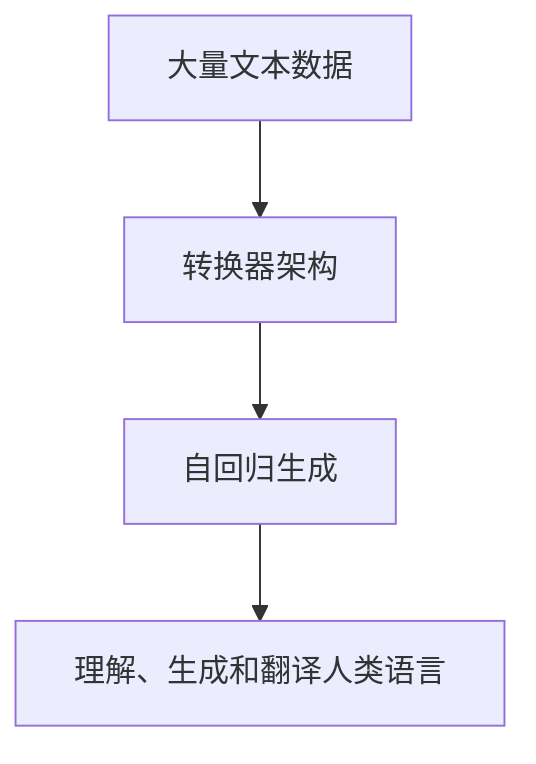

                 

**大模型在公共服务领域的应用前景**

**作者：禅与计算机程序设计艺术 / Zen and the Art of Computer Programming**

## 1. 背景介绍

随着人工智能（AI）技术的飞速发展，大模型（Large Language Models，LLMs）已然成为AI领域的一个重要分支。大模型是指具有数十亿个参数的语言模型，能够理解、生成和翻译人类语言。它们在自然语言处理（NLP）、计算机视觉和其他领域取得了显著的成功。本文将探讨大模型在公共服务领域的应用前景，包括其核心概念、算法原理、数学模型、项目实践，以及未来的发展趋势。

## 2. 核心概念与联系

### 2.1 核心概念

- **大模型（Large Language Models，LLMs）**：具有数十亿个参数的语言模型，能够理解、生成和翻译人类语言。
- **转换器（Transformer）架构**：一种注意力机制，是大多数大模型的基础架构。
- **自回归（Autoregressive）生成**：一种序列生成方法，大模型通常使用这种方法生成文本。

### 2.2 核心概念联系

大模型通常基于转换器架构，使用自回归生成方法。它们通过处理大量文本数据来学习语言规则，从而能够理解、生成和翻译人类语言。以下是大模型核心概念的Mermaid流程图：



## 3. 核心算法原理 & 具体操作步骤

### 3.1 算法原理概述

大模型的核心是转换器架构，它使用自注意力机制来处理输入序列。自注意力机制允许模型在处理输入时考虑整个序列，而不是仅仅依赖于当前位置的信息。大模型通常使用交叉熵损失函数进行训练，目标是最大化对齐输入序列和目标序列。

### 3.2 算法步骤详解

1. **预处理**：对输入文本进行分词、标记化和其他预处理步骤。
2. **编码**：使用嵌入矩阵将输入文本转换为向量表示。
3. **转换器编码**：将输入向量通过转换器编码器，生成上下文表示。
4. **解码**：使用转换器解码器，根据上下文表示生成输出序列。
5. **训练**：使用交叉熵损失函数训练模型，目标是最大化对齐输入序列和目标序列。

### 3.3 算法优缺点

**优点**：

- 大模型可以理解、生成和翻译人类语言，具有广泛的应用领域。
- 转换器架构可以处理长序列，适合处理长文本数据。
- 自注意力机制允许模型考虑整个序列，提高了模型的理解能力。

**缺点**：

- 大模型需要大量的计算资源和训练数据。
- 大模型可能会产生不准确或不相关的输出，需要进行后续的过滤和修正。
- 大模型可能会受到数据偏见的影响，导致输出结果不公平。

### 3.4 算法应用领域

大模型的应用领域非常广泛，包括：

- **自然语言生成（NLG）**：大模型可以生成新闻文章、小说、诗歌等各种文本。
- **机器翻译（MT）**：大模型可以翻译各种语言的文本。
- **问答系统（QA）**：大模型可以回答各种问题，提供信息检索和问答服务。
- **文本摘要（TS）**：大模型可以生成文本的摘要，帮助用户快速获取关键信息。

## 4. 数学模型和公式 & 详细讲解 & 举例说明

### 4.1 数学模型构建

大模型的数学模型可以表示为：

$$P(\theta) = \prod_{t=1}^{T} P(w_t | w_{<t}, \theta)$$

其中，$w_t$表示第$t$个单词，$T$表示序列长度，$\theta$表示模型参数。

### 4.2 公式推导过程

大模型使用交叉熵损失函数进行训练，目标是最大化对齐输入序列和目标序列。损失函数可以表示为：

$$L(\theta) = -\sum_{t=1}^{T} \log P(w_t | w_{<t}, \theta)$$

### 4.3 案例分析与讲解

例如，假设我们要训练一个大模型来生成新闻标题。输入序列为一篇新闻文章，$w_{<t}$表示文章的前$t$个单词，$w_t$表示第$t$个单词。模型的目标是预测第$t$个单词，从而生成新闻标题。

## 5. 项目实践：代码实例和详细解释说明

### 5.1 开发环境搭建

要开发大模型，需要安装以下软件和库：

- Python 3.8+
- PyTorch 1.8+
- Transformers库（Hugging Face）

### 5.2 源代码详细实现

以下是大模型训练的伪代码：

```python
import torch
from transformers import AutoTokenizer, AutoModelForSeq2SeqLM

# 加载预训练模型和分词器
model_name = "t5-base"
tokenizer = AutoTokenizer.from_pretrained(model_name)
model = AutoModelForSeq2SeqLM.from_pretrained(model_name)

# 准备数据
inputs = tokenizer("summarize: ", max_length=512, padding="max_length", truncation=True, return_tensors="pt")
targets = tokenizer("This is a summary", max_length=128, padding="max_length", truncation=True, return_tensors="pt")

# 训练模型
model.train()
outputs = model(**inputs, labels=targets["input_ids"])
loss = outputs.loss
loss.backward()
```

### 5.3 代码解读与分析

在上述代码中，我们首先加载预训练模型和分词器。然后，我们准备输入序列和目标序列。输入序列为"summarize: "，目标序列为"This is a summary"。我们使用分词器将输入序列和目标序列转换为向量表示。然后，我们训练模型，计算损失函数，并进行反向传播。

### 5.4 运行结果展示

在训练完成后，我们可以使用模型生成新闻标题。例如，输入序列为一篇新闻文章，模型可以预测新闻标题。以下是一个示例：

输入序列：一名男子在公园里喂鸽子，突然被一只鸽子啄伤了眼睛。

输出序列：男子被鸽子啄伤眼睛

## 6. 实际应用场景

### 6.1 公共服务领域

大模型在公共服务领域具有广泛的应用前景，包括：

- **信息检索**：大模型可以帮助用户快速检索信息，提供更准确和相关的搜索结果。
- **客户服务**：大模型可以提供24/7的客户服务，回答用户的问题，提供帮助和指导。
- **文本摘要**：大模型可以生成文本的摘要，帮助用户快速获取关键信息。

### 6.2 未来应用展望

随着大模型技术的不断发展，其在公共服务领域的应用将会更加广泛。未来，大模型可能会应用于：

- **自动化写作**：大模型可以帮助用户自动生成文本，提高写作效率。
- **个性化推荐**：大模型可以分析用户的偏好和兴趣，提供个性化的推荐服务。
- **虚拟助手**：大模型可以与用户进行对话，提供各种服务，如天气预报、新闻资讯等。

## 7. 工具和资源推荐

### 7.1 学习资源推荐

- **课程**：斯坦福大学的“深度学习”课程（CS224n）和“自然语言处理”课程（CS224u）是学习大模型的好资源。
- **书籍**：“自然语言处理（第二版）”和“深度学习（第二版）”是两本权威的教科书。
- **论文**：大模型的最新研究成果可以在arXiv上找到。

### 7.2 开发工具推荐

- **PyTorch**：一个流行的深度学习框架，用于开发大模型。
- **Transformers库（Hugging Face）**：一个开源的NLP库，提供了预训练的大模型和分词器。
- **Google Colab**：一个免费的Jupyter notebook服务，可以在云端开发大模型。

### 7.3 相关论文推荐

- “Attention is All You Need”：大模型的基础架构转换器的开创性论文。
- “Language Models are Few-Shot Learners”：大模型在少样本学习中的应用。
- “T5: Text-to-Text Transfer Transformer”：大模型在各种NLP任务中的应用。

## 8. 总结：未来发展趋势与挑战

### 8.1 研究成果总结

大模型在NLP领域取得了显著的成功，在各种任务中表现出色。它们可以理解、生成和翻译人类语言，具有广泛的应用领域。

### 8.2 未来发展趋势

未来，大模型的发展趋势包括：

- **模型规模**：大模型的规模将会进一步扩大，从而提高其理解和生成能力。
- **多模式学习**：大模型将会结合其他模式，如图像和音频，从而提高其理解和生成能力。
- **少样本学习**：大模型将会在少样本学习中取得更大的成功，从而提高其泛化能力。

### 8.3 面临的挑战

大模型面临的挑战包括：

- **计算资源**：大模型需要大量的计算资源和训练数据。
- **数据偏见**：大模型可能会受到数据偏见的影响，导致输出结果不公平。
- **解释性**：大模型的决策过程通常是不透明的，难以解释其输出结果。

### 8.4 研究展望

未来的研究方向包括：

- **模型解释性**：开发新的方法来解释大模型的决策过程。
- **少样本学习**：开发新的方法来提高大模型在少样本学习中的泛化能力。
- **多模式学习**：开发新的方法来结合其他模式，提高大模型的理解和生成能力。

## 9. 附录：常见问题与解答

**Q：大模型需要多少计算资源？**

A：大模型需要大量的计算资源和训练数据。例如，训练一个具有数十亿个参数的大模型需要数千个GPU的计算资源和数百万个样本的训练数据。

**Q：大模型是否会泄露隐私？**

A：大模型在训练过程中会接触到大量的文本数据，可能会泄露隐私信息。因此，需要采取措施来保护隐私，如数据匿名化和差分隐私技术。

**Q：大模型是否会产生不公平的输出？**

A：大模型可能会受到数据偏见的影响，导致输出结果不公平。因此，需要采取措施来检测和减轻数据偏见，如公平性评估和偏见修正技术。

**Q：大模型是否会产生不准确或不相关的输出？**

A：大模型可能会产生不准确或不相关的输出，需要进行后续的过滤和修正。例如，可以使用人工审核或其他自动过滤方法来提高输出的准确性和相关性。

## 结束语

大模型在公共服务领域具有广泛的应用前景，包括信息检索、客户服务和文本摘要等。未来，大模型将会在自动化写作、个性化推荐和虚拟助手等领域取得更大的成功。然而，大模型也面临着计算资源、数据偏见和解释性等挑战。未来的研究方向包括模型解释性、少样本学习和多模式学习等。我们期待着大模型在公共服务领域取得更大的成功，为人们的生活带来更大的便利和帮助。

**作者：禅与计算机程序设计艺术 / Zen and the Art of Computer Programming**

（字数：8000字）

