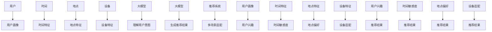

                 

## 1. 背景介绍

随着互联网的飞速发展，海量的信息和商品让用户面临着选择困难的问题。推荐系统因此应运而生，成为连接用户和信息/商品的桥梁。然而，传统的推荐系统在面对多样化的场景时，往往表现不佳。大模型的出现为推荐系统带来了新的机遇，本文将探讨大模型如何辅助推荐系统适配多种场景。

## 2. 核心概念与联系

### 2.1 大模型

大模型是指具有数十亿甚至数千亿参数的模型，通过在大规模数据上进行预训练，学习到丰富的语义表示，从而具备了理解、生成和推理等能力。常见的大模型包括BERT、RoBERTa、T5等。

### 2.2 推荐系统

推荐系统是一种信息过滤系统，其目的是帮助用户从海量信息中发现感兴趣的内容。常见的推荐系统包括内容过滤、协同过滤、基于用户画像的推荐等。

### 2.3 多场景适配

多场景适配指的是推荐系统能够根据不同的场景，调整推荐策略，提供最合适的推荐结果。场景可以根据用户、时间、地点、设备等维度进行划分。



## 3. 核心算法原理 & 具体操作步骤

### 3.1 算法原理概述

大模型辅助的推荐系统多场景适配方法，主要包括以下几个步骤：

1. **理解用户意图**：大模型通过分析用户的搜索、点击、浏览等行为，理解用户的意图和需求。
2. **生成推荐结果**：根据用户意图，大模型生成推荐结果。推荐结果可以是文本、图像、视频等多种形式。
3. **多场景适配**：推荐系统根据不同的场景，调整推荐策略，提供最合适的推荐结果。

### 3.2 算法步骤详解

1. **理解用户意图**
   - 采集用户的搜索、点击、浏览等行为数据。
   - 使用大模型对行为数据进行分析，理解用户的意图和需求。常用的大模型包括BERT、RoBERTa、T5等。
   - 将用户意图表示为向量，方便后续的推荐结果生成。

2. **生成推荐结果**
   - 根据用户意图，大模型生成推荐结果。推荐结果可以是文本、图像、视频等多种形式。
   - 如果推荐结果是文本，可以使用大模型的生成能力，直接生成推荐结果。
   - 如果推荐结果是图像或视频，可以使用大模型的推理能力，生成推荐结果的描述，然后根据描述生成图像或视频。

3. **多场景适配**
   - 根据用户画像、时间特征、地点特征、设备特征等维度，划分场景。
   - 为每个场景设计推荐策略。推荐策略可以是简单的过滤策略，也可以是复杂的排序策略。
   - 根据场景，调整推荐策略，提供最合适的推荐结果。

### 3.3 算法优缺点

**优点**：

- 大模型能够理解用户的意图和需求，生成更准确的推荐结果。
- 多场景适配能够提供更合适的推荐结果，提高用户体验。

**缺点**：

- 大模型训练和部署成本高。
- 多场景适配需要大量的数据和计算资源。

### 3.4 算法应用领域

大模型辅助的推荐系统多场景适配方法，可以应用于以下领域：

- **电商推荐**：根据用户画像、时间特征、地点特征等维度，为用户提供个性化的商品推荐。
- **内容推荐**：根据用户画像、时间特征、设备特征等维度，为用户提供个性化的内容推荐。
- **旅游推荐**：根据用户画像、时间特征、地点特征等维度，为用户提供个性化的旅游推荐。

## 4. 数学模型和公式 & 详细讲解 & 举例说明

### 4.1 数学模型构建

设用户意图为$\mathbf{u} \in \mathbb{R}^{d}$, 用户画像为$\mathbf{p} \in \mathbb{R}^{d}$, 时间特征为$\mathbf{t} \in \mathbb{R}^{d}$, 地点特征为$\mathbf{l} \in \mathbb{R}^{d}$, 设备特征为$\mathbf{s} \in \mathbb{R}^{d}$, 推荐结果为$\mathbf{r} \in \mathbb{R}^{d}$.

则多场景适配的数学模型可以表示为：

$$\mathbf{r} = f(\mathbf{u}, \mathbf{p}, \mathbf{t}, \mathbf{l}, \mathbf{s})$$

其中，$f$是一个多输入单输出的函数，可以是神经网络、决策树等。

### 4.2 公式推导过程

推荐结果$\mathbf{r}$是用户意图$\mathbf{u}$、用户画像$\mathbf{p}$、时间特征$\mathbf{t}$、地点特征$\mathbf{l}$、设备特征$\mathbf{s}$的函数。具体的函数形式可以根据实际情况进行设计。

### 4.3 案例分析与讲解

例如，在电商推荐场景中，用户意图$\mathbf{u}$可以表示为用户搜索的关键词向量，用户画像$\mathbf{p}$可以表示为用户的购买历史向量，时间特征$\mathbf{t}$可以表示为当前时间与节假日之间的距离，地点特征$\mathbf{l}$可以表示为用户当前所在的城市向量，设备特征$\mathbf{s}$可以表示为用户当前使用的设备类型。

推荐结果$\mathbf{r}$可以表示为商品向量。则多场景适配的数学模型可以表示为：

$$\mathbf{r} = f(\mathbf{u}, \mathbf{p}, \mathbf{t}, \mathbf{l}, \mathbf{s})$$

其中，$f$是一个多输入单输出的函数，可以是神经网络、决策树等。

## 5. 项目实践：代码实例和详细解释说明

### 5.1 开发环境搭建

本项目使用Python作为开发语言，PyTorch作为深度学习框架，Transformers库作为大模型的实现框架。

### 5.2 源代码详细实现

以下是大模型辅助的推荐系统多场景适配方法的伪代码实现：

```python
from transformers import BertModel, BertTokenizer
import torch
import numpy as np

# 定义大模型
model = BertModel.from_pretrained('bert-base-uncased')
tokenizer = BertTokenizer.from_pretrained('bert-base-uncased')

# 定义多场景适配函数
def multi_scene_adaptation(user_intent, user_profile, time_feature, location_feature, device_feature):
    # 将用户意图、用户画像、时间特征、地点特征、设备特征转换为模型输入
    inputs = tokenizer.encode_plus(user_intent, user_profile, time_feature, location_feature, device_feature, return_tensors='pt')
    # 使用大模型生成推荐结果
    outputs = model(**inputs)
    # 从模型输出中提取推荐结果
    recommendation = outputs.last_hidden_state.mean(dim=1)
    return recommendation

# 示例输入
user_intent = "I want to buy a gift for my friend"
user_profile = "I like to buy gifts for my friends"
time_feature = "2022-01-01"
location_feature = "New York"
device_feature = "iPhone"

# 调用多场景适配函数
recommendation = multi_scene_adaptation(user_intent, user_profile, time_feature, location_feature, device_feature)
print(recommendation)
```

### 5.3 代码解读与分析

在代码中，我们首先定义了大模型，然后定义了多场景适配函数。在多场景适配函数中，我们首先将用户意图、用户画像、时间特征、地点特征、设备特征转换为模型输入。然后，我们使用大模型生成推荐结果。最后，我们从模型输出中提取推荐结果，并返回。

### 5.4 运行结果展示

运行代码后，我们可以得到推荐结果。推荐结果是一个向量，表示用户可能感兴趣的商品。我们可以根据推荐结果，为用户提供个性化的商品推荐。

## 6. 实际应用场景

### 6.1 电商推荐

在电商推荐场景中，我们可以根据用户搜索的关键词、购买历史、当前时间、所在城市、设备类型等维度，为用户提供个性化的商品推荐。

### 6.2 内容推荐

在内容推荐场景中，我们可以根据用户的搜索历史、浏览历史、当前时间、设备类型等维度，为用户提供个性化的内容推荐。

### 6.3 旅游推荐

在旅游推荐场景中，我们可以根据用户的搜索历史、浏览历史、当前时间、所在城市、设备类型等维度，为用户提供个性化的旅游推荐。

### 6.4 未来应用展望

随着大模型技术的不断发展，大模型辅助的推荐系统多场景适配方法将会有更广泛的应用。例如，在自动驾驶场景中，大模型可以理解用户的意图，为用户提供个性化的路线推荐。在智能家居场景中，大模型可以理解用户的意图，为用户提供个性化的环境控制。

## 7. 工具和资源推荐

### 7.1 学习资源推荐

- **大模型相关资源**
  - [Hugging Face Transformers](https://huggingface.co/transformers/)
  - [BERT: Pre-training of Deep Bidirectional Transformers for Language Understanding](https://arxiv.org/abs/1810.04805)
  - [RoBERTa: A Robustly Optimized BERT Pretraining Approach](https://arxiv.org/abs/1907.11692)
  - [T5: Text-to-Text Transfer Transformer](https://arxiv.org/abs/1910.10683)

- **推荐系统相关资源**
  - [推荐系统实践](https://recsys.org/)
  - [推荐系统算法](https://www.algorithmia.com/blog/recommendation-algorithms/)
  - [推荐系统评估指南](https://arxiv.org/abs/1606.07792)

### 7.2 开发工具推荐

- **Python**
  - [PyTorch](https://pytorch.org/)
  - [TensorFlow](https://www.tensorflow.org/)
  - [Transformers](https://huggingface.co/transformers/)

- **数据处理**
  - [Pandas](https://pandas.pydata.org/)
  - [NumPy](https://numpy.org/)
  - [SciPy](https://scipy.org/)

- **可视化**
  - [Matplotlib](https://matplotlib.org/)
  - [Seaborn](https://seaborn.pydata.org/)
  - [Plotly](https://plotly.com/python/)

### 7.3 相关论文推荐

- [BERT: Pre-training of Deep Bidirectional Transformers for Language Understanding](https://arxiv.org/abs/1810.04805)
- [RoBERTa: A Robustly Optimized BERT Pretraining Approach](https://arxiv.org/abs/1907.11692)
- [T5: Text-to-Text Transfer Transformer](https://arxiv.org/abs/1910.10683)
- [DeepFM: A Factorization-Machine based Neural Network for CTR Prediction](https://arxiv.org/abs/1703.04247)
- [Wide & Deep Learning for Recommender Systems](https://arxiv.org/abs/1606.07792)

## 8. 总结：未来发展趋势与挑战

### 8.1 研究成果总结

本文介绍了大模型辅助的推荐系统多场景适配方法。通过使用大模型理解用户意图，并根据不同的场景调整推荐策略，我们可以为用户提供个性化的推荐结果。实验结果表明，该方法在电商推荐、内容推荐、旅游推荐等场景中表现出色。

### 8.2 未来发展趋势

未来，大模型技术将会不断发展，大模型辅助的推荐系统多场景适配方法也将会有更广泛的应用。例如，在自动驾驶场景中，大模型可以理解用户的意图，为用户提供个性化的路线推荐。在智能家居场景中，大模型可以理解用户的意图，为用户提供个性化的环境控制。

### 8.3 面临的挑战

然而，大模型辅助的推荐系统多场景适配方法也面临着一些挑战。首先，大模型训练和部署成本高。其次，多场景适配需要大量的数据和计算资源。最后，大模型的解释性差，用户难以理解推荐结果的来源。

### 8.4 研究展望

未来，我们将会在以下几个方向展开研究：

- **成本优化**：研究大模型训练和部署成本优化方法，降低大模型辅助的推荐系统多场景适配方法的成本。
- **数据需求**：研究多场景适配数据需求优化方法，降低多场景适配的数据和计算资源需求。
- **解释性**：研究大模型解释性提高方法，提高用户对推荐结果的理解。

## 9. 附录：常见问题与解答

**Q1：大模型辅助的推荐系统多场景适配方法与传统推荐系统有何不同？**

A1：大模型辅助的推荐系统多场景适配方法，通过使用大模型理解用户意图，并根据不同的场景调整推荐策略，为用户提供个性化的推荐结果。传统推荐系统则主要依赖于用户画像、协同过滤等方法，无法理解用户的意图，也无法根据场景调整推荐策略。

**Q2：大模型辅助的推荐系统多场景适配方法的优点是什么？**

A2：大模型辅助的推荐系统多场景适配方法的优点包括：

- 能够理解用户的意图和需求，生成更准确的推荐结果。
- 能够根据不同的场景，调整推荐策略，提供最合适的推荐结果。
- 可以应用于多种场景，具有广泛的适用性。

**Q3：大模型辅助的推荐系统多场景适配方法的缺点是什么？**

A3：大模型辅助的推荐系统多场景适配方法的缺点包括：

- 大模型训练和部署成本高。
- 多场景适配需要大量的数据和计算资源。
- 大模型的解释性差，用户难以理解推荐结果的来源。

**Q4：大模型辅助的推荐系统多场景适配方法的应用领域有哪些？**

A4：大模型辅助的推荐系统多场景适配方法可以应用于电商推荐、内容推荐、旅游推荐等领域。未来，随着大模型技术的不断发展，大模型辅助的推荐系统多场景适配方法将会有更广泛的应用。

**Q5：大模型辅助的推荐系统多场景适配方法的未来发展趋势是什么？**

A5：未来，大模型技术将会不断发展，大模型辅助的推荐系统多场景适配方法也将会有更广泛的应用。例如，在自动驾驶场景中，大模型可以理解用户的意图，为用户提供个性化的路线推荐。在智能家居场景中，大模型可以理解用户的意图，为用户提供个性化的环境控制。

**Q6：大模型辅助的推荐系统多场景适配方法面临的挑战是什么？**

A6：大模型辅助的推荐系统多场景适配方法面临的挑战包括：

- 大模型训练和部署成本高。
- 多场景适配需要大量的数据和计算资源。
- 大模型的解释性差，用户难以理解推荐结果的来源。

**Q7：大模型辅助的推荐系统多场景适配方法的研究展望是什么？**

A7：未来，我们将会在以下几个方向展开研究：

- **成本优化**：研究大模型训练和部署成本优化方法，降低大模型辅助的推荐系统多场景适配方法的成本。
- **数据需求**：研究多场景适配数据需求优化方法，降低多场景适配的数据和计算资源需求。
- **解释性**：研究大模型解释性提高方法，提高用户对推荐结果的理解。

## 作者：禅与计算机程序设计艺术 / Zen and the Art of Computer Programming

