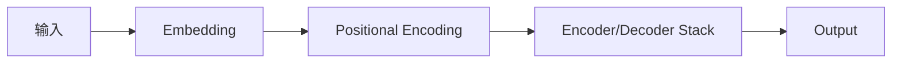

                 

大语言模型、Transformer、Attention Mechanism、BERT、ELMo、RoBERTa、T5

## 1. 背景介绍

在人工智能领域，自然语言处理（NLP）是一个非常活跃的研究领域。随着计算能力的提高和大规模数据的可用性，大语言模型（Large Language Models，LLMs）已经成为NLP领域的关键组成部分。本文将深入探讨大语言模型的原理和工程实践，并提供实用的代码示例。

## 2. 核心概念与联系

### 2.1 核心概念

大语言模型是一种统计模型，旨在学习并预测人类语言的概率分布。它们通常基于神经网络架构，可以处理大规模文本数据。大语言模型的核心概念包括：

- **表示学习（Representation Learning）**：大语言模型学习表示单词、短语或句子的表示，这些表示可以用于各种NLP任务。
- **预训练（Pre-training）**：大语言模型在大规模未标记数据上进行预训练，学习语言的统计特性。预训练模型可以在下游任务上进行微调，以提高性能。
- **自注意力（Self-Attention）**：自注意力机制是大多数大语言模型的关键组成部分，它允许模型在处理序列数据时考虑上下文。

### 2.2 核心架构

大多数大语言模型都是基于Transformer架构的，如下图所示：



图1：Transformer架构

- **Embedding**：将单词转换为向量表示。
- **Positional Encoding**：为序列中的位置添加编码，以保持序列信息。
- **Encoder/Decoder Stack**：自注意力层和Feed-Forward网络的堆叠，用于处理输入序列。

## 3. 核心算法原理 & 具体操作步骤

### 3.1 算法原理概述

大多数大语言模型使用Transformer架构，其中自注意力机制是关键组成部分。自注意力机制允许模型在处理序列数据时考虑上下文，并为每个单词生成表示。

### 3.2 算法步骤详解

1. **Embedding**：将单词转换为向量表示。
2. **Positional Encoding**：为序列中的位置添加编码。
3. **Encoder/Decoder Stack**：自注意力层和Feed-Forward网络的堆叠，用于处理输入序列。
4. **Output**：生成输出序列。

### 3.3 算法优缺点

**优点**：

- 可以处理长序列数据。
- 可以学习表示，用于各种NLP任务。
- 可以在下游任务上进行微调，提高性能。

**缺点**：

- 计算开销高。
- 训练数据要求大。
- 可能存在过拟合问题。

### 3.4 算法应用领域

大语言模型在各种NLP任务中都有应用，包括：

- 文本分类。
- 文本生成。
- 机器翻译。
- 信息提取。
- 问答系统。

## 4. 数学模型和公式 & 详细讲解 & 举例说明

### 4.1 数学模型构建

大语言模型的数学模型可以表示为：

$$P(\theta) = \prod_{i=1}^{N} P(w_i | w_{<i}, \theta)$$

其中，$w_i$是序列中的第$i$个单词，$N$是序列长度，$\theta$是模型参数。

### 4.2 公式推导过程

自注意力机制的数学模型可以表示为：

$$Attention(Q, K, V) = softmax\left(\frac{QK^T}{\sqrt{d_k}}\right)V$$

其中，$Q$, $K$, $V$是查询、键和值向量，$d_k$是键向量的维度。

### 4.3 案例分析与讲解

例如，考虑以下句子：

"我喜欢吃比萨，因为它味道很好。"

在大语言模型中，每个单词都会转换为向量表示，然后自注意力机制会考虑上下文，为每个单词生成表示。例如，单词"因为"的表示会受到前面单词"我"和"喜欢"的影响，因为它们提供了上下文信息。

## 5. 项目实践：代码实例和详细解释说明

### 5.1 开发环境搭建

要构建大语言模型，您需要安装以下软件：

- Python 3.7+
- PyTorch 1.5+
- Transformers库（Hugging Face）

### 5.2 源代码详细实现

以下是一个简单的大语言模型实现示例，使用Transformers库中的BERT模型：

```python
from transformers import BertTokenizer, BertForMaskedLM

tokenizer = BertTokenizer.from_pretrained('bert-base-uncased')
model = BertForMaskedLM.from_pretrained('bert-base-uncased')

text = "我喜欢吃[MASK]，因为它味道很好。"
inputs = tokenizer.encode_plus(text, return_tensors="pt")
logits = model(**inputs).logits
```

### 5.3 代码解读与分析

- `BertTokenizer`用于将文本转换为BERT模型可以处理的输入。
- `BertForMaskedLM`是BERT模型的一个版本，用于掩码语言模型任务。
- `encode_plus`方法将文本转换为输入张量。
- `logits`是模型输出的对数概率。

### 5.4 运行结果展示

运行上述代码后，`logits`张量包含每个掩码位置的可能单词的对数概率。您可以使用`tokenizer.decode`方法将这些单词转换为文本。

## 6. 实际应用场景

大语言模型在各种实际应用中都有广泛的应用，包括：

- **搜索引擎**：大语言模型可以用于改善搜索结果的相关性。
- **虚拟助手**：大语言模型可以用于构建更智能的虚拟助手，如Siri和Alexa。
- **内容生成**：大语言模型可以用于生成新闻文章、博客帖子和社交媒体帖子。

### 6.4 未来应用展望

未来，大语言模型可能会在以下领域有更多应用：

- **多模式学习**：大语言模型可能会与图像、音频和视频模型集成，以实现多模式学习。
- **解释性AI**：大语言模型可能会用于解释其他模型的决策过程。
- **个性化推荐**：大语言模型可能会用于构建更智能的个性化推荐系统。

## 7. 工具和资源推荐

### 7.1 学习资源推荐

- **课程**：斯坦福大学的CS224n课程是学习大语言模型的好资源。
- **文献**："Attention is All You Need"和"BERT: Pre-training of Deep Bidirectional Transformers for Language Understanding"是两篇关键文献。

### 7.2 开发工具推荐

- **Transformers库**：Hugging Face的Transformers库是构建大语言模型的好工具。
- **PyTorch**：PyTorch是构建大语言模型的流行框架。

### 7.3 相关论文推荐

- "ELMo: Deep Contextualized Word Representations"。
- "RoBERTa: A Robustly Optimized BERT Pretraining Approach"。
- "T5: Text-to-Text Transfer Transformer"。

## 8. 总结：未来发展趋势与挑战

### 8.1 研究成果总结

大语言模型已经取得了显著的成功，在各种NLP任务中表现出色。

### 8.2 未来发展趋势

未来，大语言模型可能会朝着更大、更复杂的方向发展，以学习更丰富的语言表示。

### 8.3 面临的挑战

大语言模型面临的挑战包括：

- **计算开销**：大语言模型的计算开销高，需要大量的计算资源。
- **数据要求**：大语言模型需要大量的数据进行预训练。
- **解释性**：大语言模型的决策过程通常是不透明的，需要开发新的技术来提高解释性。

### 8.4 研究展望

未来的研究可能会集中在以下领域：

- **更大的模型**：开发更大、更复杂的大语言模型。
- **多模式学习**：将大语言模型与其他模型集成，以实现多模式学习。
- **解释性AI**：开发新的技术来提高大语言模型的解释性。

## 9. 附录：常见问题与解答

**Q：大语言模型需要多大的数据集？**

A：大语言模型通常需要数十亿单词的数据集进行预训练。

**Q：大语言模型可以用于哪些NLP任务？**

A：大语言模型可以用于各种NLP任务，包括文本分类、文本生成、机器翻译、信息提取和问答系统。

**Q：大语言模型的计算开销高吗？**

A：是的，大语言模型的计算开销高，需要大量的计算资源。

## 作者：禅与计算机程序设计艺术 / Zen and the Art of Computer Programming

