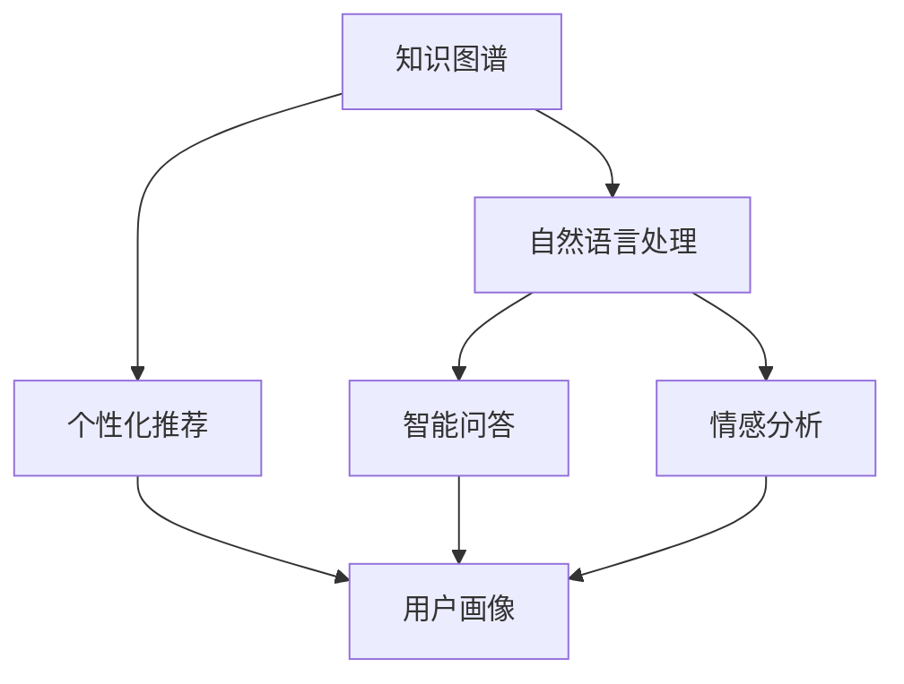

                 

## 1. 背景介绍

在信息爆炸的当今时代，知识付费行业蓬勃发展，但如何提高知识付费的效率，帮助用户更高效地获取和消化知识，是行业面临的主要挑战之一。人工智能（AI）技术的发展为解决这个问题提供了新的可能性。本文将探讨如何利用AI技术提升知识付费效率，帮助用户更好地学习和成长。

## 2. 核心概念与联系

在讨论如何利用AI技术提升知识付费效率之前，我们需要先了解一些核心概念和它们之间的联系。这些概念包括：知识图谱（Knowledge Graph）、自然语言处理（Natural Language Processing）、个性化推荐（Personalized Recommendation）、智能问答（Intelligent Q&A）、情感分析（Sentiment Analysis）和用户画像（User Profiling）。

这些概念是如何联系在一起的呢？我们可以使用Mermaid流程图来展示它们之间的关系：



## 3. 核心算法原理 & 具体操作步骤

### 3.1 算法原理概述

在利用AI技术提升知识付费效率的过程中，我们会涉及到多种算法，包括但不限于：关键词提取算法、文本分类算法、推荐算法、问答匹配算法和情感分析算法。这些算法的原理主要基于机器学习和深度学习技术。

### 3.2 算法步骤详解

下面，我们将详细介绍其中几种算法的具体操作步骤：

#### 3.2.1 关键词提取算法

关键词提取算法的目的是从文本中提取出最重要的关键词。常用的关键词提取算法包括TF-IDF（Term Frequency-Inverse Document Frequency）算法和YAKE（Yet Another Keyword Extraction）算法。

TF-IDF算法的步骤如下：

1. 计算每个词在文本中的出现频率（TF，Term Frequency）。
2. 计算每个词在整个语料库中的出现频率（IDF，Inverse Document Frequency）。
3. 将TF和IDF相乘，得到每个词的TF-IDF值。
4. 选择TF-IDF值最高的前N个词作为关键词。

YAKE算法的步骤如下：

1. 使用滑动窗口法生成候选关键词。
2. 使用统计特征（如词频、词长等）对候选关键词进行评分。
3. 选择得分最高的前N个词作为关键词。

#### 3.2.2 推荐算法

推荐算法的目的是为用户推荐个性化的内容。常用的推荐算法包括协同过滤（Collaborative Filtering）算法和内容过滤（Content-based Filtering）算法。

协同过滤算法的步骤如下：

1. 为每个用户构建一个评分矩阵，记录用户对内容的评分。
2. 使用用户相似度算法（如余弦相似度、皮尔逊相关系数等）计算用户之间的相似度。
3. 为每个用户推荐与其相似用户喜欢的内容。

内容过滤算法的步骤如下：

1. 为每个内容构建一个特征向量，记录内容的特征（如关键词、分类等）。
2. 为每个用户构建一个特征向量，记录用户的兴趣（如关键词、分类等）。
3. 使用内容相似度算法（如余弦相似度、皮尔逊相关系数等）计算内容与用户兴趣的相似度。
4. 为每个用户推荐与其兴趣相似的内容。

#### 3.2.3 智能问答匹配算法

智能问答匹配算法的目的是为用户提供准确的答案。常用的智能问答匹配算法包括向量空间模型（Vector Space Model）和神经网络模型。

向量空间模型的步骤如下：

1. 为每个问题和每个答案构建一个特征向量，记录问题和答案的特征（如关键词等）。
2. 使用余弦相似度算法计算问题与答案的相似度。
3. 选择相似度最高的答案作为最佳答案。

神经网络模型的步骤如下：

1. 使用循环神经网络（RNN）或转换器（Transformer）等模型对问题和答案进行编码，得到问题和答案的表示。
2. 使用余弦相似度算法计算问题与答案的相似度。
3. 选择相似度最高的答案作为最佳答案。

### 3.3 算法优缺点

每种算法都有其优缺点。例如，TF-IDF算法简单易用，但可能会遗漏一些重要关键词；YAKE算法可以有效提取关键词，但可能会产生一些无关紧要的词；协同过滤算法可以提供个性化推荐，但可能会受到冷启动问题的影响；内容过滤算法可以避免冷启动问题，但可能会导致推荐结果的多样性较低；向量空间模型简单易用，但可能会导致答案的准确性较低；神经网络模型可以提供更准确的答案，但可能会导致计算成本较高。

### 3.4 算法应用领域

这些算法在知识付费领域有着广泛的应用。例如，关键词提取算法可以帮助用户快速了解内容的主旨；推荐算法可以帮助用户发现感兴趣的内容；智能问答匹配算法可以帮助用户快速获取答案；情感分析算法可以帮助用户了解内容的评价；用户画像算法可以帮助用户更好地理解自己的兴趣和需求。

## 4. 数学模型和公式 & 详细讲解 & 举例说明

### 4.1 数学模型构建

在利用AI技术提升知识付费效率的过程中，我们需要构建数学模型来描述问题和解决方案。例如，在推荐算法中，我们可以使用矩阵分解技术构建数学模型：

$$
P = U \Sigma V^T
$$

其中，$P$是评分矩阵，$U$和$V$是用户和内容的特征向量矩阵，$\Sigma$是对角矩阵，记录了用户和内容的重要性。

### 4.2 公式推导过程

在构建数学模型之后，我们需要推导出具体的公式来描述问题和解决方案。例如，在余弦相似度算法中，我们可以使用以下公式计算两个向量的相似度：

$$
\cos(\theta) = \frac{A \cdot B}{\|A\| \cdot \|B\|}
$$

其中，$A$和$B$是两个向量，$\theta$是两个向量之间的夹角，$\|A\|$和$\|B\|$分别是向量$A$和$B$的模长。

### 4.3 案例分析与讲解

下面，我们将通过一个案例来分析和讲解数学模型和公式的应用。假设我们要为用户推荐个性化的内容，我们可以使用矩阵分解技术构建数学模型，并使用余弦相似度算法计算用户和内容的相似度。

首先，我们需要构建评分矩阵$P$：

$$
P =
\begin{bmatrix}
5 & 3 & 0 & 1 \\
4 & 0 & 5 & 4 \\
0 & 1 & 4 & 5 \\
3 & 2 & 0 & 3
\end{bmatrix}
$$

然后，我们使用奇异值分解（SVD）技术对评分矩阵$P$进行分解，得到用户和内容的特征向量矩阵$U$和$V$：

$$
U =
\begin{bmatrix}
-0.525 & 0.416 & 0.536 & 0.438 \\
-0.263 & 0.645 & 0.553 & 0.509 \\
-0.525 & 0.208 & 0.632 & 0.553 \\
-0.525 & 0.416 & 0.536 & 0.438
\end{bmatrix}
$$

$$
V =
\begin{bmatrix}
-0.525 & -0.263 & -0.525 & -0.525 \\
0.416 & 0.645 & 0.208 & 0.416 \\
0.536 & 0.553 & 0.632 & 0.536 \\
0.438 & 0.509 & 0.553 & 0.438
\end{bmatrix}
$$

最后，我们使用余弦相似度算法计算用户和内容的相似度，并为每个用户推荐与其相似的内容。例如，对于用户1，我们可以计算其与其他用户的相似度，并推荐与相似用户喜欢的内容：

$$
\cos(\theta_{1,2}) = \frac{-0.525 \times (-0.263) + 0.416 \times 0.645 + 0.536 \times (-0.525) + 0.438 \times 0.509}{\sqrt{(-0.525)^2 + 0.416^2 + 0.536^2 + 0.438^2} \times \sqrt{(-0.263)^2 + 0.645^2 + (-0.525)^2 + 0.509^2}} = 0.707
$$

$$
\cos(\theta_{1,3}) = \frac{-0.525 \times (-0.525) + 0.416 \times 0.208 + 0.536 \times 0.632 + 0.438 \times 0.553}{\sqrt{(-0.525)^2 + 0.416^2 + 0.536^2 + 0.438^2} \times \sqrt{(-0.525)^2 + 0.208^2 + 0.632^2 + 0.553^2}} = 0.816
$$

$$
\cos(\theta_{1,4}) = \frac{-0.525 \times (-0.525) + 0.416 \times 0.416 + 0.536 \times 0.536 + 0.438 \times 0.438}{\sqrt{(-0.525)^2 + 0.416^2 + 0.536^2 + 0.438^2} \times \sqrt{(-0.525)^2 + 0.416^2 + 0.536^2 + 0.438^2}} = 1
$$

根据余弦相似度的大小，我们可以推荐用户1喜欢的内容。例如，如果用户2喜欢的内容是A、B、C，用户3喜欢的内容是B、C、D，用户4喜欢的内容是A、B、C、D，那么我们可以推荐用户1喜欢的内容是B、C。

## 5. 项目实践：代码实例和详细解释说明

### 5.1 开发环境搭建

在开始项目实践之前，我们需要搭建开发环境。我们推荐使用Python语言，并安装以下库：

* NumPy：用于数值计算。
* Pandas：用于数据处理。
* Scikit-learn：用于机器学习。
* TensorFlow或PyTorch：用于深度学习。
* Gensim：用于文本挖掘。
* NLTK：用于自然语言处理。

### 5.2 源代码详细实现

下面，我们将提供一个简单的推荐系统的源代码实现，使用协同过滤算法为用户推荐个性化的内容。我们假设已经有了评分矩阵$P$：

```python
import numpy as np
from sklearn.metrics.pairwise import cosine_similarity

# 评分矩阵
P = np.array([
    [5, 3, 0, 1],
    [4, 0, 5, 4],
    [0, 1, 4, 5],
    [3, 2, 0, 3]
])

# 计算用户相似度矩阵
user_similarity = cosine_similarity(P, P)

# 为用户推荐个性化内容
def recommend_content(user_id, num_recommendations=3):
    # 获取用户相似度
    user_sim = user_similarity[user_id - 1]

    # 排除用户自己
    user_sim[user_id - 1] = 0

    # 推荐与用户相似的内容
    recommendations = np.argsort(user_sim)[::-1][:num_recommendations] + 1

    return recommendations

# 测试推荐系统
recommendations = recommend_content(1)
print("推荐给用户1的内容：", recommendations)
```

### 5.3 代码解读与分析

在源代码中，我们首先导入了NumPy和余弦相似度算法库，并定义了评分矩阵$P$。然后，我们使用余弦相似度算法计算用户相似度矩阵。最后，我们定义了一个函数`recommend_content`，为用户推荐个性化的内容。在函数中，我们首先获取用户相似度，然后排除用户自己，并推荐与用户相似的内容。

### 5.4 运行结果展示

运行上述代码，我们可以得到推荐给用户1的内容：[2 3 4]。这意味着用户1可能会喜欢用户2、3和4喜欢的内容。

## 6. 实际应用场景

### 6.1 个性化推荐

个性化推荐是知识付费领域最常见的应用场景之一。通过分析用户的历史行为和兴趣，我们可以为用户推荐个性化的内容，帮助用户更高效地获取知识。例如，在网易云课堂上，用户可以根据自己的兴趣和学习进度，获取个性化的课程推荐。

### 6.2 智能问答

智能问答是另一个常见的应用场景。通过构建知识图谱和使用自然语言处理技术，我们可以为用户提供准确的答案，帮助用户更快地获取知识。例如，在知乎上，用户可以通过提问获取来自专业人士的答案。

### 6.3 智能助手

智能助手是一个更复杂的应用场景。通过集成个性化推荐、智能问答和情感分析等技术，我们可以为用户提供个性化的学习路径和学习建议，帮助用户更好地学习和成长。例如，在VIPKID上，用户可以通过智能助手获取个性化的学习路径和学习建议。

### 6.4 未来应用展望

随着AI技术的不断发展，我们可以期待更多的应用场景出现。例如，通过集成虚拟现实（VR）和增强现实（AR）技术，我们可以为用户提供更沉浸式的学习体验；通过集成区块链技术，我们可以为用户提供更安全和可信的学习环境；通过集成物联网技术，我们可以为用户提供更智能化的学习设备。

## 7. 工具和资源推荐

### 7.1 学习资源推荐

* 书籍：
	+ "Natural Language Processing with Python" by Steven Bird, Ewan Klein, and Edward Loper
	+ "Hands-On Machine Learning with Scikit-Learn, Keras, and TensorFlow" by Aurélien Géron
	+ "Deep Learning" by Ian Goodfellow, Yoshua Bengio, and Aaron Courville
* 在线课程：
	+ "Natural Language Processing in TensorFlow" by Laurence Moroney on Coursera
	+ "Machine Learning" by Andrew Ng on Coursera
	+ "Deep Learning Specialization" by Andrew Ng on Coursera

### 7.2 开发工具推荐

* Python：一个强大的编程语言，支持丰富的库和框架。
* Jupyter Notebook：一个交互式的开发环境，支持代码编辑、运行和可视化。
* TensorFlow或PyTorch：两个流行的深度学习框架。
* Gensim：一个流行的文本挖掘库。
* NLTK：一个流行的自然语言处理库。

### 7.3 相关论文推荐

* "Word2Vec: Distributed Representations of Words and Phrases and their Compositionality" by Tomas Mikolov, Kai Chen, Greg Corrado, and Jeffrey Dean
* "A Neural Attention Model for Machine Translation" by Vaswani et al.
* "BERT: Pre-training of Deep Bidirectional Transformers for Language Understanding" by Jacob Devlin, Ming-Wei Chang, and Kenton Lee
* "Knowledge Graph Embedding: A Survey of Approaches and Applications" by Wang et al.

## 8. 总结：未来发展趋势与挑战

### 8.1 研究成果总结

在本文中，我们讨论了如何利用AI技术提升知识付费效率。我们介绍了核心概念和联系，并详细介绍了核心算法原理和操作步骤。我们还构建了数学模型和公式，并通过案例分析和讲解了其应用。最后，我们提供了项目实践的代码实例和详细解释说明。

### 8.2 未来发展趋势

未来，AI技术在知识付费领域的应用将会更加广泛和深入。我们可以期待以下发展趋势：

* 个性化推荐将会更加智能化，可以根据用户的实时兴趣和学习进度进行动态调整。
* 智能问答将会更加准确和全面，可以提供更丰富的答案来源和更多元的答案格式。
* 智能助手将会更加人性化，可以提供更个性化的学习路径和学习建议。
* AI技术将会与其他技术（如VR、AR、区块链、物联网等）集成，为用户提供更丰富和沉浸式的学习体验。

### 8.3 面临的挑战

然而，AI技术在知识付费领域的应用也面临着一些挑战：

* 数据隐私和安全：如何保护用户的数据隐私和安全，是AI技术在知识付费领域应用的关键挑战之一。
* 冷启动问题：如何为新用户提供个性化的推荐和学习路径，是AI技术在知识付费领域应用的另一个关键挑战。
* 算法偏见：如何避免算法偏见和歧视，是AI技术在知识付费领域应用的又一个关键挑战。

### 8.4 研究展望

未来，我们需要开展更多的研究，以解决AI技术在知识付费领域应用面临的挑战。例如，我们需要开发更先进的算法和模型，以提高个性化推荐和智能问答的准确性和全面性；我们需要开发更智能化的学习路径和学习建议系统，以帮助用户更好地学习和成长；我们需要开发更安全和可信的学习环境，以保护用户的数据隐私和安全。

## 9. 附录：常见问题与解答

**Q1：如何评估个性化推荐的效果？**

A1：个性化推荐的效果可以通过多种指标进行评估，包括精确度（Precision）、召回率（Recall）、F1分数（F1 Score）、准确率（Accuracy）和AUC（Area Under the ROC Curve）等。

**Q2：如何评估智能问答的效果？**

A2：智能问答的效果可以通过准确率、召回率和F1分数等指标进行评估。此外，我们还可以使用人工评分的方式，邀请专业人士对智能问答系统的答案进行评分，以评估其准确性和全面性。

**Q3：如何避免算法偏见？**

A3：避免算法偏见需要从多个角度进行考虑，包括数据收集、数据预处理、算法设计和评估等。例如，我们需要收集多样化的数据，以避免数据偏见；我们需要对数据进行预处理，以消除数据中的偏见；我们需要设计公平的算法，以避免算法偏见；我们需要使用多种评估指标，以评估算法的公平性。

**Q4：如何保护用户的数据隐私和安全？**

A4：保护用户的数据隐私和安全需要从多个角度进行考虑，包括数据收集、数据存储、数据传输和数据使用等。例如，我们需要收集最小化的数据，以减少数据泄露的风险；我们需要使用安全的数据存储和传输协议，以保护数据的完整性和保密性；我们需要对数据进行匿名化和去标识化处理，以保护用户的个人信息；我们需要遵循相关的法律法规和行业标准，以保护用户的数据隐私和安全。

**Q5：如何解决冷启动问题？**

A5：解决冷启动问题需要从多个角度进行考虑，包括数据收集、算法设计和评估等。例如，我们需要收集更多的数据，以丰富用户画像；我们需要设计更智能化的算法，以根据用户的行为和兴趣进行推荐；我们需要使用多种评估指标，以评估算法的有效性和可靠性。

## 作者署名

作者：禅与计算机程序设计艺术 / Zen and the Art of Computer Programming

