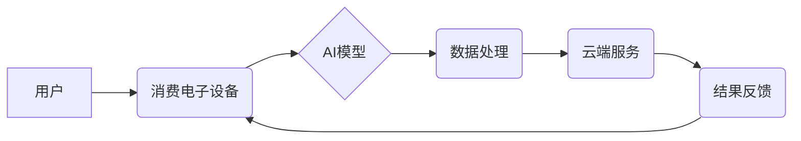

> 人工智能，消费电子，机器学习，深度学习，自然语言处理，计算机视觉，语音识别，智能家居，智能穿戴设备

## 1. 背景介绍

近年来，人工智能（AI）技术发展迅速，并开始渗透到各个领域，消费电子也不例外。AI技术赋予了消费电子设备更智能、更人性化的体验，推动了消费电子行业向智能化、个性化、交互式方向发展。

消费电子产品是指以满足个人日常娱乐、生活、工作等需求为目的的电子产品，例如智能手机、平板电脑、智能电视、智能音箱、智能手表等。传统消费电子产品主要依靠硬件功能和软件操作，而AI技术则赋予了这些产品更强大的智能能力，使其能够理解用户需求、自主学习和决策，从而提供更便捷、更智能的体验。

## 2. 核心概念与联系

**2.1 核心概念**

* **人工智能 (AI):** 人工智能是指模拟人类智能行为的计算机系统。它涵盖了多个子领域，例如机器学习、深度学习、自然语言处理、计算机视觉等。
* **机器学习 (ML):** 机器学习是人工智能的一个子领域，它使计算机能够从数据中学习，并根据学习到的知识进行预测或决策。
* **深度学习 (DL):** 深度学习是机器学习的一个子领域，它使用多层神经网络来模拟人类大脑的学习过程，能够处理更复杂的数据，并取得更优的性能。
* **自然语言处理 (NLP):** 自然语言处理是指使计算机能够理解和处理人类语言的技术。
* **计算机视觉 (CV):** 计算机视觉是指使计算机能够“看”和理解图像的技术。

**2.2 核心概念联系**

AI技术在消费电子中的应用主要依赖于以下核心概念：

* **数据驱动:** AI算法需要大量的训练数据才能学习和改进。消费电子设备能够收集大量的用户数据，例如使用习惯、偏好、地理位置等，这些数据可以用于训练AI模型。
* **云计算:** 云计算提供强大的计算资源和存储空间，可以支持AI模型的训练和部署。
* **边缘计算:** 边缘计算将计算能力部署到设备本身，可以降低延迟，提高实时性，并保护用户隐私。

**2.3  AI技术应用架构**



## 3. 核心算法原理 & 具体操作步骤

**3.1 算法原理概述**

在消费电子领域，常用的AI算法包括：

* **监督学习:** 训练模型预测输出，需要标注数据。例如，图像分类、语音识别等。
* **无监督学习:** 训练模型发现数据中的隐藏模式，不需要标注数据。例如，聚类分析、异常检测等。
* **强化学习:** 训练模型通过与环境交互学习最佳策略，需要奖励机制。例如，游戏AI、机器人控制等。

**3.2 算法步骤详解**

以监督学习为例，其基本步骤如下：

1. **数据收集和预处理:** 收集相关数据，并进行清洗、转换、特征提取等预处理操作。
2. **模型选择:** 根据任务需求选择合适的模型，例如线性回归、决策树、支持向量机等。
3. **模型训练:** 使用训练数据训练模型，调整模型参数，使模型能够准确预测输出。
4. **模型评估:** 使用测试数据评估模型性能，例如准确率、召回率、F1-score等。
5. **模型部署:** 将训练好的模型部署到消费电子设备上，用于实际应用。

**3.3 算法优缺点**

不同的AI算法具有不同的优缺点，需要根据具体任务选择合适的算法。

* **监督学习:** 优点：准确率高，可以解决分类、回归等问题。缺点：需要大量标注数据，对数据质量要求高。
* **无监督学习:** 优点：不需要标注数据，可以发现数据中的隐藏模式。缺点：难以评估模型性能，应用场景相对较少。
* **强化学习:** 优点：可以学习复杂的策略，适用于动态环境。缺点：训练过程复杂，需要设计合理的奖励机制。

**3.4 算法应用领域**

AI算法在消费电子领域应用广泛，例如：

* **语音识别:** 智能音箱、智能手机等设备使用语音识别技术，实现人机交互。
* **图像识别:** 智能手机、智能相机等设备使用图像识别技术，识别物体、场景、人脸等。
* **自然语言处理:** 智能手机、智能手表等设备使用自然语言处理技术，理解用户指令，进行对话交互。
* **个性化推荐:** 电商平台、音乐平台等使用AI算法，根据用户喜好推荐商品、音乐等。

## 4. 数学模型和公式 & 详细讲解 & 举例说明

**4.1 数学模型构建**

在AI算法中，数学模型是描述算法逻辑和关系的核心。例如，线性回归模型的数学表达式为：

$$y = w_0 + w_1x_1 + w_2x_2 + ... + w_nx_n + \epsilon$$

其中：

* $y$ 是预测输出
* $w_0, w_1, w_2, ..., w_n$ 是模型参数
* $x_1, x_2, ..., x_n$ 是输入特征
* $\epsilon$ 是误差项

**4.2 公式推导过程**

模型参数的学习过程通常使用梯度下降算法，其核心思想是通过不断调整参数，使模型预测输出与真实输出之间的误差最小化。梯度下降算法的公式为：

$$w_i = w_i - \alpha \frac{\partial Loss}{\partial w_i}$$

其中：

* $w_i$ 是模型参数
* $\alpha$ 是学习率
* $Loss$ 是损失函数，用于度量模型预测输出与真实输出之间的误差
* $\frac{\partial Loss}{\partial w_i}$ 是损失函数对模型参数的偏导数

**4.3 案例分析与讲解**

例如，在图像分类任务中，可以使用卷积神经网络（CNN）模型进行训练。CNN模型利用卷积操作和池化操作来提取图像特征，并使用全连接层进行分类。

## 5. 项目实践：代码实例和详细解释说明

**5.1 开发环境搭建**

* 操作系统：Windows/macOS/Linux
* Python版本：3.6+
* 深度学习框架：TensorFlow/PyTorch
* 其他工具：Jupyter Notebook、Git

**5.2 源代码详细实现**

以下是一个使用TensorFlow框架实现图像分类的简单代码示例：

```python
import tensorflow as tf

# 定义模型结构
model = tf.keras.models.Sequential([
    tf.keras.layers.Conv2D(32, (3, 3), activation='relu', input_shape=(28, 28, 1)),
    tf.keras.layers.MaxPooling2D((2, 2)),
    tf.keras.layers.Conv2D(64, (3, 3), activation='relu'),
    tf.keras.layers.MaxPooling2D((2, 2)),
    tf.keras.layers.Flatten(),
    tf.keras.layers.Dense(10, activation='softmax')
])

# 编译模型
model.compile(optimizer='adam',
              loss='sparse_categorical_crossentropy',
              metrics=['accuracy'])

# 训练模型
model.fit(x_train, y_train, epochs=5)

# 评估模型
loss, accuracy = model.evaluate(x_test, y_test)
print('Test loss:', loss)
print('Test accuracy:', accuracy)
```

**5.3 代码解读与分析**

* 代码首先定义了一个简单的卷积神经网络模型，包含两个卷积层、两个池化层、一个全连接层和一个softmax输出层。
* 然后，使用Adam优化器、交叉熵损失函数和准确率指标编译模型。
* 最后，使用训练数据训练模型，并使用测试数据评估模型性能。

**5.4 运行结果展示**

训练完成后，可以查看模型的训练和测试准确率，以及损失函数的变化趋势。

## 6. 实际应用场景

**6.1 智能语音助手**

智能语音助手，例如Siri、Alexa、Google Assistant等，利用语音识别技术，能够理解用户的语音指令，并执行相应的操作，例如播放音乐、设置闹钟、查询天气等。

**6.2 智能图像识别**

智能手机、智能相机等设备使用图像识别技术，可以识别物体、场景、人脸等，并提供相应的提示或操作。例如，可以识别物体并进行搜索、识别场景并提供相关信息、识别人脸并进行人脸识别等。

**6.3 智能家居控制**

智能家居设备，例如智能灯泡、智能空调、智能门锁等，可以使用AI技术实现语音控制、场景联动、个性化定制等功能，提高用户体验。

**6.4 智能穿戴设备**

智能手表、智能手环等穿戴设备可以使用AI技术监测用户的健康状况，例如心率、睡眠、运动等，并提供相应的建议和提醒。

**6.5 未来应用展望**

AI技术在消费电子领域的应用前景广阔，未来将有更多创新应用出现，例如：

* **更智能的交互方式:** 例如，基于情感识别的交互、基于身势识别的交互等。
* **更个性化的体验:** 例如，根据用户的喜好和习惯，提供个性化的内容推荐、个性化的设备设置等。
* **更强大的功能:** 例如，基于AI的虚拟助手、基于AI的医疗诊断等。

## 7. 工具和资源推荐

**7.1 学习资源推荐**

* **在线课程:** Coursera、edX、Udacity等平台提供丰富的AI课程。
* **书籍:** 《深度学习》、《机器学习实战》等书籍是学习AI的基础教材。
* **开源项目:** TensorFlow、PyTorch等开源项目可以帮助你实践AI算法。

**7.2 开发工具推荐**

* **Python:** Python是AI开发最常用的编程语言。
* **TensorFlow:** TensorFlow是Google开发的开源深度学习框架。
* **PyTorch:** PyTorch是Facebook开发的开源深度学习框架。
* **Jupyter Notebook:** Jupyter Notebook是一个交互式编程环境，方便进行AI算法开发和调试。

**7.3 相关论文推荐**

* **《ImageNet Classification with Deep Convolutional Neural Networks》**
* **《Attention Is All You Need》**
* **《BERT: Pre-training of Deep Bidirectional Transformers for Language Understanding》**

## 8. 总结：未来发展趋势与挑战

**8.1 研究成果总结**

近年来，AI技术在消费电子领域的应用取得了显著进展，例如语音识别、图像识别、自然语言处理等技术已经应用于各种消费电子设备，为用户提供了更智能、更便捷的体验。

**8.2 未来发展趋势**

* **更强大的计算能力:** 随着芯片技术的进步，消费电子设备的计算能力将进一步提升，能够支持更复杂的AI算法。
* **更丰富的传感器数据:** 消费电子设备将配备更多传感器，例如摄像头、麦克风、加速度计等，能够收集更丰富的数据，为AI算法提供更充足的训练数据。
* **更个性化的体验:** AI技术将更加注重用户个性化需求，提供更加定制化的产品和服务。

**8.3 面临的挑战**

* **数据隐私和安全:** AI算法需要大量数据进行训练，如何保护用户数据隐私和安全是一个重要的挑战。
* **算法公平性和可解释性:** AI算法可能会存在偏见和不可解释性，需要研究如何提高算法的公平性和可解释性。
* **成本和效率:** AI算法的训练和部署成本较高，需要研究如何降低成本，提高效率。

**8.4 研究展望**

未来，AI技术在消费电子领域的应用将更加广泛和深入，将带来更多创新产品和服务，改变人们的生活方式。


## 9. 附录：常见问题与解答

**9.1 如何选择合适的AI算法？**

选择合适的