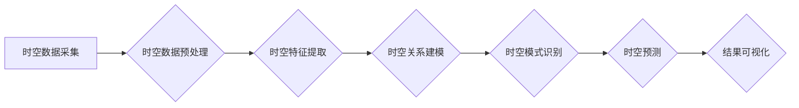

> AI时空建模，时空数据，深度学习，图神经网络，时间序列分析，预测建模，应用场景

## 1. 背景介绍

随着人工智能技术的飞速发展，时空数据在各个领域得到了广泛应用。时空数据包含了时间和空间两个维度的信息，例如地理位置、交通流量、气象数据等。有效地建模和分析时空数据对于理解复杂系统、预测未来趋势、优化资源配置等具有重要意义。

传统的时空建模方法主要依赖于统计学和地理信息系统 (GIS) 技术，但这些方法往往难以处理高维、复杂、非结构化的时空数据。近年来，深度学习技术在时空建模领域取得了显著进展，能够更好地捕捉时空数据的复杂关系和模式。

## 2. 核心概念与联系

**2.1 时空建模的概念**

时空建模是指利用数学模型、算法和技术，对时空数据进行表示、分析和预测。其目标是揭示时空数据的内在规律，并为决策支持、风险评估、资源管理等提供决策依据。

**2.2 核心概念**

* **时空数据:** 包含时间和空间两个维度信息的数字化数据。
* **时空关系:** 指不同时空实体之间的时间和空间关联。
* **时空模式:** 指时空数据中重复出现的时空特征和规律。
* **时空预测:** 利用历史时空数据预测未来时空事件或趋势。

**2.3 时空建模的架构**



## 3. 核心算法原理 & 具体操作步骤

**3.1 算法原理概述**

时空建模常用的算法包括：

* **时间序列分析:** 用于分析时间维度上的数据变化趋势，例如ARIMA、LSTM等。
* **空间分析:** 用于分析空间维度上的数据分布和关联，例如空间自相关、克里金插值等。
* **图神经网络:** 用于建模时空关系网络，例如Graph Convolutional Network (GCN)、Graph Attention Network (GAT)等。

**3.2 算法步骤详解**

以图神经网络为例，其时空建模步骤如下：

1. **构建时空图:** 将时空实体（例如地点、用户、事件）作为节点，时空关系（例如位置关系、时间关系）作为边，构建时空图。
2. **特征提取:** 对节点和边进行特征提取，例如节点的地理位置、人口密度、用户行为等，边的时间间隔、距离等。
3. **图卷积:** 利用图卷积操作，将节点和边的特征信息传播到相邻节点，学习时空关系的表示。
4. **时空预测:** 利用训练好的图神经网络模型，对未来时空事件进行预测。

**3.3 算法优缺点**

* **优点:** 能够有效地捕捉时空数据的复杂关系和模式，预测精度较高。
* **缺点:** 需要大量的训练数据，计算复杂度较高。

**3.4 算法应用领域**

* **交通预测:** 预测交通流量、拥堵情况等。
* **城市规划:** 优化城市布局、交通规划等。
* **犯罪预测:** 预测犯罪热点区域等。
* **疫情防控:** 预测疫情传播路径等。

## 4. 数学模型和公式 & 详细讲解 & 举例说明

**4.1 数学模型构建**

时空建模常用的数学模型包括：

* **空间自相关模型:** 用于描述空间位置上数据之间的相关性。
* **时间序列模型:** 用于描述时间维度上数据变化的趋势和规律。
* **时空回归模型:** 用于预测时空变量的值。

**4.2 公式推导过程**

以空间自相关模型为例，其公式如下：

$$
\rho(h) = \frac{\sum_{i=1}^{n-h} (x_i - \bar{x})(x_{i+h} - \bar{x})}{\sum_{i=1}^{n} (x_i - \bar{x})^2}
$$

其中：

* $\rho(h)$ 是空间自相关系数。
* $h$ 是空间距离。
* $x_i$ 是第 $i$ 个空间位置的数据值。
* $\bar{x}$ 是所有数据值的平均值。

**4.3 案例分析与讲解**

假设我们有城市交通流量数据，我们可以使用空间自相关模型分析不同位置之间的交通流量相关性。如果空间自相关系数较高，则表明不同位置的交通流量存在较强的相关性。

## 5. 项目实践：代码实例和详细解释说明

**5.1 开发环境搭建**

* Python 3.7+
* TensorFlow 2.0+
* PyTorch 1.0+
* Jupyter Notebook

**5.2 源代码详细实现**

```python
import tensorflow as tf

# 定义时空图神经网络模型
class SpatioTemporalGNN(tf.keras.Model):
    def __init__(self, num_nodes, embedding_dim, num_layers):
        super(SpatioTemporalGNN, self).__init__()
        self.embedding_layer = tf.keras.layers.Embedding(num_nodes, embedding_dim)
        self.gcn_layers = [tf.keras.layers.GraphConv(embedding_dim) for _ in range(num_layers)]

    def call(self, inputs):
        # 嵌入节点特征
        embeddings = self.embedding_layer(inputs)
        # 进行图卷积操作
        for layer in self.gcn_layers:
            embeddings = layer(embeddings)
        return embeddings

# 训练模型
model = SpatioTemporalGNN(num_nodes=100, embedding_dim=64, num_layers=3)
model.compile(optimizer='adam', loss='mse')
model.fit(train_data, train_labels, epochs=10)

# 预测未来时空事件
predictions = model.predict(test_data)
```

**5.3 代码解读与分析**

* 代码定义了一个时空图神经网络模型，包含嵌入层和图卷积层。
* 嵌入层将节点特征转换为向量表示。
* 图卷积层利用图卷积操作，将节点和边的特征信息传播到相邻节点。
* 模型使用均方误差损失函数和Adam优化器进行训练。

**5.4 运行结果展示**

训练完成后，可以将模型应用于预测未来时空事件，例如预测交通流量、犯罪热点等。

## 6. 实际应用场景

**6.1 交通预测**

时空建模可以用于预测交通流量、拥堵情况等，为交通管理提供决策支持。

**6.2 城市规划**

时空建模可以用于优化城市布局、交通规划等，提高城市效率和居民生活质量。

**6.3 犯罪预测**

时空建模可以用于预测犯罪热点区域等，为犯罪预防提供依据。

**6.4 未来应用展望**

随着人工智能技术的不断发展，时空建模将在更多领域得到应用，例如：

* **医疗保健:** 预测疾病传播路径、优化医疗资源配置等。
* **环境保护:** 预测环境污染情况、优化资源利用等。
* **金融服务:** 预测金融风险、优化投资策略等。

## 7. 工具和资源推荐

**7.1 学习资源推荐**

* **书籍:**
    * "Deep Learning for Spatial Data" by Michael J. Franklin
    * "Graph Neural Networks" by William L. Hamilton
* **课程:**
    * Coursera: "Deep Learning Specialization"
    * Udacity: "Deep Learning Nanodegree"

**7.2 开发工具推荐**

* **TensorFlow:** 开源深度学习框架。
* **PyTorch:** 开源深度学习框架。
* **NetworkX:** 图数据结构和算法库。

**7.3 相关论文推荐**

* "Graph Convolutional Networks for Web-Scale Recommender Systems"
* "Spatial-Temporal Graph Convolutional Networks for Traffic Forecasting"

## 8. 总结：未来发展趋势与挑战

**8.1 研究成果总结**

时空建模取得了显著进展，能够有效地处理高维、复杂、非结构化的时空数据，并为多个领域提供决策支持。

**8.2 未来发展趋势**

* **模型复杂度提升:** 开发更复杂、更强大的时空建模模型，例如Transformer、Graph Attention Network等。
* **数据融合:** 将不同类型时空数据融合，例如地理数据、传感器数据、社交媒体数据等。
* **解释性增强:** 提高时空建模模型的解释性，使模型决策更加透明可信。

**8.3 面临的挑战**

* **数据质量:** 时空数据往往存在噪声、缺失值等问题，需要进行有效的数据清洗和预处理。
* **计算复杂度:** 时空建模模型计算复杂度较高，需要开发更高效的算法和硬件支持。
* **隐私保护:** 时空数据往往包含敏感信息，需要采取有效措施保护用户隐私。

**8.4 研究展望**

未来时空建模研究将继续朝着更智能、更可解释、更安全的方向发展，为人类社会提供更精准、更有效的决策支持。

## 9. 附录：常见问题与解答

**9.1 什么是时空建模？**

时空建模是指利用数学模型、算法和技术，对时空数据进行表示、分析和预测。

**9.2 时空建模有哪些应用场景？**

时空建模应用场景广泛，例如交通预测、城市规划、犯罪预测、疫情防控等。

**9.3 如何选择合适的时空建模算法？**

选择合适的时空建模算法需要根据具体应用场景和数据特点进行选择。

**9.4 时空建模有哪些挑战？**

时空建模面临的数据质量、计算复杂度、隐私保护等挑战。


作者：禅与计算机程序设计艺术 / Zen and the Art of Computer Programming 
<end_of_turn>