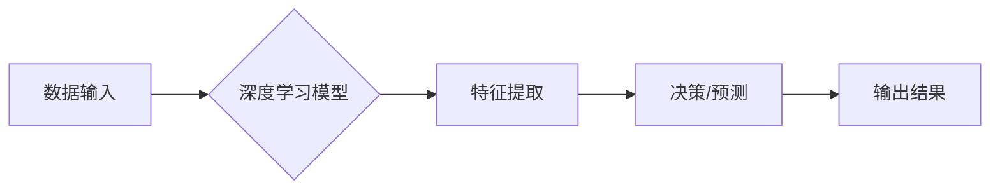

> 深度学习，计算机视觉，自然语言处理，强化学习，人工智能，Andrej Karpathy，特斯拉，OpenAI

## 1. 背景介绍

Andrej Karpathy是一位享誉全球的计算机科学家，他在人工智能领域做出了杰出的贡献。他曾担任特斯拉自动驾驶团队的负责人，并在OpenAI担任研究科学家。他的演讲内容涵盖了深度学习、计算机视觉、自然语言处理和强化学习等多个重要领域，为人工智能的未来发展提供了宝贵的见解。

## 2. 核心概念与联系

Karpathy的演讲强调了人工智能的核心概念：深度学习。深度学习是一种机器学习的子领域，它利用多层神经网络来模拟人类大脑的学习过程。通过训练大量的样本数据，深度学习模型能够自动学习特征和模式，从而实现对图像、文本、语音等数据的理解和处理。

**Mermaid 流程图：**



## 3. 核心算法原理 & 具体操作步骤

### 3.1  算法原理概述

深度学习的核心算法是反向传播算法。反向传播算法通过计算误差，并根据误差调整神经网络的权重，从而不断优化模型的性能。

### 3.2  算法步骤详解

1. **前向传播:** 将输入数据通过神经网络传递，并计算输出结果。
2. **误差计算:** 将输出结果与真实值进行比较，计算误差。
3. **反向传播:** 将误差反向传播到神经网络的各个层，并根据误差调整权重。
4. **更新权重:** 使用优化算法更新神经网络的权重。
5. **重复步骤1-4:** 重复上述步骤，直到模型性能达到预期的水平。

### 3.3  算法优缺点

**优点:**

* 能够自动学习特征，无需人工特征工程。
* 性能优异，在许多任务中都取得了突破性进展。

**缺点:**

* 训练数据量大，需要大量的计算资源。
* 模型复杂，难以解释。

### 3.4  算法应用领域

深度学习算法广泛应用于图像识别、语音识别、自然语言处理、机器翻译、推荐系统等多个领域。

## 4. 数学模型和公式 & 详细讲解 & 举例说明

### 4.1  数学模型构建

深度学习模型通常由多层神经网络组成，每层神经网络包含多个神经元。每个神经元接收来自上一层的输入信号，并通过激活函数进行处理，输出到下一层。

### 4.2  公式推导过程

反向传播算法的核心是计算梯度，并根据梯度更新权重。梯度表示模型参数的变化对输出结果的影响。

**公式:**

$$
\frac{\partial Loss}{\partial W} = \frac{\partial Loss}{\partial Output} \cdot \frac{\partial Output}{\partial W}
$$

其中：

* Loss: 损失函数
* W: 模型参数
* Output: 模型输出

### 4.3  案例分析与讲解

假设我们有一个简单的线性回归模型，目标是预测房价。模型输入特征包括房屋面积和房间数量，输出是房价。

我们可以使用反向传播算法训练这个模型。首先，我们选择一个损失函数，例如均方误差。然后，我们计算梯度，并根据梯度更新模型参数。

## 5. 项目实践：代码实例和详细解释说明

### 5.1  开发环境搭建

为了实现深度学习模型，我们需要搭建一个开发环境。常用的开发环境包括：

* Python 3.x
* TensorFlow 或 PyTorch
* CUDA 和 cuDNN

### 5.2  源代码详细实现

以下是一个使用 TensorFlow 实现简单的线性回归模型的代码示例：

```python
import tensorflow as tf

# 定义模型
model = tf.keras.Sequential([
    tf.keras.layers.Dense(units=1, input_shape=[2])
])

# 定义损失函数和优化器
model.compile(loss='mse', optimizer='sgd')

# 训练模型
model.fit(x_train, y_train, epochs=10)

# 预测房价
predictions = model.predict(x_test)
```

### 5.3  代码解读与分析

这段代码首先定义了一个简单的线性回归模型，包含一个全连接层。然后，我们定义了均方误差作为损失函数，并使用随机梯度下降作为优化器。最后，我们训练模型并使用训练好的模型预测房价。

### 5.4  运行结果展示

训练完成后，我们可以评估模型的性能，例如使用均方误差来衡量预测结果与真实值的差异。

## 6. 实际应用场景

深度学习在各个领域都有广泛的应用场景，例如：

* **计算机视觉:** 图像识别、物体检测、图像分割、人脸识别等。
* **自然语言处理:** 文本分类、情感分析、机器翻译、文本生成等。
* **语音识别:** 语音转文本、语音助手等。
* **强化学习:** 游戏人工智能、机器人控制等。

### 6.4  未来应用展望

随着深度学习技术的不断发展，未来将有更多新的应用场景出现，例如：

* **医疗诊断:** 利用深度学习模型辅助医生进行疾病诊断。
* **个性化教育:** 根据学生的学习情况提供个性化的学习方案。
* **自动驾驶:** 利用深度学习模型实现自动驾驶汽车。

## 7. 工具和资源推荐

### 7.1  学习资源推荐

* **课程:** Coursera、edX、Udacity 等平台提供深度学习相关的课程。
* **书籍:** 《深度学习》、《动手学深度学习》等书籍。
* **博客:** TensorFlow、PyTorch 等框架的官方博客。

### 7.2  开发工具推荐

* **TensorFlow:** Google 开发的开源深度学习框架。
* **PyTorch:** Facebook 开发的开源深度学习框架。
* **Keras:** TensorFlow 的高层API，简化了深度学习模型的开发。

### 7.3  相关论文推荐

* **ImageNet Classification with Deep Convolutional Neural Networks**
* **Attention Is All You Need**
* **Deep Reinforcement Learning**

## 8. 总结：未来发展趋势与挑战

### 8.1  研究成果总结

深度学习在过去几年取得了显著的进展，在许多领域都取得了突破性成果。

### 8.2  未来发展趋势

未来深度学习的发展趋势包括：

* **模型更深、更复杂:** 研究更深层次、更复杂的深度学习模型。
* **数据更丰富、更多样:** 利用更多的数据类型和数据来源进行训练。
* **算法更有效、更鲁棒:** 研究更有效、更鲁棒的深度学习算法。

### 8.3  面临的挑战

深度学习也面临着一些挑战，例如：

* **数据隐私:** 深度学习模型需要大量的训练数据，如何保护数据隐私是一个重要问题。
* **模型可解释性:** 深度学习模型的决策过程难以解释，如何提高模型的可解释性是一个重要的研究方向。
* **计算资源:** 训练深度学习模型需要大量的计算资源，如何降低训练成本是一个重要的挑战。

### 8.4  研究展望

未来，深度学习的研究将继续朝着更智能、更安全、更可解释的方向发展。


## 9. 附录：常见问题与解答

**Q1: 深度学习和机器学习有什么区别？**

**A1:** 深度学习是机器学习的一种子领域，它利用多层神经网络来模拟人类大脑的学习过程。

**Q2: 如何选择合适的深度学习框架？**

**A2:** TensorFlow 和 PyTorch 是两个流行的深度学习框架，选择哪个框架取决于具体的应用场景和个人喜好。

**Q3: 如何评估深度学习模型的性能？**

**A3:** 可以使用准确率、召回率、F1-score 等指标来评估深度学习模型的性能。

作者：禅与计算机程序设计艺术 / Zen and the Art of Computer Programming


<end_of_turn>