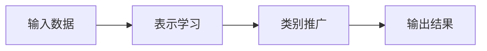

                 

**少样本学习：突破数据瓶颈的新方法**

**作者：禅与计算机程序设计艺术 / Zen and the Art of Computer Programming**

## 1. 背景介绍

在人工智能和机器学习的发展过程中，数据是关键的驱动因素。然而，收集和标注大量数据是一项昂贵且耗时的任务。少样本学习（Few-Shot Learning）是一种有希望突破数据瓶颈的新方法，它旨在从少量样本中学习泛化能力，从而节省数据收集和标注的成本。

## 2. 核心概念与联系

少样本学习的核心概念是学习少量样本的表示，并将其推广到新的、未见过的类别。其架构通常包括表示学习和类别推广两个关键步骤。下面是其 Mermaid 流程图：



## 3. 核心算法原理 & 具体操作步骤

### 3.1 算法原理概述

少样本学习算法的核心原理是学习一种表示，该表示可以在少量样本上泛化，并将其推广到新的类别。常用的少样本学习方法包括匹配式学习（Matching-based methods）、元学习（Meta-Learning）和对抗式学习（Adversarial methods）。

### 3.2 算法步骤详解

1. **表示学习**：从少量样本中学习表示，通常使用深度学习模型，如CNN或Transformer。
2. **类别推广**：将学习到的表示推广到新的类别，通常通过匹配、元学习或对抗式学习的方式进行。

### 3.3 算法优缺点

**优点**：节省数据收集和标注成本，可以应用于新的、未见过的类别。

**缺点**：需要设计复杂的架构和优化目标，并且泛化能力可能不如有大量数据的模型。

### 3.4 算法应用领域

少样本学习的应用领域包括但不限于：新类别检测、少样本分类、少样本回归和少样本生成。

## 4. 数学模型和公式 & 详细讲解 & 举例说明

### 4.1 数学模型构建

设少样本学习任务为学习表示函数 $f(x;\theta)$，其中 $x$ 是输入数据，$theta$ 是模型参数。表示函数 $f(x;\theta)$ 映射输入数据到表示空间。

### 4.2 公式推导过程

在表示学习步骤中，我们通常使用经验风险最小化（Empirical Risk Minimization）来学习模型参数 $theta$：

$$
\theta^* = \arg\min_\theta \sum_{i=1}^n L(y_i, f(x_i; \theta))
$$

其中 $L$ 是损失函数，$y_i$ 是标签，$x_i$ 是输入数据，$n$ 是样本数。

### 4.3 案例分析与讲解

例如，在匹配式学习中，给定少量样本 $(x_1, y_1), (x_2, y_2), \ldots, (x_n, y_n)$，表示学习模型 $f(x;\theta)$ 学习到表示 $(f(x_1;\theta), f(x_2;\theta), \ldots, f(x_n;\theta))$。然后，对于新的输入数据 $x_{new}$，我们可以通过找到最匹配的表示进行类别推广：

$$
y_{new} = \arg\max_{y_i} \text{sim}(f(x_{new};\theta), f(x_i;\theta))
$$

其中 $\text{sim}$ 是表示空间中的相似度度量。

## 5. 项目实践：代码实例和详细解释说明

### 5.1 开发环境搭建

我们将使用 Python 和 PyTorch 实现一个简单的匹配式学习模型。您需要安装以下库：

```bash
pip install torch torchvision
```

### 5.2 源代码详细实现

```python
import torch
import torch.nn as nn
import torch.optim as optim
import torchvision.transforms as transforms
import torchvision.datasets as datasets

# 定义表示学习模型
class Net(nn.Module):
    def __init__(self):
        super(Net, self).__init__()
        self.conv1 = nn.Conv2d(3, 6, 5)
        self.pool = nn.MaxPool2d(2, 2)
        self.conv2 = nn.Conv2d(6, 16, 5)
        self.fc1 = nn.Linear(16 * 5 * 5, 120)
        self.fc2 = nn.Linear(120, 84)
        self.fc3 = nn.Linear(84, 10)

    def forward(self, x):
        x = self.pool(F.relu(self.conv1(x)))
        x = self.pool(F.relu(self.conv2(x)))
        x = x.view(-1, 16 * 5 * 5)
        x = F.relu(self.fc1(x))
        x = F.relu(self.fc2(x))
        x = self.fc3(x)
        return x

# 加载数据集
transform = transforms.Compose([
    transforms.ToTensor(),
    transforms.Normalize((0.5, 0.5, 0.5), (0.5, 0.5, 0.5))
])

trainset = datasets.CIFAR10(root='./data', train=True,
                            download=True, transform=transform)
trainloader = torch.utils.data.DataLoader(trainset, batch_size=4,
                                          shuffle=True, num_workers=2)

# 训练模型
net = Net()
criterion = nn.CrossEntropyLoss()
optimizer = optim.SGD(net.parameters(), lr=0.001, momentum=0.9)

for epoch in range(2):  # loop over the dataset multiple times
    running_loss = 0.0
    for i, data in enumerate(trainloader, 0):
        inputs, labels = data

        optimizer.zero_grad()
        outputs = net(inputs)
        loss = criterion(outputs, labels)
        loss.backward()
        optimizer.step()

        running_loss += loss.item()
        if i % 2000 == 1999:    # print every 2000 mini-batches
            print('[%d, %5d] loss: %.3f' %
                  (epoch + 1, i + 1, running_loss / 2000))
            running_loss = 0.0

print('Finished Training')
```

### 5.3 代码解读与分析

我们定义了一个简单的 CNN 模型 `Net` 进行表示学习。然后，我们使用 PyTorch 的 `DataLoader` 来加载 CIFAR10 数据集，并使用交叉熵损失函数和 SGD 优化器来训练模型。

### 5.4 运行结果展示

运行上述代码后，您会看到模型在训练过程中的损失值。您可以根据需要调整模型架构、优化器参数和训练 epoch 数来改善模型性能。

## 6. 实际应用场景

少样本学习的实际应用场景包括但不限于：

### 6.1 新类别检测

在新类别检测中，少样本学习可以帮助检测新的、未见过的类别，从而节省数据收集和标注成本。

### 6.2 少样本分类

在少样本分类中，少样本学习可以从少量样本中学习表示，并将其推广到新的类别，从而提高分类准确性。

### 6.3 未来应用展望

未来，少样本学习有望在自动驾驶、医学成像和语言模型等领域得到广泛应用，从而节省数据收集和标注成本，并提高模型泛化能力。

## 7. 工具和资源推荐

### 7.1 学习资源推荐

* [少样本学习的综述](https://arxiv.org/abs/2006.10029)
* [少样本学习的最新进展](https://arxiv.org/abs/2102.05996)

### 7.2 开发工具推荐

* PyTorch：<https://pytorch.org/>
* TensorFlow：<https://www.tensorflow.org/>
* Keras：<https://keras.io/>

### 7.3 相关论文推荐

* [Matching Networks for One Shot Learning](https://arxiv.org/abs/1606.09282)
* [Model-Agnostic Meta-Learning for Fast Adaptation of Deep Networks](https://arxiv.org/abs/1710.09406)
* [Prototypical Networks for Few-shot Learning](https://arxiv.org/abs/1703.05400)

## 8. 总结：未来发展趋势与挑战

### 8.1 研究成果总结

少样本学习已经取得了显著的研究成果，包括匹配式学习、元学习和对抗式学习等方法。这些方法可以从少量样本中学习表示，并将其推广到新的类别。

### 8.2 未来发展趋势

未来，少样本学习有望在更多领域得到应用，并与其他机器学习方法结合，从而提高模型泛化能力和节省数据收集和标注成本。

### 8.3 面临的挑战

少样本学习面临的挑战包括但不限于：如何设计复杂的架构和优化目标，如何泛化到新的类别，如何评估模型性能等。

### 8.4 研究展望

未来的研究方向包括但不限于：少样本学习与其他机器学习方法的结合，少样本学习在更多领域的应用，少样本学习的理论分析等。

## 9. 附录：常见问题与解答

**Q：少样本学习与传统机器学习有何不同？**

**A**：少样本学习的关键区别在于它旨在从少量样本中学习泛化能力，而传统机器学习则需要大量样本。

**Q：少样本学习的优势是什么？**

**A**：少样本学习的优势包括节省数据收集和标注成本，可以应用于新的、未见过的类别。

**Q：少样本学习的缺点是什么？**

**A**：少样本学习的缺点包括需要设计复杂的架构和优化目标，泛化能力可能不如有大量数据的模型。

**Q：少样本学习的应用领域有哪些？**

**A**：少样本学习的应用领域包括但不限于：新类别检测、少样本分类、少样本回归和少样本生成。

**Q：如何评估少样本学习模型的性能？**

**A**：评估少样本学习模型性能的常用指标包括准确率、精确度、召回率和 F1 分数等。

**Q：少样本学习的未来发展趋势是什么？**

**A**：未来，少样本学习有望在更多领域得到应用，并与其他机器学习方法结合，从而提高模型泛化能力和节省数据收集和标注成本。

**Q：少样本学习面临的挑战是什么？**

**A**：少样本学习面临的挑战包括但不限于：如何设计复杂的架构和优化目标，如何泛化到新的类别，如何评估模型性能等。

**Q：未来的研究方向是什么？**

**A**：未来的研究方向包括但不限于：少样本学习与其他机器学习方法的结合，少样本学习在更多领域的应用，少样本学习的理论分析等。

## 作者署名

作者：禅与计算机程序设计艺术 / Zen and the Art of Computer Programming

