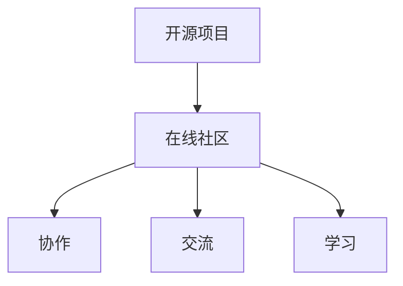

                 

**开源项目、在线社区、商业化、GitHub、GitLab、开源许可证、社区管理、营利模式**

## 1. 背景介绍

在当今的软件开发领域，开源项目已然成为主流。开源项目的成功离不开一个活跃且健康的在线社区。本文将探讨如何建立和管理开源项目的在线社区，以实现商业化的目标。

## 2. 核心概念与联系

### 2.1 开源项目与在线社区

开源项目是指任何人都可以访问、使用、修改和分发其源代码的软件项目。在线社区则是围绕开源项目而建立的虚拟社区，它为开发者提供了协作、交流和学习的平台。

### 2.2 商业化

商业化是指将开源项目转化为盈利模式的过程。这可以通过提供增值服务、销售商业版本、广告等方式实现。

## 3. 核心算法原理 & 具体操作步骤

### 3.1 算法原理概述

建立开源项目的在线社区并实现商业化的过程可以看作是一个复杂的系统工程。我们可以将其抽象为以下几个步骤的算法：

1. **项目发起与建立**：创建开源项目，选择合适的开源许可证，并建立在线社区。
2. **社区管理**：维护社区秩序，鼓励参与，管理贡献者。
3. **商业化模式选择**：根据项目特点选择合适的商业化模式。
4. **商业化实施**：提供增值服务，销售商业版本，或其他盈利方式。
5. **持续优化**：根据社区反馈和市场需求不断优化项目和商业化模式。

### 3.2 算法步骤详解

#### 3.2.1 项目发起与建立

1. **选择开源平台**：如GitHub、GitLab等。
2. **选择开源许可证**：如Apache 2.0、GPL等。
3. **建立在线社区**：创建项目网站、论坛、聊天室等。

#### 3.2.2 社区管理

1. **设置社区规范**：明确贡献者行为准则、代码提交流程等。
2. **鼓励参与**：组织活动、提供激励措施等。
3. **管理贡献者**：审核代码、回复问题、处理冲突等。

#### 3.2.3 商业化模式选择

1. **增值服务**：提供专业支持、培训、定制开发等。
2. **商业版本**：提供功能更丰富、性能更优的商业版本。
3. **广告**：在项目网站或社区平台上投放广告。
4. **捐赠**：接受用户捐赠。

#### 3.2.4 商业化实施

1. **提供增值服务**：建立专业团队，提供高质量服务。
2. **销售商业版本**：建立销售渠道，提供安全可靠的商业版本。
3. **投放广告**：选择合适的广告平台，投放广告。
4. **接受捐赠**：提供捐赠渠道，接受用户捐赠。

#### 3.2.5 持续优化

1. **收集反馈**：通过社区交流、用户调查等方式收集反馈。
2. **分析市场需求**：跟踪市场动态，分析用户需求。
3. **优化项目与商业化模式**：根据反馈和市场需求优化项目和商业化模式。

### 3.3 算法优缺点

**优点**：该算法系统化地描述了建立开源项目的在线社区并实现商业化的过程，有助于项目管理者更好地理解和实施商业化。

**缺点**：该算法过于笼统，具体实施时需要根据项目特点和市场需求进行调整。

### 3.4 算法应用领域

该算法适用于任何开源项目，包括但不限于软件项目、硬件项目、科学研究项目等。

## 4. 数学模型和公式 & 详细讲解 & 举例说明

### 4.1 数学模型构建

我们可以使用社区活跃度、项目质量、商业化成功率等指标构建数学模型，以量化开源项目的在线社区商业化情况。

### 4.2 公式推导过程

假设社区活跃度为$A$, 项目质量为$Q$, 商业化成功率为$S$, 则商业化成功率$S$可以表示为：

$$S = f(A, Q)$$

其中，$f$是一个未知函数，需要通过实证研究来确定。

### 4.3 案例分析与讲解

例如，对于一个开源软件项目，我们可以将社区活跃度$A$定义为每周活跃贡献者数量，项目质量$Q$定义为代码质量评分，商业化成功率$S$定义为项目盈利额占项目成本的比例。通过收集数据并分析，我们可以拟合出$f$函数，从而预测商业化成功率。

## 5. 项目实践：代码实例和详细解释说明

### 5.1 开发环境搭建

建议使用GitHub或GitLab作为开源平台，使用Markdown作为文档格式，使用Git作为版本控制系统。

### 5.2 源代码详细实现

本节将不提供具体代码实现，因为建立开源项目的在线社区并实现商业化的过程更多的是管理和运营过程，而不是编码过程。

### 5.3 代码解读与分析

由于没有具体代码，本节也将不进行代码解读和分析。

### 5.4 运行结果展示

由于没有具体代码，本节也将不进行运行结果展示。

## 6. 实际应用场景

### 6.1 项目成功案例

如Linux、MySQL、WordPress等开源项目，都建立了成功的在线社区，并实现了商业化。

### 6.2 项目失败案例

如OpenOffice、Hadoop等开源项目，由于社区管理不善或商业化模式选择不当，导致项目失败。

### 6.3 未来应用展望

随着开源项目的不断增多，建立和管理开源项目的在线社区并实现商业化将成为一项重要的技能。

## 7. 工具和资源推荐

### 7.1 学习资源推荐

推荐阅读《开源软件管理》《开源软件商业化》等书籍，以及相关的学术论文。

### 7.2 开发工具推荐

推荐使用GitHub或GitLab作为开源平台，使用Markdown作为文档格式，使用Git作为版本控制系统。

### 7.3 相关论文推荐

推荐阅读《Understanding Open Source Software Development》《Open Source Software Licensing: Survey and Comparative Analysis》等论文。

## 8. 总结：未来发展趋势与挑战

### 8.1 研究成果总结

本文系统地介绍了建立开源项目的在线社区并实现商业化的过程，提供了数学模型和算法原理，并给出了实际应用场景和工具推荐。

### 8.2 未来发展趋势

随着开源项目的不断增多，建立和管理开源项目的在线社区并实现商业化将成为一项重要的技能。未来，开源项目的商业化模式将更加多样化，社区管理也将更加科学化。

### 8.3 面临的挑战

开源项目的商业化面临着社区管理、商业化模式选择等挑战。如何平衡开源理念和商业利益，如何维护社区活力和项目质量，都是需要解决的问题。

### 8.4 研究展望

未来的研究可以从以下几个方向展开：开源项目商业化模式的多样化研究、社区管理科学化研究、开源项目商业化成功因素的研究等。

## 9. 附录：常见问题与解答

**Q1：如何选择开源平台？**

**A1：选择开源平台时，需要考虑平台的流量、功能、用户基础等因素。推荐使用GitHub或GitLab。**

**Q2：如何选择开源许可证？**

**A2：选择开源许可证时，需要考虑项目的特点、商业化需求等因素。推荐使用Apache 2.0或GPL。**

**Q3：如何管理开源项目的在线社区？**

**A3：管理开源项目的在线社区需要设置社区规范、鼓励参与、管理贡献者等。**

**Q4：如何实现开源项目的商业化？**

**A4：实现开源项目的商业化需要选择合适的商业化模式、提供增值服务、销售商业版本等。**

**Q5：如何持续优化开源项目的商业化？**

**A5：持续优化开源项目的商业化需要收集反馈、分析市场需求、优化项目和商业化模式等。**

## 作者：禅与计算机程序设计艺术 / Zen and the Art of Computer Programming

