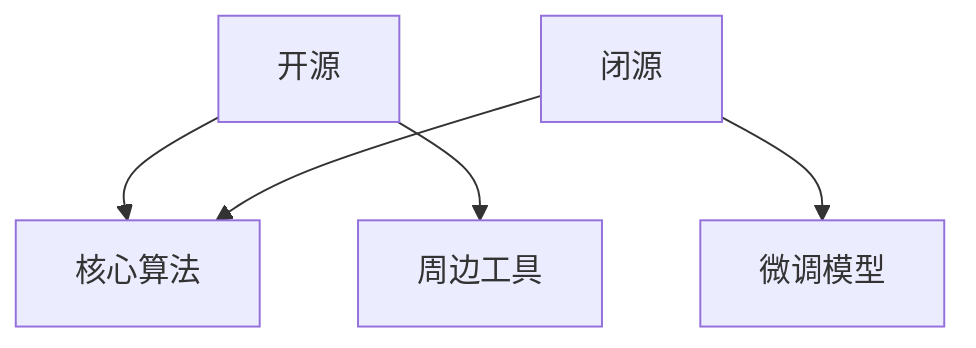

                 

**开源还是闭源:大模型商业化的抉择**

**作者：禅与计算机程序设计艺术 / Zen and the Art of Computer Programming**

## 1. 背景介绍

随着人工智能的飞速发展，大型语言模型（LLM）已成为当今最先进的技术之一。这些模型在自然语言处理、信息检索、自动生成等领域取得了显著的成就。然而，大模型的商业化之路并非一帆风顺。开源还是闭源，这是大模型商业化面临的首要抉择。本文将深入探讨这一问题，并提供清晰的指南，帮助读者理解和做出明智的选择。

## 2. 核心概念与联系

### 2.1 开源与闭源的定义

- **开源（Open Source）**：开源软件的源代码可公开获取，任何人都可以阅读、修改、分发代码，并创建衍生产品。
- **闭源（Closed Source）**：闭源软件的源代码是保密的，只有开发者才能访问和修改代码。

### 2.2 开源与闭源的优缺点

**开源优点**：透明度高、社区支持强、灵活性高、成本低、安全性高。

**开源缺点**：缺乏商业支持、维护成本高、缺乏专业文档。

**闭源优点**：商业支持强、维护成本低、专业文档丰富。

**闭源缺点**：透明度低、社区支持弱、灵活性低、成本高。

### 2.3 开源与闭源的关系

开源与闭源并非二选一的关系，而是可以结合的。例如，可以将核心算法闭源，但周边工具和框架开源。又或者，可以先开源预训练模型，待商业化时再闭源微调模型。



## 3. 核心算法原理 & 具体操作步骤

### 3.1 算法原理概述

大型语言模型的核心算法是Transformer，其基于自注意力机制（Self-Attention）和位置编码（Positional Encoding）。Transformer模型由编码器（Encoder）和解码器（Decoder）组成，可以并行处理输入序列，大大提高了模型的训练速度。

### 3.2 算法步骤详解

1. **输入表示**：将输入序列转换为向量表示。
2. **位置编码**：为输入序列添加位置信息。
3. **自注意力**：计算输入序列中每个位置的注意力权重，并生成上下文表示。
4. **前向传播**：通过多个Transformer块（包含自注意力和Feed-Forward网络）进行前向传播。
5. **输出**：生成输出序列。

### 3.3 算法优缺点

**优点**：可以并行处理输入序列、可以处理长序列、表达能力强。

**缺点**：训练成本高、计算复杂度高、难以解释模型决策。

### 3.4 算法应用领域

大型语言模型广泛应用于自然语言生成、机器翻译、信息检索、问答系统等领域。

## 4. 数学模型和公式 & 详细讲解 & 举例说明

### 4.1 数学模型构建

大型语言模型的数学模型基于Transformer架构，可以表示为：

$$M = f(x; \theta)$$

其中，$M$是模型输出，$x$是输入序列，$\theta$是模型参数，$f$是模型函数。

### 4.2 公式推导过程

自注意力机制的推导过程如下：

自注意力权重：

$$A = \text{softmax}\left(\frac{QK^T}{\sqrt{d_k}}\right)$$

上下文表示：

$$Z = A \cdot V$$

其中，$Q$, $K$, $V$是输入序列的查询、键、值向量，$d_k$是键向量的维度。

### 4.3 案例分析与讲解

例如，在机器翻译任务中，输入序列为英语句子，输出序列为法语句子。模型需要学习英语到法语的映射关系。

## 5. 项目实践：代码实例和详细解释说明

### 5.1 开发环境搭建

大型语言模型的开发需要强大的硬件支持，包括GPU、TPU等。常用的开发框架包括PyTorch、TensorFlow等。

### 5.2 源代码详细实现

大型语言模型的源代码通常包含以下部分：

- **数据预处理**：将原始文本转换为模型输入格式。
- **模型定义**：定义Transformer模型结构。
- **训练**：定义训练过程，包括损失函数、优化器等。
- **推理**：定义模型推理过程，生成输出序列。

### 5.3 代码解读与分析

大型语言模型的代码通常结构清晰，易于理解。以下是一个简单的Transformer模型定义示例：

```python
import torch
import torch.nn as nn

class Transformer(nn.Module):
    def __init__(self, d_model, n_head, n_layers):
        super(Transformer, self).__init__()
        self.encoder = nn.TransformerEncoder(
            nn.TransformerEncoderLayer(d_model, n_head),
            n_layers
        )

    def forward(self, src):
        output = self.encoder(src)
        return output
```

### 5.4 运行结果展示

大型语言模型的运行结果包括模型训练过程中的损失值、验证集上的性能指标（如BLEU、ROUGE等），以及模型推理时生成的输出序列。

## 6. 实际应用场景

### 6.1 当前应用

大型语言模型已广泛应用于搜索引擎、虚拟助手、内容生成等领域。

### 6.2 未来应用展望

未来，大型语言模型有望应用于更多领域，如自动驾驶、医疗诊断等。此外，跨模态大型语言模型（如文本到图像）也将是未来的研究热点。

## 7. 工具和资源推荐

### 7.1 学习资源推荐

- **课程**：斯坦福大学的“自然语言处理”课程（CS224n）是学习大型语言模型的良好起点。
- **文献**：Attention is All You Need（Vaswani et al., 2017）是Transformer模型的原始论文。

### 7.2 开发工具推荐

- **框架**：PyTorch、TensorFlow。
- **库**：Hugging Face的Transformers库提供了大量预训练模型。

### 7.3 相关论文推荐

- **预训练模型**：BERT（Devlin et al., 2018）、RoBERTa（Liu et al., 2019）、T5（Raffel et al., 2019）。
- **微调技术**：Fine-tuning Pre-trained Models for Natural Language Understanding（Howard & Ruder, 2018）、LoRA（Hu et al., 2021）。

## 8. 总结：未来发展趋势与挑战

### 8.1 研究成果总结

大型语言模型已取得了显著的成就，但仍面临许多挑战。

### 8.2 未来发展趋势

未来，大型语言模型的发展趋势包括模型规模更大、多模态支持、更强的控制能力等。

### 8.3 面临的挑战

挑战包括模型训练成本高、模型解释性差、模型泛化能力有限等。

### 8.4 研究展望

未来的研究方向包括模型压缩、模型联邦学习、模型安全等。

## 9. 附录：常见问题与解答

**Q：开源模型的商业化之路是什么？**

**A：开源模型的商业化之路包括提供API服务、模型微调服务、数据集等。**

**Q：闭源模型的优势是什么？**

**A：闭源模型的优势包括商业支持强、维护成本低、专业文档丰富等。**

**Q：开源模型的优势是什么？**

**A：开源模型的优势包括透明度高、社区支持强、灵活性高、成本低、安全性高等。**

**作者：禅与计算机程序设计艺术 / Zen and the Art of Computer Programming**

