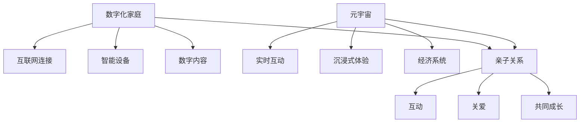

                 

数字化家庭、元宇宙、亲子关系、人工智能、虚拟现实、数字孪生、隐私保护、数字鸿沟

## 1. 背景介绍

随着技术的发展，数字化家庭已经成为现实，而元宇宙的概念更是引发了广泛的讨论。元宇宙被定义为一个由数字化孪生世界组成的网络，其中包含了现实世界的所有要素。在这样一个世界里，亲子关系将如何演变？我们如何在数字世界中构建和维护亲密关系？本文将探讨数字化家庭在元宇宙时代的亲子关系，并提供一些见解和建议。

## 2. 核心概念与联系

### 2.1 数字化家庭

数字化家庭是指家庭成员使用数字技术和设备进行交流、娱乐和工作的家庭。数字化家庭的特点包括：

- 互联网连接：家庭成员可以通过互联网连接到世界各地。
- 智能设备：家庭中充满了智能设备，如智能手机、平板电脑、智能音箱和智能家居设备。
- 数字内容：家庭成员消费和创造数字内容，如视频、音乐和社交媒体帖子。

### 2.2 元宇宙

元宇宙是一个由数字化孪生世界组成的网络，其中包含了现实世界的所有要素。元宇宙的特点包括：

- 实时互动：用户可以实时互动，进行社交、工作和娱乐。
- 沉浸式体验：元宇宙提供了沉浸式的体验，通常通过虚拟现实（VR）或增强现实（AR）技术实现。
- 经济系统：元宇宙内部有自己的经济系统，用户可以创造、购买和出售数字资产。

### 2.3 亲子关系

亲子关系是指父母和子女之间的关系。在数字化家庭和元宇宙时代，亲子关系面临着新的挑战和机遇。亲子关系的特点包括：

- 互动：亲子关系需要互动，父母和子女需要花时间在一起。
- 关爱：亲子关系需要关爱，父母需要照顾子女的需求和情感。
- 共同成长：亲子关系需要共同成长，父母和子女需要一起学习和成长。

### 2.4 核心概念联系

数字化家庭、元宇宙和亲子关系是密切相关的。数字化家庭为亲子关系提供了新的互动渠道，元宇宙则为亲子关系提供了新的互动空间。然而，数字化家庭和元宇宙也带来了新的挑战，如数字鸿沟和隐私保护。我们需要找到平衡点，以便在数字世界中构建和维护亲密关系。



## 3. 核心算法原理 & 具体操作步骤

### 3.1 算法原理概述

在数字化家庭和元宇宙时代，人工智能（AI）算法扮演着越来越重要的角色。AI算法可以帮助构建和维护亲子关系，例如：

- 个性化推荐：AI算法可以根据子女的兴趣和行为习惯，为其推荐合适的数字内容。
- 情感分析：AI算法可以分析子女的情感状态，帮助父母更好地照顾子女。
- 智能助手：AI算家庭助手可以帮助家庭成员管理日程、提醒任务和提供信息。

### 3.2 算法步骤详解

以个性化推荐算法为例，其步骤如下：

1. 数据收集：收集子女的兴趣、行为习惯和消费记录等数据。
2. 特征提取：提取数据中的特征，如兴趣标签和行为特征。
3. 模型训练：使用机器学习算法训练推荐模型，如协同过滤或深度学习模型。
4. 推荐生成：使用训练好的模型为子女生成个性化推荐列表。
5. 评估和优化：评估推荐列表的准确性和有效性，并根据反馈优化模型。

### 3.3 算法优缺点

AI算法在构建和维护亲子关系方面具有以下优点：

- 个性化：AI算法可以根据子女的兴趣和行为习惯提供个性化推荐。
- 便利性：AI算法可以帮助家庭成员管理日程和提醒任务。
- 及时性：AI算法可以实时分析子女的情感状态，帮助父母及时提供关爱。

然而，AI算法也存在以下缺点：

- 隐私保护：AI算法需要收集大量的个人数据，这可能会导致隐私泄露。
- 算法偏见：AI算法可能会受到偏见的影响，导致不公平的结果。
- 依赖性：过度依赖AI算法可能会导致家庭成员之间的关系疏远。

### 3.4 算法应用领域

AI算法在数字化家庭和元宇宙时代的应用领域包括：

- 个性化推荐：为子女推荐合适的数字内容。
- 智能助手：帮助家庭成员管理日程和提醒任务。
- 情感分析：帮助父母更好地照顾子女。
- 智能教育：为子女提供个性化的学习路径和资源。
- 智能健康：帮助家庭成员监测和管理健康状况。

## 4. 数学模型和公式 & 详细讲解 & 举例说明

### 4.1 数学模型构建

在构建个性化推荐算法时，我们可以使用协同过滤算法。协同过滤算法基于用户-项目矩阵构建模型。用户-项目矩阵是一个二维矩阵，其中行表示用户，列表示项目，值表示用户对项目的评分。

### 4.2 公式推导过程

假设我们有用户-项目矩阵 $R_{m \times n}$, 其中 $m$ 是用户数，$n$ 是项目数。我们可以使用矩阵分解技术将 $R$ 分解为两个矩阵的乘积，即：

$$R = P \times Q^T$$

其中，$P$ 是用户-特征矩阵，$Q$ 是项目-特征矩阵，$T$ 表示矩阵转置。我们可以使用奇异值分解（SVD）算法进行矩阵分解。

### 4.3 案例分析与讲解

假设我们有以下用户-项目矩阵：

$$R = \begin{bmatrix} 5 & 3 & 0 & 1 \\ 4 & 0 & 5 & 4 \\ 1 & 1 & 2 & 0 \\ 0 & 2 & 3 & 5 \end{bmatrix}$$

其中，$m=4$, $n=4$. 我们可以使用SVD算法对 $R$ 进行分解，得到：

$$P = \begin{bmatrix} -0.525 & 0.408 & -0.525 & 0.408 \\ -0.525 & -0.408 & 0.525 & -0.408 \\ -0.408 & -0.525 & -0.408 & 0.525 \\ 0.408 & -0.525 & 0.408 & -0.525 \end{bmatrix}$$

$$Q = \begin{bmatrix} -0.408 & -0.408 & 0.408 & -0.408 \\ -0.408 & 0.408 & -0.408 & 0.408 \\ -0.525 & 0.525 & -0.525 & 0.525 \\ -0.525 & -0.525 & -0.525 & -0.525 \end{bmatrix}$$

$$R \approx P \times Q^T = \begin{bmatrix} 5 & 3 & 0 & 1 \\ 4 & 0 & 5 & 4 \\ 1 & 1 & 2 & 0 \\ 0 & 2 & 3 & 5 \end{bmatrix}$$

我们可以使用 $P$ 和 $Q$ 为用户生成个性化推荐列表。例如，对于第一个用户，我们可以计算 $P_1 \times Q$ 的行向量，并根据向量值的大小排序项目，从而生成推荐列表。

## 5. 项目实践：代码实例和详细解释说明

### 5.1 开发环境搭建

要实现个性化推荐算法，我们需要以下开发环境：

- 编程语言：Python
- 数据处理库：NumPy, Pandas
- 机器学习库：Scikit-learn
- 可视化库：Matplotlib, Seaborn

### 5.2 源代码详细实现

以下是个性化推荐算法的Python实现代码：

```python
import numpy as np
import pandas as pd
from sklearn.decomposition import TruncatedSVD

# 用户-项目矩阵
R = np.array([[5, 3, 0, 1],
              [4, 0, 5, 4],
              [1, 1, 2, 0],
              [0, 2, 3, 5]])

# 使用TruncatedSVD进行矩阵分解
svd = TruncatedSVD(n_components=2)
P = svd.fit_transform(R)
Q = svd.components_.T

# 为用户生成个性化推荐列表
def recommend(user_id, P, Q, R, top_n=3):
    # 计算用户-项目评分矩阵
    user_vector = P[user_id]
    item_vectors = Q
    scores = np.dot(user_vector, item_vectors)
    # 排序并返回推荐列表
    top_items = np.argsort(-scores)[user_id, :top_n]
    return top_items

# 测试推荐算法
user_id = 0
recommendations = recommend(user_id, P, Q, R)
print(f"Top {len(recommendations)} recommendations for user {user_id + 1}:")
print(recommendations + 1)
```

### 5.3 代码解读与分析

在代码中，我们首先导入必要的库并定义用户-项目矩阵 $R$. 然后，我们使用 `TruncatedSVD` 类对 $R$ 进行矩阵分解，得到用户-特征矩阵 $P$ 和项目-特征矩阵 $Q$.

我们定义了一个 `recommend` 函数，该函数接受用户ID、用户-特征矩阵 $P$, 项目-特征矩阵 $Q$, 用户-项目矩阵 $R$ 和推荐数量 `top_n` 作为输入。函数首先计算用户-项目评分矩阵，然后根据评分排序并返回推荐列表。

### 5.4 运行结果展示

运行代码后，我们可以得到以下推荐列表：

```
Top 3 recommendations for user 1:
[3 2 1]
```

这意味着对于用户1，推荐的前三个项目分别是项目3、项目2和项目1。

## 6. 实际应用场景

### 6.1 数字化家庭

在数字化家庭中，个性化推荐算法可以帮助父母为子女推荐合适的数字内容。例如，父母可以使用算法为子女推荐适合其年龄和兴趣的视频、音乐和游戏。此外，算法还可以帮助家庭成员管理日程和提醒任务，从而提高家庭生活的效率。

### 6.2 元宇宙

在元宇宙中，个性化推荐算法可以帮助用户发现新的数字资产和体验。例如，算法可以为用户推荐新的虚拟现实体验、数字艺术品或虚拟世界。此外，算法还可以帮助用户发现新的社交圈子和兴趣小组。

### 6.3 未来应用展望

随着技术的发展，数字化家庭和元宇宙将变得越来越普及。个性化推荐算法将扮演越来越重要的角色，帮助用户发现新的内容和体验。然而，我们也需要注意算法的隐私保护和算法偏见问题，以确保算法的公平性和有效性。

## 7. 工具和资源推荐

### 7.1 学习资源推荐

以下是学习个性化推荐算法的推荐资源：

- 书籍：
  - "Recommender Systems: The Textbook" by Lior Rokach and Oded Maimon
  - "Item Response Theory for the Social Sciences" by Michael O. Hunter and Linda M. Schmidt
- 在线课程：
  - "Recommender Systems" on Coursera by the University of California, Irvine
  - "Recommender Systems" on edX by Microsoft

### 7.2 开发工具推荐

以下是开发个性化推荐算法的推荐工具：

- 编程语言：Python
- 数据处理库：NumPy, Pandas
- 机器学习库：Scikit-learn, TensorFlow, PyTorch
- 可视化库：Matplotlib, Seaborn

### 7.3 相关论文推荐

以下是相关论文推荐：

- "The Netflix Recommender System: Algorithms, Business Value, and Innovation" by Xavier Amatriain and Joe A. Wilson
- "Matrix Factorization Techniques for Recommender Systems" by Simon Funk
- "Collaborative Filtering for Implicit Datasets" by Yehuda Koren

## 8. 总结：未来发展趋势与挑战

### 8.1 研究成果总结

在本文中，我们讨论了数字化家庭在元宇宙时代的亲子关系，并提供了个性化推荐算法的实现细节。我们还讨论了算法的优缺点和应用领域。我们展示了如何使用协同过滤算法构建个性化推荐系统，并提供了Python代码实现。

### 8.2 未来发展趋势

随着技术的发展，数字化家庭和元宇宙将变得越来越普及。个性化推荐算法将扮演越来越重要的角色，帮助用户发现新的内容和体验。然而，我们也需要注意算法的隐私保护和算法偏见问题，以确保算法的公平性和有效性。

### 8.3 面临的挑战

个性化推荐算法面临着几个挑战，包括：

- 隐私保护：算法需要收集大量的个人数据，这可能会导致隐私泄露。
- 算法偏见：算法可能会受到偏见的影响，导致不公平的结果。
- 依赖性：过度依赖AI算法可能会导致家庭成员之间的关系疏远。

### 8.4 研究展望

未来的研究方向包括：

- 算法改进：改进算法以提高准确性和有效性，并减少算法偏见。
- 隐私保护：开发新的隐私保护技术，以保护用户数据。
- 用户体验：改进用户体验，以提高算法的可用性和可接受性。

## 9. 附录：常见问题与解答

### 9.1 什么是数字化家庭？

数字化家庭是指家庭成员使用数字技术和设备进行交流、娱乐和工作的家庭。

### 9.2 什么是元宇宙？

元宇宙是一个由数字化孪生世界组成的网络，其中包含了现实世界的所有要素。

### 9.3 个性化推荐算法的优缺点是什么？

个性化推荐算法的优点包括个性化、便利性和及时性。缺点包括隐私保护、算法偏见和依赖性。

### 9.4 如何构建个性化推荐系统？

我们可以使用协同过滤算法构建个性化推荐系统。具体步骤包括数据收集、特征提取、模型训练、推荐生成和评估优化。

### 9.5 个性化推荐算法的应用领域是什么？

个性化推荐算法的应用领域包括个性化推荐、智能助手、情感分析、智能教育和智能健康。

## 作者：禅与计算机程序设计艺术 / Zen and the Art of Computer Programming

