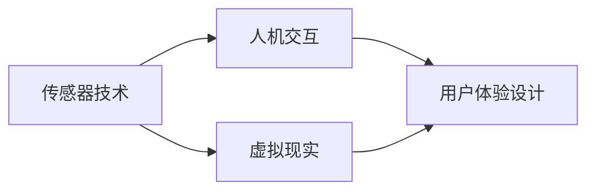

                 

数字化触觉、艺术创业、新型感官体验、创作平台、传感器技术、人机交互、虚拟现实、机器学习、用户体验设计

## 1. 背景介绍

随着技术的发展，数字化技术已经渗透到我们的日常生活中，从通信、娱乐到工作，数字化技术无处不在。然而，在感官体验方面，我们仍然主要依赖于传统的物理接触。数字化触觉技术的发展为我们提供了一个全新的机遇，使我们能够创造出新型的感官体验，从而开创数字化触觉艺术创业的新局面。

## 2. 核心概念与联系

数字化触觉技术旨在模拟人类的触觉感知，为用户提供更加真实的数字化体验。其核心概念包括传感器技术、人机交互、虚拟现实等。下面是这些概念的关系图：



## 3. 核心算法原理 & 具体操作步骤

### 3.1 算法原理概述

数字化触觉技术的核心是模拟人类的触觉感知。这需要对物理世界的触觉信息进行采集、处理和渲染。常用的算法包括机器学习算法、物理模拟算法等。

### 3.2 算法步骤详解

数字化触觉技术的算法步骤通常包括以下几个阶段：

1. 信息采集：使用传感器技术采集物理世界的触觉信息，如压力、温度、振动等。
2. 信息处理：使用机器学习算法对采集到的信息进行处理，提取有用的特征信息。
3. 信息渲染：使用物理模拟算法将处理后的信息渲染到虚拟环境中，为用户提供真实的触觉体验。

### 3.3 算法优缺点

数字化触觉技术的算法优点包括：

* 可以为用户提供更加真实的数字化体验。
* 可以扩展人类的感官能力，使其能够感知到物理世界无法感知的信息。
* 可以为远程操作提供更好的用户体验。

其缺点包括：

* 算法复杂度高，计算量大。
* 算法的准确性受到传感器技术的限制。
* 算法的实时性受到计算资源的限制。

### 3.4 算法应用领域

数字化触觉技术的算法应用领域包括：

* 远程操作：为远程操作提供更好的用户体验。
* 虚拟现实：为虚拟现实提供更加真实的触觉体验。
* 机器人技术：为机器人提供更好的触觉感知能力。
* 医疗技术：为医疗技术提供更好的触觉反馈。

## 4. 数学模型和公式 & 详细讲解 & 举例说明

### 4.1 数学模型构建

数字化触觉技术的数学模型通常是基于物理模型构建的。物理模型描述了物理世界的规律，数学模型则是对物理模型的数学描述。常用的数学模型包括弹性模型、流体模型等。

### 4.2 公式推导过程

数学模型的公式推导过程通常是基于物理模型的基本假设和定律推导出来的。例如，弹性模型的公式推导过程如下：

1. 假设物体是弹性的，即物体受到外力后会发生形变，但形变是可逆的。
2. 根据 Hooke 的定律，物体的形变量与外力的大小成正比。
3. 根据牛顿第二定律，物体的加速度与外力的大小成正比。
4. 结合上述两个定律，可以推导出弹性模型的公式：$$F = kx$$，其中$$F$$是外力，$$k$$是弹性系数，$$x$$是形变量。

### 4.3 案例分析与讲解

例如，在虚拟现实技术中，数字化触觉技术常用于模拟物体的触觉。假设我们要模拟一个弹性物体的触觉，我们可以使用弹性模型来描述物体的形变。具体过程如下：

1. 使用传感器技术采集用户的触摸信息，如压力信息。
2. 根据弹性模型的公式$$F = kx$$，计算出物体的形变量$$x$$。
3. 根据形变量$$x$$，渲染出物体的形变效果，为用户提供真实的触觉体验。

## 5. 项目实践：代码实例和详细解释说明

### 5.1 开发环境搭建

数字化触觉技术的开发环境通常包括传感器硬件、计算平台和渲染平台。常用的传感器硬件包括压力传感器、温度传感器等。常用的计算平台包括PC、单片机等。常用的渲染平台包括虚拟现实头盔、触摸屏等。

### 5.2 源代码详细实现

下面是一个简单的数字化触觉技术的代码实例，该实例模拟了一个弹性物体的触觉：

```c
#include <stdio.h>

#define K 10 // 弹性系数

int main() {
    float F, x; // F为外力，x为形变量

    printf("请输入外力F：");
    scanf("%f", &F);

    x = F / K; // 计算形变量

    printf("形变量x为：%f\n", x);

    return 0;
}
```

### 5.3 代码解读与分析

该代码实现了弹性模型的公式$$F = kx$$，计算出物体的形变量$$x$$。其中，$$F$$是外力，$$k$$是弹性系数，$$x$$是形变量。用户输入外力$$F$$后，代码计算出形变量$$x$$，并输出结果。

### 5.4 运行结果展示

运行该代码后，用户输入外力$$F$$后，代码会计算出形变量$$x$$，并输出结果。例如，输入外力$$F = 10$$后，输出形变量$$x = 1.000000$$。

## 6. 实际应用场景

### 6.1 当前应用场景

数字化触觉技术当前的应用场景包括：

* 远程操作：为远程操作提供更好的用户体验。
* 虚拟现实：为虚拟现实提供更加真实的触觉体验。
* 机器人技术：为机器人提供更好的触觉感知能力。
* 医疗技术：为医疗技术提供更好的触觉反馈。

### 6.2 未来应用展望

数字化触觉技术的未来应用展望包括：

* 远程医疗：为远程医疗提供更好的触觉反馈，从而提高医疗质量。
* 远程教育：为远程教育提供更好的互动体验，从而提高学习效果。
* 远程娱乐：为远程娱乐提供更好的互动体验，从而提高娱乐质量。
* 智能家居：为智能家居提供更好的触觉反馈，从而提高居住质量。

## 7. 工具和资源推荐

### 7.1 学习资源推荐

数字化触觉技术的学习资源包括：

* 书籍：《数字化触觉技术》《虚拟现实技术》《机器人技术》等。
* 在线课程： Coursera、Udacity、edX 等平台上的相关课程。
* 学术期刊：IEEE Transactions on Haptics、ACM Transactions on Graphics 等。

### 7.2 开发工具推荐

数字化触觉技术的开发工具包括：

* 传感器硬件：各种传感器模块、传感器开发板等。
* 计算平台：各种单片机、PC、服务器等。
* 渲染平台：各种虚拟现实头盔、触摸屏等。
* 开发平台：各种开发平台、开发框架等。

### 7.3 相关论文推荐

数字化触觉技术的相关论文包括：

* [Haptic Rendering of Virtual Objects](https://ieeexplore.ieee.org/document/4236144)
* [Haptic Feedback for Virtual Reality](https://ieeexplore.ieee.org/document/7046164)
* [Haptic Interfaces for Medical Applications](https://ieeexplore.ieee.org/document/4490242)

## 8. 总结：未来发展趋势与挑战

### 8.1 研究成果总结

数字化触觉技术的研究成果包括：

* 传感器技术的发展，使得数字化触觉技术能够采集到更加准确的触觉信息。
* 机器学习算法的发展，使得数字化触觉技术能够处理更加复杂的触觉信息。
* 物理模拟算法的发展，使得数字化触觉技术能够渲染出更加真实的触觉体验。

### 8.2 未来发展趋势

数字化触觉技术的未来发展趋势包括：

* 传感器技术的进一步发展，使得数字化触觉技术能够采集到更加丰富的触觉信息。
* 机器学习算法的进一步发展，使得数字化触觉技术能够处理更加复杂的触觉信息。
* 物理模拟算法的进一步发展，使得数字化触觉技术能够渲染出更加真实的触觉体验。
* 数字化触觉技术与其他技术的结合，如虚拟现实技术、人工智能技术等，从而开创新的应用领域。

### 8.3 面临的挑战

数字化触觉技术面临的挑战包括：

* 传感器技术的限制，使得数字化触觉技术无法采集到更加丰富的触觉信息。
* 机器学习算法的复杂性，使得数字化触觉技术无法处理更加复杂的触觉信息。
* 物理模拟算法的计算量，使得数字化触觉技术无法渲染出更加真实的触觉体验。
* 数字化触觉技术与其他技术的结合，使得数字化触觉技术需要面对更加复杂的系统集成问题。

### 8.4 研究展望

数字化触觉技术的研究展望包括：

* 传感器技术的进一步发展，使得数字化触觉技术能够采集到更加丰富的触觉信息。
* 机器学习算法的进一步发展，使得数字化触觉技术能够处理更加复杂的触觉信息。
* 物理模拟算法的进一步发展，使得数字化触觉技术能够渲染出更加真实的触觉体验。
* 数字化触觉技术与其他技术的结合，如虚拟现实技术、人工智能技术等，从而开创新的应用领域。

## 9. 附录：常见问题与解答

### 9.1 什么是数字化触觉技术？

数字化触觉技术是一种模拟人类触觉感知的技术，其目的是为用户提供更加真实的数字化体验。

### 9.2 数字化触觉技术的核心概念是什么？

数字化触觉技术的核心概念包括传感器技术、人机交互、虚拟现实等。

### 9.3 数字化触觉技术的算法原理是什么？

数字化触觉技术的算法原理包括机器学习算法、物理模拟算法等。

### 9.4 数字化触觉技术的数学模型是什么？

数字化触觉技术的数学模型通常是基于物理模型构建的，常用的数学模型包括弹性模型、流体模型等。

### 9.5 数字化触觉技术的应用领域是什么？

数字化触觉技术的应用领域包括远程操作、虚拟现实、机器人技术、医疗技术等。

### 9.6 数字化触觉技术的未来发展趋势是什么？

数字化触觉技术的未来发展趋势包括传感器技术的进一步发展、机器学习算法的进一步发展、物理模拟算法的进一步发展、数字化触觉技术与其他技术的结合等。

### 9.7 数字化触觉技术面临的挑战是什么？

数字化触觉技术面临的挑战包括传感器技术的限制、机器学习算法的复杂性、物理模拟算法的计算量、数字化触觉技术与其他技术的结合等。

### 9.8 数字化触觉技术的研究展望是什么？

数字化触觉技术的研究展望包括传感器技术的进一步发展、机器学习算法的进一步发展、物理模拟算法的进一步发展、数字化触觉技术与其他技术的结合等。

## 作者：禅与计算机程序设计艺术 / Zen and the Art of Computer Programming

