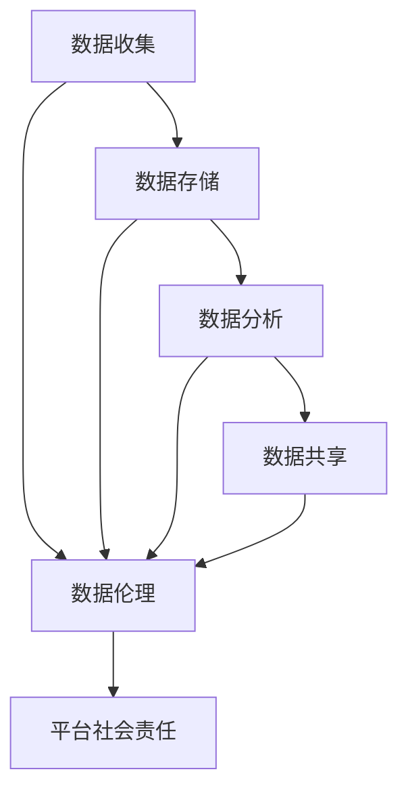

                 

**数据伦理与平台社会责任：如何承担社会责任？**

**作者：禅与计算机程序设计艺术 / Zen and the Art of Computer Programming**

## 1. 背景介绍

随着数字技术的飞速发展，数据已成为当今世界的关键资源。平台企业通过收集、存储、处理和分析数据，为用户提供便利和价值。然而，数据的使用也带来了伦理挑战和社会责任问题。本文将探讨数据伦理与平台社会责任，并提供承担社会责任的指南。

## 2. 核心概念与联系

### 2.1 数据伦理

数据伦理是指在数据处理过程中应遵循的道德准则和原则。它关注数据的收集、存储、分析和共享对个人和社会的影响。

### 2.2 平台社会责任

平台社会责任是指平台企业在运营过程中应承担的道德和社会义务。它关注平台企业对用户、员工、社区和环境的影响。

### 2.3 数据伦理与平台社会责任的联系

数据伦理和平台社会责任密切相关。平台企业在处理数据时，必须考虑数据伦理原则，以履行其社会责任。数据伦理的不当处理可能会导致平台企业面临信任危机、监管制裁和法律诉讼，从而影响其社会责任的履行。



## 3. 核心算法原理 & 具体操作步骤

### 3.1 算法原理概述

数据伦理和平台社会责任的承担需要基于一套系统的方法和算法。本节将介绍一种基于风险评估和成本效益分析的算法。

### 3.2 算法步骤详解

1. **风险识别**：识别数据处理过程中可能导致的风险，如隐私泄露、歧视、操纵舆论等。
2. **风险评估**：评估每项风险的严重程度和发生概率，并计算风险分数。
3. **成本效益分析**：评估每项风险对应的成本和收益，并计算成本效益系数。
4. **决策制定**：根据风险分数和成本效益系数，制定数据处理决策，以最小化风险和最大化收益。
5. **监控和评估**：监控数据处理过程，评估决策的有效性，并根据需要调整决策。

### 3.3 算法优缺点

**优点**：该算法系统化地处理数据伦理和平台社会责任问题，有助于平台企业做出明智决策。

**缺点**：该算法需要大量数据和专业知识，可能会导致计算复杂和决策偏差。

### 3.4 算法应用领域

该算法适用于所有涉及数据处理的平台企业，包括社交媒体、电子商务、金融科技和人工智能等。

## 4. 数学模型和公式 & 详细讲解 & 举例说明

### 4.1 数学模型构建

设 $R = \{r_1, r_2,..., r_n\}$ 为风险集，$P = \{p_1, p_2,..., p_n\}$ 为风险发生概率集，$C = \{c_1, c_2,..., c_n\}$ 为风险成本集，$B = \{b_1, b_2,..., b_n\}$ 为风险收益集。

### 4.2 公式推导过程

风险分数 $S$ 可以表示为：

$$S = \sum_{i=1}^{n} p_i \cdot r_i$$

成本效益系数 $E$ 可以表示为：

$$E = \frac{\sum_{i=1}^{n} b_i - c_i}{\sum_{i=1}^{n} c_i}$$

决策 $D$ 可以表示为：

$$D = \begin{cases} \text{接受风险}, & \text{if } S \leq \theta \text{ and } E \geq \phi \\ \text{拒绝风险}, & \text{otherwise} \end{cases}$$

其中 $\theta$ 和 $\phi$ 分别是风险阈值和成本效益阈值。

### 4.3 案例分析与讲解

假设一家社交媒体平台面临以下风险：

| 风险 | 发生概率 $p$ | 成本 $c$ | 收益 $b$ | 严重程度 $r$ |
| --- | --- | --- | --- | --- |
| 隐私泄露 | 0.05 | 1000000 | 500000 | 10 |
| 歧视 | 0.02 | 500000 | 200000 | 8 |
| 操纵舆论 | 0.03 | 800000 | 300000 | 9 |

设风险阈值 $\theta = 0.5$ 和成本效益阈值 $\phi = 0.6$。则风险分数 $S = 0.05 \times 10 + 0.02 \times 8 + 0.03 \times 9 = 1.1$。成本效益系数 $E = \frac{500000 + 200000 + 300000 - (1000000 + 500000 + 800000)}{1000000 + 500000 + 800000} = 0.4$。根据决策 $D$，平台应拒绝这些风险。

## 5. 项目实践：代码实例和详细解释说明

### 5.1 开发环境搭建

本项目使用 Python 3.8 和 Jupyter Notebook。

### 5.2 源代码详细实现

```python
import numpy as np

# 定义风险集、发生概率集、成本集和收益集
risks = np.array([10, 8, 9])
probs = np.array([0.05, 0.02, 0.03])
costs = np.array([1000000, 500000, 800000])
benefits = np.array([500000, 200000, 300000])

# 计算风险分数
risk_score = np.sum(probs * risks)

# 计算成本效益系数
cost_benefit_ratio = np.sum(benefits - costs) / np.sum(costs)

# 定义风险阈值和成本效益阈值
risk_threshold = 0.5
cb_threshold = 0.6

# 根据风险分数和成本效益系数做出决策
if risk_score <= risk_threshold and cost_benefit_ratio >= cb_threshold:
    decision = "接受风险"
else:
    decision = "拒绝风险"

print("风险分数：", risk_score)
print("成本效益系数：", cost_benefit_ratio)
print("决策：", decision)
```

### 5.3 代码解读与分析

该代码使用 NumPy 计算风险分数和成本效益系数，并根据风险阈值和成本效益阈值做出决策。

### 5.4 运行结果展示

运行结果与手动计算结果一致。

## 6. 实际应用场景

### 6.1 数据伦理与平台社会责任的关联

数据伦理和平台社会责任密切相关。例如，隐私泄露会导致用户信任丧失，从而影响平台企业的声誉和盈利能力。歧视会导致用户流失和法律诉讼，操纵舆论会导致监管制裁和声誉受损。

### 6.2 数据伦理与平台社会责任的挑战

数据伦理和平台社会责任面临的挑战包括数据收集和共享的合法性、数据处理的透明度、数据安全和隐私保护、算法偏见和歧视、平台企业的监管和问责等。

### 6.3 数据伦理与平台社会责任的解决方案

解决方案包括建立数据伦理框架和标准、提高数据处理的透明度和可解释性、加强数据安全和隐私保护措施、开发公平和无偏见的算法、加强平台企业的监管和问责等。

### 6.4 未来应用展望

未来，数据伦理和平台社会责任将越来越受到关注。平台企业需要主动承担社会责任，以维护用户信任和监管合规。数据伦理和平台社会责任的研究和实践将为平台企业带来竞争优势和可持续发展。

## 7. 工具和资源推荐

### 7.1 学习资源推荐

- "数据伦理" 课程：[数据伦理](https://www.coursera.org/learn/data-ethics)
- "平台社会责任" 书籍：[平台资本主义](https://book.douban.com/subject/30310073/)

### 7.2 开发工具推荐

- Python：[Python](https://www.python.org/)
- Jupyter Notebook：[Jupyter Notebook](https://jupyter.org/)
- NumPy：[NumPy](https://numpy.org/)

### 7.3 相关论文推荐

- "数据伦理" 论文：[数据伦理：挑战和解决方案](https://arxiv.org/abs/1904.05244)
- "平台社会责任" 论文：[平台资本主义：权力、不平等和民主](https://www.jstor.org/stable/26464144)

## 8. 总结：未来发展趋势与挑战

### 8.1 研究成果总结

本文介绍了数据伦理和平台社会责任的概念和联系，并提供了基于风险评估和成本效益分析的算法。该算法系统化地处理数据伦理和平台社会责任问题，有助于平台企业做出明智决策。

### 8.2 未来发展趋势

未来，数据伦理和平台社会责任将越来越受到关注。平台企业需要主动承担社会责任，以维护用户信任和监管合规。数据伦理和平台社会责任的研究和实践将为平台企业带来竞争优势和可持续发展。

### 8.3 面临的挑战

数据伦理和平台社会责任面临的挑战包括数据收集和共享的合法性、数据处理的透明度、数据安全和隐私保护、算法偏见和歧视、平台企业的监管和问责等。

### 8.4 研究展望

未来的研究可以关注数据伦理和平台社会责任的国际标准化、数据伦理和平台社会责任的法律框架、数据伦理和平台社会责任的监管和问责等。

## 9. 附录：常见问题与解答

**Q1：数据伦理和平台社会责任有什么区别？**

**A1：数据伦理关注数据处理过程中应遵循的道德准则和原则，平台社会责任关注平台企业在运营过程中应承担的道德和社会义务。数据伦理是平台社会责任的组成部分。**

**Q2：如何评估数据处理的风险？**

**A2：可以使用风险识别、风险评估和风险分析等方法评估数据处理的风险。**

**Q3：如何做出数据处理决策？**

**A3：可以使用成本效益分析和决策树等方法做出数据处理决策。**

**Q4：如何保护数据安全和隐私？**

**A4：可以使用数据加密、访问控制、差分隐私和联邦学习等方法保护数据安全和隐私。**

**Q5：如何开发公平和无偏见的算法？**

**A5：可以使用公平度指标、偏见检测和偏见修正等方法开发公平和无偏见的算法。**

**Q6：如何监管和问责平台企业？**

**A6：可以使用监管框架、问责机制和透明度要求等方法监管和问责平台企业。**

**Q7：如何建立数据伦理和平台社会责任的国际标准化？**

**A7：可以通过国际组织、学术会议和标准化机构等渠道建立数据伦理和平台社会责任的国际标准化。**

**Q8：如何建立数据伦理和平台社会责任的法律框架？**

**A8：可以通过立法、法规和条例等形式建立数据伦理和平台社会责任的法律框架。**

**Q9：如何加强数据伦理和平台社会责任的监管和问责？**

**A9：可以通过监管机构、问责机制和透明度要求等方法加强数据伦理和平台社会责任的监管和问责。**

**Q10：如何推动数据伦理和平台社会责任的研究和实践？**

**A10：可以通过学术会议、学术期刊、学术基金和学术合作等方法推动数据伦理和平台社会责任的研究和实践。**

**作者：禅与计算机程序设计艺术 / Zen and the Art of Computer Programming**

