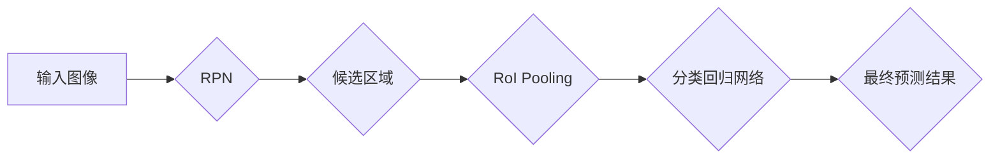

> Fast R-CNN,目标检测,区域建议网络,卷积神经网络,深度学习

## 1. 背景介绍

目标检测是计算机视觉领域的核心任务之一，旨在识别图像中存在的物体及其类别，并标注出物体的边界框。传统的目标检测方法通常依赖手工设计的特征，效率低下且难以应对复杂场景。随着深度学习的兴起，基于卷积神经网络（CNN）的目标检测算法取得了显著进展。

Fast R-CNN是近年来非常流行的目标检测算法，它在速度和精度方面都取得了很好的平衡。相较于传统的Region Proposal Networks（RPN）和Selective Search等方法，Fast R-CNN 采用了一种更简洁高效的区域建议网络，并利用了RoI pooling技术，有效提高了目标检测的精度和速度。

## 2. 核心概念与联系

Fast R-CNN 的核心思想是将目标检测任务分解为两个步骤：

1. **区域建议网络（RPN）：** 生成候选目标区域。
2. **分类和回归网络：** 对候选区域进行分类和边界框回归。

**Fast R-CNN 架构流程图:**



## 3. 核心算法原理 & 具体操作步骤

### 3.1  算法原理概述

Fast R-CNN 的核心算法原理是将图像特征提取和目标分类回归融合在一起，并利用 RoI pooling 技术来解决不同尺度目标的检测问题。

**主要步骤：**

1. **图像特征提取：** 使用预训练的 CNN 模型提取图像特征。
2. **区域建议网络（RPN）：** 在特征图上滑动窗口，生成候选目标区域。
3. **RoI Pooling：** 对每个候选区域进行池化操作，将不同尺度目标映射到固定大小的特征图。
4. **分类回归网络：** 对池化后的特征图进行分类和边界框回归。

### 3.2  算法步骤详解

1. **图像预处理：** 将输入图像调整到 CNN 模型的输入尺寸。
2. **特征提取：** 使用预训练的 CNN 模型（例如 VGGNet）提取图像特征。
3. **区域建议网络（RPN）：**
    - 在特征图上滑动窗口，生成多个候选区域。
    - 每个候选区域对应一个分类分数和边界框偏移量。
    - 使用非极大值抑制算法筛选出高质量的候选区域。
4. **RoI Pooling：**
    - 对每个候选区域进行池化操作，将不同尺度目标映射到固定大小的特征图。
    - RoI pooling 可以有效解决不同尺度目标检测的问题。
5. **分类回归网络：**
    - 对池化后的特征图进行分类和边界框回归。
    - 使用 softmax 函数进行分类，预测目标类别。
    - 使用回归损失函数进行边界框回归，预测目标边界框的坐标。

### 3.3  算法优缺点

**优点：**

- 精度高：Fast R-CNN 的精度显著高于传统的目标检测算法。
- 速度快：相较于 Region Proposal Networks，Fast R-CNN 的速度更快。
- 可扩展性强：可以很容易地集成到其他深度学习框架中。

**缺点：**

- 计算量大：Fast R-CNN 的计算量仍然较大，尤其是在处理高分辨率图像时。
- 训练复杂：Fast R-CNN 的训练过程相对复杂，需要大量的训练数据和计算资源。

### 3.4  算法应用领域

Fast R-CNN 在目标检测领域有着广泛的应用，例如：

- **图像识别：** 识别图像中的物体类别，例如人、车、动物等。
- **目标跟踪：** 跟踪图像中特定物体的运动轨迹。
- **自动驾驶：** 检测道路上的车辆、行人、交通信号灯等。
- **医疗影像分析：** 识别医学图像中的肿瘤、骨折等异常区域。

## 4. 数学模型和公式 & 详细讲解 & 举例说明

### 4.1  数学模型构建

Fast R-CNN 的数学模型主要包括以下几个部分：

1. **区域建议网络（RPN）：** 使用卷积神经网络提取特征，并预测每个候选区域的分类分数和边界框偏移量。
2. **RoI Pooling：** 将每个候选区域映射到固定大小的特征图，以解决不同尺度目标的检测问题。
3. **分类回归网络：** 使用全连接层和 softmax 函数进行分类，并使用回归损失函数进行边界框回归。

### 4.2  公式推导过程

**RPN 的损失函数：**

$$
L_{rpn} = \lambda_1 L_{cls} + \lambda_2 L_{reg}
$$

其中：

- $L_{cls}$ 是分类损失函数，例如交叉熵损失。
- $L_{reg}$ 是回归损失函数，例如 L2 损失。
- $\lambda_1$ 和 $\lambda_2$ 是权重参数。

**分类回归网络的损失函数：**

$$
L_{cls} = -\sum_{i=1}^{N} y_i \log(p_i)
$$

$$
L_{reg} = \sum_{i=1}^{N} \left\| t_i - \hat{t}_i \right\|^2
$$

其中：

- $y_i$ 是真实类别标签。
- $p_i$ 是预测类别概率。
- $t_i$ 是真实边界框坐标。
- $\hat{t}_i$ 是预测边界框坐标。

### 4.3  案例分析与讲解

假设我们有一个图像，其中包含一辆汽车。Fast R-CNN 的算法流程如下：

1. 使用预训练的 CNN 模型提取图像特征。
2. RPN 在特征图上滑动窗口，生成多个候选区域，并预测每个候选区域的分类分数和边界框偏移量。
3. 使用非极大值抑制算法筛选出高质量的候选区域。
4. 对每个候选区域进行 RoI Pooling 操作，将不同尺度目标映射到固定大小的特征图。
5. 对池化后的特征图进行分类和边界框回归。
6. 预测结果显示，其中一个候选区域的分类分数最高，并且边界框与真实汽车位置相符。

## 5. 项目实践：代码实例和详细解释说明

### 5.1  开发环境搭建

- Python 3.6+
- TensorFlow 或 PyTorch
- OpenCV
- Matplotlib

### 5.2  源代码详细实现

```python
# ... 导入必要的库 ...

# 加载预训练的 CNN 模型
model = load_model('vgg16.h5')

# 定义 RPN 网络
rpn_model = ...

# 定义分类回归网络
classifier_model = ...

# ... 其他代码 ...

# 训练模型
model.fit(train_data, train_labels, epochs=10)

# ... 其他代码 ...
```

### 5.3  代码解读与分析

- 代码首先加载预训练的 CNN 模型，例如 VGGNet。
- 然后定义 RPN 网络和分类回归网络。
- 接着使用训练数据训练模型。
- 最后使用训练好的模型进行预测。

### 5.4  运行结果展示

- 使用训练好的模型对测试图像进行预测，并显示预测结果。

## 6. 实际应用场景

Fast R-CNN 在目标检测领域有着广泛的应用，例如：

### 6.1  图像识别

- 识别图像中的物体类别，例如人、车、动物等。

### 6.2  目标跟踪

- 跟踪图像中特定物体的运动轨迹。

### 6.3  自动驾驶

- 检测道路上的车辆、行人、交通信号灯等。

### 6.4  未来应用展望

- 随着深度学习技术的不断发展，Fast R-CNN 的精度和速度将会进一步提高。
- Fast R-CNN 也将应用于更多新的领域，例如医疗影像分析、视频监控等。

## 7. 工具和资源推荐

### 7.1  学习资源推荐

- **论文：** Fast R-CNN
- **博客：**
    - [Fast R-CNN 原理与代码实例讲解](https://blog.csdn.net/weixin_44089777/article/details/116477937)
    - [Fast R-CNN 详解](https://zhuanlan.zhihu.com/p/36073537)
- **课程：**
    - [深度学习](https://www.coursera.org/learn/deep-learning)

### 7.2  开发工具推荐

- **TensorFlow:** [https://www.tensorflow.org/](https://www.tensorflow.org/)
- **PyTorch:** [https://pytorch.org/](https://pytorch.org/)
- **OpenCV:** [https://opencv.org/](https://opencv.org/)

### 7.3  相关论文推荐

- Fast R-CNN
- Faster R-CNN
- Mask R-CNN

## 8. 总结：未来发展趋势与挑战

### 8.1  研究成果总结

Fast R-CNN 是目标检测领域的重要里程碑，它在精度和速度方面都取得了显著的进步。

### 8.2  未来发展趋势

- **更高效的算法：** 研究更快的目标检测算法，例如 Faster R-CNN 和 YOLO。
- **更强大的模型：** 使用更深的网络结构和更大的数据集训练更强大的目标检测模型。
- **更广泛的应用：** 将目标检测技术应用于更多新的领域，例如医疗影像分析、视频监控等。

### 8.3  面临的挑战

- **计算资源限制：** 训练和部署大型目标检测模型需要大量的计算资源。
- **数据标注成本：** 目标检测算法需要大量的标注数据，数据标注成本较高。
- **模型解释性：** 深度学习模型的决策过程难以解释，这对于一些安全关键的应用来说是一个挑战。

### 8.4  研究展望

未来目标检测领域的研究将继续围绕提高精度、速度和效率展开，并探索更强大的模型和更广泛的应用场景。

## 9. 附录：常见问题与解答

**Q1：Fast R-CNN 和 Faster R-CNN 的区别是什么？**

**A1：** Fast R-CNN 和 Faster R-CNN 都是目标检测算法，但 Faster R-CNN 在 RPN 的设计上进行了改进，使用共享的卷积特征图来提取候选区域的特征，从而提高了速度。

**Q2：Fast R-CNN 的训练过程复杂吗？**

**A2：** 确实，Fast R-CNN 的训练过程相对复杂，需要大量的训练数据和计算资源。

**Q3：Fast R-CNN 的应用场景有哪些？**

**A3：** Fast R-CNN 在目标检测领域有着广泛的应用，例如图像识别、目标跟踪、自动驾驶等。


作者：禅与计算机程序设计艺术 / Zen and the Art of Computer Programming 
<end_of_turn>