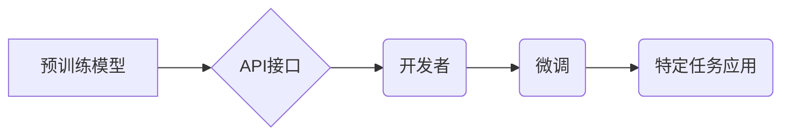

> OpenAI, API, 语言模型, 机器学习, 自然语言处理, 应用程序开发, 创新应用

## 1. 背景介绍

近年来，人工智能（AI）技术取得了飞速发展，特别是深度学习的突破，使得自然语言处理（NLP）领域取得了显著进展。OpenAI作为一家领先的AI研究机构，致力于推动通用人工智能的开发，并通过其开放的API，让开发者能够轻松地利用强大的AI模型构建创新应用。

OpenAI Models API提供了一系列预训练的语言模型，例如GPT-3、DALL-E 2等，这些模型经过海量文本和图像数据的训练，具备强大的文本生成、图像生成、翻译、问答等能力。开发者可以通过API接口调用这些模型，无需自己训练模型，即可快速构建出具有AI能力的应用程序。

## 2. 核心概念与联系

OpenAI Models API的核心概念包括：

* **预训练模型:** OpenAI训练了大量的语言模型，这些模型已经具备了基本的语言理解和生成能力，开发者可以利用这些预训练模型作为基础，进行特定任务的微调。
* **API接口:** OpenAI提供了完善的API接口，开发者可以通过API发送请求，调用预训练模型进行文本生成、图像生成、翻译等操作。
* **微调:** 开发者可以根据自己的特定任务，对预训练模型进行微调，使其在特定领域表现更优。

**Mermaid 流程图:**



## 3. 核心算法原理 & 具体操作步骤

### 3.1  算法原理概述

OpenAI Models API主要基于Transformer架构，Transformer是一种新型的神经网络架构，能够有效地处理序列数据，例如文本和图像。Transformer的核心组件是注意力机制，注意力机制能够让模型关注输入序列中最重要的部分，从而提高模型的理解和生成能力。

### 3.2  算法步骤详解

1. **输入处理:** 将输入文本或图像转换为模型可以理解的格式，例如词嵌入或像素矩阵。
2. **编码:** 使用Transformer编码器将输入序列编码成隐藏状态，隐藏状态包含了输入序列的语义信息。
3. **解码:** 使用Transformer解码器根据隐藏状态生成输出序列，例如文本或图像。
4. **输出处理:** 将输出序列转换为人类可读的格式。

### 3.3  算法优缺点

**优点:**

* 强大的文本生成和理解能力
* 能够处理长序列数据
* 训练效率高

**缺点:**

* 计算资源需求高
* 训练数据量大
* 容易出现偏差

### 3.4  算法应用领域

* **文本生成:** 写作、翻译、摘要、对话系统
* **图像生成:** 图片合成、图像编辑、艺术创作
* **语音识别:** 语音转文本
* **机器翻译:** 语言翻译

## 4. 数学模型和公式 & 详细讲解 & 举例说明

### 4.1  数学模型构建

OpenAI Models API基于Transformer架构，其核心是注意力机制和多头注意力机制。

**注意力机制:**

注意力机制允许模型关注输入序列中最重要的部分，并根据其重要性分配不同的权重。注意力机制的公式如下：

$$
Attention(Q, K, V) = softmax(\frac{QK^T}{\sqrt{d_k}})V
$$

其中：

* $Q$：查询矩阵
* $K$：键矩阵
* $V$：值矩阵
* $d_k$：键向量的维度
* $softmax$：softmax函数

**多头注意力机制:**

多头注意力机制将注意力机制应用于多个不同的子空间，从而能够捕捉到不同层次的语义信息。多头注意力机制的公式如下：

$$
MultiHead(Q, K, V) = Concat(head_1, head_2, ..., head_h)W_o
$$

其中：

* $head_i$：第 $i$ 个注意力头的输出
* $h$：注意力头的数量
* $W_o$：最终输出的权重矩阵

### 4.2  公式推导过程

注意力机制的公式推导过程可以参考相关文献，例如Vaswani et al. (2017)的论文《Attention Is All You Need》。

### 4.3  案例分析与讲解

例如，在机器翻译任务中，注意力机制可以帮助模型关注源语言中与目标语言单词相关的部分，从而提高翻译的准确性。

## 5. 项目实践：代码实例和详细解释说明

### 5.1  开发环境搭建

* Python 3.7+
* OpenAI API密钥
* pip install openai

### 5.2  源代码详细实现

```python
import openai

# 设置OpenAI API密钥
openai.api_key = "YOUR_API_KEY"

# 定义文本生成任务
prompt = "写一篇关于人工智能的文章。"

# 调用OpenAI API进行文本生成
response = openai.Completion.create(
    engine="text-davinci-003",
    prompt=prompt,
    max_tokens=200,
    temperature=0.7
)

# 打印生成文本
print(response.choices[0].text)
```

### 5.3  代码解读与分析

* `openai.api_key = "YOUR_API_KEY"`：设置OpenAI API密钥，用于授权访问API。
* `openai.Completion.create()`：调用OpenAI API的文本生成接口。
* `engine="text-davinci-003"`：指定使用的模型，这里使用的是text-davinci-003模型。
* `prompt=prompt`：设置文本生成任务的提示信息。
* `max_tokens=200`：设置生成的文本长度上限。
* `temperature=0.7`：设置文本生成的随机性，温度值越高，生成的文本越随机。

### 5.4  运行结果展示

运行代码后，将输出一篇关于人工智能的文章。

## 6. 实际应用场景

OpenAI Models API在各个领域都有广泛的应用场景，例如：

* **聊天机器人:** 开发更智能、更自然的聊天机器人，能够理解用户的意图并提供更精准的回复。
* **内容创作:** 自动生成文章、故事、诗歌等内容，提高内容创作效率。
* **代码生成:** 根据自然语言描述自动生成代码，简化开发流程。
* **数据分析:** 分析文本数据，提取关键信息，进行数据挖掘。

### 6.4  未来应用展望

随着人工智能技术的不断发展，OpenAI Models API的应用场景将更加广泛，例如：

* **个性化教育:** 根据学生的学习情况，提供个性化的学习内容和辅导。
* **医疗诊断:** 辅助医生进行疾病诊断，提高诊断准确率。
* **科学研究:** 加速科学研究的进程，例如药物研发、材料科学等。

## 7. 工具和资源推荐

### 7.1  学习资源推荐

* OpenAI 官方文档：https://platform.openai.com/docs/
* Transformer 架构论文：https://arxiv.org/abs/1706.03762

### 7.2  开发工具推荐

* Python
* Jupyter Notebook

### 7.3  相关论文推荐

* Attention Is All You Need (Vaswani et al., 2017)
* GPT-3: Language Models are Few-Shot Learners (Brown et al., 2020)

## 8. 总结：未来发展趋势与挑战

### 8.1  研究成果总结

OpenAI Models API的推出，为开发者提供了强大的AI工具，推动了AI技术的应用和发展。

### 8.2  未来发展趋势

未来，OpenAI Models API将朝着以下方向发展：

* 模型能力提升：模型参数规模更大，性能更强。
* 多模态融合：支持文本、图像、音频等多模态数据的处理。
* 更加安全可靠：加强模型的安全性、可靠性和可解释性。

### 8.3  面临的挑战

OpenAI Models API也面临着一些挑战，例如：

* 计算资源需求高
* 训练数据量大
* 容易出现偏差

### 8.4  研究展望

未来，需要进一步研究如何降低模型的计算资源需求，提高模型的训练效率，并解决模型偏差问题，使其能够更安全、更可靠地应用于各个领域。

## 9. 附录：常见问题与解答

* **如何获取OpenAI API密钥？**

   访问OpenAI官网，注册账号并申请API密钥。

* **如何选择合适的模型？**

   根据具体的应用场景选择合适的模型，OpenAI提供多种类型的模型，例如文本生成、图像生成、翻译等。

* **如何解决模型输出的偏差问题？**

   可以通过数据预处理、模型微调等方法来解决模型输出的偏差问题。


作者：禅与计算机程序设计艺术 / Zen and the Art of Computer Programming 
<end_of_turn>