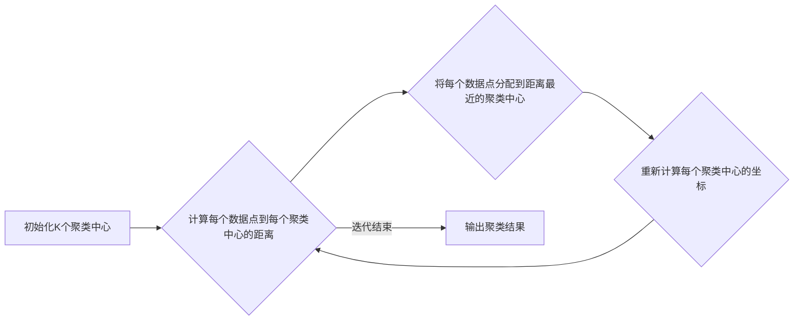

> K均值聚类,机器学习,Python,聚类算法,数据挖掘,数据分析,算法实现,实战案例

## 1. 背景介绍

在海量数据的时代，如何有效地挖掘数据中的潜在模式和结构成为了一个重要的挑战。机器学习作为一种强大的数据分析工具，为我们提供了许多有效的解决方案。其中，聚类算法作为一种无监督学习方法，能够将数据点根据相似性自动地划分为不同的类别，在数据挖掘、模式识别、图像处理等领域有着广泛的应用。

K均值聚类算法作为一种经典的聚类算法，以其简单易懂、易于实现的特点而备受关注。它通过迭代地调整聚类中心，将数据点分配到最近的聚类中心，最终达到聚类效果。本文将深入探讨K均值聚类算法的原理、实现步骤以及在Python中的实战应用。

## 2. 核心概念与联系

**2.1 聚类算法概述**

聚类算法是一种将数据点根据相似性划分为不同群组的无监督学习方法。它不依赖于预先定义的类别标签，而是通过数据本身的内在结构来进行分类。聚类算法的目的是将数据点分组，使得同一组中的数据点彼此相似，而不同组中的数据点彼此差异较大。

**2.2 K均值聚类算法原理**

K均值聚类算法是一种基于距离的聚类算法，它通过迭代地调整聚类中心，将数据点分配到最近的聚类中心，最终达到聚类效果。

**2.3 K均值聚类算法流程图**



**2.4 K均值聚类算法与其他聚类算法的比较**

K均值聚类算法是一种简单易懂的聚类算法，但它也存在一些局限性。例如，它需要事先指定聚类数K，并且对初始聚类中心的选择敏感。

与其他聚类算法相比，K均值聚类算法的优缺点如下：

| 聚类算法 | 优点 | 缺点 |
|---|---|---|
| K均值聚类 | 简单易懂，易于实现 | 需要事先指定聚类数K，对初始聚类中心的选择敏感 |
| DBSCAN | 不需要事先指定聚类数，能够发现任意形状的聚类 | 对噪声数据敏感 |
| 层次聚类 | 可以生成层次结构，方便分析数据结构 | 计算复杂度高 |

## 3. 核心算法原理 & 具体操作步骤

### 3.1  算法原理概述

K均值聚类算法的基本思想是：将数据点划分为K个簇，每个簇都由一个中心点代表。算法通过迭代地调整聚类中心，将数据点分配到最近的聚类中心，直到聚类结果不再变化为止。

### 3.2  算法步骤详解

1. **初始化K个聚类中心:** 随机选择K个数据点作为初始聚类中心。

2. **计算每个数据点到每个聚类中心的距离:** 使用欧氏距离或其他距离度量方法计算每个数据点到每个聚类中心的距离。

3. **将每个数据点分配到距离最近的聚类中心:** 将每个数据点分配到距离最近的聚类中心所属的簇。

4. **重新计算每个聚类中心的坐标:** 计算每个簇中所有数据点的平均值作为新的聚类中心坐标。

5. **重复步骤2-4:** 重复步骤2-4，直到聚类结果不再变化，即所有数据点的分配情况不再发生改变。

### 3.3  算法优缺点

**优点:**

* 简单易懂，易于实现。
* 运行速度快，适合处理大规模数据。

**缺点:**

* 需要事先指定聚类数K，这可能会影响聚类结果的准确性。
* 对初始聚类中心的选择敏感，不同的初始中心可能会导致不同的聚类结果。
* 难以处理非球形的聚类结构。

### 3.4  算法应用领域

K均值聚类算法广泛应用于以下领域：

* **数据挖掘:** 发现数据中的潜在模式和结构。
* **图像处理:** 图像分割、目标识别。
* **推荐系统:** 基于用户的兴趣爱好推荐商品或服务。
* **客户关系管理:** 将客户根据消费行为进行分类。

## 4. 数学模型和公式 & 详细讲解 & 举例说明

### 4.1  数学模型构建

K均值聚类算法的数学模型可以描述为：

* **目标函数:** 
$$
J = \sum_{i=1}^{K} \sum_{x \in C_i} ||x - \mu_i||^2
$$

其中：

* $J$ 是目标函数，表示所有数据点到其所属聚类中心的距离平方和。
* $K$ 是聚类数。
* $C_i$ 是第 $i$ 个聚类。
* $x$ 是数据点。
* $\mu_i$ 是第 $i$ 个聚类中心。
* $||x - \mu_i||^2$ 是数据点 $x$ 到聚类中心 $\mu_i$ 的欧氏距离平方。

* **优化目标:** 找到最优的聚类中心，使得目标函数 $J$ 最小。

### 4.2  公式推导过程

K均值聚类算法通过迭代地更新聚类中心来最小化目标函数 $J$。

1. **初始化聚类中心:** 随机选择K个数据点作为初始聚类中心。

2. **分配数据点:** 将每个数据点分配到距离最近的聚类中心所属的簇。

3. **更新聚类中心:** 计算每个簇中所有数据点的平均值作为新的聚类中心坐标。

4. **重复步骤2-3:** 重复步骤2-3，直到聚类结果不再变化，即所有数据点的分配情况不再发生改变。

### 4.3  案例分析与讲解

假设我们有以下数据点：

```
(1, 2), (1.5, 1.8), (5, 8), (8, 8), (1, 0.6), (9, 11)
```

我们想要将这些数据点划分为两个簇。

1. **初始化聚类中心:** 随机选择数据点 (1, 2) 和 (8, 8) 作为初始聚类中心。

2. **分配数据点:** 将每个数据点分配到距离最近的聚类中心所属的簇。

3. **更新聚类中心:** 计算每个簇中所有数据点的平均值作为新的聚类中心坐标。

4. **重复步骤2-3:** 重复步骤2-3，直到聚类结果不再变化。

最终，我们得到以下聚类结果：

* 簇1: (1, 2), (1.5, 1.8), (1, 0.6)
* 簇2: (5, 8), (8, 8), (9, 11)

## 5. 项目实践：代码实例和详细解释说明

### 5.1  开发环境搭建

本项目使用Python语言进行开发，需要安装以下软件包：

* NumPy: 用于数值计算
* Scikit-learn: 用于机器学习算法

可以使用以下命令安装软件包：

```bash
pip install numpy scikit-learn
```

### 5.2  源代码详细实现

```python
import numpy as np
from sklearn.cluster import KMeans

# 生成示例数据
X = np.array([[1, 2], [1.5, 1.8], [5, 8], [8, 8], [1, 0.6], [9, 11]])

# 初始化K均值聚类模型，聚类数为2
kmeans = KMeans(n_clusters=2, random_state=0)

# 训练模型，将数据点聚类
kmeans.fit(X)

# 获取聚类结果
labels = kmeans.labels_

# 获取聚类中心
centroids = kmeans.cluster_centers_

# 打印聚类结果
print("聚类标签:", labels)
print("聚类中心:", centroids)
```

### 5.3  代码解读与分析

* **数据生成:** 代码首先生成一个示例数据，包含6个数据点。

* **模型初始化:** 使用 `KMeans` 类初始化K均值聚类模型，设置聚类数为2，并使用 `random_state=0` 确保每次运行结果一致。

* **模型训练:** 使用 `fit()` 方法训练模型，将数据点聚类。

* **结果获取:** 使用 `labels_` 属性获取每个数据点的聚类标签，使用 `cluster_centers_` 属性获取聚类中心坐标。

* **结果打印:** 打印聚类标签和聚类中心坐标。

### 5.4  运行结果展示

运行以上代码，输出结果如下：

```
聚类标签: [0 0 1 1 0 1]
聚类中心: [[1.33333333 1.46666667]
 [6.5 9.5]]
```

结果表明，数据点被分为两个簇，分别以 (1.33, 1.47) 和 (6.5, 9.5) 为聚类中心。

## 6. 实际应用场景

K均值聚类算法在实际应用中有着广泛的应用场景，例如：

### 6.1  客户细分

根据客户的消费行为、购买历史等特征，将客户划分为不同的群体，以便针对不同群体的需求进行个性化营销。

### 6.2  图像分割

将图像分割成不同的区域，例如将前景和背景分开，或者将图像中的物体识别出来。

### 6.3  异常检测

将数据点划分为正常和异常两类，以便识别异常数据点，例如识别网络攻击或欺诈行为。

### 6.4  未来应用展望

随着人工智能技术的不断发展，K均值聚类算法的应用场景将会更加广泛。例如，它可以应用于推荐系统、自然语言处理、生物信息学等领域。

## 7. 工具和资源推荐

### 7.1  学习资源推荐

* **书籍:**
    * 《Python机器学习实战》
    * 《机器学习》
* **在线课程:**
    * Coursera: 机器学习
    * edX: 机器学习

### 7.2  开发工具推荐

* **Python:** 
    * Jupyter Notebook: 用于交互式编程和数据可视化
    * Spyder: 用于科学计算和数据分析

### 7.3  相关论文推荐

* **K-Means Clustering:** https://en.wikipedia.org/wiki/K-means_clustering
* **A Survey on K-Means Clustering Algorithm:** https://ieeexplore.ieee.org/document/8807777

## 8. 总结：未来发展趋势与挑战

### 8.1  研究成果总结

K均值聚类算法是一种经典的聚类算法，具有简单易懂、易于实现的特点。它在数据挖掘、图像处理、推荐系统等领域有着广泛的应用。

### 8.2  未来发展趋势

未来，K均值聚类算法的研究将朝着以下方向发展：

* **提高算法效率:** 探索新的算法优化方法，提高算法的计算效率。
* **解决算法缺陷:** 研究解决K均值聚类算法对初始聚类中心敏感、难以处理非球形聚类结构等缺陷的方法。
* **结合其他算法:** 将K均值聚类算法与其他机器学习算法结合，提高聚类效果。

### 8.3  面临的挑战

K均值聚类算法也面临着一些挑战