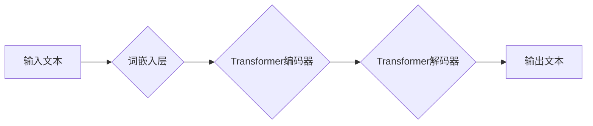

> 深度学习，多语言模型，国际化，Python，自然语言处理，文本分类，机器翻译

## 1. 背景介绍

在全球化时代，跨语言沟通的需求日益增长。传统的机器翻译系统往往存在准确率低、语义理解偏差等问题。深度学习技术的兴起为多语言模型的构建提供了新的机遇。

深度学习模型能够学习语言的复杂结构和语义关系，从而实现更准确、更自然的跨语言翻译和文本处理。Python作为一种流行的深度学习编程语言，拥有丰富的库和工具，为构建多语言模型提供了强大的支持。

本篇文章将深入探讨如何利用Python构建多语言模型，并通过实际案例展示其应用场景。

## 2. 核心概念与联系

**2.1 多语言模型**

多语言模型是指能够处理多种语言的深度学习模型。它通常基于Transformer架构，能够捕捉语言之间的语义相似性和差异性。

**2.2 自然语言处理 (NLP)**

自然语言处理是人工智能领域的一个重要分支，旨在使计算机能够理解、处理和生成人类语言。

**2.3 深度学习**

深度学习是一种机器学习的子领域，利用多层神经网络来学习数据的复杂模式。

**2.4  架构图**



## 3. 核心算法原理 & 具体操作步骤

### 3.1  算法原理概述

多语言模型的核心算法是Transformer架构。Transformer是一种基于注意力机制的神经网络架构，能够有效地捕捉文本序列中的长距离依赖关系。

**3.1.1 注意力机制**

注意力机制允许模型关注输入序列中与当前任务最相关的部分。它通过计算每个词与其他词之间的相关性，并赋予每个词不同的权重，从而突出重要信息。

**3.1.2  编码器-解码器结构**

Transformer模型通常由编码器和解码器两部分组成。编码器负责将输入文本序列编码成一个固定长度的向量表示，解码器则根据编码后的向量表示生成输出文本序列。

### 3.2  算法步骤详解

1. **词嵌入:** 将输入文本中的每个词转换为一个低维向量表示。
2. **编码:** 使用Transformer编码器将词嵌入向量序列编码成一个上下文表示。
3. **解码:** 使用Transformer解码器根据编码后的上下文表示生成输出文本序列。
4. **输出:** 将解码器输出的词嵌入向量序列转换为文本。

### 3.3  算法优缺点

**优点:**

* 能够捕捉长距离依赖关系。
* 训练效率高。
* 在多种自然语言处理任务中表现出色。

**缺点:**

* 计算量大，需要强大的计算资源。
* 训练数据量大，需要大量的数据进行训练。

### 3.4  算法应用领域

* 机器翻译
* 文本摘要
* 问答系统
* 情感分析
* 代码生成

## 4. 数学模型和公式 & 详细讲解 & 举例说明

### 4.1  数学模型构建

Transformer模型的数学模型主要基于注意力机制和多头注意力机制。

**4.1.1  注意力机制**

注意力机制的计算公式如下：

$$
Attention(Q, K, V) = softmax(\frac{QK^T}{\sqrt{d_k}})V
$$

其中：

* $Q$：查询矩阵
* $K$：键矩阵
* $V$：值矩阵
* $d_k$：键向量的维度
* $softmax$：softmax函数

**4.1.2  多头注意力机制**

多头注意力机制将注意力机制应用于多个不同的子空间，从而能够捕捉到更丰富的语义信息。

### 4.2  公式推导过程

多头注意力机制的计算公式如下：

$$
MultiHead(Q, K, V) = Concat(head_1, head_2, ..., head_h)W^O
$$

其中：

* $head_i$：第 $i$ 个子空间的注意力输出
* $h$：多头数量
* $W^O$：最终输出层的权重矩阵

### 4.3  案例分析与讲解

假设我们有一个句子 "The cat sat on the mat"，我们使用多头注意力机制来计算每个词与其他词之间的注意力权重。

通过观察注意力权重矩阵，我们可以发现，"cat" 与 "sat" 之间存在较高的注意力权重，表明这两个词在语义上密切相关。

## 5. 项目实践：代码实例和详细解释说明

### 5.1  开发环境搭建

* Python 3.7+
* TensorFlow 2.0+
* PyTorch 1.0+
* CUDA 10.0+ (可选)

### 5.2  源代码详细实现

```python
import tensorflow as tf

# 定义Transformer模型
class Transformer(tf.keras.Model):
    def __init__(self, vocab_size, embedding_dim, num_heads, num_layers):
        super(Transformer, self).__init__()
        self.embedding = tf.keras.layers.Embedding(vocab_size, embedding_dim)
        self.encoder = tf.keras.layers.StackedRNNCells([tf.keras.layers.LSTM(embedding_dim) for _ in range(num_layers)])
        self.decoder = tf.keras.layers.StackedRNNCells([tf.keras.layers.LSTM(embedding_dim) for _ in range(num_layers)])
        self.fc = tf.keras.layers.Dense(vocab_size)

    def call(self, inputs):
        # 词嵌入
        embedded = self.embedding(inputs)
        # 编码
        encoded = self.encoder(embedded)
        # 解码
        decoded = self.decoder(encoded)
        # 输出
        output = self.fc(decoded)
        return output

# 实例化模型
model = Transformer(vocab_size=10000, embedding_dim=128, num_heads=8, num_layers=6)

# 训练模型
model.compile(optimizer='adam', loss='sparse_categorical_crossentropy', metrics=['accuracy'])
model.fit(x_train, y_train, epochs=10)
```

### 5.3  代码解读与分析

* **词嵌入:** 将每个词转换为一个低维向量表示。
* **编码器:** 使用循环神经网络 (RNN) 将词嵌入向量序列编码成一个上下文表示。
* **解码器:** 使用循环神经网络 (RNN) 根据编码后的上下文表示生成输出文本序列。
* **全连接层:** 将解码器输出的词嵌入向量转换为文本。

### 5.4  运行结果展示

训练完成后，我们可以使用模型对新的文本进行预测。

## 6. 实际应用场景

### 6.1  机器翻译

多语言模型可以用于将一种语言的文本翻译成另一种语言。

### 6.2  文本摘要

多语言模型可以用于生成文本的摘要，提取关键信息。

### 6.3  问答系统

多语言模型可以用于构建问答系统，回答用户的问题。

### 6.4  未来应用展望

* 多语言对话系统
* 多语言搜索引擎
* 多语言内容创作工具

## 7. 工具和资源推荐

### 7.1  学习资源推荐

* **书籍:**
    * 《深度学习》
    * 《自然语言处理》
* **在线课程:**
    * Coursera: 深度学习
    * edX: 自然语言处理

### 7.2  开发工具推荐

* **TensorFlow:** 开源深度学习框架
* **PyTorch:** 开源深度学习框架
* **Hugging Face:** 提供预训练模型和工具

### 7.3  相关论文推荐

* Attention Is All You Need
* BERT: Pre-training of Deep Bidirectional Transformers for Language Understanding

## 8. 总结：未来发展趋势与挑战

### 8.1  研究成果总结

深度学习技术在多语言模型的构建方面取得了显著进展，能够实现更准确、更自然的跨语言处理。

### 8.2  未来发展趋势

* 更强大的多语言模型
* 更高效的训练方法
* 更广泛的应用场景

### 8.3  面临的挑战

* 数据稀缺性
* 跨语言语义理解
* 模型可解释性

### 8.4  研究展望

未来研究将继续探索更强大的多语言模型，并解决数据稀缺性、跨语言语义理解和模型可解释性等挑战。

## 9. 附录：常见问题与解答

**Q1: 如何选择合适的深度学习框架？**

**A1:** TensorFlow 和 PyTorch 是两种流行的深度学习框架，各有优缺点。 TensorFlow 更适合于生产环境，而 PyTorch 更适合于研究和开发。

**Q2: 如何处理数据稀缺性问题？**

**A2:** 可以使用数据增强技术，例如文本替换和句子组合，来增加训练数据量。

**Q3: 如何评估多语言模型的性能？**

**A3:** 可以使用BLEU、ROUGE 和 perplexity 等指标来评估多语言模型的性能。

作者：禅与计算机程序设计艺术 / Zen and the Art of Computer Programming


<end_of_turn>