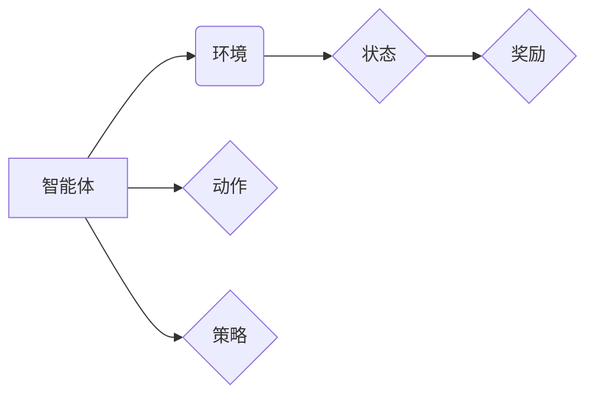

> 深度强化学习，机器人控制，Python，深度学习，强化学习，神经网络，环境模拟，策略梯度，Q学习

## 1. 背景介绍

在人工智能领域，深度强化学习（Deep Reinforcement Learning，DRL）作为一种强大的学习范式，近年来取得了显著进展，并在机器人控制、游戏 AI、自动驾驶等领域展现出巨大的应用潜力。DRL算法能够通过与环境交互，学习最优的策略，从而实现复杂任务的自动化控制。

传统的强化学习算法通常依赖于手工设计的特征工程，而深度强化学习则通过深度神经网络自动学习特征表示，从而能够处理更复杂、更高维度的环境信息。

Python作为一种简洁易用的编程语言，在机器学习和深度学习领域拥有广泛的应用。结合Python强大的机器学习库，如TensorFlow、PyTorch等，可以方便快捷地实现深度强化学习算法的开发和应用。

本篇文章将深入探讨深度强化学习的原理和应用，并以机器人控制为例，展示如何使用Python实现深度强化学习算法，并将其应用于机器人控制任务。

## 2. 核心概念与联系

**2.1 强化学习概述**

强化学习是一种基于交互学习的机器学习范式，其核心在于智能体通过与环境交互，学习最优的策略，以最大化累积的奖励。

* **智能体 (Agent):**  学习和决策的实体。
* **环境 (Environment):** 智能体所处的外部世界。
* **状态 (State):** 环境的当前状态。
* **动作 (Action):** 智能体在特定状态下可以执行的操作。
* **奖励 (Reward):** 环境对智能体动作的反馈，可以是正向奖励或负向惩罚。
* **策略 (Policy):** 智能体在不同状态下选择动作的规则。

**2.2 深度强化学习**

深度强化学习将深度神经网络引入强化学习框架，通过深度神经网络学习智能体的策略或价值函数，从而能够处理更复杂、更高维度的环境信息。

**2.3 机器人控制**

机器人控制是指通过算法控制机器人运动和行为，使其能够完成预定的任务。深度强化学习可以用于学习机器人控制策略，使其能够在复杂环境中自主导航、避障、抓取等。

**2.4 核心概念关系图**



## 3. 核心算法原理 & 具体操作步骤

### 3.1 算法原理概述

本篇文章将介绍两种常用的深度强化学习算法：

* **策略梯度算法 (Policy Gradient)**：直接优化策略网络，通过梯度上升更新策略参数，使其能够最大化累积奖励。
* **Q学习算法 (Q-Learning)**：学习状态-动作对的价值函数，通过价值函数估计动作在特定状态下的期望奖励，从而选择最优动作。

### 3.2 算法步骤详解

**3.2.1 策略梯度算法**

1. 初始化策略网络，并随机初始化策略参数。
2. 在环境中进行采样，收集状态、动作、奖励和下一个状态的数据。
3. 计算策略梯度，即策略参数变化方向，使其能够最大化累积奖励。
4. 使用梯度上升算法更新策略参数，从而优化策略网络。
5. 重复步骤2-4，直到策略收敛或达到预设的训练目标。

**3.2.2 Q学习算法**

1. 初始化状态-动作对的价值函数表，并随机初始化价值函数值。
2. 在环境中进行采样，收集状态、动作、奖励和下一个状态的数据。
3. 更新价值函数值，根据Bellman方程计算下一个状态的价值函数值，并利用奖励和折扣因子更新当前状态-动作对的价值函数值。
4. 根据价值函数值选择最优动作，并执行该动作。
5. 重复步骤2-4，直到价值函数收敛或达到预设的训练目标。

### 3.3 算法优缺点

**3.3.1 策略梯度算法**

* **优点:** 能够直接优化策略，避免价值函数的估计误差。
* **缺点:** 训练过程可能不稳定，需要仔细调参。

**3.3.2 Q学习算法**

* **优点:** 训练过程相对稳定，易于实现。
* **缺点:** 需要离线学习，无法直接处理连续动作空间。

### 3.4 算法应用领域

* **策略梯度算法:** 游戏 AI、机器人控制、自动驾驶等。
* **Q学习算法:** 围棋、麻将、机器人控制等。

## 4. 数学模型和公式 & 详细讲解 & 举例说明

### 4.1 数学模型构建

**4.1.1 策略梯度算法**

策略梯度算法的目标是最大化累积奖励，可以使用以下公式表示：

$$
J(\theta) = E_{\tau \sim \pi_{\theta}}[R(\tau)]
$$

其中：

* $J(\theta)$ 是策略网络参数 $\theta$ 的目标函数，即累积奖励的期望值。
* $\tau$ 是一个轨迹，由一系列状态、动作和奖励组成。
* $\pi_{\theta}$ 是策略网络，根据状态输出动作概率分布。
* $R(\tau)$ 是轨迹 $\tau$ 的累积奖励。

**4.1.2 Q学习算法**

Q学习算法的目标是学习状态-动作对的价值函数，可以使用以下Bellman方程表示：

$$
Q(s, a) = R(s, a) + \gamma \max_{a'} Q(s', a')
$$

其中：

* $Q(s, a)$ 是状态 $s$ 下动作 $a$ 的价值函数。
* $R(s, a)$ 是状态 $s$ 下执行动作 $a$ 得到的奖励。
* $\gamma$ 是折扣因子，控制未来奖励的权重。
* $s'$ 是状态 $s$ 下执行动作 $a$ 之后到达的状态。

### 4.2 公式推导过程

**4.2.1 策略梯度算法**

策略梯度算法的目标是最大化目标函数 $J(\theta)$，可以使用梯度上升算法更新策略参数：

$$
\theta = \theta + \alpha \nabla_{\theta} J(\theta)
$$

其中：

* $\alpha$ 是学习率。
* $\nabla_{\theta} J(\theta)$ 是目标函数 $J(\theta)$ 对策略参数 $\theta$ 的梯度。

**4.2.2 Q学习算法**

Q学习算法通过迭代更新价值函数，可以使用以下公式更新价值函数值：

$$
Q(s, a) = Q(s, a) + \alpha [R(s, a) + \gamma \max_{a'} Q(s', a') - Q(s, a)]
$$

其中：

* $\alpha$ 是学习率。

### 4.3 案例分析与讲解

**4.3.1 策略梯度算法案例**

OpenAI Five 团队使用策略梯度算法训练了五个AI代理，在Dota 2游戏中战胜了人类职业选手。

**4.3.2 Q学习算法案例**

AlphaGo 团队使用Q学习算法训练了AlphaGo，在围棋游戏中战胜了人类世界冠军。

## 5. 项目实践：代码实例和详细解释说明

### 5.1 开发环境搭建

* Python 3.6+
* TensorFlow 或 PyTorch
* OpenAI Gym 或其他机器人控制仿真环境

### 5.2 源代码详细实现

```python
# 使用TensorFlow实现策略梯度算法控制机器人

import tensorflow as tf
import gym

# 定义策略网络
class PolicyNetwork(tf.keras.Model):
    def __init__(self, state_dim, action_dim):
        super(PolicyNetwork, self).__init__()
        self.dense1 = tf.keras.layers.Dense(64, activation='relu')
        self.dense2 = tf.keras.layers.Dense(32, activation='relu')
        self.output = tf.keras.layers.Dense(action_dim, activation='softmax')

    def call(self, state):
        x = self.dense1(state)
        x = self.dense2(x)
        return self.output(x)

# 定义训练函数
def train(env, policy_network, learning_rate, num_episodes):
    optimizer = tf.keras.optimizers.Adam(learning_rate)
    for episode in range(num_episodes):
        state = env.reset()
        done = False
        total_reward = 0
        while not done:
            # 选择动作
            action_probs = policy_network(state)
            action = tf.random.categorical(tf.math.log(action_probs), 1)[0, 0]
            # 执行动作
            next_state, reward, done, _ = env.step(action)
            # 更新策略网络
            with tf.GradientTape() as tape:
                # 计算损失函数
                loss = -tf.math.log(action_probs[0, action])
            gradients = tape.gradient(loss, policy_network.trainable_variables)
            optimizer.apply_gradients(zip(gradients, policy_network.trainable_variables))
            # 更新状态
            state = next_state
            total_reward += reward
        print(f"Episode {episode+1}, Total Reward: {total_reward}")

# 实例化环境和策略网络
env = gym.make('CartPole-v1')
state_dim = env.observation_space.shape[0]
action_dim = env.action_space.n
policy_network = PolicyNetwork(state_dim, action_dim)

# 训练策略网络
train(env, policy_network, learning_rate=0.01, num_episodes=1000)
```

### 5.3 代码解读与分析

* **策略网络:** 使用多层感知机构建策略网络，输出动作概率分布。
* **训练函数:** 使用策略梯度算法训练策略网络，通过最大化累积奖励更新策略参数。
* **环境模拟:** 使用OpenAI Gym中的CartPole-v1环境模拟机器人控制任务。

### 5.4 运行结果展示

训练完成后，可以将训练好的策略网络应用于环境中，观察机器人控制的效果。

## 6. 实际应用场景

**6.1 机器人导航**

深度强化学习可以用于训练机器人自主导航，使其能够在复杂环境中避障、规划路径，并到达目标位置。

**6.2 机器人抓取**

深度强化学习可以用于训练机器人抓取物体，使其能够识别物体形状、抓取位置，并完成物体抓取任务。

**6.3 自动驾驶**

深度强化学习可以用于训练自动驾驶系统，使其能够感知周围环境、做出决策，并控制车辆行驶。

### 6.4 未来应用展望

* **医疗机器人:** 深度强化学习可以用于训练医疗机器人，使其能够协助医生进行手术、提供患者护理等。
* **工业机器人:** 深度强化学习可以用于训练工业机器人，使其能够完成更复杂、更灵活的任务，例如装配、焊接等。
* **服务机器人:** 深度强化学习可以用于训练服务机器人，使其能够提供更智能、更人性化的服务，例如陪伴、翻译等。

## 7. 工具和资源推荐

### 7.1 学习资源推荐

* **书籍:**
    * Deep Reinforcement Learning Hands-On by Maxim Lapan
    * Reinforcement Learning: An Introduction by Richard S. Sutton and Andrew G. Barto
* **在线课程:**
    * Deep Reinforcement Learning Specialization by DeepLearning.AI
    * Reinforcement Learning by David Silver (University of DeepMind)

### 7.2 开发工具推荐

* **TensorFlow:** https://www.tensorflow.org/
* **PyTorch:** https://pytorch.org/
* **OpenAI Gym:** https://gym.openai.com/

### 7.3 相关论文推荐

