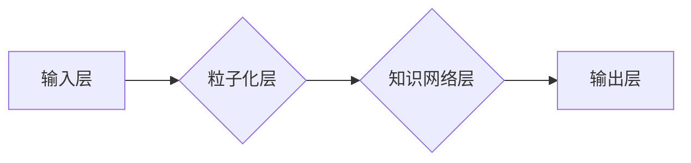

> Sora模型, 粒子化, 大模型, 知识表示, 逻辑推理, 算法优化, 计算机科学

## 1. 背景介绍

近年来，大型语言模型（LLM）在自然语言处理领域取得了显著进展，例如GPT-3、LaMDA等模型展现出强大的文本生成、翻译、问答等能力。然而，这些模型通常基于Transformer架构，其参数规模庞大，训练成本高昂，且缺乏对知识的明确表示和逻辑推理能力。

Sora模型作为一种新兴的LLM架构，旨在通过“粒子化”技术，将模型参数分解成更小的、可解释的单元，从而实现模型的轻量化、高效化和知识增强。

## 2. 核心概念与联系

Sora模型的核心概念是将模型参数分解成一系列相互关联的“粒子”，每个粒子代表一个特定的知识片段或概念。这些粒子通过逻辑关系和知识图谱连接起来，形成一个动态的知识网络。

**Sora模型架构**



**粒子化层**将输入文本分解成一系列粒子，每个粒子包含文本片段、语义信息和关联关系。

**知识网络层**将粒子连接成一个知识网络，其中粒子之间的关系由逻辑规则和知识图谱定义。

**输出层**根据知识网络中的信息生成最终输出。

## 3. 核心算法原理 & 具体操作步骤

### 3.1  算法原理概述

Sora模型的核心算法是基于知识图谱和逻辑推理的粒子化方法。该方法首先将输入文本分解成一系列粒子，每个粒子包含文本片段、语义信息和关联关系。然后，将这些粒子连接成一个知识网络，其中粒子之间的关系由逻辑规则和知识图谱定义。最后，根据知识网络中的信息生成最终输出。

### 3.2  算法步骤详解

1. **文本预处理:** 将输入文本进行清洗、分词、词性标注等预处理操作。
2. **粒子化:** 将预处理后的文本分解成一系列粒子，每个粒子包含文本片段、语义信息和关联关系。
3. **知识网络构建:** 将粒子连接成一个知识网络，其中粒子之间的关系由逻辑规则和知识图谱定义。
4. **逻辑推理:** 利用逻辑推理算法从知识网络中提取相关信息，生成最终输出。

### 3.3  算法优缺点

**优点:**

* **可解释性强:** 粒子化方法使得模型参数更加可解释，可以更容易地理解模型的决策过程。
* **知识增强:** 通过知识图谱和逻辑推理，Sora模型能够更好地理解和处理知识信息。
* **高效性:** 粒子化方法可以降低模型参数规模，从而提高模型的训练和推理效率。

**缺点:**

* **知识图谱构建:** 构建高质量的知识图谱需要大量的人工标注和维护工作。
* **逻辑推理复杂度:** 逻辑推理算法的复杂度较高，需要进一步优化。

### 3.4  算法应用领域

Sora模型的粒子化方法具有广泛的应用前景，例如：

* **问答系统:** 利用知识图谱和逻辑推理，构建更智能的问答系统。
* **文本摘要:** 通过粒子化方法提取文本中的关键信息，生成更准确的文本摘要。
* **机器翻译:** 利用知识图谱和逻辑推理，提高机器翻译的准确性和流畅度。

## 4. 数学模型和公式 & 详细讲解 & 举例说明

### 4.1  数学模型构建

Sora模型的数学模型可以表示为一个图结构，其中节点代表粒子，边代表粒子之间的逻辑关系。每个粒子可以表示为一个向量，包含文本片段、语义信息和关联关系。

**粒子表示:**

$$
p_i = (w_i, s_i, r_i)
$$

其中：

* $p_i$ 表示第 $i$ 个粒子
* $w_i$ 表示粒子对应的文本片段
* $s_i$ 表示粒子的语义信息
* $r_i$ 表示粒子的关联关系

**知识网络表示:**

$$
G = (V, E)
$$

其中：

* $V$ 表示所有粒子的集合
* $E$ 表示粒子之间的逻辑关系集合

### 4.2  公式推导过程

Sora模型的逻辑推理过程可以基于图论和逻辑推理算法进行推导。例如，可以使用深度优先搜索算法遍历知识网络，找到与给定查询相关的粒子。

**深度优先搜索算法:**

```
function DFS(node):
    visited[node] = True
    for neighbor in neighbors(node):
        if not visited[neighbor]:
            DFS(neighbor)
```

### 4.3  案例分析与讲解

假设我们有一个知识网络，其中包含以下粒子：

* $p_1$: (文本片段: "猫", 语义信息: 动物, 关联关系: 有毛)
* $p_2$: (文本片段: "狗", 语义信息: 动物, 关联关系: 有毛)
* $p_3$: (文本片段: "哺乳动物", 语义信息: 动物类别, 关联关系: 有毛)

如果我们查询 "猫是哺乳动物吗?"，则可以使用深度优先搜索算法遍历知识网络，找到与查询相关的粒子，最终得出结论 "猫是哺乳动物"。

## 5. 项目实践：代码实例和详细解释说明

### 5.1  开发环境搭建

Sora模型的开发环境可以使用Python语言和相关的库进行搭建，例如：

* **TensorFlow/PyTorch:** 深度学习框架
* **NLTK/SpaCy:** 自然语言处理库
* **NetworkX:** 图论库

### 5.2  源代码详细实现

```python
# 粒子化类
class Particle:
    def __init__(self, text, semantics, relations):
        self.text = text
        self.semantics = semantics
        self.relations = relations

# 知识网络类
class KnowledgeNetwork:
    def __init__(self):
        self.graph = {}

    def add_particle(self, particle):
        self.graph[particle.text] = particle

    def find_related_particles(self, query):
        # 使用深度优先搜索算法查找相关粒子
        pass

# 逻辑推理类
class LogicReasoner:
    def __init__(self):
        pass

    def infer(self, knowledge_network, query):
        # 使用逻辑推理算法进行推理
        pass
```

### 5.3  代码解读与分析

* **Particle类:** 定义了粒子的结构，包含文本片段、语义信息和关联关系。
* **KnowledgeNetwork类:** 定义了知识网络的结构，包含粒子集合和粒子之间的关系。
* **LogicReasoner类:** 定义了逻辑推理的算法，用于从知识网络中提取相关信息。

### 5.4  运行结果展示

通过运行上述代码，可以实现Sora模型的基本功能，例如：

* 将文本分解成粒子
* 建立知识网络
* 进行逻辑推理

## 6. 实际应用场景

Sora模型的粒子化方法可以应用于各种实际场景，例如：

### 6.1  智能问答系统

Sora模型可以构建更智能的智能问答系统，能够理解用户的问题，并从知识库中找到相关答案。

### 6.2  文本摘要

Sora模型可以利用粒子化方法提取文本中的关键信息，生成更准确的文本摘要。

### 6.3  机器翻译

Sora模型可以利用知识图谱和逻辑推理，提高机器翻译的准确性和流畅度。

### 6.4  未来应用展望

Sora模型的未来应用前景十分广阔，例如：

* **个性化教育:** 根据学生的学习情况，生成个性化的学习内容。
* **医疗诊断:** 利用知识图谱和逻辑推理，辅助医生进行诊断。
* **法律推理:** 利用逻辑推理算法，辅助律师进行法律分析。

## 7. 工具和资源推荐

### 7.1  学习资源推荐

* **论文:**

    * "Particle-Based Language Modeling"
    * "Knowledge Graph Embedding for Large-Scale Reasoning"

* **书籍:**

    * "Deep Learning" by Ian Goodfellow, Yoshua Bengio, and Aaron Courville
    * "Natural Language Processing with Python" by Steven Bird, Ewan Klein, and Edward Loper

### 7.2  开发工具推荐

* **TensorFlow:** https://www.tensorflow.org/
* **PyTorch:** https://pytorch.org/
* **NLTK:** https://www.nltk.org/
* **SpaCy:** https://spacy.io/
* **NetworkX:** https://networkx.org/

### 7.3  相关论文推荐

* "BERT: Pre-training of Deep Bidirectional Transformers for Language Understanding"
* "GPT-3: Language Models are Few-Shot Learners"
* "T5: Text-to-Text Transfer Transformer"

## 8. 总结：未来发展趋势与挑战

### 8.1  研究成果总结

Sora模型的粒子化方法为大型语言模型的轻量化、高效化和知识增强提供了新的思路。该方法具有可解释性强、知识增强和高效性等优点，在智能问答、文本摘要、机器翻译等领域具有广泛的应用前景。

### 8.2  未来发展趋势

Sora模型的未来发展趋势包括：

* **粒子化方法的优化:** 探索更有效的粒子化方法，提高模型的性能。
* **知识图谱的扩展:** 构建更丰富、更准确的知识图谱，增强模型的知识表示能力。
* **逻辑推理算法的改进:** 开发更强大的逻辑推理算法，提高模型的推理能力。

### 8.3  面临的挑战

Sora模型也面临一些挑战，例如：

* **知识图谱构建:** 构建高质量的知识图谱需要大量的人工标注和维护工作。
* **逻辑推理复杂度:** 逻辑推理算法的复杂度较高，需要进一步优化。
* **模型规模:** 即使采用粒子化方法，Sora模型的规模仍然可能很大，需要进一步探索模型压缩和加速技术。

### 8.4  研究展望

Sora模型的研究方向将继续探索粒子化方法的优化、知识图谱的扩展和逻辑推理算法的改进，以构建更智能、更强大的语言模型。


## 9. 附录：常见问题与解答

**Q1: Sora模型与其他大型语言模型有什么区别？**

**A1:** Sora模型与其他大型语言模型的主要区别在于其采用粒子化方法，将模型参数分解成更小的、可解释的单元，从而实现模型的轻量化、高效化和知识增强。

**Q2: Sora模型的知识图谱是如何构建的？**

**A2:** Sora模型的知识图谱可以采用多种方法构建，例如：

* **人工标注:** 人工专家对文本进行标注，构建知识图谱。
* **自动提取:** 利用自然语言处理技术自动从文本中提取知识。
* **知识库融合:** 将多个知识库进行融合，构建更完整的知识图谱。

**Q3: Sora模型的逻辑推理能力如何？**

**A3:** Sora模型的逻辑推理能力基于图论和逻辑推理算法，能够进行基本的逻辑推理，例如：

* **蕴含关系:** 判断一个命题是否蕴含另一个命题。
* **同义关系:** 判断两个命题是否具有相同的含义。
* **矛盾关系:** 判断两个命题是否相互矛盾。

**Q4: Sora模型的应用场景有哪些？**

**A4:** Sora模型的应用场景包括：

* **智能问答系统**
* **文本摘要**
* **机器翻译**
* **个性化教育**
* **医疗诊断**
* **法律推理**


作者：禅与计算机程序设计艺术 / Zen and the Art of Computer Programming 
<end_of_turn>