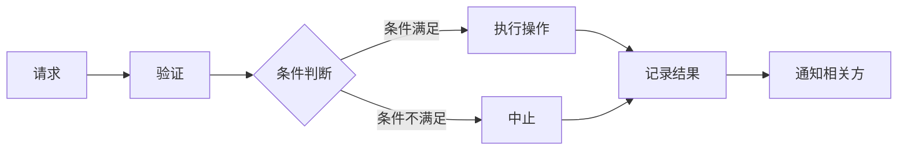

                 

## 1. 背景介绍

在当今数字化转型的时代，工作流管理（Workflow Management, WfM）已成为企业提高效率和降低成本的关键。然而，传统的工作流管理系统往往存在灵活性不足、可扩展性差、数据安全和可追溯性低等问题。区块链技术和智能合约的出现为工作流管理带来了颠覆性的变化，提供了更高的安全性、透明度和可追溯性。

本文将深入探讨智能合约在工作流管理中的应用，介绍其核心概念、原理、算法、数学模型，并提供项目实践和实际应用场景。我们还将推荐相关学习资源、开发工具和论文，并展望未来的发展趋势和挑战。

## 2. 核心概念与联系

### 2.1 智能合约（Smart Contract）

智能合约是一种自动执行的计算机程序，它在区块链上运行，无需中间人即可执行协议。智能合约一旦部署，就无法更改，这为工作流管理提供了高度的安全性和透明度。



上图展示了智能合约的基本流程。请求触发智能合约，智能合约验证请求，根据条件判断是否执行操作，记录结果并通知相关方。

### 2.2 工作流管理（Workflow Management, WfM）

工作流管理是指使用软件系统来建模、执行、监控和优化组织的业务流程。工作流管理系统（WfMS）是一种软件系统，它支持工作流的自动化和管理。

### 2.3 区块链（Blockchain）

区块链是一种去中心化的分布式账本技术，它使用加密算法将交易记录在不可更改的区块中。区块链为智能合约和工作流管理提供了高度安全和透明的环境。

## 3. 核心算法原理 & 具体操作步骤

### 3.1 算法原理概述

智能合约在工作流管理中的应用主要基于以下算法原理：

1. **请求验证**：智能合约接收到请求后，首先验证请求的合法性，确保请求来自于已授权的用户或系统。
2. **条件判断**：智能合约根据预定义的条件判断是否执行相应的操作。条件可以是时间、地点、事件触发等。
3. **操作执行**：当条件满足时，智能合约执行相应的操作，如转账、发送通知等。
4. **结果记录**：智能合约记录操作的结果，并将其存储在区块链上，提供高度的可追溯性。
5. **通知相关方**：智能合约通知相关方操作的结果，以便他们采取进一步的行动。

### 3.2 算法步骤详解

下面是智能合约在工作流管理中的具体操作步骤：

1. **定义工作流**：使用工作流建模工具定义工作流的各个步骤、条件和操作。
2. **编写智能合约**：使用智能合约编程语言（如Solidity）编写智能合约，实现工作流的各个步骤。
3. **部署智能合约**：将智能合约部署到区块链上，并记录其地址。
4. **触发智能合约**：使用已授权的用户或系统触发智能合约，启动工作流。
5. **监控工作流**：监控智能合约的执行情况，确保工作流按预期进行。
6. **优化工作流**：根据工作流的执行情况，优化智能合约，提高工作流的效率和可靠性。

### 3.3 算法优缺点

**优点**：

* 提高了工作流的安全性和透明度
* 无需中间人即可执行协议
* 提高了工作流的可追溯性
* 降低了人为错误的可能性

**缺点**：

* 智能合约一旦部署，就无法更改，这可能会导致灵活性不足
* 智能合约的编写和部署需要一定的技术水平
* 区块链网络的延迟可能会影响智能合约的执行速度

### 3.4 算法应用领域

智能合约在工作流管理中的应用有广泛的领域，包括：

* 供应链管理：智能合约可以自动执行付款、发货、收货等操作，提高供应链的效率和可靠性。
* 金融服务：智能合约可以自动执行贷款、保险等金融服务，降低人为错误的可能性。
* 物流管理：智能合约可以自动执行运输、配送等物流操作，提高物流的效率和可靠性。
* 公共服务：智能合约可以自动执行选举、投票等公共服务，提高公共服务的透明度和可靠性。

## 4. 数学模型和公式 & 详细讲解 & 举例说明

### 4.1 数学模型构建

工作流管理中的智能合约可以使用有向图（Directed Graph）来建模。有向图中的节点表示工作流的各个步骤，边表示步骤之间的依赖关系。

数学上，有向图可以表示为一个邻接矩阵（Adjacency Matrix）或邻接表（Adjacency List）。邻接矩阵是一个方阵，其中元素表示两个节点之间是否存在边。邻接表是一个列表，其中每个元素表示一个节点及其邻接节点。

### 4.2 公式推导过程

假设工作流管理中的智能合约有向图有n个节点，则邻接矩阵为一个n×n的方阵。邻接矩阵的元素$a_{ij}$表示节点i和节点j之间是否存在边，如果存在边则$a_{ij}=1$，否则$a_{ij}=0$。

邻接表可以表示为一个列表，其中每个元素为一个二元组$(i, j)$，表示节点i和节点j之间存在边。

### 4.3 案例分析与讲解

例如，考虑一个简单的工作流：接收订单→验证订单→发货→收款。这个工作流可以用下面的邻接矩阵来表示：

$$
\begin{bmatrix}
0 & 1 & 0 & 0 \\
0 & 0 & 1 & 0 \\
0 & 0 & 0 & 1 \\
0 & 0 & 0 & 0
\end{bmatrix}
$$

其中，每行每列对应一个节点，元素表示两个节点之间是否存在边。例如，$a_{12}=1$表示节点1（接收订单）和节点2（验证订单）之间存在边。

这个工作流也可以用邻接表表示为：

$(1, 2), (2, 3), (3, 4)$

其中，每个二元组表示两个节点之间存在边。

## 5. 项目实践：代码实例和详细解释说明

### 5.1 开发环境搭建

要开发智能合约，需要搭建以下开发环境：

* 以太坊（Ethereum）开发环境：包括Ganache（本地测试网络）、Truffle（智能合约开发框架）、Web3.js（以太坊JavaScript库）
* 编程语言：Solidity（智能合约编程语言）
* 编辑器：Visual Studio Code（集成了Solidity插件）

### 5.2 源代码详细实现

下面是一个简单的智能合约示例，实现了一个简单的工作流：接收订单→验证订单→发货→收款。

```solidity
pragma solidity ^0.8.0;

contract Workflow {
    enum Status { Created, Validated, Shipped, Paid }

    struct Order {
        uint id;
        address customer;
        uint amount;
        Status status;
    }

    Order[] public orders;

    function createOrder(uint _amount) public {
        orders.push(Order(msg.sender, _amount, Status.Created));
    }

    function validateOrder(uint _id) public {
        Order memory order = orders[_id];
        require(order.status == Status.Created, "Order not created");
        order.status = Status.Validated;
    }

    function shipOrder(uint _id) public {
        Order memory order = orders[_id];
        require(order.status == Status.Validated, "Order not validated");
        order.status = Status.Shipped;
    }

    function payOrder(uint _id) public payable {
        Order memory order = orders[_id];
        require(order.status == Status.Shipped, "Order not shipped");
        require(msg.value == order.amount, "Incorrect amount");
        order.status = Status.Paid;
    }
}
```

### 5.3 代码解读与分析

这个智能合约定义了一个简单的工作流，包括创建订单、验证订单、发货和收款。每个订单都有唯一的id，客户地址，金额和状态。智能合约提供了四个函数：createOrder、validateOrder、shipOrder和payOrder，分别对应工作流的四个步骤。

每个函数都包含了条件判断，确保工作流按预期进行。例如，validateOrder函数只能在订单状态为Created时调用，shipOrder函数只能在订单状态为Validated时调用，payOrder函数只能在订单状态为Shipped时调用，并且支付的金额必须与订单金额相同。

### 5.4 运行结果展示

部署并测试这个智能合约后，可以使用以太坊浏览器（如MetaMask）查看订单的状态。例如，创建一个订单后，其状态为Created。验证订单后，其状态变为Validated。发货后，其状态变为Shipped。收款后，其状态变为Paid。

## 6. 实际应用场景

### 6.1 供应链管理

智能合约可以应用于供应链管理，自动执行付款、发货、收货等操作。例如，当货物发货时，智能合约可以自动执行付款操作。当货物收货时，智能合约可以自动执行发货操作。这种自动化可以提高供应链的效率和可靠性。

### 6.2 金融服务

智能合约可以应用于金融服务，自动执行贷款、保险等金融服务。例如，当借款人还款时，智能合约可以自动执行贷款操作。当保险事件发生时，智能合约可以自动执行保险操作。这种自动化可以降低人为错误的可能性。

### 6.3 物流管理

智能合约可以应用于物流管理，自动执行运输、配送等物流操作。例如，当货物运输时，智能合约可以自动执行运输操作。当货物配送时，智能合约可以自动执行配送操作。这种自动化可以提高物流的效率和可靠性。

### 6.4 未来应用展望

智能合约在工作流管理中的应用前景广阔。随着区块链技术的发展，智能合约的安全性、可靠性和可扩展性将进一步提高。智能合约可以应用于更多的领域，如医疗保健、政府服务等。此外，智能合约还可以与物联网、人工智能等技术结合，实现更复杂的工作流管理。

## 7. 工具和资源推荐

### 7.1 学习资源推荐

* **以太坊白皮书**：<https://ethereum.org/en/whitepaper/>
* **Solidity官方文档**：<https://docs.soliditylang.org/>
* **Truffle官方文档**：<https://truffleframework.com/docs>
* **Web3.js官方文档**：<https://web3js.readthedocs.io/en/v1.7.3/web3-eth-contract.html>

### 7.2 开发工具推荐

* **Ganache**：<https://truffleframework.com/ganache>
* **Truffle**：<https://truffleframework.com/truffle>
* **Visual Studio Code**：<https://code.visualstudio.com/>
* **MetaMask**：<https://metamask.io/>

### 7.3 相关论文推荐

* **Ethereum: A Secure Decentralized Generalized Transaction Ledger**：<https://ethereum.org/en/whitepaper/>
* **Smart Contracts on the Blockchain：A Survey and Tutorial**：<https://arxiv.org/abs/1803.05069>
* **Blockchains, Smart Contracts, and the Future of Workflow Management Systems**：<https://arxiv.org/abs/1803.05070>

## 8. 总结：未来发展趋势与挑战

### 8.1 研究成果总结

本文介绍了智能合约在工作流管理中的应用，包括核心概念、原理、算法、数学模型和项目实践。我们还讨论了智能合约在供应链管理、金融服务、物流管理等领域的实际应用场景。

### 8.2 未来发展趋势

智能合约在工作流管理中的应用前景广阔。随着区块链技术的发展，智能合约的安全性、可靠性和可扩展性将进一步提高。智能合约可以应用于更多的领域，如医疗保健、政府服务等。此外，智能合约还可以与物联网、人工智能等技术结合，实现更复杂的工作流管理。

### 8.3 面临的挑战

智能合约在工作流管理中的应用也面临着挑战。首先，智能合约的编写和部署需要一定的技术水平。其次，区块链网络的延迟可能会影响智能合约的执行速度。再次，智能合约一旦部署，就无法更改，这可能会导致灵活性不足。最后，智能合约的安全性和可靠性需要进一步提高。

### 8.4 研究展望

未来的研究可以从以下几个方向展开：

* 研究智能合约在更复杂工作流管理中的应用，如医疗保健、政府服务等。
* 研究智能合约与物联网、人工智能等技术的结合，实现更复杂的工作流管理。
* 研究提高智能合约安全性和可靠性的方法，如形式化验证、安全审计等。
* 研究提高智能合约可扩展性的方法，如分片技术、状态通道等。

## 9. 附录：常见问题与解答

**Q1：智能合约是什么？**

A1：智能合约是一种自动执行的计算机程序，它在区块链上运行，无需中间人即可执行协议。

**Q2：智能合约在工作流管理中的优势是什么？**

A2：智能合约在工作流管理中的优势包括提高了工作流的安全性和透明度，无需中间人即可执行协议，提高了工作流的可追溯性，降低了人为错误的可能性。

**Q3：智能合约在工作流管理中的挑战是什么？**

A3：智能合约在工作流管理中的挑战包括智能合约的编写和部署需要一定的技术水平，区块链网络的延迟可能会影响智能合约的执行速度，智能合约一旦部署，就无法更改，这可能会导致灵活性不足，智能合约的安全性和可靠性需要进一步提高。

**Q4：智能合约在工作流管理中的未来发展趋势是什么？**

A4：智能合约在工作流管理中的未来发展趋势包括智能合约可以应用于更多的领域，如医疗保健、政府服务等，智能合约还可以与物联网、人工智能等技术结合，实现更复杂的工作流管理。

**Q5：如何学习智能合约在工作流管理中的应用？**

A5：要学习智能合约在工作流管理中的应用，需要学习以太坊白皮书、Solidity官方文档、Truffle官方文档、Web3.js官方文档等学习资源。还需要掌握Ganache、Truffle、Visual Studio Code、MetaMask等开发工具。

## 作者：禅与计算机程序设计艺术 / Zen and the Art of Computer Programming

