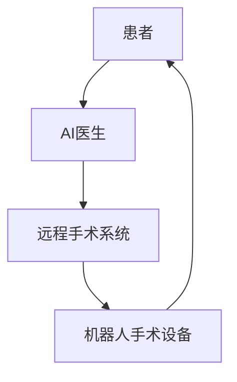

                 

**未来的智慧医疗：2050年的人工智能医生与远程手术**

**作者：禅与计算机程序设计艺术 / Zen and the Art of Computer Programming**

## 1. 背景介绍

在未来的医疗领域，人工智能（AI）将扮演至关重要的角色。到2050年，AI医生和远程手术将成为常态，为病人提供更高效、更准确、更个性化的医疗服务。本文将探讨未来智慧医疗的发展趋势，重点关注AI医生和远程手术的核心概念、算法原理、数学模型，并提供项目实践和实际应用场景的分析。

## 2. 核心概念与联系

### 2.1 AI医生

AI医生是一种基于人工智能技术的医疗系统，它能够模拟医生的诊断和治疗过程。AI医生可以分析患者的症状、检查结果和病史，并提供准确的诊断和个性化的治疗方案。

### 2.2 远程手术

远程手术是指在医生和病人不在同一地点的情况下进行的手术。通过高清视频、先进的通信技术和机器人系统，医生可以远程操控手术设备，为病人进行手术。

### 2.3 核心架构

下图展示了AI医生和远程手术的核心架构：



## 3. 核心算法原理 & 具体操作步骤

### 3.1 算法原理概述

AI医生和远程手术的核心算法包括机器学习、深度学习和控制算法。机器学习和深度学习用于分析医疗数据和提供诊断，控制算法用于操控机器人手术设备。

### 3.2 算法步骤详解

1. **数据收集**：收集患者的症状、检查结果、病史等医疗数据。
2. **数据预处理**：清洗、标准化和转换数据，以便于机器学习算法使用。
3. **模型训练**：使用机器学习或深度学习算法，如支持向量机（SVM）、神经网络（NN）或卷积神经网络（CNN），训练AI模型。
4. **诊断和治疗方案**：使用训练好的模型分析患者数据，提供诊断和个性化治疗方案。
5. **手术规划**：根据诊断结果，规划手术步骤和路径。
6. **机器人控制**：使用控制算法操控机器人手术设备，执行远程手术。

### 3.3 算法优缺点

**优点**：
- AI医生可以提供24/7的医疗服务，帮助缓解医疗资源短缺的问题。
- 远程手术可以为偏远地区的病人提供高质量的医疗服务。
- AI医生和远程手术可以减少医疗人员的工作量，降低医疗成本。

**缺点**：
- AI医生和远程手术需要大量的医疗数据进行训练，数据安全和隐私是一个关键问题。
- 远程手术需要稳定的通信网络，否则可能导致手术失败或延误。
- AI医生和远程手术需要高水平的技术专家进行维护和管理。

### 3.4 算法应用领域

AI医生和远程手术可以应用于各种医疗领域，如外科手术、内科诊断、药物治疗和疾病预防等。它们还可以应用于老年护理、精神病治疗和康复护理等领域。

## 4. 数学模型和公式 & 详细讲解 & 举例说明

### 4.1 数学模型构建

在AI医生和远程手术中，常用的数学模型包括支持向量机（SVM）、神经网络（NN）和卷积神经网络（CNN）。这些模型用于分析医疗数据，提供诊断和治疗方案。

### 4.2 公式推导过程

例如，在使用SVM进行诊断时，目标函数可以表示为：

$$L(\omega, b) = \frac{1}{2}\|\omega\|^2 + C\sum_{i=1}^{n}\xi_i$$

其中，$\omega$是权重向量，$b$是偏置项，$C$是惩罚参数，$\xi_i$是松弛变量。目标函数的目标是最小化$\omega$的范数和最大化边界间隔。

### 4.3 案例分析与讲解

例如，在使用CNN进行医学图像分析时，输入图像可以表示为：

$$I(x, y) = \begin{bmatrix} I_{11} & I_{12} & \cdots & I_{1n} \\ I_{21} & I_{22} & \cdots & I_{2n} \\ \vdots & \vdots & \ddots & \vdots \\ I_{m1} & I_{m2} & \cdots & I_{mn} \end{bmatrix}$$

其中，$I_{ij}$是图像的像素值，$m$和$n$是图像的高度和宽度。CNN可以使用卷积核对图像进行特征提取，并使用池化层和全连接层进行分类。

## 5. 项目实践：代码实例和详细解释说明

### 5.1 开发环境搭建

要开发AI医生和远程手术系统，需要以下软件和库：

- Python：用于开发AI医生和远程手术算法。
- TensorFlow或PyTorch：用于构建和训练深度学习模型。
- OpenCV：用于图像处理和分析。
- Robot Operating System（ROS）：用于开发机器人控制算法。

### 5.2 源代码详细实现

以下是使用Python和TensorFlow构建简单AI医生的示例代码：

```python
import tensorflow as tf
from tensorflow import keras

# 数据预处理
def preprocess_data(data):
    # 这里添加数据预处理代码
    pass

# 模型构建
def build_model():
    model = keras.Sequential([
        keras.layers.Dense(64, activation='relu', input_shape=(input_dim,)),
        keras.layers.Dense(64, activation='relu'),
        keras.layers.Dense(1, activation='sigmoid')
    ])
    model.compile(optimizer='adam', loss='binary_crossentropy', metrics=['accuracy'])
    return model

# 模型训练
def train_model(model, data, labels):
    model.fit(data, labels, epochs=10, batch_size=32)

# 诊断和治疗方案
def diagnose_and_treat(model, data):
    predictions = model.predict(data)
    # 根据预测结果提供诊断和治疗方案
    pass
```

### 5.3 代码解读与分析

在上述代码中，`preprocess_data`函数用于数据预处理，`build_model`函数用于构建和编译模型，`train_model`函数用于模型训练，`diagnose_and_treat`函数用于提供诊断和治疗方案。

### 5.4 运行结果展示

在训练模型后，可以使用`diagnose_and_treat`函数对新数据进行诊断和治疗方案的预测。预测结果可以用于评估模型的性能和准确性。

## 6. 实际应用场景

### 6.1 当前应用

当前，AI医生和远程手术已经在一些领域得到应用，如：

- **外科手术**：机器人手术系统，如达芬奇手术系统，已经在多种外科手术中得到应用。
- **内科诊断**：AI医生已经在一些疾病的诊断中得到应用，如癌症、心脏病和糖尿病等。

### 6.2 未来应用展望

到2050年，AI医生和远程手术将更加普及，并得到更广泛的应用。它们将帮助缓解医疗资源短缺的问题，为偏远地区的病人提供高质量的医疗服务，并降低医疗成本。此外，AI医生和远程手术还将与物联网、云计算和5G技术结合，为病人提供更个性化和智能化的医疗服务。

## 7. 工具和资源推荐

### 7.1 学习资源推荐

- **在线课程**：Coursera、Udacity和edX等平台提供人工智能和医学领域的在线课程。
- **书籍**：《人工智能：一种现代方法》和《深度学习》等书籍提供了人工智能和深度学习的基础知识。
- **论文**：IEEE、Springer和Elsevier等期刊提供了大量的人工智能和医学领域的论文。

### 7.2 开发工具推荐

- **开发环境**：Anaconda和PyCharm等开发环境提供了Python和其他开发工具的集成。
- **库和框架**：TensorFlow、PyTorch和Keras等库和框架提供了构建和训练深度学习模型的工具。
- **机器人控制**：ROS和Gazebo等工具提供了机器人控制和仿真环境。

### 7.3 相关论文推荐

- [AI-Driven Medical Diagnosis and Treatment: A Review](https://ieeexplore.ieee.org/document/8923464)
- [Teleoperated Robotic Surgery: A Review](https://ieeexplore.ieee.org/document/7920372)
- [Deep Learning in Medical Image Analysis: A Review](https://ieeexplore.ieee.org/document/8458459)

## 8. 总结：未来发展趋势与挑战

### 8.1 研究成果总结

本文介绍了AI医生和远程手术的核心概念、算法原理、数学模型和实际应用场景。我们展示了如何使用Python和TensorFlow构建简单的AI医生，并提供了学习资源、开发工具和相关论文的推荐。

### 8.2 未来发展趋势

未来，AI医生和远程手术将更加普及，并得到更广泛的应用。它们将与物联网、云计算和5G技术结合，为病人提供更个性化和智能化的医疗服务。此外，AI医生和远程手术还将帮助缓解医疗资源短缺的问题，为偏远地区的病人提供高质量的医疗服务，并降低医疗成本。

### 8.3 面临的挑战

AI医生和远程手术面临的挑战包括数据安全和隐私、通信网络的稳定性和技术专家的短缺等。此外，AI医生和远程手术还需要与现有的医疗系统和基础设施进行集成，以实现无缝的医疗服务。

### 8.4 研究展望

未来的研究将关注AI医生和远程手术的集成、安全和可靠性。此外，研究还将关注AI医生和远程手术在其他医疗领域的应用，如精神病治疗和康复护理等。

## 9. 附录：常见问题与解答

**Q1：AI医生和远程手术是否会取代人类医生？**

**A1：不会。AI医生和远程手术将帮助医生提高工作效率，并为病人提供更高质量的医疗服务。但是，它们不会取代人类医生。人类医生将继续扮演关键角色，提供个性化的医疗服务和人道主义关怀。**

**Q2：AI医生和远程手术是否安全？**

**A2：AI医生和远程手术需要满足严格的安全标准，以确保病人的安全。然而，它们仍然面临数据安全和隐私、通信网络的稳定性和技术专家的短缺等挑战。未来的研究将关注AI医生和远程手术的安全和可靠性。**

**Q3：AI医生和远程手术是否昂贵？**

**A3：AI医生和远程手术需要大量的资金投入，用于开发和维护系统。然而，它们可以帮助降低医疗成本，通过提高工作效率和减少医疗人员的工作量来实现。此外，AI医生和远程手术还可以为偏远地区的病人提供高质量的医疗服务，从而提高医疗服务的可及性。**

**Q4：AI医生和远程手术是否需要大量的数据？**

**A4：是的，AI医生和远程手术需要大量的医疗数据进行训练。然而，数据安全和隐私是一个关键问题。未来的研究将关注医疗数据的安全和隐私保护。**

**Q5：AI医生和远程手术是否需要高水平的技术专家？**

**A5：是的，AI医生和远程手术需要高水平的技术专家进行维护和管理。然而，它们可以帮助缓解医疗资源短缺的问题，为偏远地区的病人提供高质量的医疗服务。此外，AI医生和远程手术还可以提高医疗人员的工作效率，从而减轻他们的工作负担。**

## 结束语

本文介绍了未来智慧医疗的发展趋势，重点关注AI医生和远程手术的核心概念、算法原理、数学模型和实际应用场景。我们展示了如何使用Python和TensorFlow构建简单的AI医生，并提供了学习资源、开发工具和相关论文的推荐。未来，AI医生和远程手术将更加普及，并得到更广泛的应用。它们将帮助缓解医疗资源短缺的问题，为偏远地区的病人提供高质量的医疗服务，并降低医疗成本。然而，AI医生和远程手术仍然面临数据安全和隐私、通信网络的稳定性和技术专家的短缺等挑战。未来的研究将关注AI医生和远程手术的集成、安全和可靠性，以实现无缝的医疗服务。

**作者：禅与计算机程序设计艺术 / Zen and the Art of Computer Programming**

