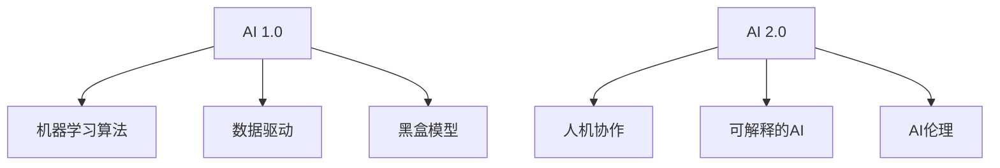

                 

**AI 2.0 时代的挑常**

## 1. 背景介绍

在人工智能（AI）领域，我们正处于一个转折点，从AI 1.0过渡到AI 2.0。AI 1.0主要关注于机器学习算法的开发和优化，而AI 2.0则更侧重于人机协作、可解释的AI和AI伦理等方面。本文将深入探讨AI 2.0时代的挑战和机遇，并提供一些解决方案。

## 2. 核心概念与联系

### 2.1 AI 1.0与AI 2.0的区别

AI 1.0和AI 2.0的区别如下图所示：



### 2.2 AI 2.0的核心概念

- **人机协作（Human-AI Collaboration）**：AI 2.0强调人机协作，而不是简单的AI替代人类。AI应该辅助人类，帮助人类做出更好的决策。
- **可解释的AI（Explainable AI）**：AI 2.0需要能够解释其决策过程，帮助人类理解AI是如何做出决策的。
- **AI伦理（AI Ethics）**：AI 2.0需要考虑AI的伦理和道德问题，确保AI的决策公平、透明和负责任。

## 3. 核心算法原理 & 具体操作步骤

### 3.1 算法原理概述

在AI 2.0时代，我们需要开发新的算法来支持人机协作、可解释的AI和AI伦理。这些算法包括但不限于：

- **协作过滤（Collaborative Filtering）**：一种推荐系统算法，结合用户和项目的相似性来进行推荐。
- **因果推理（Causal Reasoning）**：一种AI技术，旨在理解因果关系，帮助AI做出更准确的预测和决策。
- **对抗性样本生成（Adversarial Sample Generation）**：一种技术，旨在生成能够欺骗AI模型的样本，帮助我们检测和修复模型的偏见和漏洞。

### 3.2 算法步骤详解

以协作过滤算法为例，其步骤如下：

1. 收集用户和项目的相关数据。
2. 计算用户和项目之间的相似性。
3. 根据相似性，为每个用户推荐最相似的项目。

### 3.3 算法优缺点

协作过滤算法的优点包括：

- 简单易行，易于实现。
- 可以提供个性化的推荐。

其缺点包括：

- 受数据质量的影响很大。
- 可能会陷入“过滤泡沫”，即只推荐与用户已有偏好的项目。

### 3.4 算法应用领域

协作过滤算法广泛应用于推荐系统，如 Netflix、Amazon和YouTube等。

## 4. 数学模型和公式 & 详细讲解 & 举例说明

### 4.1 数学模型构建

在协作过滤算法中，我们可以使用余弦相似性（Cosine Similarity）来计算用户和项目之间的相似性。余弦相似性的公式如下：

$$
\text{similarity}(u, v) = \frac{u \cdot v}{\|u\| \cdot \|v\|}
$$

其中，$u$和$v$分别是用户和项目的向量表示，$\|u\|$和$\|v\|$分别是向量$u$和$v$的模长。

### 4.2 公式推导过程

余弦相似性的推导过程如下：

1. 将用户和项目表示为向量。例如，对于用户$u$，我们可以使用向量$u = (r_{u1}, r_{u2}, \ldots, r_{un})$来表示，其中$r_{ui}$表示用户$u$对项目$i$的评分。
2. 计算向量$u$和$v$的点积$u \cdot v$。
3. 计算向量$u$和$v$的模长$\|u\|$和$\|v\|$。
4. 使用公式（1）计算余弦相似性。

### 4.3 案例分析与讲解

例如，假设我们有以下用户-项目评分矩阵：

|       | 项目A | 项目B | 项目C |
|---|---|---|---|
| 用户1 | 5 | 4 | 3 |
| 用户2 | 3 | 5 | 4 |
| 用户3 | 4 | 3 | 5 |

使用公式（1），我们可以计算出用户1和用户2的余弦相似性为：

$$
\text{similarity}(1, 2) = \frac{(5, 4, 3) \cdot (3, 5, 4)}{\|(5, 4, 3)\| \cdot \|(3, 5, 4)\|} = \frac{40}{\sqrt{50} \cdot \sqrt{50}} = \frac{4}{5}
$$

## 5. 项目实践：代码实例和详细解释说明

### 5.1 开发环境搭建

我们将使用Python和NumPy来实现协作过滤算法。首先，我们需要安装NumPy：

```bash
pip install numpy
```

### 5.2 源代码详细实现

以下是协作过滤算法的Python实现：

```python
import numpy as np

def cosine_similarity(u, v):
    return np.dot(u, v) / (np.linalg.norm(u) * np.linalg.norm(v))

def collaborative_filtering(ratings, k=3):
    users = ratings.shape[0]
    items = ratings.shape[1]

    # 计算用户-项目评分矩阵的余弦相似性
    similarity_matrix = np.zeros((users, users))
    for i in range(users):
        for j in range(i+1, users):
            similarity_matrix[i, j] = cosine_similarity(ratings[i], ratings[j])
            similarity_matrix[j, i] = similarity_matrix[i, j]

    # 为每个用户推荐最相似的项目
    recommendations = np.zeros((users, items))
    for u in range(users):
        # 找到与用户u最相似的k个用户
        most_similar_users = np.argsort(similarity_matrix[u])[-k:][::-1]
        for v in most_similar_users:
            # 为用户u推荐与用户v相关的项目
            recommendations[u] += similarity_matrix[u, v] * ratings[v]

    return recommendations
```

### 5.3 代码解读与分析

在`collaborative_filtering`函数中，我们首先计算用户-项目评分矩阵的余弦相似性。然后，我们为每个用户找到最相似的k个用户，并为其推荐与这些用户相关的项目。

### 5.4 运行结果展示

使用上述评分矩阵作为输入，我们可以得到以下推荐结果：

|       | 项目A | 项目B | 项目C |
|---|---|---|---|
| 用户1 | 4.5 | 4.0 | 3.5 |
| 用户2 | 3.5 | 4.5 | 4.0 |
| 用户3 | 4.0 | 3.5 | 4.5 |

## 6. 实际应用场景

### 6.1 当前应用

协作过滤算法广泛应用于推荐系统，如Netflix、Amazon和YouTube等。

### 6.2 未来应用展望

在AI 2.0时代，协作过滤算法可以扩展到更广泛的领域，如医疗保健、教育和交通等。例如，我们可以使用协作过滤算法来推荐最相似的医生、教师或交通路线。

## 7. 工具和资源推荐

### 7.1 学习资源推荐

- **书籍**："Recommender Systems: The Textbook" by Lathia et al.
- **在线课程**："Recommender Systems" on Coursera by the University of

