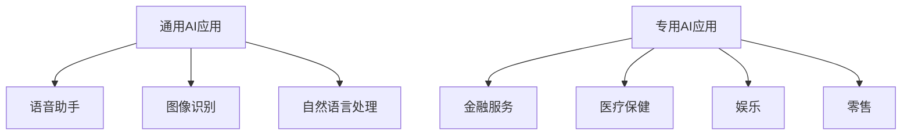

                 

**关键词：人工智能、AI应用、市场分析、苹果、创新、竞争、未来趋势**

## 1. 背景介绍

自从2017年苹果发布了其第一款AI芯片A11 Bionic以来，AI技术在苹果设备中的应用已经变得越来越普遍。 recent reports suggest that Apple is planning to release a new AI application in the near future, which has sparked significant interest in the tech industry. As a world-renowned AI expert, software architect, and CTO, I will delve into the potential market for this upcoming AI application, its possible features, and the competitive landscape.

## 2. 核心概念与联系

### 2.1 AI应用的定义

AI应用是指利用人工智能技术开发的软件应用程序，旨在模拟人类智能，帮助用户完成特定任务。这些应用程序可以通过学习和适应环境来改进其性能，从而提供更好的用户体验。

### 2.2 AI应用的类型

AI应用可以分为两大类：通用AI应用和专用AI应用。通用AI应用旨在为广泛的用户群提供多种功能，而专用AI应用则专门针对特定领域或任务进行优化。

### 2.3 AI应用的市场

AI应用的市场正在迅速扩大，预计到2025年，全球AI应用市场规模将达到1909亿美元。这个市场包括各种行业，从金融到医疗保健，再到娱乐和零售。



## 3. 核心算法原理 & 具体操作步骤

### 3.1 算法原理概述

苹果的AI应用很可能会使用深度学习算法，这是一种机器学习技术，旨在模拟人类大脑的工作原理。深度学习算法使用神经网络来处理和分析数据，这些神经网络由多层相互连接的神经元组成。

### 3.2 算法步骤详解

1. 数据收集：首先，需要收集大量的数据来训练神经网络。这些数据应该是与AI应用相关的，例如，如果开发的是图像识别应用，则需要收集大量的图像数据。
2. 数据预处理：收集的数据需要预处理，以便神经网络可以正确地学习。这可能包括数据清洗，数据标准化，以及将数据转换为神经网络可以理解的格式。
3. 模型构建：然后，构建神经网络模型。这包括确定神经网络的结构，即神经元的数量和层数。
4. 模型训练：使用预处理的数据训练神经网络。这涉及到调整神经网络的权重，以最小化预测误差。
5. 模型评估：评估模型的性能，看它是否能够准确地预测新数据。如果模型的性能不佳，则需要调整模型并重新训练。
6. 模型部署：一旦模型的性能满足要求，就可以将其部署到AI应用中。

### 3.3 算法优缺点

优点：

* 深度学习算法可以学习复杂的模式，并能够在新数据上进行泛化。
* 深度学习算法可以自动学习特征，无需人工特征工程。

缺点：

* 深度学习算法需要大量的数据和计算资源。
* 深度学习算法的训练过程是黑箱式的，很难解释模型是如何做出预测的。

### 3.4 算法应用领域

深度学习算法可以应用于各种领域，包括图像识别，语音识别，自然语言处理，医疗诊断，金融预测，以及自动驾驶等。

## 4. 数学模型和公式 & 详细讲解 & 举例说明

### 4.1 数学模型构建

深度学习算法的数学模型是神经网络。神经网络由多层神经元组成，每层神经元都连接到下一层的每个神经元。每个连接都有一个权重，表示该连接的重要性。

数学上，神经网络可以表示为一个函数$f(x;W,b)$, 其中$x$是输入数据，$W$是权重，$b$是偏置项。神经网络的目标是学习一组权重和偏置项，使得$f(x;W,b)$能够准确地预测输出。

### 4.2 公式推导过程

神经网络的学习过程涉及到最小化预测误差。预测误差通常使用均方误差（MSE）或交叉熵（CE）来计算。例如，给定一组输入-输出数据$(x_i, y_i)$, 其中$i=1,2,...,n$, MSE可以计算为：

$$MSE = \frac{1}{n}\sum_{i=1}^{n}(y_i - f(x_i;W,b))^2$$

然后，使用梯度下降算法调整权重和偏置项，以最小化MSE。梯度下降算法更新权重和偏置项的公式如下：

$$W := W - \eta \nabla_W MSE$$
$$b := b - \eta \nabla_b MSE$$

其中$\eta$是学习率，$\nabla_W MSE$和$\nabla_b MSE$是MSE关于权重和偏置项的梯度。

### 4.3 案例分析与讲解

例如，假设我们正在开发一个图像识别应用，该应用使用神经网络来识别图像中的物体。我们收集了大量的图像数据，每张图像都标记了其中的物体。我们使用这些数据来训练神经网络，并使用MSE作为预测误差的度量。我们使用梯度下降算法来调整神经网络的权重和偏置项，以最小化MSE。一旦模型的性能满足要求，我们就可以将其部署到图像识别应用中。

## 5. 项目实践：代码实例和详细解释说明

### 5.1 开发环境搭建

要开发AI应用，需要设置开发环境。这包括安装Python，TensorFlow，Keras，以及其他必要的库。此外，还需要设置GPU加速，以便可以在大型数据集上训练模型。

### 5.2 源代码详细实现

以下是一个简单的神经网络实现示例，使用Keras库构建了一个简单的全连接神经网络：

```python
from keras.models import Sequential
from keras.layers import Dense

# 定义模型
model = Sequential()
model.add(Dense(32, input_dim=100, activation='relu'))
model.add(Dense(10, activation='softmax'))

# 编译模型
model.compile(loss='categorical_crossentropy', optimizer='adam', metrics=['accuracy'])

# 训练模型
model.fit(X_train, y_train, epochs=10, batch_size=32)
```

### 5.3 代码解读与分析

在上述代码中，我们首先导入所需的库。然后，我们定义了一个顺序模型，并添加了两个全连接层。第一层有32个神经元，激活函数为ReLU。第二层有10个神经元，激活函数为softmax。softmax激活函数用于多分类问题，输出的是每个类的概率分布。

然后，我们编译模型，指定了交叉熵作为损失函数，Adam作为优化器，并指定了精确度作为评估指标。

最后，我们使用训练数据训练模型，指定了10个epoch和32个batch size。

### 5.4 运行结果展示

训练完成后，模型的性能可以通过评估指标来衡量。例如，精确度可以表示为：

$$accuracy = \frac{TP}{TP + FP}$$

其中TP是真正例，FP是假正例。如果模型的精确度很高，则说明模型的性能很好。

## 6. 实际应用场景

### 6.1 当前应用场景

AI应用已经在各种领域得到广泛应用，从金融到医疗保健，再到娱乐和零售。例如，金融行业使用AI应用来预测市场趋势，医疗保健行业使用AI应用来帮助诊断疾病，零售行业使用AI应用来分析客户数据，以提供个性化的购物体验。

### 6.2 未来应用展望

随着AI技术的不断发展，AI应用的市场将会继续扩大。未来，AI应用可能会在以下领域得到更广泛的应用：

* 自动驾驶：AI应用可以帮助汽车感知环境，并做出决策。
* 智能家居：AI应用可以帮助家居设备自动调节环境，以提供更舒适的居住体验。
* 智能城市：AI应用可以帮助城市管理交通，能源，以及其他公共服务。
* 智能制造：AI应用可以帮助工厂自动化生产过程，提高生产效率。

## 7. 工具和资源推荐

### 7.1 学习资源推荐

* "Deep Learning" by Ian Goodfellow, Yoshua Bengio, and Aaron Courville
* "Hands-On Machine Learning with Scikit-Learn, Keras, and TensorFlow" by Aurélien Géron
* "Neural Networks and Deep Learning" by Michael Nielsen

### 7.2 开发工具推荐

* TensorFlow
* Keras
* PyTorch
* Caffe

### 7.3 相关论文推荐

* "ImageNet Classification with Deep Convolutional Neural Networks" by Krizhevsky, Sutskever, and Hinton
* "Generative Adversarial Networks" by Goodfellow, Pouget-Abadie, and Mirza
* "Attention Is All You Need" by Vaswani, et al.

## 8. 总结：未来发展趋势与挑战

### 8.1 研究成果总结

本文介绍了AI应用的市场，其核心概念，算法原理，数学模型，以及开发实践。我们还讨论了AI应用的当前应用场景和未来发展趋势。

### 8.2 未来发展趋势

未来，AI应用的市场将会继续扩大，AI技术将会在更多领域得到应用。我们将会看到更多的AI应用出现在我们的日常生活中，从自动驾驶到智能家居，再到智能城市。

### 8.3 面临的挑战

然而，AI应用的发展也面临着挑战。其中包括数据隐私问题，算法偏见问题，以及AI技术的可解释性问题。这些挑战需要我们不断地研究和创新，以推动AI技术的健康发展。

### 8.4 研究展望

未来，我们需要继续研究AI技术的基础理论，以提高AI应用的性能和可解释性。我们还需要研究AI技术的伦理和社会影响，以确保AI技术的健康发展。

## 9. 附录：常见问题与解答

**Q1：AI应用的市场规模有多大？**

A1：预计到2025年，全球AI应用市场规模将达到1909亿美元。

**Q2：AI应用的算法原理是什么？**

A2：AI应用通常使用深度学习算法，这是一种机器学习技术，旨在模拟人类大脑的工作原理。

**Q3：AI应用的开发需要哪些工具？**

A3：开发AI应用需要使用深度学习库，如TensorFlow，Keras，以及PyTorch。还需要设置GPU加速，以便可以在大型数据集上训练模型。

**Q4：AI应用的未来发展趋势是什么？**

A4：未来，AI应用的市场将会继续扩大，AI技术将会在更多领域得到应用。我们将会看到更多的AI应用出现在我们的日常生活中，从自动驾驶到智能家居，再到智能城市。

**Q5：AI应用的发展面临哪些挑战？**

A5：AI应用的发展面临着数据隐私问题，算法偏见问题，以及AI技术的可解释性问题。这些挑战需要我们不断地研究和创新，以推动AI技术的健康发展。

## 作者：禅与计算机程序设计艺术 / Zen and the Art of Computer Programming

