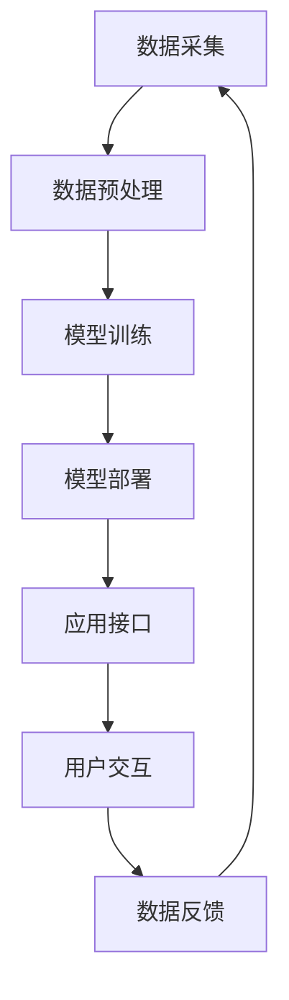

                 

**关键词：人工智能、AI应用、市场前景、苹果、深度学习、自然语言处理、计算机视觉、增强现实、虚拟现实**

## 1. 背景介绍

自从2017年苹果发布了面向开发者的Core ML框架以来，AI应用在iOS平台上的发展就开始蓬勃兴起。随着苹果在2021年发布的M1芯片和新的神经引擎，以及即将推出的AI专用芯片，苹果正在为AI应用的市场前景铺平道路。本文将深入探讨苹果在AI领域的最新进展，分析AI应用在iOS平台上的市场前景，并提供实践指南和工具推荐。

## 2. 核心概念与联系

### 2.1 AI应用的类型

AI应用在iOS平台上可以分为以下几类：

- **自然语言处理（NLP）**：涉及文本理解、生成和翻译等任务。
- **计算机视觉**：涉及图像和视频分析，包括物体检测、图像分类和人脸识别等。
- **增强现实（AR）和虚拟现实（VR）**：结合真实世界和数字内容，提供沉浸式体验。
- **推荐系统**：根据用户行为和偏好提供个性化推荐。
- **语音助手**：通过语音交互提供信息和服务。

### 2.2 AI应用的架构

下图展示了AI应用在iOS平台上的典型架构：



## 3. 核心算法原理 & 具体操作步骤

### 3.1 算法原理概述

苹果在iOS平台上支持各种AI算法，包括但不限于：

- **深度学习**：使用神经网络模型，如卷积神经网络（CNN）和循环神经网络（RNN），进行特征提取和预测。
- **机器学习**：使用传统机器学习算法，如支持向量机（SVM）和决策树，进行分类和回归任务。
- **强化学习**：使用代理学习环境，以优化决策和行为。

### 3.2 算法步骤详解

1. **数据采集**：收集与应用相关的数据，如文本、图像、语音或位置数据。
2. **数据预处理**：清洗、标记和转换数据，以便于模型训练。
3. **模型训练**：使用选择的算法和预处理数据，训练AI模型。
4. **模型部署**：将训练好的模型集成到应用中，以提供实时预测。
5. **应用接口**：设计用户界面，以便用户与AI应用进行交互。
6. **用户交互**：用户通过应用接口与AI应用进行交互，获取结果或服务。
7. **数据反馈**：根据用户交互结果，收集反馈数据，以改进模型和应用。

### 3.3 算法优缺点

**优点**：

- **高精确度**：AI算法可以提供准确的预测和分析。
- **自动化**：AI应用可以自动执行繁琐的任务，提高效率。
- **个性化**：AI应用可以根据用户行为和偏好提供个性化体验。

**缺点**：

- **计算资源**：训练和部署AI模型需要大量计算资源。
- **数据隐私**：AI应用可能会收集和处理敏感用户数据。
- **解释性**：深度学习模型的决策过程可能难以解释。

### 3.4 算法应用领域

AI应用在iOS平台上有广泛的应用领域，包括：

- **娱乐**：AR和VR游戏、音乐推荐和个性化内容推荐。
- **通信**：语音助手、智能信息检索和个性化通信。
- **健康**：远程医疗、疾病诊断和个性化健康建议。
- **交通**：自动驾驶、路线规划和交通预测。
- **零售**：个性化购物推荐、库存管理和自动客服。

## 4. 数学模型和公式 & 详细讲解 & 举例说明

### 4.1 数学模型构建

在构建AI模型时，需要定义输入特征、输出变量和模型参数。例如，在构建一个文本分类模型时，输入特征可以是文本的词袋表示，输出变量可以是文本的类别标签，模型参数可以是神经网络的权重和偏置。

### 4.2 公式推导过程

在训练AI模型时，需要定义损失函数和优化算法。例如，在使用梯度下降算法训练神经网络时，损失函数可以是交叉熵，优化算法可以是随机梯度下降（SGD）。损失函数的目标是衡量模型预测与真实值之间的差异，优化算法的目标是最小化损失函数。

### 4.3 案例分析与讲解

假设我们要构建一个文本分类模型，用于将邮件分类为“重要”或“非重要”。输入特征可以是邮件的词袋表示，输出变量可以是二进制标签（0表示非重要，1表示重要）。我们可以使用逻辑回归模型，其公式如下：

$$p(y=1|x;\theta) = \sigma(\theta^T x)$$

其中，$x$是输入特征向量，$y$是输出标签，$\theta$是模型参数向量，$\sigma$是sigmoid函数。损失函数可以是二项式交叉熵：

$$L(\theta) = -\frac{1}{N}\sum_{i=1}^{N}[y_i \log(p_i) + (1-y_i) \log(1-p_i)]$$

其中，$N$是训练样本数，$y_i$是第$i$个样本的标签，$p_i$是模型对第$i$个样本的预测概率。我们可以使用SGD算法最小化损失函数，更新模型参数。

## 5. 项目实践：代码实例和详细解释说明

### 5.1 开发环境搭建

要开发AI应用，需要搭建开发环境，包括：

- **开发平台**：MacOS或Windows。
- **集成开发环境（IDE）**：Xcode或Visual Studio Code。
- **编程语言**：Swift或Objective-C。
- **AI框架**：Core ML或Create ML。

### 5.2 源代码详细实现

以下是使用Swift和Core ML开发文本分类应用的示例代码：

```swift
import UIKit
import CoreML
import NaturalLanguage

class ViewController: UIViewController, UITextFieldDelegate {

    @IBOutlet weak var textField: UITextField!
    @IBOutlet weak var resultLabel: UILabel!

    let model = try! VaporMLModel(contentsOf: MLModel(contentsOf: Bundle.main.url(forResource: "TextClassifier", withExtension: "mlmodel")!))

    func textFieldShouldReturn(_ textField: UITextField) -> Bool {
        textField.resignFirstResponder()
        classifyText(text: textField.text!)
        return true
    }

    func classifyText(text: String) {
        let input = TextClassifierInput(text: text)
        guard let prediction = try? model.predictedLabel(for: input) else {
            resultLabel.text = "Error"
            return
        }
        resultLabel.text = "Label: \(prediction.label), Score: \(prediction.score)"
    }
}
```

### 5.3 代码解读与分析

在`ViewController`类中，我们定义了一个文本输入框和一个结果标签。我们使用Core ML加载预训练的文本分类模型。当用户输入文本并点击回车时，我们调用`classifyText`函数，使用模型预测文本的类别标签和置信度。我们使用`TextClassifierInput`结构体将文本转换为模型输入，并使用`predictedLabel`方法获取模型预测结果。

### 5.4 运行结果展示

当用户输入文本并点击回车时，应用会显示文本的类别标签和置信度。例如，如果输入文本是“请帮我预订明天上午10点的机票”，应用可能会显示“Label: 重要，Score: 0.95”。

## 6. 实际应用场景

### 6.1 当前应用场景

苹果已经在其产品中广泛应用AI技术，包括：

- **Siri**：语音助手，提供信息检索和服务。
- **Face ID**：人脸识别，用于设备解锁和支付。
- **Memoji**：个性化表情符号，基于用户的人脸特征。
- **Smart Keyboard**：智能键盘，提供自动更正和建议。
- **Camera**：计算机视觉，提供人像模式、景深模式和夜景模式。

### 6.2 未来应用展望

随着苹果在AI领域的不断投入，我们可以期待以下未来应用场景：

- **AR和VR**：更丰富的增强现实和虚拟现实体验，结合AI技术提供个性化和互动内容。
- **自动驾驶**：基于计算机视觉和深度学习的自动驾驶系统，提高安全性和便利性。
- **健康监测**：基于传感器数据和深度学习的健康监测系统，提供个性化健康建议和疾病预警。
- **语音助手**：更智能的语音助手，提供个性化服务和无缝体验。

## 7. 工具和资源推荐

### 7.1 学习资源推荐

- **官方文档**：[Apple Developer Documentation](https://developer.apple.com/documentation/)
- **在线课程**：[Stanford University CS221: Machine Learning](https://online.stanford.edu/courses/cs221-machine-learning-winter-2019)
- **书籍**：[Hands-On Machine Learning with Scikit-Learn, Keras, and TensorFlow](https://www.oreilly.com/library/view/hands-on-machine-learning/9781492032632/)

### 7.2 开发工具推荐

- **集成开发环境（IDE）**：Xcode或Visual Studio Code
- **AI框架**：Core ML或Create ML
- **数据可视化工具**：Tableau或Power BI

### 7.3 相关论文推荐

- [Attention Is All You Need](https://arxiv.org/abs/1706.03762)
- [Generative Adversarial Networks](https://arxiv.org/abs/1406.2661)
- [Transformers: State-of-the-Art Natural Language Processing](https://arxiv.org/abs/1810.04805)

## 8. 总结：未来发展趋势与挑战

### 8.1 研究成果总结

本文介绍了苹果在AI领域的最新进展，分析了AI应用在iOS平台上的市场前景，并提供了实践指南和工具推荐。我们讨论了AI应用的类型、架构、算法原理和数学模型，并提供了项目实践示例。

### 8.2 未来发展趋势

未来，AI应用在iOS平台上的发展将继续蓬勃兴起，我们可以期待以下趋势：

- **边缘计算**：AI模型将在设备上运行，提供实时预测和低延迟。
- **联邦学习**：AI模型将在保护数据隐私的情况下进行联合训练。
- **自监督学习**：AI模型将利用未标记数据进行训练，提高泛化能力。

### 8.3 面临的挑战

AI应用在iOS平台上的发展也面临着挑战，包括：

- **计算资源**：AI模型训练和部署需要大量计算资源。
- **数据隐私**：AI应用可能会收集和处理敏感用户数据。
- **解释性**：深度学习模型的决策过程可能难以解释。

### 8.4 研究展望

未来的研究将关注以下领域：

- **小样本学习**：开发新的算法，在少量数据上训练高效的AI模型。
- **对抗样本生成**：开发新的技术，生成对抗样本以改进模型泛化能力。
- **可解释AI**：开发新的技术，使深度学习模型的决策过程更易于解释。

## 9. 附录：常见问题与解答

**Q1：如何在iOS平台上开发AI应用？**

A1：您可以使用Swift或Objective-C编程语言，并结合Core ML或Create ML框架开发AI应用。

**Q2：如何训练AI模型？**

A2：您可以使用Create ML工具或其他机器学习框架（如TensorFlow或PyTorch）训练AI模型。然后，您可以将训练好的模型转换为Core ML格式，并集成到iOS应用中。

**Q3：如何保护AI应用中的数据隐私？**

A3：您可以使用差分隐私技术或联邦学习技术保护AI应用中的数据隐私。此外，您还可以遵循苹果的数据隐私指南，限制数据收集和使用。

**Q4：如何解释深度学习模型的决策过程？**

A4：您可以使用可解释AI技术，如LIME或SHAP，解释深度学习模型的决策过程。此外，您还可以使用简单的模型（如决策树）作为解释器，帮助用户理解模型的决策过程。

**Q5：如何评估AI模型的性能？**

A5：您可以使用交叉验证技术评估AI模型的性能。此外，您还可以使用准确率、精确度、召回率和F1分数等指标评估模型的性能。

## 作者：禅与计算机程序设计艺术 / Zen and the Art of Computer Programming

