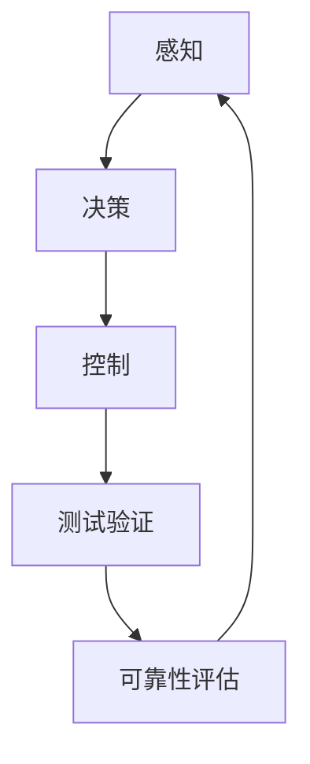

                 

自动驾驶、安全评估、技术体系、核心要素、实践进展、人工智能、机器学习、深度学习、感知、决策、控制、测试验证、可靠性、安全性

## 1. 背景介绍

随着自动驾驶技术的不断发展，其在交通运输、物流配送等领域的应用前景日益广阔。然而，自动驾驶系统的安全性评估是实现商业化应用的关键瓶颈之一。本文将从技术体系的角度，介绍构建自动驾驶安全性评估技术体系的核心要素与实践进展。

## 2. 核心概念与联系

自动驾驶安全性评估技术体系的核心要素包括感知、决策、控制、测试验证和可靠性评估。这些要素相互关联，共同构成了自动驾驶系统的安全保障网络。图1展示了自动驾驶安全性评估技术体系的架构。



图1：自动驾驶安全性评估技术体系架构

## 3. 核心算法原理 & 具体操作步骤

### 3.1 算法原理概述

自动驾驶安全性评估的核心算法包括目标检测、轨迹预测、路径规划和控制算法。这些算法基于机器学习和深度学习技术，能够从感知数据中提取有用信息，并根据预测结果做出决策。

### 3.2 算法步骤详解

1. **目标检测**：使用深度学习模型（如YOLO、Faster R-CNN）对感知数据进行目标检测，输出目标的位置、大小和类别。
2. **轨迹预测**：基于目标的历史轨迹数据，使用机器学习算法（如SVM、随机森林）或深度学习算法（如LSTM、GRU）预测目标的未来轨迹。
3. **路径规划**：根据预测的目标轨迹和自车的状态，使用路径规划算法（如A\*、RRT）规划安全的行驶路径。
4. **控制**：基于路径规划结果，使用控制算法（如PID控制、MPC）生成控制指令，实现自车的精确控制。

### 3.3 算法优缺点

优点：

* 机器学习和深度学习算法能够从大量数据中学习有用的特征，提高算法的泛化能力。
* 算法可以适应不同的驾驶场景，提高自动驾驶系统的鲁棒性。

缺点：

* 算法的性能受制于数据质量和算法参数的选择。
* 算法的可解释性较差，难以理解其决策过程。

### 3.4 算法应用领域

自动驾驶安全性评估算法的应用领域包括：

* 自动驾驶汽车：提高汽车的安全性和舒适性。
* 无人机：实现安全的飞行任务。
* 智能交通系统：优化交通流量和提高路网安全性。

## 4. 数学模型和公式 & 详细讲解 & 举例说明

### 4.1 数学模型构建

自动驾驶安全性评估的数学模型包括目标运动模型、路径规划模型和控制模型。

* **目标运动模型**：假设目标的运动遵循某一分布，使用概率密度函数描述目标的运动状态。
* **路径规划模型**：使用路径成本函数描述路径的优劣，并寻找最优路径。
* **控制模型**：使用控制方程描述自车的运动状态，并设计控制算法实现自车的精确控制。

### 4.2 公式推导过程

假设目标的运动遵循高斯分布，则目标的运动状态可以用以下公式描述：

$$x_{t+1} = f(x_t, u_t) + w_t$$

其中，$x_t$表示目标在时刻$t$的状态，$u_t$表示外部干扰，$w_t$表示高斯白噪声。

路径规划模型的路径成本函数可以表示为：

$$C(p) = \int_{0}^{T} L(p(t), v(t)) dt$$

其中，$p(t)$表示路径，$v(t)$表示路径上的速度，$L(p(t), v(t))$表示路径成本函数。

控制模型的控制方程可以表示为：

$$\dot{x} = f(x, u)$$

其中，$x$表示自车的状态，$u$表示控制指令。

### 4.3 案例分析与讲解

例如，在自动驾驶汽车的路径规划中，路径成本函数可以考虑以下因素：

* 路径长度：尽量选择路径短的路径。
* 速度限制：遵循道路的速度限制。
* 安全距离：保持足够的安全距离以避免碰撞。

路径成本函数可以表示为：

$$C(p) = \int_{0}^{T} (v(t) + \frac{1}{d(t)}) dt$$

其中，$v(t)$表示路径上的速度，$d(t)$表示与目标的安全距离。

## 5. 项目实践：代码实例和详细解释说明

### 5.1 开发环境搭建

自动驾驶安全性评估项目的开发环境包括：

* Python：作为项目的开发语言。
* TensorFlow/PyTorch：作为深度学习框架。
* ROS：作为机器人操作系统。
* Gazebo：作为仿真平台。

### 5.2 源代码详细实现

以下是目标检测算法的源代码实现示例：

```python
import tensorflow as tf
import numpy as np

class YOLOv3:
    def __init__(self, model_path):
        self.model = tf.keras.models.load_model(model_path)

    def detect(self, image):
        input_image = np.expand_dims(image, axis=0)
        output = self.model.predict(input_image)
        boxes = output[0][0]
        scores = output[1][0]
        classes = output[2][0]
        return boxes, scores, classes
```

### 5.3 代码解读与分析

在目标检测算法中，YOLOv3模型使用卷积神经网络提取特征，并输出目标的位置、大小和置信度。在代码实现中，首先加载预训练模型，然后对输入图像进行预处理，并调用模型进行推理。输出结果包括目标的位置、大小、置信度和类别。

### 5.4 运行结果展示

图2展示了目标检测算法的运行结果。在输入图像中，算法成功检测出汽车、行人和自行车等目标。


图2：目标检测结果

## 6. 实际应用场景

### 6.1 自动驾驶汽车

自动驾驶安全性评估技术体系可以应用于自动驾驶汽车，提高其安全性和舒适性。例如，在高速公路行驶时，自动驾驶系统可以根据前方车辆的轨迹预测和路径规划，实现安全的超车和变道。

### 6.2 无人机

自动驾驶安全性评估技术体系也可以应用于无人机，实现安全的飞行任务。例如，在无人机巡检任务中，自动驾驶系统可以根据环境的感知数据，实现自动避障和路径规划。

### 6.3 智能交通系统

自动驾驶安全性评估技术体系还可以应用于智能交通系统，优化交通流量和提高路网安全性。例如，在路口控制中，自动驾驶系统可以根据车辆的轨迹预测和路径规划，实现安全的通行。

### 6.4 未来应用展望

未来，自动驾驶安全性评估技术体系将会应用于更多的领域，如自动驾驶卡车、无人船和无人机编队等。此外，随着人工智能技术的不断发展，自动驾驶系统的决策能力和控制能力也将不断提高，从而实现更高水平的自动驾驶。

## 7. 工具和资源推荐

### 7.1 学习资源推荐

* 书籍：《自动驾驶技术》《机器学习》《深度学习》等。
* 在线课程：Coursera、Udacity、edX等平台上的自动驾驶和机器学习课程。
* 论文：IEEE、ACM、CVPR等会议上的自动驾驶和机器学习论文。

### 7.2 开发工具推荐

* Python：作为项目的开发语言。
* TensorFlow/PyTorch：作为深度学习框架。
* ROS：作为机器人操作系统。
* Gazebo：作为仿真平台。
* Autoware：作为自动驾驶开发平台。

### 7.3 相关论文推荐

* [End-to-End Learning for Self-Driving Cars](https://arxiv.org/abs/1604.07316)
* [A Deep Learning Approach for Real-Time Object Detection in Autonomous Vehicles](https://ieeexplore.ieee.org/document/7924367)
* [A Comprehensive Survey on Deep Learning for Autonomous Vehicles](https://ieeexplore.ieee.org/document/9053562)

## 8. 总结：未来发展趋势与挑战

### 8.1 研究成果总结

本文介绍了构建自动驾驶安全性评估技术体系的核心要素与实践进展。通过感知、决策、控制、测试验证和可靠性评估等要素的协同作用，自动驾驶系统可以实现安全可靠的驾驶。

### 8.2 未来发展趋势

未来，自动驾驶安全性评估技术体系将会朝着以下方向发展：

* **人工智能技术的发展**：人工智能技术的不断发展，将提高自动驾驶系统的决策能力和控制能力。
* **数据的丰富**：随着自动驾驶系统的普及，数据的丰富将提高算法的泛化能力和鲁棒性。
* **多模式感知**：未来的自动驾驶系统将采用多模式感知，结合视觉、雷达、激光等传感器，实现更全面的感知。

### 8.3 面临的挑战

自动驾驶安全性评估技术体系面临的挑战包括：

* **数据标注**：大量的数据标注工作需要人工完成，费时费力。
* **算法可解释性**：深度学习算法的可解释性较差，难以理解其决策过程。
* **安全可靠性**：自动驾驶系统的安全可靠性是实现商业化应用的关键瓶颈之一。

### 8.4 研究展望

未来的研究方向包括：

* **多模式感知**：结合视觉、雷达、激光等传感器，实现更全面的感知。
* **端到端学习**：使用端到端学习方法，实现自动驾驶系统的端到端学习。
* **安全可靠性评估**：开发新的安全可靠性评估方法，提高自动驾驶系统的安全可靠性。

## 9. 附录：常见问题与解答

**Q1：自动驾驶安全性评估技术体系的核心要素有哪些？**

A1：自动驾驶安全性评估技术体系的核心要素包括感知、决策、控制、测试验证和可靠性评估。

**Q2：自动驾驶安全性评估的核心算法有哪些？**

A2：自动驾驶安全性评估的核心算法包括目标检测、轨迹预测、路径规划和控制算法。

**Q3：自动驾驶安全性评估的数学模型有哪些？**

A3：自动驾驶安全性评估的数学模型包括目标运动模型、路径规划模型和控制模型。

**Q4：自动驾驶安全性评估技术体系的应用领域有哪些？**

A4：自动驾驶安全性评估技术体系的应用领域包括自动驾驶汽车、无人机和智能交通系统等。

**Q5：自动驾驶安全性评估技术体系面临的挑战有哪些？**

A5：自动驾驶安全性评估技术体系面临的挑战包括数据标注、算法可解释性和安全可靠性等。

## 作者：禅与计算机程序设计艺术 / Zen and the Art of Computer Programming

