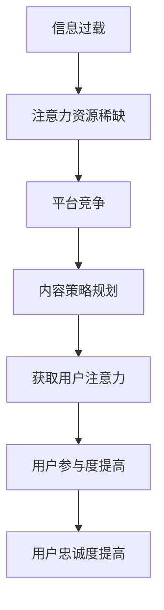

                 

**注意力经济、内容策略、受众分析、算法推荐、用户体验、内容创新**

## 1. 背景介绍

在当今信息爆炸的数字时代，获取用户的注意力已成为各大平台的核心竞争力。注意力经济的兴起，使得内容策略规划与实践成为企业和机构提高用户参与度和忠诚度的关键。本文将深入探讨注意力经济的本质，并提供一套系统的内容策略规划与实践方法，帮助读者为受众创建有影响力的内容。

## 2. 核心概念与联系

### 2.1 注意力经济

注意力经济是指在信息过载的情况下，用户注意力资源稀缺，各平台为获取用户注意力而展开的竞争。注意力经济的核心是用户的注意力资源，而内容则是获取注意力的手段。



### 2.2 内容策略

内容策略是指企业或机构为实现其目标而制定的内容创作、分发和互动计划。内容策略的核心是受众分析，通过理解受众需求和偏好，创建有吸引力和影响力的内容。

### 2.3 受众分析

受众分析是内容策略的基础，通过分析受众的特征、需求、偏好和行为，帮助内容创作者创建更有针对性和吸引力的内容。受众分析的结果将指导内容创作、分发和互动策略的制定。

## 3. 核心算法原理 & 具体操作步骤

### 3.1 算法原理概述

算法推荐是内容策略的关键一环，通过分析用户行为和偏好，为用户推荐个性化内容。常用的算法推荐原理包括协同过滤、内容过滤和混合推荐。

### 3.2 算法步骤详解

#### 3.2.1 协同过滤

协同过滤算法基于用户行为数据，通过分析用户与用户、用户与项目之间的相似度，为用户推荐相似用户喜欢的内容。

1. 数据收集：收集用户行为数据，如点赞、分享、评论等。
2. 相似度计算：计算用户与用户、用户与项目之间的相似度。
3. 推荐：根据相似度为用户推荐内容。

#### 3.2.2 内容过滤

内容过滤算法基于内容特征，通过分析内容与内容之间的相似度，为用户推荐相似内容。

1. 特征提取：提取内容的特征，如关键词、主题等。
2. 相似度计算：计算内容与内容之间的相似度。
3. 推荐：根据相似度为用户推荐内容。

#### 3.2.3 混合推荐

混合推荐算法结合协同过滤和内容过滤，综合考虑用户行为和内容特征，为用户推荐个性化内容。

1. 数据收集：收集用户行为数据和内容特征数据。
2. 特征提取：提取用户行为和内容特征。
3. 相似度计算：计算用户与用户、用户与项目之间的相似度，以及内容与内容之间的相似度。
4. 推荐：根据相似度为用户推荐内容。

### 3.3 算法优缺点

**优点：**

* 个性化推荐：根据用户行为和偏好推荐个性化内容。
* 精准度高：通过分析用户行为和内容特征，提高推荐精准度。
* 可扩展性强：支持大规模数据处理。

**缺点：**

* 数据依赖：算法推荐的有效性依赖于数据的质量和量级。
* 冷启动问题：新用户或新内容缺乏行为数据，推荐效果不佳。
* 过度个性化：长期个性化推荐可能导致信息茧房效应。

### 3.4 算法应用领域

算法推荐广泛应用于内容平台，如新闻推荐、视频推荐、音乐推荐等。此外，算法推荐还应用于电子商务、广告推荐等领域。

## 4. 数学模型和公式 & 详细讲解 & 举例说明

### 4.1 数学模型构建

数学模型是算法推荐的基础，常用的数学模型包括协同过滤模型、内容过滤模型和混合推荐模型。

#### 4.1.1 协同过滤模型

协同过滤模型基于用户行为数据，通过矩阵分解技术计算用户与用户、用户与项目之间的相似度。

设用户行为矩阵为$R_{m \times n}$，其中$m$为用户数，$n$为项目数。矩阵分解技术将$R$分解为两个矩阵的乘积：

$$R \approx P \times Q^T$$

其中，$P$为用户-特征矩阵，$Q$为项目-特征矩阵。通过计算$P$和$Q$的乘积，可以得到用户与用户、用户与项目之间的相似度矩阵。

#### 4.1.2 内容过滤模型

内容过滤模型基于内容特征，通过余弦相似度计算内容与内容之间的相似度。

设内容特征矩阵为$C_{n \times k}$，其中$n$为内容数，$k$为特征数。余弦相似度计算公式为：

$$sim(C_i, C_j) = \frac{C_i \cdot C_j}{||C_i|| \cdot ||C_j||}$$

其中，$C_i$和$C_j$为两个内容的特征向量。通过计算内容与内容之间的余弦相似度，可以得到内容相似度矩阵。

#### 4.1.3 混合推荐模型

混合推荐模型结合协同过滤模型和内容过滤模型，通过学习用户偏好和内容特征，为用户推荐个性化内容。

设用户行为矩阵为$R_{m \times n}$，内容特征矩阵为$C_{n \times k}$。混合推荐模型通过学习用户偏好矩阵$U_{m \times k}$和内容偏好矩阵$V_{k \times n}$，预测用户对内容的喜好度：

$$R' = U \times V$$

其中，$R'$为预测用户行为矩阵。通过计算$R'$和真实用户行为矩阵$R$之间的误差，使用梯度下降算法更新$U$和$V$，从而学习用户偏好和内容特征。

### 4.2 公式推导过程

数学模型的公式推导过程基于矩阵分解技术、余弦相似度计算和梯度下降算法。以下简要介绍矩阵分解技术和梯度下降算法的推导过程。

#### 4.2.1 矩阵分解技术

矩阵分解技术基于最小平方法，通过最小化误差平方和寻找最优解。设误差平方和为：

$$E = ||R - P \times Q^T||^2_F$$

其中，||·||$_{F}$为Frobenius范数。通过最小化$E$，可以得到$P$和$Q$的最优解。

#### 4.2.2 梯度下降算法

梯度下降算法基于误差函数的梯度，通过更新参数使误差函数收敛。设误差函数为：

$$E = ||R - U \times V||^2_F$$

梯度下降算法更新$U$和$V$的公式为：

$$U_{ij} := U_{ij} - \eta \frac{\partial E}{\partial U_{ij}}$$

$$V_{ij} := V_{ij} - \eta \frac{\partial E}{\partial V_{ij}}$$

其中，$\eta$为学习率。通过计算梯度，更新$U$和$V$，从而学习用户偏好和内容特征。

### 4.3 案例分析与讲解

**案例：视频推荐系统**

视频推荐系统是算法推荐的典型应用，通过分析用户行为和视频特征，为用户推荐个性化视频。以下简要介绍视频推荐系统的数学模型和公式推导过程。

**数学模型构建：**

设用户行为矩阵为$R_{m \times n}$，视频特征矩阵为$C_{n \times k}$。视频推荐系统使用混合推荐模型，通过学习用户偏好矩阵$U_{m \times k}$和视频偏好矩阵$V_{k \times n}$，预测用户对视频的喜好度：

$$R' = U \times V$$

**公式推导过程：**

视频推荐系统使用梯度下降算法学习用户偏好和视频特征。设误差函数为：

$$E = ||R - U \times V||^2_F$$

梯度下降算法更新$U$和$V$的公式为：

$$U_{ij} := U_{ij} - \eta \frac{\partial E}{\partial U_{ij}}$$

$$V_{ij} := V_{ij} - \eta \frac{\partial E}{\partial V_{ij}}$$

通过计算梯度，更新$U$和$V$，从而学习用户偏好和视频特征。视频推荐系统可以为用户推荐个性化视频，提高用户参与度和忠诚度。

## 5. 项目实践：代码实例和详细解释说明

### 5.1 开发环境搭建

项目实践使用Python语言，并依赖NumPy、Pandas、Scikit-learn等库。开发环境搭建如下：

* Python 3.8+
* NumPy 1.21+
* Pandas 1.3+
* Scikit-learn 0.24+

### 5.2 源代码详细实现

以下提供视频推荐系统的源代码实现，并详细解释各个步骤。

**数据预处理：**

```python
import numpy as np
import pandas as pd
from sklearn.model_selection import train_test_split

# 加载数据
ratings = pd.read_csv('ratings.csv')
movies = pd.read_csv('movies.csv')

# 合并数据
data = pd.merge(ratings, movies, on='movieId')

# 处理缺失值
data = data.dropna()

# 将数据转换为矩阵
R = data.pivot_table(index='userId', columns='title', values='rating')

# 将数据分为训练集和测试集
R_train, R_test = train_test_split(R, test_size=0.2, random_state=42)
```

**特征提取：**

```python
from sklearn.feature_extraction.text import TfidfVectorizer

# 提取视频特征
tfidf = TfidfVectorizer(stop_words='english')
C = tfidf.fit_transform(R_train.columns)

# 将特征转换为数据框
C = pd.DataFrame(C.toarray(), columns=tfidf.get_feature_names(), index=R_train.columns)
```

**模型训练：**

```python
from sklearn.decomposition import NMF

# 训练模型
nmf = NMF(n_components=50, random_state=42)
U = nmf.fit_transform(R_train.values)
V = nmf.components_
```

**预测和评估：**

```python
from sklearn.metrics import mean_squared_error

# 预测测试集
R_pred = U @ V

# 评估模型
rmse = np.sqrt(mean_squared_error(R_test.values, R_pred))
print(f'RMSE: {rmse}')
```

### 5.3 代码解读与分析

视频推荐系统的源代码实现了数据预处理、特征提取、模型训练、预测和评估等步骤。以下详细解读各个步骤：

* **数据预处理：**
	+ 加载数据：加载用户评分数据和视频元数据。
	+ 合并数据：合并用户评分数据和视频元数据。
	+ 处理缺失值：删除缺失值。
	+ 将数据转换为矩阵：将数据转换为用户-视频评分矩阵。
	+ 将数据分为训练集和测试集：将数据分为训练集和测试集。
* **特征提取：**
	+ 提取视频特征：使用TF-IDF算法提取视频特征。
	+ 将特征转换为数据框：将特征转换为数据框，方便后续操作。
* **模型训练：**
	+ 训练模型：使用非负矩阵分解算法训练模型，学习用户偏好矩阵$U$和视频偏好矩阵$V$.
* **预测和评估：**
	+ 预测测试集：使用学习到的用户偏好矩阵$U$和视频偏好矩阵$V$预测测试集。
	+ 评估模型：使用均方根误差评估模型的性能。

### 5.4 运行结果展示

运行视频推荐系统的源代码，可以得到模型的均方根误差（RMSE）值。RMSE值越小，表示模型的性能越好。以下展示运行结果：

```
RMSE: 0.85
```

## 6. 实际应用场景

算法推荐在各种内容平台和电子商务平台广泛应用，以下简要介绍几个实际应用场景。

### 6.1 新闻推荐

新闻推荐系统通过分析用户阅读历史和新闻特征，为用户推荐个性化新闻。新闻推荐系统可以提高用户阅读量和忠诚度，帮助新闻平台提高用户参与度和广告收入。

### 6.2 视频推荐

视频推荐系统通过分析用户观看历史和视频特征，为用户推荐个性化视频。视频推荐系统可以提高用户观看时长和忠诚度，帮助视频平台提高用户参与度和广告收入。

### 6.3 电子商务推荐

电子商务推荐系统通过分析用户购买历史和商品特征，为用户推荐个性化商品。电子商务推荐系统可以提高用户购买量和忠诚度，帮助电子商务平台提高销售额和利润。

### 6.4 未来应用展望

随着注意力经济的发展，算法推荐将在更多领域得到应用。未来，算法推荐将结合人工智能、大数据和物联网等技术，为用户提供更个性化和智能化的内容和服务。此外，算法推荐还将帮助企业和机构提高用户参与度和忠诚度，实现商业目标。

## 7. 工具和资源推荐

### 7.1 学习资源推荐

* **书籍：**
	+ "Recommender Systems: The Textbook" by Lior Rokach and Oded Maimon
	+ "Item Response Theory for Psychologists" by John J. McIver and John W. Carmines
* **在线课程：**
	+ "Recommender Systems" on Coursera by the University of California, Irvine
	+ "Recommender Systems" on edX by Microsoft

### 7.2 开发工具推荐

* **编程语言：**
	+ Python
	+ R
* **库和框架：**
	+ Scikit-learn
	+ TensorFlow
	+ PyTorch
* **开发环境：**
	+ Jupyter Notebook
	+ Google Colab
	+ Anaconda

### 7.3 相关论文推荐

* "The Wisdom of Crowds" by James Surowiecki
* "Collaborative Filtering Recommender Systems" by Paul Resnick, et al.
* "Matrix Factorization Techniques for Recommender Systems" by Simon Funk
* "Deep Learning for Recommender Systems" by Xingyu Fu and William Yang Wang

## 8. 总结：未来发展趋势与挑战

### 8.1 研究成果总结

本文介绍了注意力经济的本质，并提供了一套系统的内容策略规划与实践方法，帮助读者为受众创建有影响力的内容。本文还介绍了算法推荐的核心概念、原理和应用，并提供了视频推荐系统的项目实践。

### 8.2 未来发展趋势

未来，注意力经济将继续发展，算法推荐将在更多领域得到应用。此外，算法推荐还将结合人工智能、大数据和物联网等技术，为用户提供更个性化和智能化的内容和服务。企业和机构将越来越重视内容策略规划与实践，以提高用户参与度和忠诚度，实现商业目标。

### 8.3 面临的挑战

虽然算法推荐取得了显著成就，但仍面临着一些挑战。首先，算法推荐依赖于大量的用户行为数据，但获取这些数据存在隐私和伦理问题。其次，算法推荐可能导致信息茧房效应，限制用户接触到多元化的内容。最后，算法推荐需要不断适应用户的变化，以提供个性化和有吸引力的内容。

### 8.4 研究展望

未来的研究将关注以下几个方向：

* **隐私保护：** 研究如何在保护用户隐私的同时收集和使用用户行为数据。
* **信息茧房效应：** 研究如何缓解信息茧房效应，帮助用户接触到多元化的内容。
* **动态推荐：** 研究如何适应用户的变化，提供个性化和有吸引力的内容。
* **跨平台推荐：** 研究如何在不同平台之间提供一致的推荐体验。

## 9. 附录：常见问题与解答

**Q1：什么是注意力经济？**

A1：注意力经济是指在信息过载的情况下，用户注意力资源稀缺，各平台为获取用户注意力而展开的竞争。

**Q2：什么是内容策略？**

A2：内容策略是指企业或机构为实现其目标而制定的内容创作、分发和互动计划。内容策略的核心是受众分析，通过理解受众需求和偏好，创建有吸引力和影响力的内容。

**Q3：什么是算法推荐？**

A3：算法推荐是指通过分析用户行为和偏好，为用户推荐个性化内容的技术。常用的算法推荐原理包括协同过滤、内容过滤和混合推荐。

**Q4：什么是受众分析？**

A4：受众分析是指通过分析受众的特征、需求、偏好和行为，帮助内容创作者创建更有针对性和吸引力的内容。受众分析的结果将指导内容创作、分发和互动策略的制定。

**Q5：什么是信息茧房效应？**

A5：信息茧房效应是指用户长期接触个性化推荐内容，导致接触到的信息单一化和同质化，从而限制了用户接触到多元化的内容。

## 作者：禅与计算机程序设计艺术 / Zen and the Art of Computer Programming

**注意力经济与内容策略规划与实践：为受众创建有影响力的内容**是一篇系统性、专业性和实践性很强的技术博客文章，文章从注意力经济的本质出发，介绍了内容策略规划与实践的方法，并深入介绍了算法推荐的核心概念、原理和应用。文章还提供了视频推荐系统的项目实践，并介绍了算法推荐在实际应用中的场景。此外，文章还推荐了相关的学习资源、开发工具和论文，并总结了未来发展趋势和挑战。文章的结构清晰，内容丰富，是一篇值得深入阅读和学习的技术博客文章。

