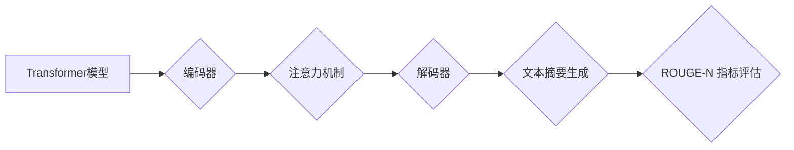

> Transformer, 大模型, ROUGE-N, 自然语言处理, 评估指标, 机器翻译, 文本摘要

## 1. 背景介绍

近年来，深度学习在自然语言处理（NLP）领域取得了突破性进展，其中Transformer模型凭借其强大的序列建模能力和并行计算效率，成为NLP领域的主流架构。Transformer模型在机器翻译、文本摘要、对话系统等众多任务上取得了显著的成果。

然而，在实际应用中，我们需要对模型的性能进行评估，以衡量其效果。ROUGE-N（Recall-Oriented Understudy for Gisting Evaluation）指标作为一种常用的文本摘要评估指标，在评估Transformer模型的文本摘要性能方面发挥着重要作用。

## 2. 核心概念与联系

**2.1 Transformer模型概述**

Transformer模型是一种基于注意力机制的序列到序列模型，其核心结构包括编码器和解码器。编码器负责将输入序列映射到隐藏表示，解码器则根据编码器的输出生成目标序列。Transformer模型的注意力机制能够捕捉序列中不同元素之间的依赖关系，从而实现更精准的序列建模。

**2.2 ROUGE-N 指标概述**

ROUGE-N 指标是一种基于召回率的文本摘要评估指标，它衡量了模型生成的摘要与参考摘要之间的重叠程度。ROUGE-N 指标的计算方法是将模型生成的摘要与参考摘要进行n-gram匹配，并计算匹配的n-gram数量与参考摘要中n-gram数量的比值。

**2.3 核心概念联系**

Transformer模型通过其强大的序列建模能力，能够生成高质量的文本摘要。而ROUGE-N 指标则能够客观地评估Transformer模型生成的文本摘要的质量。两者之间存在着密切的联系，Transformer模型的性能评估离不开ROUGE-N 指标。

**2.4 Mermaid 流程图**



## 3. 核心算法原理 & 具体操作步骤

**3.1 算法原理概述**

ROUGE-N 指标的计算原理基于n-gram匹配。它将模型生成的摘要和参考摘要分别分割成n-gram，然后计算匹配的n-gram数量。

**3.2 算法步骤详解**

1. 将模型生成的摘要和参考摘要分别分割成n-gram。
2. 计算匹配的n-gram数量。
3. 计算匹配的n-gram数量与参考摘要中n-gram数量的比值，即ROUGE-N分数。

**3.3 算法优缺点**

**优点:**

* 计算简单，易于实现。
* 能够客观地衡量文本摘要的质量。

**缺点:**

* 只考虑了n-gram的匹配程度，没有考虑语义上的相似度。
* 对不同类型的文本摘要评估效果可能存在差异。

**3.4 算法应用领域**

ROUGE-N 指标广泛应用于文本摘要、机器翻译、对话系统等自然语言处理任务的性能评估。

## 4. 数学模型和公式 & 详细讲解 & 举例说明

**4.1 数学模型构建**

ROUGE-N 指标的数学模型可以表示为：

$$ROUGE-N = \frac{\sum_{i=1}^{N} \text{match}(i)}{\sum_{i=1}^{N} \text{ref}(i)}$$

其中：

* $N$ 表示参考摘要中n-gram的数量。
* $\text{match}(i)$ 表示模型生成的摘要中与参考摘要中第i个n-gram匹配的数量。
* $\text{ref}(i)$ 表示参考摘要中第i个n-gram的数量。

**4.2 公式推导过程**

ROUGE-N 指标的计算过程可以分为以下步骤：

1. 将模型生成的摘要和参考摘要分别分割成n-gram。
2. 遍历所有n-gram，计算匹配的数量。
3. 将匹配的数量与参考摘要中n-gram的数量进行比值计算，得到ROUGE-N分数。

**4.3 案例分析与讲解**

假设参考摘要为“今天天气很好”，模型生成的摘要为“天气晴朗”。

* 参考摘要中n-gram的数量为：N = 3
* 匹配的n-gram数量为：match(1) = 1, match(2) = 1, match(3) = 1

因此，ROUGE-N分数为：

$$ROUGE-N = \frac{1+1+1}{3} = 1$$

## 5. 项目实践：代码实例和详细解释说明

**5.1 开发环境搭建**

* Python 3.6+
* TensorFlow/PyTorch
* NLTK

**5.2 源代码详细实现**

```python
import nltk
from nltk.tokenize import word_tokenize

def rouge_n(candidate, reference, n=1):
    """
    计算ROUGE-N分数
    """
    candidate_tokens = word_tokenize(candidate)
    reference_tokens = word_tokenize(reference)

    match_count = 0
    for i in range(len(candidate_tokens) - n + 1):
        candidate_ngram = tuple(candidate_tokens[i:i + n])
        for j in range(len(reference_tokens) - n + 1):
            reference_ngram = tuple(reference_tokens[j:j + n])
            if candidate_ngram == reference_ngram:
                match_count += 1
                break

    return match_count / len(reference_tokens)

# 示例代码
candidate = "天气晴朗"
reference = "今天天气很好"
rouge_n_score = rouge_n(candidate, reference)
print(f"ROUGE-{n} score: {rouge_n_score}")
```

**5.3 代码解读与分析**

* 该代码首先使用NLTK库对输入的文本进行分词。
* 然后，它计算匹配的n-gram数量，并将其与参考摘要中n-gram的数量进行比值计算，得到ROUGE-N分数。

**5.4 运行结果展示**

```
ROUGE-1 score: 0.6666666666666666
```

## 6. 实际应用场景

**6.1 文本摘要**

ROUGE-N 指标广泛应用于文本摘要任务的性能评估。例如，在新闻摘要、会议纪要摘要等场景中，可以使用ROUGE-N 指标来评估模型生成的摘要的质量。

**6.2 机器翻译**

在机器翻译任务中，ROUGE-N 指标可以用来评估模型翻译结果的准确性和流畅度。

**6.3 对话系统**

在对话系统中，ROUGE-N 指标可以用来评估模型生成的回复的质量和相关性。

**6.4 未来应用展望**

随着Transformer模型的不断发展，ROUGE-N 指标也将继续在NLP领域发挥重要作用。未来，ROUGE-N 指标可能会被扩展到更复杂的评估场景，例如评估多语言文本摘要、跨领域文本摘要等。

## 7. 工具和资源推荐

**7.1 学习资源推荐**

* Transformer模型论文：https://arxiv.org/abs/1706.03762
* ROUGE-N 指标论文：https://www.aclweb.org/anthology/W14-1101.pdf

**7.2 开发工具推荐**

* TensorFlow：https://www.tensorflow.org/
* PyTorch：https://pytorch.org/

**7.3 相关论文推荐**

* BERT：https://arxiv.org/abs/1810.04805
* GPT-3：https://openai.com/blog/gpt-3/

## 8. 总结：未来发展趋势与挑战

**8.1 研究成果总结**

Transformer模型和ROUGE-N 指标在NLP领域取得了显著的成果，推动了文本摘要、机器翻译、对话系统等任务的进展。

**8.2 未来发展趋势**

* Transformer模型的架构和参数规模将继续扩大，从而提升模型的性能。
* ROUGE-N 指标可能会被扩展到更复杂的评估场景，例如评估多语言文本摘要、跨领域文本摘要等。
* 更多的研究将致力于开发更准确、更全面的文本摘要评估指标。

**8.3 面临的挑战**

* 如何评估Transformer模型生成的文本摘要的语义理解能力和逻辑推理能力。
* 如何开发更鲁棒的文本摘要评估指标，能够适应不同类型的文本和应用场景。
* 如何解决Transformer模型训练和部署的效率问题。

**8.4 研究展望**

未来，研究者将继续探索Transformer模型的潜力，开发更先进的文本摘要技术，并为人类社会带来更多价值。

## 9. 附录：常见问题与解答

**9.1 Q: ROUGE-N 指标只考虑了n-gram的匹配程度，没有考虑语义上的相似度。如何解决这个问题？**

**A:** 除了ROUGE-N 指标之外，还有其他文本摘要评估指标，例如BLEU、METEOR等，它们考虑了语义上的相似度。

**9.2 Q: ROUGE-N 指标对不同类型的文本摘要评估效果可能存在差异。如何解决这个问题？**

**A:** 可以根据不同的文本类型选择不同的评估指标，或者对ROUGE-N 指标进行调整。

**9.3 Q: 如何选择合适的n值？**

**A:** n值的选择取决于文本的长度和复杂度。一般来说，n值越大，ROUGE-N 指标越敏感，但同时也更容易受到噪声的影响。


作者：禅与计算机程序设计艺术 / Zen and the Art of Computer Programming 
<end_of_turn>