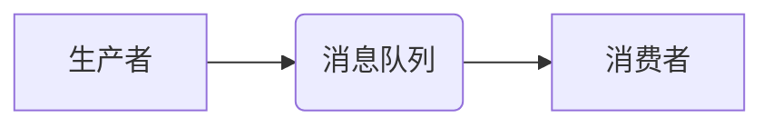

> 消息队列，异步通信，分布式系统，消息中间件，RabbitMQ，Kafka，性能优化

## 1. 背景介绍

在当今以大数据和云计算为核心的技术时代，分布式系统架构已成为主流。分布式系统由多个独立的节点组成，这些节点之间需要进行数据交换和协作。传统的同步通信方式在分布式系统中存在诸多弊端，例如：

* **性能瓶颈:** 同步通信需要等待对方响应，导致系统响应时间变长，性能下降。
* **单点故障:** 如果某个节点出现故障，整个系统都可能瘫痪。
* **复杂性增加:** 同步通信逻辑复杂，难以维护和扩展。

为了解决这些问题，消息队列应运而生。消息队列是一种异步通信机制，它通过消息中间件将生产者和消费者分离，实现数据异步传输。

## 2. 核心概念与联系

消息队列的核心概念包括：

* **生产者:** 生成消息并将其发送到消息队列。
* **消费者:** 从消息队列中接收消息并进行处理。
* **消息中间件:** 负责存储和转发消息，提供消息队列服务。
* **消息:** 包含数据和元信息的单位，用于传递信息。

消息队列的架构通常由以下几个部分组成：



**消息队列的优势:**

* **异步通信:** 生产者和消费者之间无需同步，提高了系统性能和容错性。
* **解耦:** 生产者和消费者之间没有直接依赖关系，可以独立开发和部署。
* **可靠性:** 消息中间件通常提供消息持久化和重试机制，确保消息可靠传输。
* **可扩展性:** 消息队列可以轻松扩展，以满足不断增长的业务需求。

## 3. 核心算法原理 & 具体操作步骤

### 3.1  算法原理概述

消息队列的核心算法原理是基于**先进先出（FIFO）**的原则，即消息按照发送顺序被存储和消费。消息中间件通常采用**阻塞式**或**非阻塞式**两种方式处理消息。

* **阻塞式:** 生产者发送消息时，需要等待消息中间件确认消息已成功存储，然后才能返回。
* **非阻塞式:** 生产者发送消息后，无需等待确认，可以继续执行其他操作。

### 3.2  算法步骤详解

1. **生产者发送消息:** 生产者将消息封装成消息对象，并发送到消息队列。
2. **消息中间件存储消息:** 消息中间件将消息对象存储到消息队列中，并根据消息的优先级和路由规则进行排序。
3. **消费者接收消息:** 消费者从消息队列中接收消息，并进行处理。
4. **消息确认:** 消费者处理完消息后，需要向消息中间件发送确认消息，告知消息已成功处理。

### 3.3  算法优缺点

**优点:**

* 简单易懂，易于实现。
* 能够保证消息的顺序性。
* 能够实现异步通信，提高系统性能。

**缺点:**

* 对于高吞吐量的场景，可能会出现性能瓶颈。
* 无法实现消息的实时性。

### 3.4  算法应用领域

消息队列广泛应用于以下领域：

* **电商平台:** 订单处理、商品推荐、用户行为分析等。
* **金融系统:** 交易处理、风险控制、资金管理等。
* **社交网络:** 消息推送、用户互动、数据分析等。
* **物联网:** 设备数据采集、设备控制、数据分析等。

## 4. 数学模型和公式 & 详细讲解 & 举例说明

### 4.1  数学模型构建

消息队列的吞吐量可以表示为：

$$
吞吐量 = \frac{消息数量}{时间}
$$

其中：

* 消息数量：单位时间内发送的消息数量。
* 时间：单位时间。

### 4.2  公式推导过程

吞吐量与消息队列的性能指标密切相关，例如：

* **消息存储速度:** 消息中间件存储消息的速度。
* **消息消费速度:** 消费者处理消息的速度。
* **网络带宽:** 网络传输速度。

吞吐量可以根据以上指标进行优化。

### 4.3  案例分析与讲解

假设一个消息队列系统，每秒可以发送1000条消息，每秒可以消费500条消息，网络带宽为10Mbps。

则该系统的吞吐量为：

$$
吞吐量 = \frac{1000}{1} = 1000 \text{条/秒}
$$

如果提高消息消费速度，可以提高吞吐量。

## 5. 项目实践：代码实例和详细解释说明

### 5.1  开发环境搭建

本例使用Python语言和RabbitMQ消息队列进行开发。

* 安装Python环境
* 安装RabbitMQ消息队列
* 安装Python消息队列库Pika

### 5.2  源代码详细实现

```python
import pika

# 连接RabbitMQ
connection = pika.BlockingConnection(pika.ConnectionParameters('localhost'))
channel = connection.channel()

# 创建队列
channel.queue_declare(queue='my_queue')

# 发送消息
message = 'Hello World!'
channel.basic_publish(exchange='', routing_key='my_queue', body=message)
print(" [x] Sent %r" % message)

# 关闭连接
connection.close()
```

### 5.3  代码解读与分析

* `pika`库用于连接和操作RabbitMQ消息队列。
* `BlockingConnection`用于建立阻塞式连接。
* `channel`用于执行消息队列操作。
* `queue_declare`用于创建队列。
* `basic_publish`用于发送消息。
* `exchange`和`routing_key`用于指定消息路由。
* `connection.close()`用于关闭连接。

### 5.4  运行结果展示

运行代码后，消息将被发送到名为`my_queue`的队列中。

## 6. 实际应用场景

### 6.1  电商平台

* 订单处理: 当用户下单时，系统会将订单信息发送到消息队列，由订单处理服务消费并进行处理。
* 商品推荐: 系统可以将用户浏览历史和购买记录发送到消息队列，由推荐引擎消费并进行商品推荐。
* 用户行为分析: 系统可以将用户行为数据发送到消息队列，由数据分析服务消费并进行分析。

### 6.2  金融系统

* 交易处理: 当用户进行交易时，系统会将交易信息发送到消息队列，由交易处理服务消费并进行处理。
* 风险控制: 系统可以将交易数据发送到消息队列，由风险控制服务消费并进行风险评估。
* 资金管理: 系统可以将资金流转信息发送到消息队列，由资金管理服务消费并进行资金管理。

### 6.3  社交网络

* 消息推送: 当用户收到新消息时，系统会将消息发送到消息队列，由消息推送服务消费并进行推送。
* 用户互动: 系统可以将用户互动数据发送到消息队列，由用户互动服务消费并进行分析。
* 数据分析: 系统可以将用户行为数据发送到消息队列，由数据分析服务消费并进行分析。

### 6.4  未来应用展望

随着大数据和云计算技术的不断发展，消息队列将在未来发挥更加重要的作用。例如：

* **实时数据处理:** 消息队列可以用于处理实时数据流，例如传感器数据、社交媒体数据等。
* **微服务架构:** 消息队列是微服务架构中不可或缺的组件，用于实现微服务之间的通信和协作。
* **事件驱动架构:** 消息队列可以用于实现事件驱动架构，例如用户登录、订单创建等事件。

## 7. 工具和资源推荐

### 7.1  学习资源推荐

* **RabbitMQ官方文档:** https://www.rabbitmq.com/documentation.html
* **Kafka官方文档:** https://kafka.apache.org/documentation/
* **消息队列技术博客:** https://www.rabbitmq.com/blog/

### 7.2  开发工具推荐

* **RabbitMQ:** https://www.rabbitmq.com/
* **Kafka:** https://kafka.apache.org/
* **Pika:** https://pika.readthedocs.io/en/stable/

### 7.3  相关论文推荐

* **Kafka: A Distributed Streaming Platform:** https://static.googleusercontent.com/media/research.google.com/en//pubs/archive/43111.pdf
* **RabbitMQ in Action:** https://www.manning.com/books/rabbitmq-in-action

## 8. 总结：未来发展趋势与挑战

### 8.1  研究成果总结

消息队列技术已经取得了长足的进步，并广泛应用于各种领域。

### 8.2  未来发展趋势

未来消息队列技术的发展趋势包括：

* **更强大的性能和可靠性:** 随着大数据和云计算的不断发展，消息队列需要具备更高的性能和可靠性。
* **更智能的路由和调度:** 消息队列需要具备更智能的路由和调度机制，以提高消息处理效率。
* **更丰富的功能和应用场景:** 消息队列需要提供更丰富的功能和应用场景，以满足不断增长的业务需求。

### 8.3  面临的挑战

消息队列技术也面临着一些挑战，例如：

* **复杂性增加:** 随着消息队列功能的不断增强，其复杂性也随之增加。
* **安全性和隐私性:** 消息队列需要保证消息的安全性和隐私性。
* **成本控制:** 消息队列的部署和维护成本较高。

### 8.4  研究展望

未来研究方向包括：

* **开发更高效的消息处理算法:** 提高消息处理效率，降低系统延迟。
* **设计更安全的消息传输机制:** 保证消息的安全性和隐私性。
* **探索新的消息队列应用场景:** 将消息队列应用于更多领域，例如物联网、人工智能等。

## 9. 附录：常见问题与解答

### 9.1  常见问题

* **消息队列和数据库的区别是什么？**
* **如何选择合适的消息队列？**
* **如何进行消息队列的性能优化？**

### 9.2  解答

* **消息队列和数据库的区别:** 数据库用于持久化存储数据，而消息队列用于异步传输消息。
* **如何选择合适的消息队列:** 需要根据业务需求、吞吐量、可靠性等因素进行选择。
* **如何进行消息队列的性能优化:** 可以通过调整消息队列配置、优化消息格式、使用缓存等方式进行优化。


作者：禅与计算机程序设计艺术 / Zen and the Art of Computer Programming 
<end_of_turn>