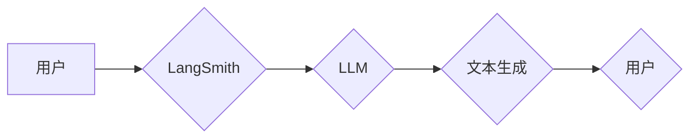

> LangChain, LangSmith, 观测, 语言模型, 应用场景, 代码实例, 实践指南

## 1. 背景介绍

近年来，大型语言模型（LLM）的快速发展掀起了人工智能领域的革命。这些模型展现出惊人的文本生成、理解和翻译能力，为各种应用场景提供了无限可能。然而，如何有效地利用LLM并将其集成到实际应用中仍然是一个关键挑战。

LangChain 作为一款开源框架，旨在解决这一挑战。它提供了一套工具和组件，帮助开发者构建基于LLM的应用程序，并将其与其他数据源和服务进行集成。其中，LangChain 的 LangSmith 工具尤为突出，它提供了一个直观的用户界面，方便开发者进行LLM的观测和调试。

## 2. 核心概念与联系

LangChain 的核心概念包括：

* **代理 (Agent):**  一个能够与外部环境交互的智能体，它可以利用LLM的能力来完成任务。
* **模型 (Model):**  LLM 核心，负责文本生成、理解和处理。
* **提示 (Prompt):**  向模型输入的指令或文本，引导模型生成特定类型的输出。
* **内存 (Memory):**  存储代理与环境交互的历史信息，帮助代理保持上下文和记忆。
* **工具 (Tool):**  外部应用程序或服务，可以被代理调用来完成特定任务。

LangSmith 作为 LangChain 的一部分，提供了一个可视化界面，帮助开发者观察和调试 LLMs 的行为。它可以展示模型的输入输出、中间状态以及执行过程中的关键信息，从而帮助开发者更好地理解模型的工作机制，并进行更有效的调试和优化。

**Mermaid 流程图:**



## 3. 核心算法原理 & 具体操作步骤

### 3.1  算法原理概述

LangSmith 的核心算法原理基于 LLMs 的文本生成机制。它通过分析用户的输入提示，并结合模型的训练数据，生成相应的文本输出。

### 3.2  算法步骤详解

1. **用户输入提示:** 用户通过 LangSmith 的界面输入一个文本提示。
2. **提示预处理:** LangSmith 对用户的提示进行预处理，例如去除停用词、规范化语法等。
3. **模型编码:** 预处理后的提示被编码成模型可以理解的向量表示。
4. **文本生成:** 模型根据编码后的提示，生成一系列候选文本。
5. **文本解码:** 模型生成的候选文本被解码成人类可读的文本。
6. **输出结果:** LangSmith 将解码后的文本输出到用户界面。

### 3.3  算法优缺点

**优点:**

* **易于使用:** LangSmith 提供了一个直观的界面，方便用户进行 LLMs 的观测和调试。
* **可视化展示:** LangSmith 可以展示模型的输入输出、中间状态以及执行过程中的关键信息，帮助用户更好地理解模型的工作机制。
* **灵活定制:** 用户可以自定义提示、模型和工具，以满足不同的应用场景。

**缺点:**

* **依赖于 LLMs:** LangSmith 的性能取决于所使用的 LLMs 的能力。
* **资源消耗:** LLMs 的训练和推理过程需要大量的计算资源。

### 3.4  算法应用领域

LangSmith 可以在以下领域应用：

* **教育:** 用于辅助教学、个性化学习和智能答疑。
* **科研:** 用于文本分析、数据挖掘和知识发现。
* **创作:** 用于辅助写作、诗歌创作和剧本编写。
* **客服:** 用于构建智能客服系统，提供快速高效的客户服务。

## 4. 数学模型和公式 & 详细讲解 & 举例说明

### 4.1  数学模型构建

LLMs 的核心是基于 Transformer 架构的神经网络模型。Transformer 模型利用自注意力机制来捕捉文本序列中的长距离依赖关系，从而实现更准确的文本生成和理解。

**公式:**

* **自注意力机制:**

$$
Attention(Q, K, V) = \frac{exp(Q \cdot K^T / \sqrt{d_k})}{softmax(Q \cdot K^T / \sqrt{d_k})} \cdot V
$$

其中，Q、K、V 分别代表查询矩阵、键矩阵和值矩阵，$d_k$ 代表键向量的维度。

**讲解:**

自注意力机制通过计算查询向量与键向量的相似度，来确定每个词与其他词之间的关系。然后，根据这些关系，将值向量进行加权求和，得到最终的输出。

**举例说明:**

假设我们有一个句子 "The cat sat on the mat"，其中每个词都对应一个向量表示。通过自注意力机制，我们可以计算每个词与其他词之间的相似度，例如 "cat" 与 "sat" 之间的关系比较密切，因为它们共同描述了猫的行为。

### 4.2  公式推导过程

Transformer 模型的训练过程基于反向传播算法，目标是最小化模型预测的文本与真实文本之间的差异。

**公式:**

* **损失函数:**

$$
Loss = -\sum_{i=1}^{N} log(P(w_i | w_{<i}))
$$

其中，$N$ 代表文本长度，$w_i$ 代表第 $i$ 个词，$P(w_i | w_{<i})$ 代表模型预测第 $i$ 个词的概率。

**讲解:**

损失函数衡量了模型预测的文本与真实文本之间的差异。训练过程的目标是通过调整模型参数，最小化损失函数的值。

### 4.3  案例分析与讲解

通过 LangSmith，我们可以观察到 LLMs 在不同提示下的行为，并分析其生成的文本质量。例如，我们可以比较不同长度的提示对模型的影响，或者观察模型在处理不同类型的文本时的表现。

## 5. 项目实践：代码实例和详细解释说明

### 5.1  开发环境搭建

1. 安装 Python 3.7 或更高版本。
2. 安装 LangChain 和 LangSmith 库：

```bash
pip install langchain langsmith
```

### 5.2  源代码详细实现

```python
from langchain.llms import OpenAI
from langchain.agents import initialize_agent
from langchain.tools import Tool
from langchain.chains import ConversationChain

# 初始化 OpenAI LLM
llm = OpenAI(temperature=0.7)

# 定义一个工具
class SearchTool(Tool):
    def __init__(self, url):
        self.url = url

    def run(self, query):
        # 使用工具进行搜索
        # ...
        return results

# 创建一个代理
tools = [SearchTool("https://www.example.com")]
agent = initialize_agent(
    llm=llm,
    tools=tools,
    agent="zero-shot-react-description",
)

# 创建一个对话链
conversation = ConversationChain(llm=llm, agent=agent)

# 与代理进行对话
response = conversation.run("What is the capital of France?")
print(response)
```

### 5.3  代码解读与分析

* 代码首先初始化 OpenAI LLM 和一个搜索工具。
* 然后，它创建一个代理，该代理可以调用搜索工具来获取信息。
* 最后，它创建一个对话链，并使用代理与用户进行对话。

### 5.4  运行结果展示

运行代码后，代理将使用搜索工具查询 "What is the capital of France?"，并返回结果 "Paris"。

## 6. 实际应用场景

### 6.1  教育领域

* **智能答疑:** LangChain 可以构建智能答疑系统，帮助学生解决学习问题。
* **个性化学习:** LangChain 可以根据学生的学习进度和能力，提供个性化的学习内容和练习。
* **辅助写作:** LangChain 可以帮助学生生成写作素材、检查语法错误和提高写作水平。

### 6.2  科研领域

* **文本分析:** LangChain 可以用于分析学术论文、新闻报道和其他文本数据，提取关键信息和发现隐藏的模式。
* **数据挖掘:** LangChain 可以帮助科研人员从海量数据中挖掘有价值的信息。
* **知识发现:** LangChain 可以帮助科研人员发现新的知识和理论。

### 6.3  创作领域

* **辅助写作:** LangChain 可以帮助作家生成故事创意、人物设定和情节发展。
* **诗歌创作:** LangChain 可以根据用户的输入，生成不同风格的诗歌。
* **剧本编写:** LangChain 可以帮助编剧生成剧本对话、人物性格和剧情走向。

### 6.4  未来应用展望

随着 LLMs 的不断发展，LangChain 将有更广泛的应用场景。例如，它可以用于构建更智能的聊天机器人、虚拟助手和游戏角色。

## 7. 工具和资源推荐

### 7.1  学习资源推荐

* **LangChain 官方文档:** https://python.langchain.com/docs/
* **LangSmith 官方文档:** https://github.com/langchain-ai/langsmith
* **OpenAI 文档:** https://platform.openai.com/docs/

### 7.2  开发工具推荐

* **Python:** https://www.python.org/
* **Jupyter Notebook:** https://jupyter.org/

### 7.3  相关论文推荐

* **Attention Is All You Need:** https://arxiv.org/abs/1706.03762
* **BERT: Pre-training of Deep Bidirectional Transformers for Language Understanding:** https://arxiv.org/abs/1810.04805

## 8. 总结：未来发展趋势与挑战

### 8.1  研究成果总结

LangChain 和 LangSmith 为构建基于 LLMs 的应用程序提供了强大的工具和框架。它们简化了 LLMs 的使用过程，并提供了更直观的方式进行观测和调试。

### 8.2  未来发展趋势

* **更强大的 LLMs:** 未来将会有更强大的 LLMs 问世，它们将拥有更强的文本生成、理解和推理能力。
* **更丰富的工具和组件:** LangChain 将会提供更多类型的工具和组件，以满足更广泛的应用场景。
* **更智能的代理:** 未来将会有更智能的代理，它们能够更好地理解用户的意图，并提供更精准的响应。

### 8.3  面临的挑战

* **数据安全和隐私:** LLMs 的训练和使用需要大量的文本数据，如何保证数据的安全和隐私是一个重要的挑战。
* **模型可解释性:** LLMs 的决策过程往往是不可解释的，如何提高模型的可解释性是一个重要的研究方向。
* **伦理问题:** LLMs 的应用可能会带来一些伦理问题，例如信息操纵和偏见放大，需要引起足够的重视。

### 8.4  研究展望

未来，我们将继续研究 LLMs 的应用，探索其在更多领域中的潜力，并努力解决其面临的挑战。


## 9. 附录：常见问题与解答

**Q1: 如何安装 LangChain 和 LangSmith？**

A1: 使用 pip 安装：

```bash
pip install langchain langsmith
```

**Q2: 如何使用 LangSmith 进行 LLMs 的观测？**

A2: 

1. 打开 LangSmith 应用程序。
2. 选择一个 LLMs 模型。
3. 输入一个文本提示。
4. 观察模型的输入输出、中间状态以及执行过程中的关键信息。

**Q3: LangChain 和 LangSmith 的区别是什么？**

A3: LangChain 是一个开源框架，提供了一套工具和组件，帮助开发者构建基于LLMs的应用程序。LangSmith 是 LangChain 的一部分，它提供了一个可视化界面，方便用户进行 LLMs 的观测和调试。

**Q4: LangChain 支持哪些 LLMs 模型？**

A4: LangChain 支持多种 LLMs 模型，包括 OpenAI、HuggingFace 等。

**Q5: LangChain 的应用场景有哪些？**

A5: LangChain 可以应用于教育、