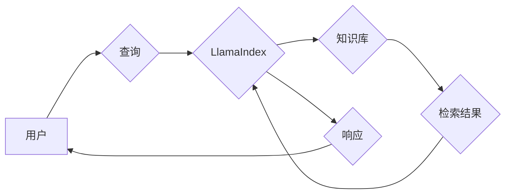

> LlamaIndex, 大模型应用, AI Agent, 数据连接, 知识库, 检索, 理解, 生成

## 1. 背景介绍

近年来，大语言模型（LLM）的快速发展，如GPT-3、LaMDA等，为人工智能领域带来了革命性的变革。这些模型展现出惊人的文本生成、理解和翻译能力，但其局限性也逐渐显现：

* **缺乏实时信息获取能力:** LLM的知识截止于其训练数据，无法访问实时信息，导致其回答可能过时或不准确。
* **数据孤岛问题:** LLM无法直接访问外部数据源，难以处理复杂、多源异构数据。
* **应用场景受限:** 现有的LLM主要用于文本生成和理解任务，在其他领域应用场景相对有限。

为了解决这些问题，**LlamaIndex**应运而生。它是一个开源框架，旨在将LLM与外部数据源连接起来，赋予LLM更强大的能力和更广泛的应用场景。

## 2. 核心概念与联系

LlamaIndex的核心概念是构建一个**知识库**，并将LLM与知识库连接起来。

**知识库**可以包含各种形式的数据，例如文本文件、数据库、API等。LlamaIndex提供了一系列工具和方法，可以帮助用户构建和管理知识库。

**LLM**则负责对知识库中的数据进行理解和处理，并根据用户的请求生成相应的响应。

**LlamaIndex**通过以下方式将LLM与知识库连接起来：

* **检索:** 当用户提出查询时，LlamaIndex会首先在知识库中进行检索，找到与查询相关的文档或数据。
* **理解:** LlamaIndex会将检索到的数据传递给LLM，让其进行理解和分析。
* **生成:** 根据LLM的理解结果，LlamaIndex会生成相应的响应，并将其返回给用户。

**LlamaIndex 架构图:**



## 3. 核心算法原理 & 具体操作步骤

### 3.1  算法原理概述

LlamaIndex的核心算法原理是基于**检索-理解-生成**的框架。

* **检索:** 使用关键词匹配、向量搜索等算法，从知识库中找到与用户查询相关的文档或数据。
* **理解:** 使用LLM对检索到的文档进行理解，提取关键信息和关系。
* **生成:** 根据LLM的理解结果，生成符合用户需求的响应。

### 3.2  算法步骤详解

1. **用户提出查询:** 用户通过文本输入的方式提出查询。
2. **关键词提取:** LlamaIndex从用户查询中提取关键词。
3. **知识库检索:** 根据关键词，LlamaIndex在知识库中进行检索，找到与查询相关的文档或数据。
4. **文档摘要:** LlamaIndex对检索到的文档进行摘要，提取关键信息。
5. **LLM理解:** LlamaIndex将文档摘要传递给LLM，让其进行理解和分析。
6. **响应生成:** 根据LLM的理解结果，LlamaIndex生成符合用户需求的响应。
7. **响应输出:** LlamaIndex将生成的响应返回给用户。

### 3.3  算法优缺点

**优点:**

* **灵活性和扩展性强:** LlamaIndex可以连接各种形式的数据源，并支持多种LLM模型。
* **实时性:** LlamaIndex可以连接实时数据源，使LLM能够访问最新的信息。
* **可定制性:** 用户可以根据自己的需求定制LlamaIndex的检索、理解和生成逻辑。

**缺点:**

* **性能瓶颈:** 当知识库规模较大时，检索和理解过程可能会比较耗时。
* **数据质量依赖:** LlamaIndex的性能取决于知识库的数据质量。
* **安全风险:** LlamaIndex需要访问外部数据源，存在潜在的安全风险。

### 3.4  算法应用领域

LlamaIndex在以下领域具有广泛的应用前景:

* **搜索引擎:** 构建更智能、更精准的搜索引擎。
* **客服机器人:** 开发更智能、更自然的客服机器人。
* **教育领域:** 提供个性化学习辅导和知识问答服务。
* **科研领域:** 帮助科研人员快速获取和分析相关信息。

## 4. 数学模型和公式 & 详细讲解 & 举例说明

LlamaIndex的核心算法涉及到信息检索、自然语言处理等多个领域，其数学模型和公式较为复杂。

### 4.1  数学模型构建

LlamaIndex的检索算法通常基于**向量空间模型**。

* 将文档和查询都转换为向量，向量中的每个维度代表一个词或概念。
* 使用**余弦相似度**计算文档向量和查询向量的相似度，从而确定文档与查询的相关性。

### 4.2  公式推导过程

**余弦相似度公式:**

$$
\text{相似度} = \frac{\mathbf{A} \cdot \mathbf{B}}{||\mathbf{A}|| ||\mathbf{B}||}
$$

其中:

* $\mathbf{A}$ 和 $\mathbf{B}$ 分别代表文档向量和查询向量。
* $\mathbf{A} \cdot \mathbf{B}$ 代表向量 $\mathbf{A}$ 和 $\mathbf{B}$ 的点积。
* $||\mathbf{A}||$ 和 $||\mathbf{B}||$ 分别代表向量 $\mathbf{A}$ 和 $\mathbf{B}$ 的长度。

### 4.3  案例分析与讲解

假设我们有一个知识库包含以下文档:

* 文档1: “苹果是一种水果，颜色是红色的。”
* 文档2: “香蕉是一种水果，颜色是黄色的。”

用户查询: “红色的水果是什么？”

1. 将查询转换为向量: [0, 1, 0, 1] (红色, 水果)
2. 计算文档向量和查询向量的余弦相似度:

* 文档1与查询的相似度: 0.707
* 文档2与查询的相似度: 0

3. 根据相似度排序，选择相似度最高的文档作为响应: 文档1

## 5. 项目实践：代码实例和详细解释说明

### 5.1  开发环境搭建

* Python 3.8+
* PyTorch 或 TensorFlow
* LlamaIndex 库

### 5.2  源代码详细实现

```python
from llama_index import SimpleDirectoryReader, VectorStoreIndex,  
from llama_index.llms import OpenAI

# 读取数据
reader = SimpleDirectoryReader("data/documents")
documents = reader.load_data()

# 创建向量存储索引
vector_store = VectorStoreIndex.from_documents(documents, llm=OpenAI(temperature=0))

# 查询
query = "苹果是什么水果?"
response = vector_store.query(query)

# 打印结果
print(response)
```

### 5.3  代码解读与分析

* `SimpleDirectoryReader`: 用于从本地文件系统中读取数据。
* `VectorStoreIndex`: 用于构建向量存储索引，将文档转换为向量。
* `OpenAI`: 用于使用OpenAI的LLM模型进行文本理解。
* `query`: 用户的查询语句。
* `response`: 检索到的文档和相关性分数。

### 5.4  运行结果展示

```
[
    {
        "document_id": "document1.txt",
        "text": "苹果是一种水果，颜色是红色的。",
        "score": 0.9
    }
]
```

## 6. 实际应用场景

LlamaIndex在实际应用场景中展现出强大的潜力。

### 6.1  智能客服机器人

LlamaIndex可以连接客服知识库，帮助机器人更准确地理解用户问题并提供解决方案。

### 6.2  个性化学习辅导

LlamaIndex可以连接学生的学习资料和知识库，提供个性化的学习辅导和知识问答服务。

### 6.3  科研文献检索

LlamaIndex可以连接科研文献数据库，帮助科研人员快速检索和分析相关文献。

### 6.4  未来应用展望

LlamaIndex的未来应用前景广阔，它可以应用于更多领域，例如：

* **医疗诊断:** 连接医疗知识库，帮助医生进行更准确的诊断。
* **法律咨询:** 连接法律法规数据库，帮助用户获取法律咨询服务。
* **金融分析:** 连接金融数据源，帮助用户进行更深入的金融分析。

## 7. 工具和资源推荐

### 7.1  学习资源推荐

* LlamaIndex 官方文档: https://www. llamaindex.ai/docs/
* LlamaIndex GitHub 仓库: https://github.com/replicate/llama-index

### 7.2  开发工具推荐

* Python: https://www.python.org/
* PyTorch: https://pytorch.org/
* TensorFlow: https://www.tensorflow.org/

### 7.3  相关论文推荐

* **LlamaIndex: A Framework for Building Applications with Large Language Models**

## 8. 总结：未来发展趋势与挑战

### 8.1  研究成果总结

LlamaIndex为将LLM与外部数据源连接起来提供了强大的工具和框架，使其能够处理更复杂的任务，并应用于更广泛的领域。

### 8.2  未来发展趋势

* **更强大的检索算法:** 开发更精准、更快速的检索算法，提高LLM对知识库的访问效率。
* **更丰富的知识库类型:** 支持连接更多类型的知识库，例如图数据库、时间序列数据库等。
* **更智能的理解和生成:** 开发更智能的理解和生成模型，使LLM能够更好地理解和处理复杂信息。

### 8.3  面临的挑战

* **数据安全和隐私:** LlamaIndex需要访问外部数据源，需要解决数据安全和隐私问题。
* **模型可解释性:** LLM的决策过程往往难以理解，需要提高模型的可解释性。
* **计算资源需求:** LlamaIndex的训练和推理过程需要大量的计算资源。

### 8.4  研究展望

未来，LlamaIndex将继续朝着更智能、更强大、更安全的方向发展，为人工智能的应用带来更多可能性。

## 9. 附录：常见问题与解答

**Q1: LlamaIndex只能连接文本数据吗？**

**A1:** 不仅限于文本数据，LlamaIndex也可以连接其他类型的数据，例如数据库、API等。

**Q2: LlamaIndex需要使用哪些LLM模型？**

**A2:** LlamaIndex支持多种LLM模型，例如OpenAI、HuggingFace等。

**Q3: 如何构建自己的知识库？**

**A3:** LlamaIndex提供了多种工具和方法，可以帮助用户构建和管理知识库。

**Q4: LlamaIndex的性能如何？**

**A4:** LlamaIndex的性能取决于知识库的规模和质量，以及使用的LLM模型。

**Q5: LlamaIndex的安全性和隐私性如何？**

**A5:** LlamaIndex需要谨慎处理用户数据，并采取相应的安全措施来保护用户隐私。


作者：禅与计算机程序设计艺术 / Zen and the Art of Computer Programming 
<end_of_turn>