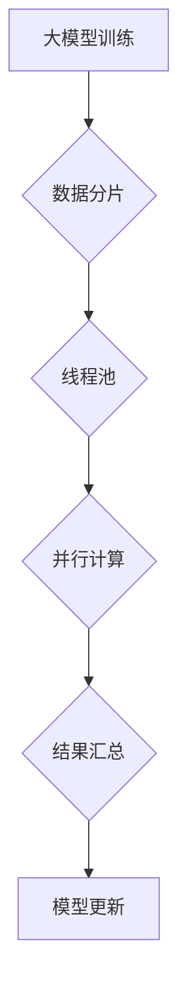

> 大模型、AI Agent、线程、并发、异步、Python、多进程、多线程、协程

## 1. 背景介绍

在人工智能领域，大模型的兴起为我们带来了前所未有的机遇。这些强大的模型能够处理海量数据，学习复杂的模式，并生成高质量的文本、图像和代码。然而，单线程的执行方式限制了大模型的效率和性能。为了充分发挥大模型的潜力，我们需要探索并利用并发和异步编程技术，例如创建线程，来加速模型的训练和推理过程。

## 2. 核心概念与联系

### 2.1 线程

线程是程序执行的基本单位，它可以独立执行代码块。与进程不同，线程共享同一个进程的内存空间，因此可以更快速地进行数据交换和通信。

### 2.2 并发与异步

* **并发**是指多个任务同时进行，即使它们并非真正同时执行，而是轮流执行，给用户的感觉也是同时进行。
* **异步**是指一个任务在执行过程中，可以切换到其他任务，并在任务完成时收到通知。

### 2.3 大模型与线程

大模型的训练和推理过程通常涉及大量的计算，可以充分利用线程的并发特性来加速执行。例如，可以将模型的训练数据分成多个部分，分别分配给不同的线程进行处理，从而缩短训练时间。

**Mermaid 流程图**



## 3. 核心算法原理 & 具体操作步骤

### 3.1 算法原理概述

大模型的线程化处理主要基于以下算法原理：

* **任务分解:** 将大模型的训练或推理任务分解成多个小的、独立的子任务。
* **线程池:** 创建一个线程池，用于管理和调度线程。
* **任务分配:** 将子任务分配给不同的线程进行处理。
* **结果收集:** 收集各个线程处理完成的结果，并进行汇总或合并。

### 3.2 算法步骤详解

1. **数据分片:** 将大模型的训练数据或推理输入数据分成多个部分，每个部分称为一个数据块。
2. **线程池创建:** 创建一个线程池，指定线程池的大小和线程的属性。
3. **任务分配:** 将每个数据块分配给一个线程进行处理。
4. **并行计算:** 线程池中的每个线程独立执行数据块的处理任务，例如模型的训练或推理。
5. **结果收集:** 线程处理完成后，将结果发送回主线程进行汇总或合并。
6. **模型更新:** 根据汇总的结果，更新大模型的权重或参数。

### 3.3 算法优缺点

**优点:**

* **提高效率:** 利用多线程的并发特性，可以显著缩短大模型的训练和推理时间。
* **资源利用率高:** 线程共享进程的内存空间，可以有效利用系统资源。

**缺点:**

* **开发复杂度增加:** 线程编程需要考虑线程同步和通信问题，开发难度相对较高。
* **性能瓶颈:** 如果任务之间存在依赖关系，线程化并不能有效提高性能。

### 3.4 算法应用领域

* **自然语言处理:** 大模型的文本生成、翻译、问答等任务可以利用线程化处理来提高效率。
* **计算机视觉:** 大模型的图像识别、目标检测等任务也可以通过线程化处理来加速执行。
* **机器学习:** 大模型的训练过程可以利用线程化处理来缩短训练时间。

## 4. 数学模型和公式 & 详细讲解 & 举例说明

### 4.1 数学模型构建

假设我们有一个包含 $N$ 个数据点的训练数据集，每个数据点包含 $D$ 个特征。我们使用一个包含 $M$ 个参数的大模型进行训练。

我们可以使用以下数学模型来表示大模型的训练过程：

$$
\mathbf{y} = f(\mathbf{x}, \mathbf{W})
$$

其中：

* $\mathbf{y}$ 是模型的输出结果。
* $\mathbf{x}$ 是输入数据。
* $\mathbf{W}$ 是模型的参数。
* $f$ 是模型的激活函数。

### 4.2 公式推导过程

为了训练大模型，我们需要使用损失函数来衡量模型的预测结果与真实结果之间的差异。常见的损失函数包括均方误差 (MSE) 和交叉熵 (Cross-Entropy)。

假设我们的损失函数为 $L(\mathbf{y}, \mathbf{y'})$，其中 $\mathbf{y}$ 是模型的预测结果，$\mathbf{y'}$ 是真实结果。

我们可以使用梯度下降算法来更新模型的参数 $\mathbf{W}$，使其最小化损失函数。梯度下降算法的更新公式为：

$$
\mathbf{W} = \mathbf{W} - \eta \nabla L(\mathbf{y}, \mathbf{y'})
$$

其中：

* $\eta$ 是学习率。
* $\nabla L(\mathbf{y}, \mathbf{y'})$ 是损失函数的梯度。

### 4.3 案例分析与讲解

假设我们使用一个包含 1000 个参数的大模型进行文本分类任务。训练数据集包含 10000 个文本样本，每个样本包含 100 个特征。

我们可以将训练数据集分成 10 个数据块，每个数据块包含 1000 个样本。然后，我们可以创建 10 个线程，每个线程负责处理一个数据块。

每个线程使用梯度下降算法来更新模型的参数，并将其结果发送回主线程进行汇总。主线程将汇总的结果用于更新全局模型参数。

通过线程化处理，我们可以显著缩短大模型的训练时间。

## 5. 项目实践：代码实例和详细解释说明

### 5.1 开发环境搭建

* Python 3.x
* TensorFlow 或 PyTorch 等深度学习框架

### 5.2 源代码详细实现

```python
import threading
import time

# 定义一个函数，模拟大模型的训练任务
def train_task(data_block):
    print(f"线程 {threading.current_thread().name} 处理数据块 {data_block}")
    time.sleep(1)  # 模拟训练时间
    print(f"线程 {threading.current_thread().name} 完成数据块 {data_block} 的训练")

# 创建数据块列表
data_blocks = ["数据块 1", "数据块 2", "数据块 3", "数据块 4", "数据块 5"]

# 创建线程池
threads = []
for data_block in data_blocks:
    thread = threading.Thread(target=train_task, args=(data_block,))
    threads.append(thread)
    thread.start()

# 等待所有线程完成
for thread in threads:
    thread.join()

print("所有线程完成训练")
```

### 5.3 代码解读与分析

* `threading` 模块用于创建和管理线程。
* `train_task` 函数模拟大模型的训练任务，接收数据块作为参数。
* `data_blocks` 列表包含需要训练的数据块。
* `threads` 列表用于存储创建的线程对象。
* `thread.start()` 方法启动线程执行。
* `thread.join()` 方法等待线程完成执行。

### 5.4 运行结果展示

运行上述代码，将输出以下结果：

```
线程 Thread-1 处理数据块 数据块 1
线程 Thread-2 处理数据块 数据块 2
线程 Thread-3 处理数据块 数据块 3
线程 Thread-4 处理数据块 数据块 4
线程 Thread-5 处理数据块 数据块 5
线程 Thread-1 完成数据块 数据块 1 的训练
线程 Thread-2 完成数据块 数据块 2 的训练
线程 Thread-3 完成数据块 数据块 3 的训练
线程 Thread-4 完成数据块 数据块 4 的训练
线程 Thread-5 完成数据块 数据块 5 的训练
所有线程完成训练
```

## 6. 实际应用场景

### 6.1 自然语言处理

* **文本生成:** 利用多线程加速文本生成模型的训练和推理，提高生成速度和效率。
* **机器翻译:** 将翻译任务分解成多个句子或段落，并使用多线程进行并行处理，缩短翻译时间。
* **问答系统:** 利用多线程处理用户提问和模型回答，提高问答系统的响应速度。

### 6.2 计算机视觉

* **图像识别:** 将图像分割成多个区域，并使用多线程进行并行处理，提高图像识别速度。
* **目标检测:** 将目标检测任务分解成多个目标的检测，并使用多线程进行并行处理，提高目标检测效率。
* **图像生成:** 利用多线程加速图像生成模型的训练和推理，提高生成速度和质量。

### 6.3 机器学习

* **模型训练:** 利用多线程加速模型的训练过程，缩短训练时间。
* **模型预测:** 利用多线程加速模型的预测过程，提高预测速度。
* **数据处理:** 利用多线程加速数据预处理和特征提取过程，提高数据处理效率。

### 6.4 未来应用展望

随着大模型的不断发展，线程化处理将成为大模型应用开发中不可或缺的一部分。未来，我们将看到更多基于线程化的创新应用，例如：

* **实时大模型推理:** 利用多线程实现实时的大模型推理，例如在语音识别、机器翻译等场景中。
* **分布式大模型训练:** 利用多机多卡的分布式计算环境，通过线程化处理加速大模型的训练过程。
* **个性化大模型服务:** 利用多线程实现个性化的大模型服务，例如根据用户的需求动态调整模型参数，提供更精准的预测结果。

## 7. 工具和资源推荐

### 7.1 学习资源推荐

* **书籍:**
    * 《Python Concurrency with Multiprocessing and Threading》
    * 《Effective Python》
* **在线课程:**
    * Coursera: "Concurrency in Python"
    * Udemy: "Python Multithreading and Multiprocessing"

### 7.2 开发工具推荐

* **Python:** 作为主流的编程语言，Python 提供了丰富的库和工具支持多线程编程。
* **TensorFlow:** 深度学习框架，支持多线程训练和推理。
* **PyTorch:** 深度学习框架，支持多线程训练和推理。

### 7.3 相关论文推荐

* "Scaling Language Modeling with Pathways"
* "BERT: Pre-training of Deep Bidirectional Transformers for Language Understanding"
* "Attention Is All You Need"

## 8. 总结：未来发展趋势与挑战

### 8.1 研究成果总结

本文介绍了大模型应用开发中线程化处理的原理、算法、代码实现以及实际应用场景。通过利用多线程的并发特性，我们可以显著提高大模型的训练和推理效率，并为大模型的应用开发提供更强大的工具和技术支持。

### 8.2 未来发展趋势

* **更复杂的线程管理:** 未来，我们将看到更复杂的线程管理机制，例如动态线程池、智能线程调度等，以更好地应对大模型的训练和推理需求。
* **更有效的线程通信:** 未来，我们将看到更有效的线程通信机制，例如共享内存、消息队列等，以提高线程之间的协作效率。
* **更广泛的应用场景:** 未来，线程化处理将应用于更广泛的领域，例如实时大模型推理、分布式大模型训练、个性化大模型服务等。

### 8.3 面临的挑战

* **线程同步和通信问题:** 线程化编程需要解决线程同步和通信问题，否则可能会导致数据竞争和程序崩溃。
* **性能瓶颈:** 如果任务之间存在依赖关系，线程化并不能有效提高性能。
* **开发复杂度增加:** 线程编程需要更复杂的代码逻辑和调试技巧。

### 8.4 研究展望

未来，我们将继续研究和探索线程化处理技术，以更好地支持大模型的应用开发，并推动人工智能技术的进步。

## 