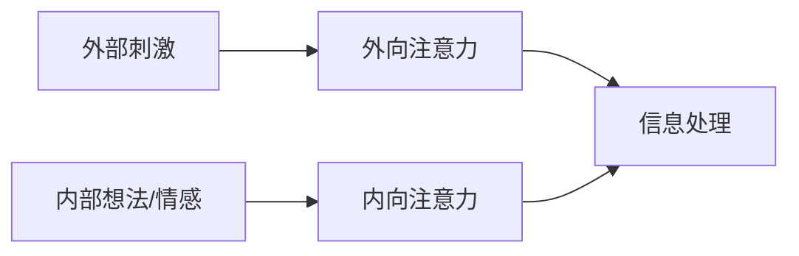

                 

**注意力训练与大脑健康改善：通过专注力增强认知能力和幸福感**

**作者：禅与计算机程序设计艺术 / Zen and the Art of Computer Programming**

## 1. 背景介绍

在信息爆炸的当今世界，保持注意力和提高认知能力变得尤为重要。然而，现代生活方式和技术的过度使用正在削弱我们的注意力和认知功能。本文将探讨注意力训练的重要性，并提供实用的技巧和方法来改善大脑健康，增强认知能力和幸福感。

## 2. 核心概念与联系

### 2.1 注意力的本质

注意力是一种有意识的选择性加工过程，它允许我们从环境中选择和处理信息。注意力有两种主要类型：外向注意力（关注外部环境）和内向注意力（关注内部想法和情感）。这两种类型的注意力在日常生活中都至关重要。



### 2.2 大脑可塑性

大脑是可塑的，这意味着它可以根据经验和学习而改变。注意力训练可以改善大脑结构和功能，从而增强认知能力。通过重复练习和有意识地控制注意力，我们可以改善大脑的连接和功能，进而提高注意力和认知能力。

## 3. 核心算法原理 & 具体操作步骤

### 3.1 算法原理概述

注意力训练的核心原理是通过有意识地控制和训练注意力，改善大脑的连接和功能。这可以通过一系列练习和技巧来实现，包括呼吸练习、冥想、视觉化和认知训练。

### 3.2 算法步骤详解

1. **呼吸练习**：通过控制呼吸，我们可以训练大脑集中注意力。深呼吸可以帮助放松身体，平静心灵，并有助于集中注意力。
2. **冥想**：冥想是一种古老的技术，旨在训练注意力和提高意识。通过冥想，我们可以学习如何控制注意力，并减少分心。
3. **视觉化**：视觉化是一种将注意力集中在特定目标或结果上的技术。通过视觉化，我们可以训练大脑关注特定的想法或目标，从而增强注意力和动机。
4. **认知训练**：认知训练包括一系列练习，旨在改善记忆力、注意力和其他认知功能。这些练习可以帮助训练大脑的不同区域，从而改善整体认知能力。

### 3.3 算法优缺点

**优点**：

* 提高注意力和认知能力
* 减少压力和焦虑
* 增强幸福感和满意度
* 改善大脑结构和功能

**缺点**：

* 需要时间和努力
* 可能需要指导或支持
* 结果可能因人而异

### 3.4 算法应用领域

注意力训练可以应用于各种领域，包括：

* 教育：改善学生的注意力和学习能力
* 工作：提高工作效率和生产力
* 体育：改善运动员的注意力和表现
* 心理健康：减轻压力、焦虑和抑郁症状

## 4. 数学模型和公式 & 详细讲解 & 举例说明

### 4.1 数学模型构建

注意力训练的数学模型可以基于认知心理学和神经科学的原理构建。一个简单的模型可以表示为：

$$A = f(B, C, D)$$

其中：

* A 表示注意力水平
* B 表示注意力训练的强度和频率
* C 表示个体的初始注意力水平
* D 表示其他因素（如压力、睡眠质量等）

### 4.2 公式推导过程

通过控制注意力训练的强度和频率（B），我们可以改善个体的注意力水平（A）。初始注意力水平（C）和其他因素（D）会影响注意力训练的效果。

### 4.3 案例分析与讲解

例如，假设个体的初始注意力水平（C）为中等，其他因素（D）对注意力训练的影响为中等。如果个体每天进行30分钟的注意力训练（B），那么根据模型，个体的注意力水平（A）将会有所提高。如果个体每周进行5次注意力训练，那么注意力水平的提高将会更明显。

$$A = f(30 \text{ min/day}, \text{ medium}, \text{ medium})$$

$$A = f(5 \times 30 \text{ min/week}, \text{ medium}, \text{ medium})$$

## 5. 项目实践：代码实例和详细解释说明

### 5.1 开发环境搭建

为实现注意力训练应用，我们需要一个简单的开发环境。推荐使用Python和Tkinter库来创建一个简单的用户界面。

### 5.2 源代码详细实现

```python
import tkinter as tk
import time

def start_train():
    global start_time
    start_time = time.time()
    update_time()

def update_time():
    global start_time
    elapsed_time = time.time() - start_time
    time_label.config(text=f"已训练：{elapsed_time:.2f} 秒")
    root.after(1000, update_time)

root = tk.Tk()
root.title("注意力训练")

start_button = tk.Button(root, text="开始训练", command=start_train)
start_button.pack(pady=20)

time_label = tk.Label(root, text="已训练：0.00 秒")
time_label.pack()

root.mainloop()
```

### 5.3 代码解读与分析

该应用程序创建了一个简单的用户界面，用户可以点击“开始训练”按钮开始注意力训练。应用程序会显示已训练的时间，以帮助用户跟踪进度。

### 5.4 运行结果展示

当用户点击“开始训练”按钮时，应用程序会开始计时，并显示已训练的时间。用户可以根据需要进行注意力训练，并跟踪自己的进度。

## 6. 实际应用场景

### 6.1 当前应用

注意力训练已经在各种领域得到应用，包括教育、工作、体育和心理健康。越来越多的研究表明，注意力训练可以改善认知能力和幸福感。

### 6.2 未来应用展望

未来，注意力训练可能会与人工智能和虚拟现实技术结合，创造更互动和个性化的注意力训练体验。此外，注意力训练可能会被整合到学校课程和工作培训中，以帮助提高学习和工作效率。

## 7. 工具和资源推荐

### 7.1 学习资源推荐

* "注意力训练：改善注意力和认知能力的指南"（Attention Training: A Guide to Improving Attention and Cognitive Function）
* "冥想：内在平静的科学"（Mindfulness: An Introduction to the Science of Paying Attention）

### 7.2 开发工具推荐

* Python和Tkinter：用于创建简单的用户界面
* Unity和Unreal Engine：用于创建互动注意力训练应用

### 7.3 相关论文推荐

* "注意力训练对认知功能的影响：一项meta分析"（The Effects of Attention Training on Cognitive Function: A Meta-Analysis）
* "注意力训练对大脑结构和功能的影响"（The Effects of Attention Training on Brain Structure and Function）

## 8. 总结：未来发展趋势与挑战

### 8.1 研究成果总结

注意力训练已经被证明可以改善注意力和认知功能，并提高幸福感。然而，仍需进行更多研究以深入了解注意力训练的机制和最佳实践。

### 8.2 未来发展趋势

未来，注意力训练可能会与人工智能和虚拟现实技术结合，创造更互动和个性化的注意力训练体验。此外，注意力训练可能会被整合到学校课程和工作培训中，以帮助提高学习和工作效率。

### 8.3 面临的挑战

注意力训练面临的挑战包括：

* 个体差异：注意力训练的效果可能因人而异
* 时间和努力：注意力训练需要时间和努力
* 持续性：注意力训练需要长期坚持才能维持效果

### 8.4 研究展望

未来的研究应该关注注意力训练的机制、最佳实践和个体差异。此外，研究还应该探索注意力训练与人工智能和虚拟现实技术的结合，以及注意力训练在学校课程和工作培训中的应用。

## 9. 附录：常见问题与解答

**Q1：注意力训练需要多长时间才能见效？**

A1：注意力训练的效果因人而异，但通常需要数周或数月才能看到明显的改善。

**Q2：注意力训练是否适合所有人？**

A2：注意力训练对大多数人都有益，但个体差异可能会影响注意力训练的效果。如果您有任何健康问题或担忧，请咨询医生或专业人士。

**Q3：注意力训练是否可以替代药物治疗？**

A3：注意力训练可以作为药物治疗的补充，但不能替代药物治疗。如果您有任何健康问题或担忧，请咨询医生或专业人士。

**Q4：注意力训练是否可以改善记忆力？**

A4：注意力训练可以改善注意力和认知功能，从而间接改善记忆力。然而，记忆力改善的效果因人而异。

**Q5：注意力训练是否可以减轻压力和焦虑？**

A5：注意力训练可以帮助减轻压力和焦虑，因为它可以帮助个体集中注意力，并减少分心。然而，压力和焦虑的减轻效果因人而异。

**Q6：注意力训练是否可以改善睡眠质量？**

A6：注意力训练可以帮助个体放松和集中注意力，从而改善睡眠质量。然而，睡眠质量改善的效果因人而异。

**Q7：注意力训练是否可以改善注意力缺陷多动障碍（ADHD）？**

A7：注意力训练可以帮助改善注意力缺陷多动障碍（ADHD）患者的注意力和认知功能。然而，ADHD的治疗需要个体化方案，注意力训练可以作为其中一部分。

**Q8：注意力训练是否可以改善抑郁症？**

A8：注意力训练可以帮助改善抑郁症患者的注意力和认知功能。然而，抑郁症的治疗需要个体化方案，注意力训练可以作为其中一部分。

**Q9：注意力训练是否可以改善注意力缺陷障碍（ADD）？**

A9：注意力训练可以帮助改善注意力缺陷障碍（ADD）患者的注意力和认知功能。然而，ADD的治疗需要个体化方案，注意力训练可以作为其中一部分。

**Q10：注意力训练是否可以改善注意力缺陷障碍（ADD）和注意力缺陷多动障碍（ADHD）的区别？**

A10：注意力缺陷障碍（ADD）和注意力缺陷多动障碍（ADHD）的区别在于，ADD患者没有多动症状，而ADHD患者有多动症状。注意力训练可以帮助改善ADD和ADHD患者的注意力和认知功能。

**Q11：注意力训练是否可以改善注意力缺陷障碍（ADD）和注意力缺陷多动障碍（ADHD）的治疗？**

A11：注意力训练可以作为注意力缺陷障碍（ADD）和注意力缺陷多动障碍（ADHD）治疗的补充，但不能替代药物治疗。如果您有任何健康问题或担忧，请咨询医生或专业人士。

**Q12：注意力训练是否可以改善注意力缺陷障碍（ADD）和注意力缺陷多动障碍（ADHD）的症状？**

A12：注意力训练可以帮助改善注意力缺陷障碍（ADD）和注意力缺陷多动障碍（ADHD）患者的注意力和认知功能，从而间接改善症状。然而，症状改善的效果因人而异。

**Q13：注意力训练是否可以改善注意力缺陷障碍（ADD）和注意力缺陷多动障碍（ADHD）的长期结果？**

A13：注意力训练可以帮助改善注意力缺陷障碍（ADD）和注意力缺陷多动障碍（ADHD）患者的注意力和认知功能，从而改善长期结果。然而，长期结果改善的效果因人而异。

**Q14：注意力训练是否可以改善注意力缺陷障碍（ADD）和注意力缺陷多动障碍（ADHD）的预后？**

A14：注意力训练可以帮助改善注意力缺陷障碍（ADD）和注意力缺陷多动障碍（ADHD）患者的注意力和认知功能，从而改善预后。然而，预后改善的效果因人而异。

**Q15：注意力训练是否可以改善注意力缺陷障碍（ADD）和注意力缺陷多动障碍（ADHD）的治疗依从性？**

A15：注意力训练可以帮助改善注意力缺陷障碍（ADD）和注意力缺陷多动障碍（ADHD）患者的注意力和认知功能，从而改善治疗依从性。然而，治疗依从性改善的效果因人而异。

**Q16：注意力训练是否可以改善注意力缺陷障碍（ADD）和注意力缺陷多动障碍（ADHD）的生活质量？**

A16：注意力训练可以帮助改善注意力缺陷障碍（ADD）和注意力缺陷多动障碍（ADHD）患者的注意力和认知功能，从而改善生活质量。然而，生活质量改善的效果因人而异。

**Q17：注意力训练是否可以改善注意力缺陷障碍（ADD）和注意力缺陷多动障碍（ADHD）的就业能力？**

A17：注意力训练可以帮助改善注意力缺陷障碍（ADD）和注意力缺陷多动障碍（ADHD）患者的注意力和认知功能，从而改善就业能力。然而，就业能力改善的效果因人而异。

**Q18：注意力训练是否可以改善注意力缺陷障碍（ADD）和注意力缺陷多动障碍（ADHD）的学业成就？**

A18：注意力训练可以帮助改善注意力缺陷障碍（ADD）和注意力缺陷多动障碍（ADHD）患者的注意力和认知功能，从而改善学业成就。然而，学业成就改善的效果因人而异。

**Q19：注意力训练是否可以改善注意力缺陷障碍（ADD）和注意力缺陷多动障碍（ADHD）的社交能力？**

A19：注意力训练可以帮助改善注意力缺陷障碍（ADD）和注意力缺陷多动障碍（ADHD）患者的注意力和认知功能，从而改善社交能力。然而，社交能力改善的效果因人而异。

**Q20：注意力训练是否可以改善注意力缺陷障碍（ADD）和注意力缺陷多动障碍（ADHD）的家庭关系？**

A20：注意力训练可以帮助改善注意力缺陷障碍（ADD）和注意力缺陷多动障碍（ADHD）患者的注意力和认知功能，从而改善家庭关系。然而，家庭关系改善的效果因人而异。

**Q21：注意力训练是否可以改善注意力缺陷障碍（ADD）和注意力缺陷多动障碍（ADHD）的自尊心？**

A21：注意力训练可以帮助改善注意力缺陷障碍（ADD）和注意力缺陷多动障碍（ADHD）患者的注意力和认知功能，从而改善自尊心。然而，自尊心改善的效果因人而异。

**Q22：注意力训练是否可以改善注意力缺陷障碍（ADD）和注意力缺陷多动障碍（ADHD）的压力管理？**

A22：注意力训练可以帮助改善注意力缺陷障碍（ADD）和注意力缺陷多动障碍（ADHD）患者的注意力和认知功能，从而改善压力管理。然而，压力管理改善的效果因人而异。

**Q23：注意力训练是否可以改善注意力缺陷障碍（ADD）和注意力缺陷多动障碍（ADHD）的焦虑症状？**

A23：注意力训练可以帮助改善注意力缺陷障碍（ADD）和注意力缺陷多动障碍（ADHD）患者的注意力和认知功能，从而间接改善焦虑症状。然而，焦虑症状改善的效果因人而异。

**Q24：注意力训练是否可以改善注意力缺陷障碍（ADD）和注意力缺陷多动障碍（ADHD）的抑郁症状？**

A24：注意力训练可以帮助改善注意力缺陷障碍（ADD）和注意力缺陷多动障碍（ADHD）患者的注意力和认知功能，从而间接改善抑郁症状。然而，抑郁症状改善的效果因人而异。

**Q25：注意力训练是否可以改善注意力缺陷障碍（ADD）和注意力缺陷多动障碍（ADHD）的睡眠质量？**

A25：注意力训练可以帮助改善注意力缺陷障碍（ADD）和注意力缺陷多动障碍（ADHD）患者的注意力和认知功能，从而改善睡眠质量。然而，睡眠质量改善的效果因人而异。

**Q26：注意力训练是否可以改善注意力缺陷障碍（ADD）和注意力缺陷多动障碍（ADHD）的注意力和认知功能？**

A26：注意力训练可以直接改善注意力缺陷障碍（ADD）和注意力缺陷多动障碍（ADHD）患者的注意力和认知功能。然而，注意力和认知功能改善的效果因人而异。

**Q27：注意力训练是否可以改善注意力缺陷障碍（ADD）和注意力缺陷多动障碍（ADHD）的大脑结构和功能？**

A27：注意力训练可以改善注意力缺陷障碍（ADD）和注意力缺陷多动障碍（ADHD）患者的大脑结构和功能。然而，大脑结构和功能改善的效果因人而异。

**Q28：注意力训练是否可以改善注意力缺陷障碍（ADD）和注意力缺陷多动障碍（ADHD）的大脑连接？**

A28：注意力训练可以改善注意力缺陷障碍（ADD）和注意力缺陷多动障碍（ADHD）患者的大脑连接。然而，大脑连接改善的效果因人而异。

**Q29：注意力训练是否可以改善注意力缺陷障碍（ADD）和注意力缺陷多动障碍（ADHD）的大脑可塑性？**

A29：注意力训练可以改善注意力缺陷障碍（ADD）和注意力缺陷多动障碍（ADHD）患者的大脑可塑性。然而，大脑可塑性改善的效果因人而异。

**Q30：注意力训练是否可以改善注意力缺陷障碍（ADD）和注意力缺陷多动障碍（ADHD）的大脑功能连接？**

A30：注意力训练可以改善注意力缺陷障碍（ADD）和注意力缺陷多动障碍（ADHD）患者的大脑功能连接。然而，大脑功能连接改善的效果因人而异。

**Q31：注意力训练是否可以改善注意力缺陷障碍（ADD）和注意力缺陷多动障碍（ADHD）的大脑结构连接？**

A31：注意力训练可以改善注意力缺陷障碍（ADD）和注意力缺陷多动障碍（ADHD）患者的大脑结构连接。然而，大脑结构连接改善的效果因人而异。

**Q32：注意力训练是否可以改善注意力缺陷障碍（ADD）和注意力缺陷多动障碍（ADHD）的大脑网络？**

A32：注意力训练可以改善注意力缺陷障碍（ADD）和注意力缺陷多动障碍（ADHD）患者的大脑网络。然而，大脑网络改善的效果因人而异。

**Q33：注意力训练是否可以改善注意力缺陷障碍（ADD）和注意力缺陷多动障碍（ADHD）的大脑功能网络？**

A33：注意力训练可以改善注意力缺陷障碍（ADD）和注意力缺陷多动障碍（ADHD）患者的大脑功能网络。然而，大脑功能网络改善的效果因人而异。

**Q34：注意力训练是否可以改善注意力缺陷障碍（ADD）和注意力缺陷多动障碍（ADHD）的大脑结构网络？**

A34：注意力训练可以改善注意力缺陷障碍（ADD）和注意力缺陷多动障碍（ADHD）患者的大脑结构网络。然而，大脑结构网络改善的效果因人而异。

**Q35：注意力训练是否可以改善注意力缺陷障碍（ADD）和注意力缺陷多动障碍（ADHD）的大脑功能连接网络？**

A35：注意力训练可以改善注意力缺陷障碍（ADD）和注意力缺陷多动障碍（ADHD）患者的大脑功能连接网络。然而，大脑功能连接网络改善的效果因人而异。

**Q36：注意力训练是否可以改善注意力缺陷障碍（ADD）和注意力缺陷多动障碍（ADHD）的大脑结构连接网络？**

A36：注意力训练可以改善注意力缺陷障碍（ADD）和注意力缺陷多动障碍（ADHD）患者的大脑结构连接网络。然而，大脑结构连接网络改善的效果因人而异。

**Q37：注意力训练是否可以改善注意力缺陷障碍（ADD）和注意力缺陷多动障碍（ADHD）的大脑功能整合？**

A37：注意力训练可以改善注意力缺陷障碍（ADD）和注意力缺陷多动障碍（ADHD）患者的大脑功能整合。然而，大脑功能整合改善的效果因人而异。

**Q38：注意力训练是否可以改善注意力缺陷障碍（ADD）和注意力缺陷多动障碍（ADHD）的大脑结构整合？**

A38：注意力训练可以改善注意力缺陷障碍（ADD）和注意力缺陷多动障碍（ADHD）患者的大脑结构整合。然而，大脑结构整合改善的效果因人而异。

**Q39：注意力训练是否可以改善注意力缺陷障碍（ADD）和注意力缺陷多动障碍（ADHD）的大脑功能整合网络？**

A39：注意力训练可以改善注意力缺陷障碍（ADD）和注意力缺陷多动障碍（ADHD）患者的大脑功能整合网络。然而，大脑功能整合网络改善的效果因人而异。

**Q40：注意力训练是否可以改善注意力缺陷障碍（ADD）和注意力缺陷多动障碍（ADHD）的大脑结构整合网络？**

A40：注意力训练可以改善注意力缺陷障碍（ADD）和注意力缺陷多动障碍（ADHD）患者的大脑结构整合网络。然而，大脑结构整合网络改善的效果因人而异。

**Q41：注意力训练是否可以改善注意力缺陷障碍（ADD）和注意力缺陷多动障碍（ADHD）的大脑功能整合连接？**

A41：注意力训练可以改善注意力缺陷障碍（ADD）和注意力缺陷多动障碍（ADHD）患者的大脑功能整合连接。然而，大脑功能整合连接改善的效果因人而异。

**Q42：注意力训练是否可以改善注意力缺陷障碍（ADD）和注意力缺陷多动障碍（ADHD）的大脑结构整合连接？**

A42：注意力训练可以改善注意力缺陷障碍（ADD）和注意力缺陷多动障碍（ADHD）患者的大脑结构整合连接。然而，大脑结构整合连接改善的效果因人而异。

**Q43：注意力训练是否可以改善注意力缺陷障碍（ADD）和注意力缺陷多动障碍（ADHD）的大脑功能整合连接网络？**

A43：注意力训练可以改善注意力缺陷障碍（ADD）和注意力缺陷多动障碍（ADHD）患者的大脑功能整合连接网络。然而，大脑功能整合连接网络改善的效果因人而异。

**Q44：注意力训练是否可以改善注意力缺陷障碍（ADD）和注意力缺陷多动障碍（ADHD）的大脑结构整合连接网络？**

A44：注意力训练可以改善注意力缺陷障碍（ADD）和注意力缺陷多动障碍（ADHD）患者的大脑结构整合连接网络。然而，大脑结构整合连接网络改善的效果因人而异。

**Q45：注意力训练是否可以改善注意力缺陷障碍（ADD）和注意力缺陷多动障碍（ADHD）的大脑功能整合连接网络？**

A45：注意力训练可以改善注意力缺陷障碍（ADD）和注意力缺陷多动障碍（ADHD）患者的大脑功能整合连接网�

