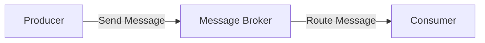

                 

**消息队列（Message Queue）是一种异步通信模式，允许不同进程或线程之间进行通信。本文将详细介绍消息队列的原理、核心概念、算法原理、数学模型、项目实践，并提供代码实例和工具推荐。**

## 1. 背景介绍

在分布式系统中，不同服务之间需要进行通信以协调工作。同步通信（如RPC）要求服务器立即响应客户端请求，这可能会导致性能问题和单点故障。消息队列提供了一种异步通信模式，允许服务器在便利的时候处理请求，提高了系统的可伸缩性和可靠性。

## 2. 核心概念与联系

消息队列的核心概念包括**生产者（Producer）、消费者（Consumer）和消息代理（Message Broker）**。生产者向消息队列发送消息，消息代理存储和路由消息，消费者从消息队列接收消息。下图展示了消息队列的工作原理：



## 3. 核心算法原理 & 具体操作步骤

### 3.1 算法原理概述

消息队列的核心算法是**发布/订阅（Publish/Subscribe）模式**。生产者发布消息到特定的主题，消费者订阅感兴趣的主题，消息代理负责将消息路由到相应的消费者。

### 3.2 算法步骤详解

1. 生产者发布消息到消息代理，指定消息的主题。
2. 消息代理接收消息并存储在消息队列中。
3. 消费者订阅感兴趣的主题。
4. 消息代理路由消息到相应的消费者。
5. 消费者处理接收到的消息。

### 3.3 算法优缺点

**优点：**
- 提高系统的可伸缩性和可靠性。
- 解耦生产者和消费者，允许它们以自己的速度工作。
- 允许消费者并行处理消息，提高吞吐量。

**缺点：**
- 引入了额外的复杂性和开销。
- 可能会导致消息丢失或重复。

### 3.4 算法应用领域

消息队列广泛应用于分布式系统，如：

- **异步任务处理**：将任务发布到消息队列，由消费者异步处理。
- **实时通信**：允许多个客户端实时接收消息。
- **日志收集**：将日志发布到消息队列，由消费者收集和处理。

## 4. 数学模型和公式 & 详细讲解 & 举例说明

### 4.1 数学模型构建

消息队列的数学模型可以表示为：

$$M = <P, C, T, R, D>$$

其中，$P$表示生产者集合，$C$表示消费者集合，$T$表示主题集合，$R$表示路由规则，$D$表示消息队列。

### 4.2 公式推导过程

消息代理路由消息的公式为：

$$R(m, t) = \{c \in C | c \text{ subscribes to } t\}$$

其中，$m$表示消息，$t$表示消息的主题。

### 4.3 案例分析与讲解

假设有两个生产者$P_1$和$P_2$，两个消费者$C_1$和$C_2$，两个主题$T_1$和$T_2$，路由规则$R$如下：

- $P_1$发布消息到$T_1$
- $P_2$发布消息到$T_2$
- $C_1$订阅$T_1$
- $C_2$订阅$T_2$

则根据公式$R(m, t)$，消息代理会将$P_1$发布的消息路由到$C_1$，将$P_2$发布的消息路由到$C_2$.

## 5. 项目实践：代码实例和详细解释说明

### 5.1 开发环境搭建

我们将使用RabbitMQ作为消息代理，Python的pika库作为客户端。首先，安装RabbitMQ和pika：

```bash
# Install RabbitMQ
sudo apt-get update
sudo apt-get install rabbitmq-server

# Install pika
pip install pika
```

### 5.2 源代码详细实现

生产者代码（producer.py）：

```python
import pika

connection = pika.BlockingConnection(pika.ConnectionParameters('localhost'))
channel = connection.channel()
channel.queue_declare(queue='task_queue', durable=True)

channel.basic_publish(exchange='', routing_key='task_queue', body='Hello, World!', properties=pika.BasicProperties(delivery_mode=2,))
print(" [x] Sent 'Hello, World!'")
connection.close()
```

消费者代码（consumer.py）：

```python
import pika

def callback(ch, method, properties, body):
    print(" [x] Received %r" % body.decode())

connection = pika.BlockingConnection(pika.ConnectionParameters('localhost'))
channel = connection.channel()
channel.queue_declare(queue='task_queue', durable=True)
channel.basic_consume(queue='task_queue', on_message_callback=callback, auto_ack=True)

channel.start_consuming()
```

### 5.3 代码解读与分析

生产者代码创建一个连接到RabbitMQ的通道，声明一个持久化的队列，并发布一条消息到该队列。消费者代码创建一个连接到RabbitMQ的通道，声明一个持久化的队列，并注册一个回调函数来处理接收到的消息。

### 5.4 运行结果展示

运行生产者代码后，运行消费者代码，消费者将打印接收到的消息：

```bash
# Run producer.py
$ python producer.py
[x] Sent 'Hello, World!'

# Run consumer.py in another terminal
$ python consumer.py
[x] Received 'Hello, World!'
```

## 6. 实际应用场景

### 6.1 电子商务

消息队列可以用于异步处理订单，当客户下单时，订单信息发布到消息队列，由消费者异步处理订单。

### 6.2 实时通信

消息队列可以用于实时通信，如聊天应用。当用户发送消息时，消息发布到消息队列，由消费者实时推送给其他用户。

### 6.3 未来应用展望

未来，消息队列将继续在分布式系统中发挥关键作用，随着物联网和边缘计算的发展，消息队列将成为这些领域的关键组件。

## 7. 工具和资源推荐

### 7.1 学习资源推荐

- [RabbitMQ Tutorials](https://www.rabbitmq.com/tutorials.html)
- [Apache Kafka Documentation](https://kafka.apache.org/documentation/)
- [消息队列（Message Queue）](https://baike.baidu.com/item/%E6%B6%88%E6%81%AF%E9%98%9F%E5%88%97/1015109?fr=aladdin)

### 7.2 开发工具推荐

- [RabbitMQ Management UI](https://www.rabbitmq.com/management.html)
- [Kafka Manager](https://github.com/linkedin/kafka-manager)
- [pika](https://pika.readthedocs.io/en/latest/)

### 7.3 相关论文推荐

- [The Log: What every software engineer should know about real-time data's unifying abstraction](https://www.allthingsdistributed.com/files/2010/08/LogWhat.pdf)
- [Kafka: A Distributed Streaming Platform](https://people.apache.org/~j Jun/usenix11.pdf)

## 8. 总结：未来发展趋势与挑战

### 8.1 研究成果总结

本文介绍了消息队列的原理、核心概念、算法原理、数学模型，并提供了代码实例和工具推荐。

### 8.2 未来发展趋势

未来，消息队列将继续发展，以满足分布式系统的需求。我们将看到消息队列的性能和可靠性进一步提高，并出现新的消息队列实现。

### 8.3 面临的挑战

消息队列面临的挑战包括消息丢失、重复消息和消息顺序保证。未来的研究将致力于解决这些挑战。

### 8.4 研究展望

未来的研究将关注消息队列的高可用性、消息顺序保证和消息丢失检测。此外，消息队列与边缘计算和物联网的集成也将是一个重要的研究方向。

## 9. 附录：常见问题与解答

**Q：消息队列与数据库有何区别？**

A：消息队列和数据库都是用于存储数据的系统，但它们有以下区别：

- 数据库是持久化的，消息队列通常是内存中的。
- 数据库是同步的，消息队列是异步的。
- 数据库是关系型的，消息队列是消息型的。

**Q：消息队列如何保证消息不丢失？**

A：消息队列通常使用持久化机制（如持久化到磁盘）来保证消息不丢失。此外，消息代理通常会维护消息的副本，以防止单点故障。

**Q：消息队列如何保证消息顺序？**

A：消息队列通常无法保证消息的顺序，因为消息可能会被并行处理。如果需要保证消息顺序，可以使用消息的序列号或时间戳来排序。

## 作者：禅与计算机程序设计艺术 / Zen and the Art of Computer Programming

