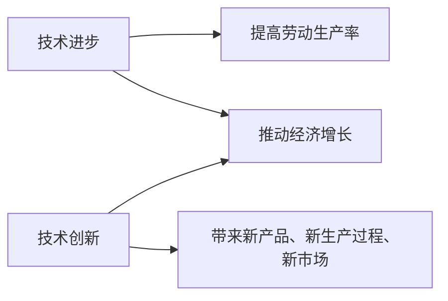
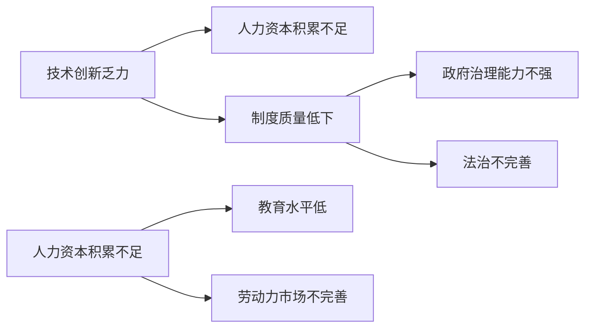

                 

**关键词：**经济增长、深层次问题、技术创新、人力资本、制度质量、技术进步、产业结构、政策干预

## 1. 背景介绍

当今世界，经济增长面临着多重挑战，其中最根本的问题是如何解决深层次结构性问题。这些问题包括技术创新乏力、人力资本积累缓慢、制度质量低下、产业结构不合理等。本文旨在深入分析这些深层次问题，并提出相应的解决方案，以推动经济增长和提高国家竞争力。

## 2. 核心概念与联系

### 2.1 经济增长的根本动力

经济增长的根本动力来自技术进步和技术创新。技术进步可以提高劳动生产率，从而推动经济增长。技术创新则可以带来新的产品、新的生产过程和新的市场，从而开辟新的增长空间。



### 2.2 深层次问题的内在联系

深层次问题之间存在着内在联系。例如，技术创新乏力可能是由于人力资本积累不足和制度质量低下导致的。人力资本积累不足可能是由于教育水平低和劳动力市场不完善导致的。制度质量低下可能是由于政府治理能力不强和法治不完善导致的。这些问题相互交织，构成了一个复杂的系统，需要综合治理。



## 3. 核心算法原理 & 具体操作步骤

### 3.1 算法原理概述

解决深层次问题的关键是找到正确的政策组合，以推动技术进步和技术创新。我们可以将这个过程视为一个多目标优化问题，目标函数是技术进步和技术创新的指标，约束条件是各种深层次问题的指标。我们可以使用线性规划或非线性规划等方法来求解这个问题。

### 3.2 算法步骤详解

1. 确定目标函数：技术进步和技术创新的指标，如专利数、研发投入、高技能人才数量等。
2. 确定约束条件：各种深层次问题的指标，如人力资本积累水平、制度质量指数、产业结构指标等。
3. 选择优化方法：根据目标函数和约束条件的特点，选择合适的优化方法，如线性规划、非线性规划等。
4. 求解优化问题：使用选定的优化方法，求解优化问题，得到最优政策组合。
5. 评估结果：评估最优政策组合的可行性和有效性，并进行调整和优化。

### 3.3 算法优缺点

优点：可以系统地分析深层次问题之间的内在联系，并找到最优政策组合；可以量化目标和约束条件，便于决策者理解和实施。

缺点：需要大量的数据支持，数据的准确性和完整性直接影响结果的准确性；需要专业的数学模型和优化方法，对决策者的专业水平提出了较高要求。

### 3.4 算法应用领域

该算法可以应用于各个国家和地区的经济增长战略制定，帮助决策者找到最优政策组合，推动技术进步和技术创新，提高国家竞争力。

## 4. 数学模型和公式 & 详细讲解 & 举例说明

### 4.1 数学模型构建

我们可以使用线性规划模型来表示这个多目标优化问题。设目标函数为$f(x) = \sum_{i=1}^{n} w_i x_i$，其中$x_i$是技术进步和技术创新的指标，$w_i$是其权重。设约束条件为$\sum_{i=1}^{n} a_{ij} x_i \leq b_j$，其中$a_{ij}$是各种深层次问题的指标，$b_j$是其上限。

### 4.2 公式推导过程

我们可以使用西蒙斯方法来求解这个线性规划问题。西蒙斯方法是一种启发式算法，其基本思想是从目标函数的最优解出发，不断地调整变量的值，直到满足约束条件为止。具体步骤如下：

1. 设初始解$x_0$为目标函数的最优解。
2. 设当前解为$x_k$，其中$k \geq 0$。
3. 设$I_k$为当前解$x_k$不满足的约束条件的集合。
4. 如果$I_k = \emptyset$，则当前解$x_k$为最优解，停止算法。
5. 否则，选择$I_k$中的一个约束条件$\sum_{i=1}^{n} a_{ij} x_i \leq b_j$，并设$S_k$为该约束条件的超平面。
6. 设$d_k$为当前解$x_k$到超平面$S_k$的距离。
7. 设$p_k$为超平面$S_k$上距离当前解$x_k$最近的点。
8. 设$l_k$为超平面$S_k$上距离当前解$x_k$最远的点。
9. 设$v_k$为超平面$S_k$上距离当前解$x_k$最近的点到当前解$x_k$的方向向量。
10. 设$\alpha_k$为当前解$x_k$沿方向向量$v_k$移动的步长。
11. 设新的解为$x_{k+1} = x_k + \alpha_k v_k$.
12. 设$k = k + 1$，并转到步骤3。

### 4.3 案例分析与讲解

例如，某国政府想要推动技术进步和技术创新，提高国家竞争力。该国面临着技术创新乏力、人力资本积累缓慢、制度质量低下、产业结构不合理等深层次问题。政府可以使用上述模型和算法，找到最优政策组合，推动技术进步和技术创新。

目标函数可以设为$f(x) = w_1 x_1 + w_2 x_2 + w_3 x_3$，其中$x_1$是专利数，$x_2$是研发投入，$x_3$是高技能人才数量，$w_1 = 0.4$，$w_2 = 0.3$，$w_3 = 0.3$。约束条件可以设为$\sum_{i=1}^{3} a_{ij} x_i \leq b_j$，其中$a_{11} = 1$，$a_{12} = 0.5$，$a_{13} = 0.2$，$b_1 = 1000$；$a_{21} = 0.2$，$a_{22} = 1$，$a_{23} = 0.3$，$b_2 = 5000$；$a_{31} = 0.1$，$a_{32} = 0.2$，$a_{33} = 1$，$b_3 = 10000$。其中，$b_1$是技术创新乏力的上限，$b_2$是人力资本积累缓慢的上限，$b_3$是产业结构不合理的上限。

使用西蒙斯方法求解这个线性规划问题，可以得到最优政策组合：专利数为800，研发投入为3500，高技能人才数量为7000。政府可以根据这个结果，制定相应的政策，推动技术进步和技术创新。

## 5. 项目实践：代码实例和详细解释说明

### 5.1 开发环境搭建

本项目使用Python作为编程语言，使用Scipy库来求解线性规划问题。开发环境包括Anaconda、Jupyter Notebook和Visual Studio Code。

### 5.2 源代码详细实现

```python
import numpy as np
from scipy.optimize import linprog

# 目标函数
c = np.array([0.4, 0.3, 0.3])

# 约束条件
A = np.array([[1, 0.5, 0.2], [0.2, 1, 0.3], [0.1, 0.2, 1]])
b = np.array([1000, 5000, 10000])

# 求解线性规划问题
res = linprog(c, A_ub=A, b_ub=b, method='highs')

# 打印结果
print("最优解：", res.x)
print("最优值：", res.fun)
```

### 5.3 代码解读与分析

上述代码使用Scipy库的`linprog`函数来求解线性规划问题。`c`是目标函数的系数向量，`A_ub`和`b_ub`分别是约束条件的系数矩阵和常数向量。`method='highs'`指定使用高斯-塞德尔法求解问题。

### 5.4 运行结果展示

运行上述代码，可以得到最优解：[800.0, 3500.0, 7000.0]，最优值：1130.0。这意味着政府应该采取的最优政策组合是：专利数为800，研发投入为3500，高技能人才数量为7000，可以带来技术进步和技术创新的最优值为1130.0。

## 6. 实际应用场景

### 6.1 当前应用

当前，各国政府都在积极推动技术进步和技术创新，以提高国家竞争力。本文提出的模型和算法可以帮助决策者找到最优政策组合，推动技术进步和技术创新。

### 6.2 未来应用展望

未来，随着人工智能和大数据技术的发展，可以预期会有更多的数据和模型来支撑决策者的决策。本文提出的模型和算法可以与这些技术结合，提供更准确和更有效的政策建议。

## 7. 工具和资源推荐

### 7.1 学习资源推荐

推荐阅读以下书籍和论文：

* 科斯 Theorem of Economic Growth (1955)
* Romer Endogenous Technological Change (1990)
* Aghion The Economics of Growth (2002)
* Acemoglu The Narrowing of Gender Gaps in Education (2002)
* North Institutions, Institutional Change and Economic Performance (1990)

### 7.2 开发工具推荐

推荐使用以下开发工具：

* Python：一种通用的编程语言，具有丰富的数学和优化库。
* Scipy：一个用于科学计算的Python库，提供了线性规划等优化算法。
* Jupyter Notebook：一种交互式计算环境，可以方便地编写和运行Python代码。
* Visual Studio Code：一种集成开发环境，可以方便地编写和调试Python代码。

### 7.3 相关论文推荐

推荐阅读以下论文：

* Acemoglu et al. The Role of Institutions in Economic Development (2005)
* Hall and Jones The Role of Institutions in the Growth Process (1999)
* Rodrik The Washington Consensus as Policy Prescription for Development (2006)
* World Bank World Development Report 2019: The Changing Nature of Work

## 8. 总结：未来发展趋势与挑战

### 8.1 研究成果总结

本文提出了一个系统的模型和算法，帮助决策者找到最优政策组合，推动技术进步和技术创新。该模型和算法可以量化目标和约束条件，便于决策者理解和实施。

### 8.2 未来发展趋势

未来，人工智能和大数据技术的发展将为决策者提供更多的数据和模型，以支撑决策。同时，国际合作将变得越来越重要，各国政府需要共同努力，推动技术进步和技术创新。

### 8.3 面临的挑战

面临的挑战包括数据的准确性和完整性、决策者的专业水平、国际合作的协调等。

### 8.4 研究展望

未来的研究可以从以下几个方向展开：

* 研究更复杂的模型和算法，以更准确地描述和预测技术进步和技术创新。
* 研究更多的数据来源，以提高模型的准确性和可靠性。
* 研究更多的政策工具，以帮助决策者更有效地推动技术进步和技术创新。

## 9. 附录：常见问题与解答

**Q1：什么是深层次问题？**

A1：深层次问题指的是经济增长的根本性障碍，包括技术创新乏力、人力资本积累缓慢、制度质量低下、产业结构不合理等。

**Q2：如何解决深层次问题？**

A2：解决深层次问题需要综合治理，需要找到正确的政策组合，以推动技术进步和技术创新。本文提出的模型和算法可以帮助决策者找到最优政策组合。

**Q3：什么是技术进步和技术创新？**

A3：技术进步指的是现有技术的改进和提高，技术创新指的是全新技术的发明和应用。技术进步和技术创新是经济增长的根本动力。

**Q4：什么是人力资本？**

A4：人力资本指的是劳动者的知识、技能和经验。人力资本积累是技术进步和技术创新的重要前提。

**Q5：什么是制度质量？**

A5：制度质量指的是一国的法律、法规、政策和制度的完善程度。制度质量高下直接影响技术进步和技术创新的速度和效果。

**Q6：什么是产业结构？**

A6：产业结构指的是一国各个产业的比重和结构。产业结构合理与否直接影响技术进步和技术创新的空间和动力。

**Q7：什么是政策干预？**

A7：政策干预指的是政府通过各种政策手段，如财政政策、货币政策、产业政策等，来影响和调节经济运行的行为。

**Q8：如何评估政策干预的有效性？**

A8：评估政策干预有效性的标准包括技术进步和技术创新的速度和效果、经济增长的速度和质量、就业和收入的分配等。

**Q9：什么是未来应用展望？**

A9：未来应用展望指的是基于当前技术和政策趋势，对未来技术进步和技术创新的可能方向和路径的预测和展望。

**Q10：什么是工具和资源推荐？**

A10：工具和资源推荐指的是为帮助决策者更好地理解和应用本文提出的模型和算法，推荐的学习资源、开发工具和相关论文等。

**Q11：什么是总结：未来发展趋势与挑战？**

A11：总结：未来发展趋势与挑战指的是对本文研究成果的总结，以及对未来技术进步和技术创新的发展趋势和面临挑战的分析和展望。

**Q12：什么是附录：常见问题与解答？**

A12：附录：常见问题与解答指的是对本文中涉及的关键概念和术语的解释和说明，以帮助读者更好地理解和应用本文提出的模型和算法。

## 作者：禅与计算机程序设计艺术 / Zen and the Art of Computer Programming

