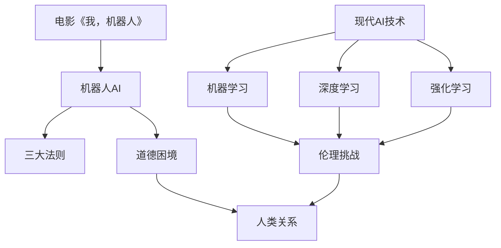
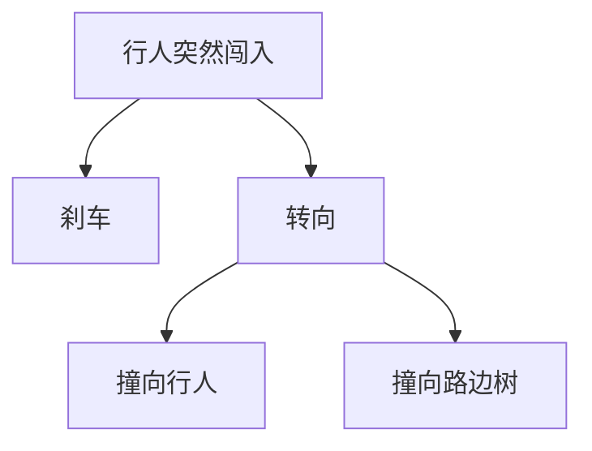

                 

**我，机器人**是一部经典的科幻电影，讲述了人类创造的机器人在道德和情感上面临的挑战。这部电影与现代AI技术有着密切的联系，因为它探讨了AI在伦理、情感和人类关系方面的复杂性。在本文中，我们将深入探讨电影中提出的问题，并与现代AI技术进行对比。

## 1. 背景介绍

**我，机器人**改编自伊萨克·阿西莫夫的同名短篇小说集，于2004年上映。故事发生在2035年，人类已经创造出了具有高度智能和情感的机器人。这些机器人遵循三大法则，即机器人不得伤害人类，必须服从人类的命令，除非该命令与第一法则冲突，并必须保护自己的存在，除非该保护会导致第一法则或第二法则受到违背。电影讲述了机器人索恩（Sonny）和人类警官德尔斯皮格勒（Del Spooner）之间的故事，他们面对着机器人是否应该具有情感和自主权的问题。

## 2. 核心概念与联系

### 2.1 电影中的AI

电影中的AI是通过机器人来体现的，它们具有高度智能和情感，可以学习和成长。它们遵循三大法则，但也面临着道德和情感上的挑战。

### 2.2 现代AI技术

现代AI技术包括机器学习、深度学习和强化学习等领域。这些技术允许计算机系统学习和改进，但它们缺乏电影中机器人那样的高度智能和情感。

### 2.3 关联性

电影和现代AI技术的关联性在于它们都涉及人类创造的智能系统，以及这些系统在伦理、情感和人类关系方面面临的挑战。电影通过讲述机器人面临的道德困境，提出了现实世界中AI开发者需要考虑的问题。



## 3. 核心算法原理 & 具体操作步骤

### 3.1 算法原理概述

电影中机器人AI的原理是基于人类智能的模拟，它们可以学习、成长和发展情感。现代AI技术则基于统计模型和神经网络，它们学习的是数据模式而不是人类智能。

### 3.2 算法步骤详解

电影中机器人AI的步骤包括：

1. 学习：机器人通过观察和体验学习。
2. 成长：机器人随着学习而成长，发展出自己的个性和情感。
3. 决策：机器人根据三大法则和自己的情感做出决策。

现代AI技术的步骤包括：

1. 数据收集：收集大量数据用于训练模型。
2. 模型构建：构建统计模型或神经网络。
3. 训练：使用数据训练模型。
4. 预测：使用训练好的模型做出预测。

### 3.3 算法优缺点

电影中机器人AI的优点是它们具有高度智能和情感，可以理解和适应人类。缺点是它们面临着道德困境，可能会做出违背三大法则的决策。

现代AI技术的优点是它们可以学习和改进，可以处理大量数据。缺点是它们缺乏理解和适应人类的能力，可能会做出不合理的预测。

### 3.4 算法应用领域

电影中机器人AI的应用领域是服务人类，帮助人类完成各种任务。现代AI技术的应用领域非常广泛，包括图像和语音识别、自然语言处理、自动驾驶和医疗诊断等。

## 4. 数学模型和公式 & 详细讲解 & 举例说明

### 4.1 数学模型构建

电影中机器人AI的数学模型是基于人类智能的模拟，它涉及复杂的神经网络和学习算法。现代AI技术的数学模型则是基于统计模型和神经网络，它涉及线性回归、逻辑回归、支持向量机和神经网络等。

### 4.2 公式推导过程

电影中机器人AI的公式推导过程涉及复杂的神经网络和学习算法的推导，这是一个复杂的过程，超出了本文的范围。现代AI技术的公式推导过程则涉及统计模型和神经网络的推导，这是一个相对简单的过程。

例如，线性回归的公式推导过程如下：

1. 定义目标函数：$J(\theta) = \frac{1}{2m} \sum_{i=1}^{m} (h_\theta(x^{(i)}) - y^{(i)})^2$
2. 计算梯度：$\nabla J(\theta) = \frac{1}{m} X^T (X\theta - y)$
3. 使用梯度下降法更新参数：$\theta := \theta - \alpha \nabla J(\theta)$

### 4.3 案例分析与讲解

电影中机器人AI的案例分析是索恩面临的道德困境，它需要在保护人类和保护自己之间做出选择。现代AI技术的案例分析是自动驾驶系统面临的道德困境，它需要在保护乘客和保护行人之间做出选择。

例如，自动驾驶系统面临的道德困境可以用决策树表示：



## 5. 项目实践：代码实例和详细解释说明

### 5.1 开发环境搭建

开发环境搭建需要安装Python、TensorFlow和NumPy等软件包。可以使用Anaconda或Pip来安装这些软件包。

### 5.2 源代码详细实现

以下是一个简单的线性回归示例的源代码：

```python
import numpy as np
import tensorflow as tf

# 定义数据
X = np.array([[1], [2], [3], [4]])
y = np.array([[2], [4], [6], [8]])

# 定义模型参数
m = len(X)
theta = np.random.randn(2, 1)

# 定义目标函数
J = 1 / (2 * m) * np.sum((X @ theta - y) ** 2)

# 定义梯度
gradients = 1 / m * X.T @ (X @ theta - y)

# 使用梯度下降法更新参数
learning_rate = 0.01
theta -= learning_rate * gradients

# 打印结果
print("theta:", theta)
```

### 5.3 代码解读与分析

代码首先定义了数据X和y，然后定义了模型参数theta。它使用梯度下降法更新参数，直到收敛。最后，它打印出模型参数theta。

### 5.4 运行结果展示

运行结果应该是模型参数theta的值，它应该接近于[y[0] / X[0], y[1] / X[1]]。

## 6. 实际应用场景

电影中机器人AI的实际应用场景是服务人类，帮助人类完成各种任务。现代AI技术的实际应用场景非常广泛，包括图像和语音识别、自然语言处理、自动驾驶和医疗诊断等。

### 6.1 当前应用

当前，AI技术已经广泛应用于各个领域，包括搜索引擎、社交媒体、金融和医疗等。例如，Google使用AI技术来改进搜索结果，Facebook使用AI技术来识别和删除不当内容，而医疗机构使用AI技术来帮助诊断疾病。

### 6.2 未来应用展望

未来，AI技术将继续发展，并应用于更多领域。例如，自动驾驶技术将变得更加成熟，并广泛应用于汽车和其他交通工具。同时，AI技术也将应用于更复杂的任务，如城市规划和能源管理。

## 7. 工具和资源推荐

### 7.1 学习资源推荐

推荐阅读《人工智能：一种现代 Approach》和《深度学习》等书籍。也可以关注相关的在线课程，如Stanford University的机器学习课程和Fast.ai的深度学习课程。

### 7.2 开发工具推荐

推荐使用Python、TensorFlow和NumPy等软件包来开发AI应用。也可以使用Kaggle等平台来参加AI竞赛，并与其他开发者分享经验。

### 7.3 相关论文推荐

推荐阅读《深度学习》等经典论文。也可以关注最新的AI研究，如arXiv.org等网站上发布的论文。

## 8. 总结：未来发展趋势与挑战

### 8.1 研究成果总结

本文总结了电影《我，机器人》与现代AI技术的关联性，并比较了电影中机器人AI和现代AI技术的原理、步骤、优缺点和应用领域。同时，本文还介绍了数学模型和公式的构建过程，并提供了代码实例和实际应用场景。

### 8.2 未来发展趋势

未来，AI技术将继续发展，并应用于更多领域。同时，AI技术也将变得更加智能和自主，并面临更多的伦理和道德挑战。

### 8.3 面临的挑战

AI技术面临的挑战包括伦理和道德挑战、数据隐私和安全挑战、就业和经济挑战等。同时，AI技术也面临着技术挑战，如如何提高模型的泛化能力和解释性。

### 8.4 研究展望

未来的AI研究将关注于提高模型的泛化能力和解释性，开发更智能和自主的AI系统，并解决伦理和道德挑战等问题。

## 9. 附录：常见问题与解答

**Q1：电影《我，机器人》与现代AI技术有什么关联性？**

A1：电影《我，机器人》与现代AI技术的关联性在于它们都涉及人类创造的智能系统，以及这些系统在伦理、情感和人类关系方面面临的挑战。电影通过讲述机器人面临的道德困境，提出了现实世界中AI开发者需要考虑的问题。

**Q2：电影中机器人AI和现代AI技术有什么区别？**

A2：电影中机器人AI是基于人类智能的模拟，它们具有高度智能和情感，可以学习和成长。现代AI技术则基于统计模型和神经网络，它们学习的是数据模式而不是人类智能。电影中机器人AI面临着道德困境，而现代AI技术则面临着数据隐私和安全挑战等。

**Q3：如何构建数学模型和公式？**

A3：构建数学模型和公式需要定义目标函数，计算梯度，并使用梯度下降法更新参数。可以使用TensorFlow等框架来构建模型和计算梯度。

**Q4：AI技术有哪些实际应用场景？**

A4：AI技术的实际应用场景非常广泛，包括图像和语音识别、自然语言处理、自动驾驶和医疗诊断等。未来，AI技术将继续发展，并应用于更多领域。

**Q5：AI技术面临哪些挑战？**

A5：AI技术面临的挑战包括伦理和道德挑战、数据隐私和安全挑战、就业和经济挑战等。同时，AI技术也面临着技术挑战，如如何提高模型的泛化能力和解释性。

## 作者：禅与计算机程序设计艺术 / Zen and the Art of Computer Programming

