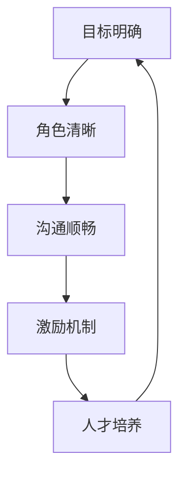

                 

**知识付费创业中的团队管理**

## 1. 背景介绍

随着互联网的发展，知识付费行业迅速崛起，成为一种新的商业模式。然而，知识付费创业并非易事，其中团队管理至关重要。本文将深入探讨知识付费创业中的团队管理，提供实用的指南和建议。

## 2. 核心概念与联系

### 2.1 团队管理的定义

团队管理是指在知识付费创业中，对团队成员进行组织、指导、协调和控制，以实现团队目标的过程。有效的团队管理可以提高团队的凝聚力、协作性和生产率，从而提高知识付费产品的质量和创业的成功率。

### 2.2 团队管理的关键要素

团队管理的关键要素包括：

- **目标明确**：清晰的目标可以指引团队的方向，提高团队的凝聚力。
- **角色清晰**：明确每个成员的角色和职责，可以避免混乱和重复劳动。
- **沟通顺畅**：良好的沟通可以提高团队的协作性，避免信息的丢失和误解。
- **激励机制**：合理的激励机制可以提高团队成员的积极性和创造力。
- **人才培养**：不断培养和提高团队成员的技能，可以提高团队的整体水平。

### 2.3 团队管理的流程图



## 3. 核心算法原理 & 具体操作步骤

### 3.1 算法原理概述

团队管理的算法原理基于组织行为学和管理学的理论，包括目标设置理论、角色理论、沟通理论、激励理论和学习理论等。

### 3.2 算法步骤详解

#### 3.2.1 目标设置

1. 确定团队的长期目标和短期目标。
2. 将目标分解为可衡量的子目标。
3. 与团队成员共同商定目标，并得到他们的认同。

#### 3.2.2 角色设置

1. 根据团队的目标和任务，确定需要的角色和职责。
2. 根据成员的技能和兴趣，匹配角色和人员。
3. 明确每个角色的权利和义务。

#### 3.2.3 沟通机制建立

1. 确定沟通渠道，如邮件、即时通讯工具、会议等。
2. 确定沟通频率和内容，如每周例会、项目进度汇报等。
3. 确定沟通风格，如正式、非正式、直接或间接等。

#### 3.2.4 激励机制设计

1. 确定激励目标，如提高生产率、鼓励创新等。
2. 设计激励措施，如薪酬、奖金、晋升等。
3. 确定激励标准，如绩效考核、客户满意度等。

#### 3.2.5 人才培养

1. 评估团队成员的技能和能力。
2. 根据评估结果，制订培训计划。
3. 提供培训机会，如内部培训、外部培训、在线培训等。

### 3.3 算法优缺点

**优点：**

- 有助于提高团队的凝聚力和协作性。
- 有助于提高团队的生产率和创造力。
- 有助于提高团队成员的满意度和忠诚度。

**缺点：**

- 管理成本高。
- 需要管理者具备一定的管理技能。
- 可能会导致官僚主义和僵化。

### 3.4 算法应用领域

团队管理算法适用于各种知识付费创业项目，如在线课程、电子书、音频课程、付费社群等。

## 4. 数学模型和公式 & 详细讲解 & 举例说明

### 4.1 数学模型构建

团队管理的数学模型可以基于组织行为学和管理学的理论构建。例如，目标设置理论可以用目标函数表示：

$$Maximize\ Z = f(x_1, x_2,..., x_n)$$

其中，$x_1, x_2,..., x_n$ 表示团队的子目标，$f$ 表示目标函数。

### 4.2 公式推导过程

例如，在设置薪酬激励机制时，可以使用以下公式：

$$W = a \times P + b \times Q + c$$

其中，$W$ 表示薪酬，$P$ 表示绩效考核分数，$Q$ 表示客户满意度分数，$a, b, c$ 表示权重系数。

### 4.3 案例分析与讲解

例如，在一家提供在线课程的知识付费平台中，管理者可以使用目标设置理论和激励机制设计理论来提高教师的生产率和创新能力。首先，管理者与教师共同商定教师的目标，如每年开发3门新课程。然后，管理者设计激励机制，如每开发一门新课程奖励5000元。最后，管理者定期评估教师的绩效，并根据绩效调整激励机制。

## 5. 项目实践：代码实例和详细解释说明

### 5.1 开发环境搭建

本项目使用 Python 和 Django 框架开发，需要安装 Python、Django 和相关依赖。

### 5.2 源代码详细实现

以下是一个简单的 Django 项目，用于管理知识付费平台的教师和课程信息。

```python
# models.py
from django.db import models

class Teacher(models.Model):
    name = models.CharField(max_length=50)
    salary = models.DecimalField(max_digits=10, decimal_places=2)

class Course(models.Model):
    name = models.CharField(max_length=50)
    teacher = models.ForeignKey(Teacher, on_delete=models.CASCADE)
    price = models.DecimalField(max_digits=10, decimal_places=2)

# views.py
from django.shortcuts import render
from.models import Teacher, Course

def teacher_list(request):
    teachers = Teacher.objects.all()
    return render(request, 'teacher_list.html', {'teachers': teachers})

def course_list(request):
    courses = Course.objects.all()
    return render(request, 'course_list.html', {'courses': courses})
```

### 5.3 代码解读与分析

本项目使用 Django 的 ORM 定义了 Teacher 和 Course 两个模型，分别表示教师和课程信息。在 views.py 中，定义了两个视图函数，用于展示教师列表和课程列表。

### 5.4 运行结果展示

运行项目后，可以在浏览器中访问 http://localhost:8000/teachers/ 和 http://localhost:8000/courses/ 查看教师列表和课程列表。

## 6. 实际应用场景

### 6.1 团队管理的应用

团队管理算法可以应用于各种知识付费创业项目，如在线课程平台、电子书平台、音频课程平台、付费社群等。

### 6.2 未来应用展望

随着知识付费行业的发展，团队管理算法将会越来越重要。未来，团队管理算法将会与人工智能、大数据等技术结合，实现智能化的团队管理。

## 7. 工具和资源推荐

### 7.1 学习资源推荐

- **书籍**：《管理学原理》《组织行为学》《团队管理与领导力》《知识管理》《创新与企业家精神》
- **在线课程**： Coursera、Udemy、edX 上的管理学、组织行为学、创新管理等课程

### 7.2 开发工具推荐

- **项目管理工具**： Trello、Asana、Jira
- **沟通工具**： Slack、Microsoft Teams、Google Workspace
- **开发工具**： Git、Docker、Kubernetes

### 7.3 相关论文推荐

- **组织行为学**："Organizational Behavior" by Daniel A. Wren and Edward Lawrence
- **管理学**："Management: A New Approach" by Henry Mintzberg
- **知识管理**："The Knowledge-Creating Company" by Ikujiro Nonaka and Hirotaka Takeuchi
- **创新管理**："The Innovators' Dilemma" by Clayton M. Christensen

## 8. 总结：未来发展趋势与挑战

### 8.1 研究成果总结

本文介绍了知识付费创业中的团队管理，包括团队管理的定义、关键要素、流程图、算法原理、数学模型和公式、项目实践等。本文提供了实用的指南和建议，有助于知识付费创业者提高团队管理水平。

### 8.2 未来发展趋势

未来，团队管理将会越来越智能化，人工智能、大数据等技术将会广泛应用于团队管理中。此外，团队管理将会越来越重视员工的个性化需求和多元化发展。

### 8.3 面临的挑战

然而，团队管理也面临着挑战，如管理成本高、管理者技能缺乏、官僚主义和僵化等。此外，知识付费行业的不确定性和竞争激烈也给团队管理带来了挑战。

### 8.4 研究展望

未来的研究可以从以下几个方向展开：

- 智能化团队管理技术的研究。
- 个性化和多元化团队管理的研究。
- 知识付费行业团队管理的特点和挑战的研究。
- 团队管理的跨文化研究。

## 9. 附录：常见问题与解答

**Q1：什么是团队管理？**

A1：团队管理是指在知识付费创业中，对团队成员进行组织、指导、协调和控制，以实现团队目标的过程。

**Q2：团队管理的关键要素是什么？**

A2：团队管理的关键要素包括目标明确、角色清晰、沟通顺畅、激励机制和人才培养。

**Q3：如何设置目标？**

A3：设置目标时，需要确定长期目标和短期目标，并将目标分解为可衡量的子目标。此外，还需要与团队成员共同商定目标，并得到他们的认同。

**Q4：如何设置激励机制？**

A4：设置激励机制时，需要确定激励目标，设计激励措施，并确定激励标准。此外，还需要定期评估绩效，并根据绩效调整激励机制。

**Q5：如何培养人才？**

A5：培养人才时，需要评估团队成员的技能和能力，制订培训计划，并提供培训机会。此外，还需要鼓励成员自主学习和创新。

**作者：禅与计算机程序设计艺术 / Zen and the Art of Computer Programming**

（完）

