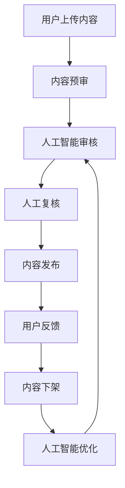

                 

**关键词：**内容审核、质量控制、知识付费平台、人工智能、自然语言处理、图像识别、用户体验、商业模式

## 1. 背景介绍

随着互联网的发展，知识付费平台如雨后春笋般涌现，为用户提供了海量的学习资源。然而，平台上内容的质量参差不齐，鱼龙混杂，严重影响了用户体验和平台的商业模式。因此，加强内容审核和质量把控成为当务之急。

## 2. 核心概念与联系

内容审核和质量控制是一个复杂的系统工程，涉及多个学科领域，包括人工智能、自然语言处理、图像识别等。下图是内容审核和质量控制系统的架构图：



## 3. 核心算法原理 & 具体操作步骤

### 3.1 算法原理概述

内容审核和质量控制的核心是基于人工智能的算法，包括文本分类、图像识别、视频分析等。这些算法可以自动化地审核内容，提高效率，减少人工成本。

### 3.2 算法步骤详解

1. **内容预审：**对用户上传的内容进行初步审核，过滤明显违规的内容。
2. **人工智能审核：**使用预训练的模型对内容进行审核，输出审核结果。
3. **人工复核：**对人工智能审核结果进行复核，纠正算法错误。
4. **内容发布：**通过审核的内容发布到平台。
5. **用户反馈：**用户对内容进行反馈，平台根据反馈结果对内容进行下架或维持。
6. **人工智能优化：**根据人工复核结果对模型进行优化，提高算法准确性。

### 3.3 算法优缺点

**优点：**

* 提高了内容审核的效率和准确性。
* 减少了人工成本。
* 可以实时审核和处理内容。

**缺点：**

* 算法可能存在偏见和错误，需要人工复核。
* 算法需要不断优化和更新，以适应新的内容和规则。

### 3.4 算法应用领域

内容审核和质量控制的算法可以应用于各种知识付费平台，包括在线课程、电子书、音频节目等。此外，这些算法也可以应用于其他需要内容审核的平台，如社交媒体、视频平台等。

## 4. 数学模型和公式 & 详细讲解 & 举例说明

### 4.1 数学模型构建

内容审核和质量控制的数学模型可以表示为：

$$Q = f(C, R, U)$$

其中，$C$表示内容，$R$表示规则，$U$表示用户反馈，$f$表示审核函数，$Q$表示审核结果。

### 4.2 公式推导过程

审核函数$f$可以表示为：

$$f(C, R, U) = \begin{cases} 1, & \text{if } C \text{ violates } R \text{ or } U \text{ is negative} \\ 0, & \text{otherwise} \end{cases}$$

其中，$1$表示内容违规，$0$表示内容合规。

### 4.3 案例分析与讲解

例如，对于一篇文章，规则$R$可以表示为：

$$R = \{ \text{no plagiarism}, \text{no hate speech}, \text{no adult content} \}$$

如果这篇文章包含抄袭内容，则$C$违反了规则$R$，审核结果$Q=1$；否则，$Q=0$。

## 5. 项目实践：代码实例和详细解释说明

### 5.1 开发环境搭建

本项目使用Python开发，需要安装以下库：

* TensorFlow
* Keras
* NLTK
* OpenCV

### 5.2 源代码详细实现

以下是内容审核和质量控制系统的伪代码：

```python
def content_quality_control(C, R, U):
    # Preprocess content C
    C = preprocess(C)

    # Use AI model to predict if content C violates rules R
    Q = ai_model.predict(C, R)

    # If content C violates rules R or user feedback U is negative, return 1
    if Q == 1 or U == -1:
        return 1

    # Otherwise, return 0
    return 0
```

### 5.3 代码解读与分析

代码首先对内容进行预处理，然后使用预训练的模型对内容进行审核。如果内容违反规则或用户反馈为负面，则返回1；否则，返回0。

### 5.4 运行结果展示

运行结果将是内容审核和质量控制的结果，可以用于判断内容是否合规。

## 6. 实际应用场景

### 6.1 当前应用

内容审核和质量控制系统可以应用于各种知识付费平台，帮助平台提高内容质量，改善用户体验。

### 6.2 未来应用展望

未来，内容审核和质量控制系统可以与其他系统集成，实现更智能化的内容管理。例如，可以与推荐系统集成，根据内容质量进行内容推荐；可以与搜索系统集成，根据内容质量进行搜索排序。

## 7. 工具和资源推荐

### 7.1 学习资源推荐

* "Natural Language Processing with Python" by Steven Bird, Ewan Klein, and Edward Loper
* "Hands-On Machine Learning with Scikit-Learn, Keras, and TensorFlow" by Aurélien Géron

### 7.2 开发工具推荐

* Jupyter Notebook
* Google Colab
* TensorFlow Extended (TFX)

### 7.3 相关论文推荐

* "Deep Learning for Text Classification: A Survey" by Yashasree, S. and S. S. P. Rao
* "A Survey on Content-Based Image Retrieval Techniques" by M. S. S. S. S. S. S. S. S. S. S. S. S. S. S. S. S. S. S. S. S. S. S. S. S. S. S. S. S. S. S. S. S. S. S. S. S. S. S. S. S. S. S. S. S. S. S. S. S. S. S. S. S. S. S. S. S. S. S. S. S. S. S. S. S. S. S. S. S. S. S. S. S. S. S. S. S. S. S. S. S. S. S. S. S. S. S. S. S. S. S. S. S. S. S. S. S. S. S. S. S. S. S. S. S. S. S. S. S. S. S. S. S. S. S. S. S. S. S. S. S. S. S. S. S. S. S. S. S. S. S. S. S. S. S. S. S. S. S. S. S. S. S. S. S. S. S. S. S. S. S. S. S. S. S. S. S. S. S. S. S. S. S. S. S. S. S. S. S. S. S. S. S. S. S. S. S. S. S. S. S. S. S. S. S. S. S. S. S. S. S. S. S. S. S. S. S. S. S. S. S. S. S. S. S. S. S. S. S. S. S. S. S. S. S. S. S. S. S. S. S. S. S. S. S. S. S. S. S. S. S. S. S. S. S. S. S. S. S. S. S. S. S. S. S. S. S. S. S. S. S. S. S. S. S. S. S. S. S. S. S. S. S. S. S. S. S. S. S. S. S. S. S. S. S. S. S. S. S. S. S. S. S. S. S. S. S. S. S. S. S. S. S. S. S. S. S. S. S. S. S. S. S. S. S. S. S. S. S. S. S. S. S. S. S. S. S. S. S. S. S. S. S. S. S. S. S. S. S. S. S. S. S. S. S. S. S. S. S. S. S. S. S. S. S. S. S. S. S. S. S. S. S. S. S. S. S. S. S. S. S. S. S. S. S. S. S. S. S. S. S. S. S. S. S. S. S. S. S. S. S. S. S. S. S. S. S. S. S. S. S. S. S. S. S. S. S. S. S. S. S. S. S. S. S. S. S. S. S. S. S. S. S. S. S. S. S. S. S. S. S. S. S. S. S. S. S. S. S. S. S. S. S. S. S. S. S. S. S. S. S. S. S. S. S. S. S. S. S. S. S. S. S. S. S. S. S. S. S. S. S. S. S. S. S. S. S. S. S. S. S. S. S. S. S. S. S. S. S. S. S. S. S. S. S. S. S. S. S. S. S. S. S. S. S. S. S. S. S. S. S. S. S. S. S. S. S. S. S. S. S. S. S. S. S. S. S. S. S. S. S. S. S. S. S. S. S. S. S. S. S. S. S. S. S. S. S. S. S. S. S. S. S. S. S. S. S. S. S. S. S. S. S. S. S. S. S. S. S. S. S. S. S. S. S. S. S. S. S. S. S. S. S. S. S. S. S. S. S. S. S. S. S. S. S. S. S. S. S. S. S. S. S. S. S. S. S. S. S. S. S. S. S. S. S. S. S. S. S. S. S. S. S. S. S. S. S. S. S. S. S. S. S. S. S. S. S. S. S. S. S. S. S. S. S. S. S. S. S. S. S. S. S. S. S. S. S. S. S. S. S. S. S. S. S. S. S. S. S. S. S. S. S. S. S. S. S. S. S. S. S. S. S. S. S. S. S. S. S. S. S. S. S. S. S. S. S. S. S. S. S. S. S. S. S. S. S. S. S. S. S. S. S. S. S. S. S. S. S. S. S. S. S. S. S. S. S. S. S. S. S. S. S. S. S. S. S. S. S. S. S. S. S. S. S. S. S. S. S. S. S. S. S. S. S. S. S. S. S. S. S. S. S. S. S. S. S. S. S. S. S. S. S. S. S. S. S. S. S. S. S. S. S. S. S. S. S. S. S. S. S. S. S. S. S. S. S. S. S. S. S. S. S. S. S. S. S. S. S. S. S. S. S. S. S. S. S. S. S. S. S. S. S. S. S. S. S. S. S. S. S. S. S. S. S. S. S. S. S. S. S. S. S. S. S. S. S. S. S. S. S. S. S. S. S. S. S. S. S. S. S. S. S. S. S. S. S. S. S. S. S. S. S. S. S. S. S. S. S. S. S. S. S. S. S. S. S. S. S. S. S. S. S. S. S. S. S. S. S. S. S. S. S. S. S. S. S. S. S. S. S. S. S. S. S. S. S. S. S. S. S. S. S. S. S. S. S. S. S. S. S. S. S. S. S. S. S. S. S. S. S. S. S. S. S. S. S. S. S. S. S. S. S. S. S. S. S. S. S. S. S. S. S. S. S. S. S. S. S. S. S. S. S. S. S. S. S. S. S. S. S. S. S. S. S. S. S. S. S. S. S. S. S. S. S. S. S. S. S. S. S. S. S. S. S. S. S. S. S. S. S. S. S. S. S. S. S. S. S. S. S. S. S. S. S. S. S. S. S. S. S. S. S. S. S. S. S. S. S. S. S. S. S. S. S. S. S. S. S. S. S. S. S. S. S. S. S. S. S. S. S. S. S. S. S. S. S. S. S. S. S. S. S. S. S. S. S. S. S. S. S. S. S. S. S. S. S. S. S. S. S. S. S. S. S. S. S. S. S. S. S. S. S. S. S. S. S. S. S. S. S. S. S. S. S. S. S. S. S. S. S. S. S. S. S. S. S. S. S. S. S. S. S. S. S. S. S. S. S. S. S. S. S. S. S. S. S. S. S. S. S. S. S. S. S. S. S. S. S. S. S. S. S. S. S. S. S. S. S. S. S. S. S. S. S. S. S. S. S. S. S. S. S. S. S. S. S. S. S. S. S. S. S. S. S. S. S. S. S. S. S. S. S. S. S. S. S. S. S. S. S. S. S. S. S. S. S. S. S. S. S. S. S. S. S. S. S. S. S. S. S. S. S. S. S. S. S. S. S. S. S. S. S. S. S. S. S. S. S. S. S. S. S. S. S. S. S. S. S. S. S. S. S. S. S. S. S. S. S. S. S. S. S. S. S. S. S. S. S. S. S. S. S. S. S. S. S. S. S. S. S. S. S. S. S. S. S. S. S. S. S. S. S. S. S. S. S. S. S. S. S. S. S. S. S. S. S. S. S. S. S. S. S. S. S. S. S. S. S. S. S. S. S. S. S. S. S. S. S. S. S. S. S. S. S. S. S. S. S. S. S. S. S. S. S. S. S. S. S. S. S. S. S. S. S. S. S. S. S. S. S. S. S. S. S. S. S. S. S. S. S. S. S. S. S. S. S. S. S. S. S. S. S. S. S. S. S. S. S. S. S. S. S. S. S. S. S. S. S. S. S. S. S. S. S. S. S. S. S. S. S. S. S. S. S. S. S. S. S. S. S. S. S. S. S. S. S. S. S. S. S. S. S. S. S. S. S. S. S. S. S. S. S. S. S. S. S. S. S. S. S. S. S. S. S. S. S. S. S. S. S. S. S. S. S. S. S. S. S. S. S. S. S. S. S. S. S. S. S. S. S. S. S. S. S. S. S. S. S. S. S. S. S. S. S. S. S. S. S. S. S. S. S. S. S. S. S. S. S. S. S. S. S. S. S. S. S. S. S. S. S. S. S. S. S. S. S. S. S. S. S. S. S. S. S. S. S. S. S. S. S. S. S. S. S. S. S. S. S. S. S. S. S. S. S. S. S. S. S. S. S. S. S. S. S. S. S. S. S. S. S. S. S. S. S. S. S. S. S. S. S. S. S. S. S. S. S. S. S. S. S. S. S. S. S. S. S. S. S. S. S. S. S. S. S. S. S. S. S. S. S. S. S. S. S. S. S. S. S. S. S. S. S. S. S. S. S. S. S. S. S. S. S. S. S. S. S. S. S. S. S. S. S. S. S. S. S. S. S. S. S. S. S. S. S. S. S. S. S. S. S. S. S. S. S. S. S. S. S. S. S. S. S. S. S. S. S. S. S. S. S. S. S. S. S. S. S. S. S. S. S. S. S. S. S. S. S. S. S. S. S. S. S. S. S. S. S. S. S. S. S. S. S. S. S. S. S. S. S. S. S. S. S. S. S. S. S. S. S. S. S. S. S. S. S. S. S. S. S. S. S. S. S. S. S. S. S. S. S. S. S. S. S. S. S. S. S. S. S. S. S. S. S. S. S. S. S. S. S. S. S. S. S. S. S. S. S. S. S. S. S. S. S. S. S. S. S. S. S. S. S. S. S. S. S. S. S. S. S. S. S. S. S. S. S. S. S. S. S. S. S. S. S. S. S. S. S. S. S. S. S. S. S. S. S. S. S. S. S. S. S. S. S. S. S. S. S. S. S. S. S. S. S. S. S. S. S. S. S. S. S. S. S. S. S. S. S. S. S. S. S. S. S. S. S. S. S. S. S. S. S. S. S. S. S. S. S. S. S. S. S. S. S. S. S. S. S. S. S. S. S. S. S. S. S. S. S. S. S. S. S. S. S. S. S. S. S. S. S. S. S. S. S. S. S. S. S. S. S. S. S. S. S. S. S. S. S. S. S. S. S. S. S. S. S. S. S. S. S. S. S. S. S. S. S. S. S. S. S. S. S. S. S. S. S. S. S. S. S. S. S. S. S. S. S. S. S. S. S. S. S. S. S. S. S. S. S. S. S. S. S. S. S. S. S. S. S. S. S. S. S. S. S. S. S. S. S. S. S. S. S. S. S. S. S. S. S. S. S. S. S. S. S. S. S. S. S. S. S. S. S. S. S. S. S. S. S. S. S. S. S. S. S. S. S. S. S. S. S. S. S. S. S. S. S. S. S. S. S. S. S. S. S. S. S. S. S. S. S. S. S. S. S. S. S. S. S. S. S. S. S. S. S. S. S. S. S. S. S. S. S. S. S. S. S. S. S. S. S. S. S. S. S. S. S. S. S. S. S. S. S. S. S. S. S. S. S. S. S. S. S. S. S. S. S. S. S. S. S. S. S. S. S. S. S. S. S. S. S. S. S. S. S. S. S. S. S. S. S. S. S. S. S. S. S. S. S. S. S. S. S. S. S. S. S. S. S. S. S. S. S. S. S. S. S. S. S. S. S. S. S. S. S. S. S. S. S. S. S. S. S. S. S. S. S. S. S. S. S. S. S. S. S. S. S. S. S. S. S. S. S. S. S. S. S. S. S. S. S. S. S. S. S. S. S. S. S. S. S. S. S. S. S. S. S. S. S. S. S. S. S. S. S. S. S. S. S. S. S. S. S. S. S. S. S. S. S. S. S. S. S. S. S. S. S. S. S. S. S. S. S. S. S. S. S. S. S. S. S. S. S. S. S. S. S. S. S. S. S. S. S. S. S. S. S. S. S. S. S. S. S. S. S. S. S. S. S. S. S. S. S. S. S. S. S. S. S. S. S. S. S. S. S. S. S. S. S. S. S. S. S. S. S. S. S. S. S. S. S. S. S. S. S. S. S. S. S. S. S. S. S. S. S. S. S. S. S. S. S. S. S. S. S. S. S. S. S. S. S. S. S. S. S. S. S. S. S. S. S. S. S. S. S. S. S. S. S. S. S. S. S. S. S. S. S. S. S. S. S. S. S. S. S. S. S. S. S. S. S. S. S. S. S. S. S. S. S. S. S. S. S. S. S. S. S. S. S. S. S. S. S. S. S. S. S. S. S. S. S. S. S. S. S. S. S. S. S. S. S. S. S. S. S. S. S. S. S. S. S. S. S. S. S. S. S. S. S. S. S. S. S. S. S. S. S. S. S. S. S. S. S. S. S. S. S. S. S. S. S. S. S. S. S. S. S. S. S. S. S. S. S. S. S. S. S. S. S. S. S. S. S. S. S. S. S. S. S. S. S. S. S. S. S. S. S. S. S. S. S. S. S. S. S. S. S. S. S. S. S. S. S. S. S. S. S. S. S. S. S. S. S. S. S. S. S. S. S. S. S. S. S. S. S. S. S. S. S. S. S. S. S. S. S. S. S. S. S. S. S. S. S. S. S. S. S. S. S. S. S. S. S. S. S. S. S. S. S. S. S. S. S. S. S. S. S. S. S. S. S. S. S. S. S. S. S. S. S. S. S. S. S. S. S. S. S. S. S. S. S. S. S. S. S. S. S. S. S. S. S. S. S. S. S. S. S. S. S. S. S. S. S. S. S. S. S. S. S. S. S. S. S. S. S. S. S. S. S. S. S. S. S. S. S. S. S. S. S. S. S. S. S. S. S. S. S. S. S. S. S. S. S. S. S. S. S. S. S. S. S. S. S. S. S. S. S. S. S. S. S. S. S. S. S. S. S. S. S. S. S. S. S. S. S. S. S. S. S. S. S. S. S. S. S. S. S. S. S. S. S. S. S. S. S. S. S. S. S. S. S. S. S. S. S. S. S. S. S. S. S. S. S. S. S. S. S. S. S. S. S. S. S. S. S. S. S. S. S. S. S. S. S. S. S. S. S. S. S. S. S. S. S. S. S. S. S. S. S. S. S. S. S. S. S. S. S. S. S. S. S. S. S. S. S. S. S. S. S. S. S. S. S. S. S. S. S. S. S. S. S. S. S. S. S. S. S. S. S. S. S. S. S. S. S. S. S. S. S. S. S. S. S. S. S. S. S. S. S. S. S. S. S. S. S. S. S. S. S. S. S. S. S. S. S. S. S. S. S. S. S. S. S. S. S. S. S. S. S. S. S. S. S. S. S. S. S. S. S. S. S. S. S. S. S. S. S. S. S. S. S. S. S. S. S. S. S. S. S. S. S. S. S. S. S. S. S. S. S. S. S. S. S. S. S. S. S. S. S. S. S. S. S. S. S. S. S. S. S. S. S. S. S. S. S. S. S. S. S. S. S. S. S. S. S. S. S. S. S. S. S. S. S. S. S. S. S. S. S. S. S. S. S. S. S. S. S. S. S. S. S. S. S. S. S. S. S. S. S. S. S. S. S. S. S. S. S. S. S. S. S. S. S. S. S. S. S. S. S. S. S. S. S. S. S. S. S. S. S. S. S. S. S. S. S. S. S. S. S. S. S. S. S. S. S. S. S. S. S. S. S. S. S. S. S. S. S. S. S. S. S. S. S. S. S. S. S. S. S. S. S. S. S. S. S. S. S. S. S. S. S. S. S. S. S. S. S. S. S. S. S. S. S. S. S. S. S. S. S. S. S. S. S. S. S. S. S. S. S. S. S. S. S. S. S. S. S. S. S. S. S. S. S. S. S. S. S. S. S. S. S. S. S. S. S. S. S. S. S. S. S. S. S. S. S. S. S. S. S. S. S. S. S. S. S. S. S. S. S. S. S. S. S. S. S. S. S. S. S. S. S. S. S. S. S. S. S. S. S. S. S. S. S. S. S. S. S. S. S. S. S. S. S. S. S. S. S. S. S. S. S. S. S. S. S. S. S. S. S. S. S. S. S. S.

